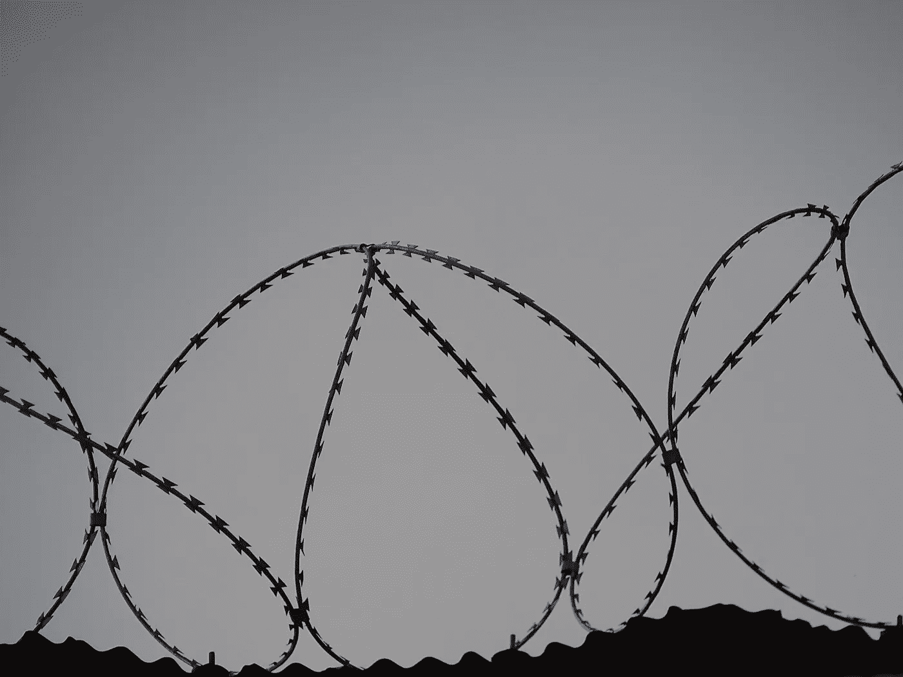

# 被困在文化景观中

> 原文：<https://medium.datadriveninvestor.com/trapped-inside-culture-scape-342c887d2265?source=collection_archive---------12----------------------->

这是 2018 年 6 月，没有适当的睡眠我的思想都在明天会发生什么，因为我的最终结果将公布。在印度，这种情况很可悲，尤其是如果你是个普通的孩子。那更糟的孩子呢？他们已经习惯了，他们认为这是理所当然的，就像父母一样。

但是普通的孩子感受到了最大的压力，他们必须取得比他们的标准更大的成就。人们希望你的分数接近最高分，我们被告知要取得好成绩，但我们知道大多数时候我们已经尽力了。同样，我的成绩出来了，我得了 **70** %,我很满意，但我的妈妈不知从哪里哭了起来，现在连我都要哭才能解决问题。

 [## 为了主流的利益和反叛的少数民族的利益，个性的摇摆|数据…

### 在一个给定的社会中，个人独立行动的能力受到多种因素的影响，例如…

www.datadriveninvestor.com](https://www.datadriveninvestor.com/2020/05/14/the-sway-of-individuality-for-the-benefit-of-mainstream-and-sake-of-rebellious-minority/) 

仅仅因为我在考试中表现不佳，我的父母就不让我做决定。他们下定决心，我会做出糟糕的决定，仅仅因为我表现不好。很遗憾亲戚和我父母的朋友代表我做决定。我在自己的壳里打滚，无处发出声音来做决定。

这只是文化景观的一个例子，人们依靠他人做出决定，这些决定是不合理的。我们经常在日常生活中利用这一点，人们对我们设置了障碍，但当我们质疑他们时。他们嘲笑我们。

当我质问我父母的时候，

**“我不能做决定吗？”**

你应该有更多的标记来做一个，我没办法。回想起来，我意识到这不怪我的父母，也不怪我们的父母。是这个社会带来了由他们自己的信仰发展出来的思想和观念，并希望我们适应环境。

如果你质疑它，那么你就被打上了疯子的烙印。文化景观每天都在我们的生活中进行，我们甚至无法区分它们。例如，**你需要一个大学学位才能在生活中获得成功，**这是一个普遍而强大的信念，几十年来一直如此。

如果我们往外看，有些人没有学位却取得了巨大的成就，他们打破并走出了**文化景观**。他们发现，在一个泡沫中保持他们的能力和发展潜力。

看看你周围，问一些问题，弄清楚你是否在文化景观中冒泡。更多关于这个话题的来啦！敬请期待...

**访问专家视图—** [**订阅 DDI 英特尔**](https://datadriveninvestor.com/ddi-intel)