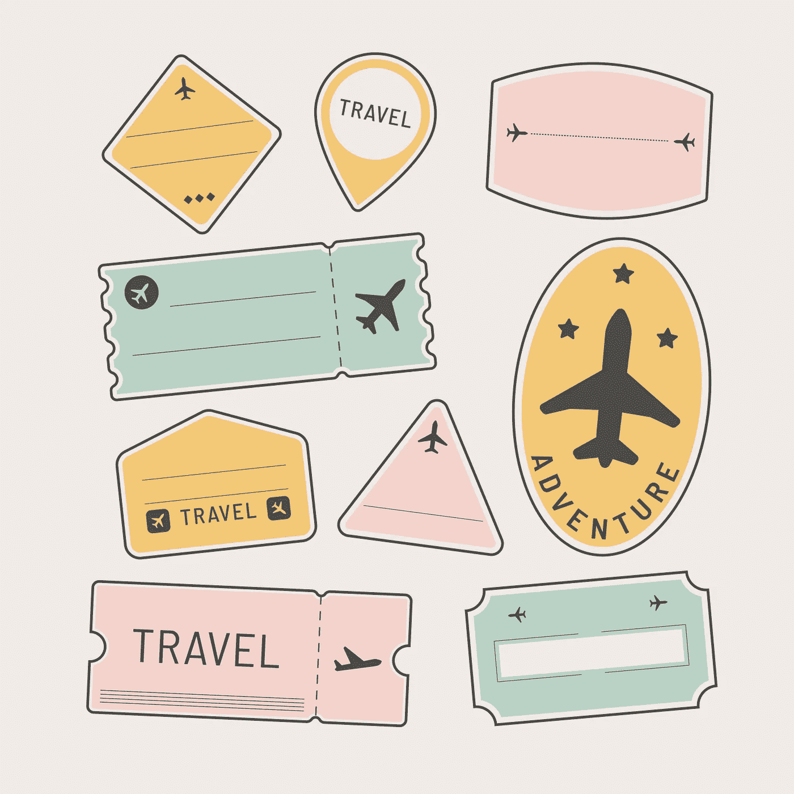

# 旅行与生活

> 原文：<https://medium.datadriveninvestor.com/travel-life-dbd8c9e66bb6?source=collection_archive---------16----------------------->

很久以后，我最近去了趟库尔格。它提醒了我为什么会爱上旅行、食物、风景和与陌生人的偶遇。它带我去了 2019 年的最后一次国际旅行。

2019 年去了韩国。我心血来潮决定去那里，因为我喜欢韩剧，我听 kpop。首尔的食物、城市和咖啡都让我着迷。在我去过的城市中，首尔的咖啡馆是我见过最多的。

然而，我遇到的人最让我怀念。他们在某些方面不同，但在许多方面，他们像我。他们有野心、自我怀疑和梦想，并为之努力奋斗。

在一个与印度截然不同的国家，我意识到我们人类并没有那么大的不同。我们共同生活在这个星球上，这种联系感使这次旅行成为有史以来最人性化的经历之一。

我们在韩剧中看到的世界就像你在典型的宝莱坞电影中看到的印度。有一定道理，但也有很多虚构。但是，真实的事情比你能想象的更惊险。

# 耐心:

你还记得你要排队多久才能登机吗？高速公路上的交通似乎持续了多长时间？

小时候“我们到了吗？”每当我们旅行时，这是我最常问的问题。但是，随着时间的推移，你开始欣赏这样的旅程。它们可能是伪装的机会。

它可以是坐在车里欣赏迷人的风景，或者在飞行中结交新朋友，其他时候，它教会你要有耐心。

对以后收获回报感到不安，是生活的基本技能之一。

> 延迟满足是生活中成功的最佳预测者之一，无论是 SAT 还是人际关系。

# 移情:

当我们听到一个遥远的地方或国家发生的悲剧时，我们很难产生共鸣。旅行让你更好地与来自不同世界的人联系。它给了我们一个视角，让我们意识到那可能是你。

此外，去不同的国家和地方旅行是我们能做的最有特权的事情之一。许多人喜欢旅行，但他们不能。他们继续过着平静、卑微的生活，然而他们很满足，这个词在当今时代已经失传了。

> 我记得在越南见过一些人，他们住在大约 400 平方英尺的小房子里。脚，但有一个巨大的心和微笑在他们的脸上。

# 学习:

走出你的舒适区是生活中最好的学习方式之一。很少有什么事情能像旅行一样让你走出舒适区。结识新朋友，吃新鲜的食物，用一种新的语言说话可以让你扩大视野。

最难忘的时刻之一是学会足够的韩语，以便在商店点一杯热美式咖啡。我现在可以不用手势就能得到我想要的所有咖啡:)

> 学习一件新事物会感觉像是一种超能力。

# 经历:

我们对时间的感知无非是我们能回忆起多少个瞬间。我们拥有的记忆越多，我们的生命似乎就越长。然而，在平凡的生活中很难创造出令人难忘的时刻。当你经历一天又一天的生活时，你可能会感觉到生活是如何与你擦肩而过的。

新的经历是治愈的良药！没有比旅行更好的创造奇妙体验的方式了。通过到其他地方进行不同类型的旅行，你会有很多理由怀旧。

你还会学到，当我们只带旅行中必不可少的东西时，你不需要太多就能快乐。我们意识到那些似乎对我们生活不可或缺的小玩意和汽车是我们生活中不那么重要的一部分。

> 与其计划下一次大采购，不如专注于计划一次能让你感觉自己在未来几年都充满活力的经历。

# 结论:

现代生活最大的礼物之一是旅行的能力。目前的疫情让这变得更加困难，但你仍然可以去当地旅游。可能是在你所在城市的另一个地方过夜，或者学习一些新的东西。

> 目前的情况使旅行成为完全不同的经历，并提醒我们耐心、同理心和沿途学习的价值。

如果你把旅行当成你的老师，它会比你在学校里学到更多关于生活的东西。