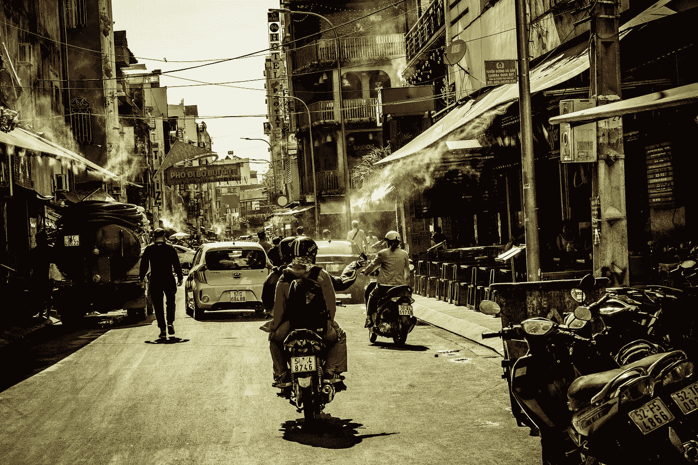
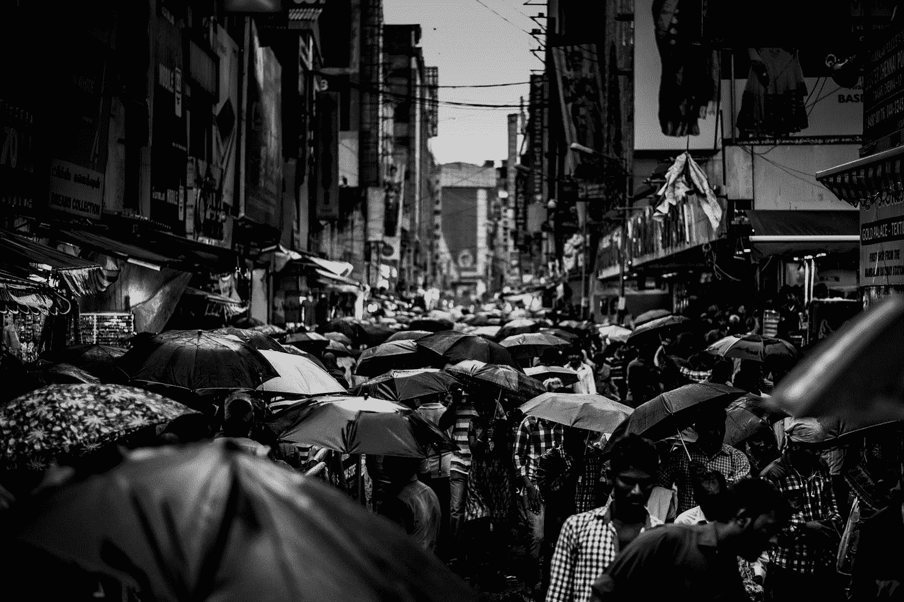

# 旅行会让你成为更好的投资者

> 原文：<https://medium.datadriveninvestor.com/travel-will-make-you-a-better-investor-b90162403726?source=collection_archive---------40----------------------->

## **通过改变你的参照系**

Photo by [Robert Metz](https://unsplash.com/@___rob__?utm_source=medium&utm_medium=referral) on [Unsplash](https://unsplash.com?utm_source=medium&utm_medium=referral)

我们都有一个参照系，我们在哪里出生和生活都会影响它，我们在哪里上学，我们学什么，我们的职业，以及我们花时间接触的人都会影响它。

我们通过一个偏向我们所知的透镜来看事情。

经验可以帮助我们打开我们的参照系。像一份新工作，新朋友，搬家，尤其是搬到或只是旅行到另一个国家的经历。

**旅游**

首先，让我们明确一点，我不是在说为我们的美国读者预订一个为期一周的坎昆之旅，或者为我们的澳大利亚读者预订一个巴厘岛之旅，与你经常聚会的那群朋友一起聚会。这次离海滩更近了。

体验一种新的文化是有层次的。在上述为期一周的旅行中，你可能会品尝到一些新的食物。但是如果你拿起背包，独自去墨西哥、印度或越南背包旅行几个月，你将会沉浸在一种不同层次的新文化中。

然后当然是搬到一个新的国家。安顿下来，必须在一个新的国家处理日常生活，这将真正打开你对新文化的视野。

**我如何成为更好的投资者**

以上三种旅行我都做过。我当然去过墨西哥和巴厘岛这样的地方进行短暂的海滩旅行。我背包穿越了南美、中美和东南亚，我甚至有机会在过去的工作中在印度生活了两年。

**网飞**

当我在印度工作时，网飞第一次进入印度，我的同事们也报名参加了。

我于 2015 年抵达印度，当然我已经有了它，并将使用 VPN 访问它。

但是网飞最初并没有吸引印度市场。毫不奇怪，他们爱朋友。但是大多数美国节目都没有被他们击中要害。

但当网飞在 2016 年 1 月进入印度(即当每个人都可以在没有 VPN 的情况下访问)并开始创建专为印度制作的内容时。

我看到了炒作。我看到我的同事注册，观看，谈论它。我买了一些股票。我做得很好。

**亚马逊**

另一个故事，同样的国家，不同的公司。当我最初搬到印度时，我不认为亚马逊在那里会有机会。我用它们订了几样东西。其中一封花了一个月的时间才到达，因为我必须向移民局发送一封附有我护照复印件的挂号信，这样他们才能让一名法国记者通过海关。

我也亲身经历过地址的混乱。我给了警察一个地址，他们对我很不满(有些国家要求所有居住在该国的外国人接受警方访问，以核实你的地址)。我只是给了他们给我的地址。

同样，正如我的同事向我解释的那样，一旦你越过城市来到乡村(大部分印度人仍然居住在那里)，地址就会变得更加模糊不清。

我在那里住了几个月后买了一些亚马逊的股票，因为这是我在那里住了几个月后发现的。有些东西是你无法通过其他方式得到的。去高档商场的交通太拥挤了，有时候等一两个星期才能收到包裹更容易。

最重要的是，我学会了解决地址问题的方法。每天都有一辆亚马逊的卡车开到我的工作场所，上面有着固定的地址，载着数百个包裹，每个人都出去领取他们的快递。

有时我会和他们一起在那里，等着直到有人喊我的名字，抢走我的包裹。

 [## 100 年来，这些红利珍珠一直在说服投资者

### 你想要支付可靠红利的股票吗？那你应该看看这两个车厂。有些股票有…

www.datadriveninvestor.com](https://www.datadriveninvestor.com/2020/08/24/these-dividend-pearls-have-been-convincing-investors-for-100-years/) 

好吧，是的，这个在这里可以用。对于 13 亿人口来说，如果在这里行得通，这可能是相当不错的增长潜力。

Photo by [Karthik Chandran](https://unsplash.com/@karthikchandrasekar?utm_source=medium&utm_medium=referral) on [Unsplash](https://unsplash.com?utm_source=medium&utm_medium=referral)

**NIO**

我现在在墨西哥，不再在亚洲了。但我在新德里、孟买、胡志明市、河内等城市有第一手的经验，并了解这些城市的感受。人的数量，交通，荒谬的摩托车数量，年轻人的数量以及这些城市不断的喧嚣。还有烟雾。

因为雾霾买了 NIO。我只是不相信除了电动汽车之外，还有任何可能解决雾霾的方法。我还知道，当时只有一小部分人有车。他们要么有两个轮子，要么什么都没有。因此，随着收入水平的提高，只会有越来越多的汽车加入这一行列。

我只知道电动汽车是这些城市的未来。

**牛**

好吧，你说你也知道。你们都参与了绿色革命。你也拥有特斯拉或 NIO。你可能拥有这两个中的一个，因为你有一个西方的参照系。你有一辆车，你认识的每个人都有一辆车，你在路上看到的都是汽车，偶尔周末有人骑着摩托车出去玩。并且那个人可能在家里有一辆车，他们乘它去上班。

这就是你错过机会的地方。你没有意识到，在一个拥有 14 亿人口、中位收入低于 2000 美元的国家，拥有一辆汽车对其中大约 10 亿人来说是一个白日梦。摩托车还是踏板车？这是有可能的。不仅如此。你没有看到交通和基础设施，如果你有一辆小型摩托车，你实际上可以比开车更快地到达你想去的地方。

牛是一家电动两轮车公司。摩托车和轻便摩托车。不像现在美国城市里的电动滑板车。

好吧，牛，一家中国公司，要进入印度市场可能很难。但是越南、印度尼西亚、马来西亚和菲律宾都有同样的问题，它们的人口都在快速增长。

正如你所看到的，我通过走出这个世界，让我看到了机会。所以，出去吧。它会改变你的观点，也许有一天会让你赚回一些钱。

**进入专家视角—** [**订阅 DDI 英特尔**](https://datadriveninvestor.com/ddi-intel)