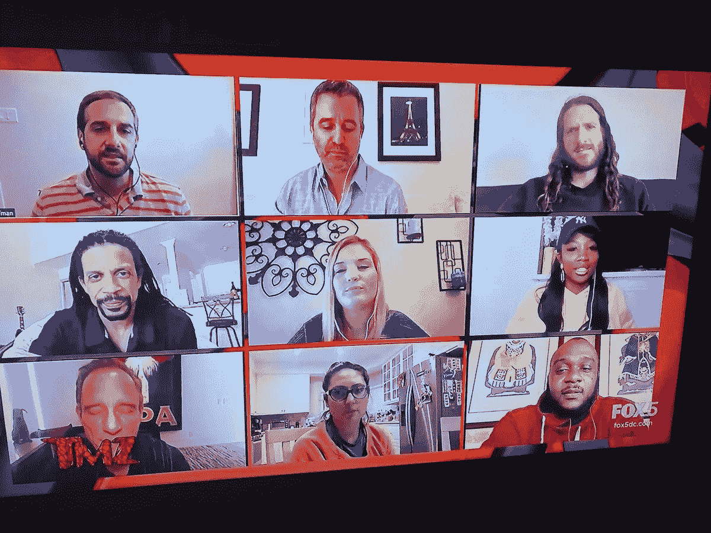
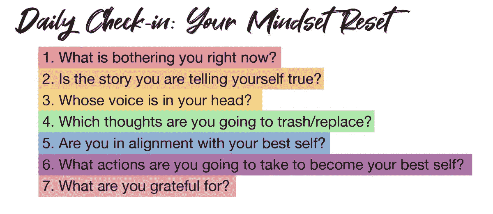
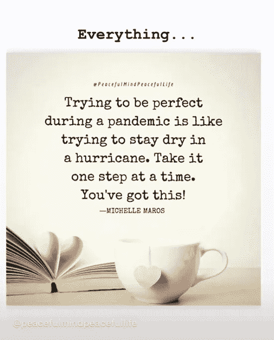

# 在一个不确定的新世界里轻盈地行走

> 原文：<https://medium.datadriveninvestor.com/treading-lightly-in-an-uncertain-new-world-8e2ee3e804b3?source=collection_archive---------27----------------------->

## 恐惧和焦虑加剧了对未知的社会跋涉

Adjusting to the new normal, [TMZ](https://twitter.com/TMZ/) has done entire shows via [Zoom](https://twitter.com/zoom_us) videos.

即使是未来学家也必须适应新常态。像大多数人一样， [Brian Fanzo](https://twitter.com/iSocialFanz) 无法想象一场世界剧变会榨干他作为主题演讲人的生意——几个月的活动被取消。

[切尔西·克罗斯特](https://twitter.com/ChelseaKrost)也不能幸免。这位领先的千禧一代专家、顶级营销和品牌策略师看到了一个项目搁置的大开放日历。

在她的#MillennialTalk Twitter 聊天中，Krost 和 Fanzo 谈到了新的世界，以及人们如何在充满恐惧和焦虑的不确定时期取得成功。

 [## 掌握生产力可以缓解焦虑

### 一致性是成功在线互动的关键

medium.com](https://medium.com/datadriveninvestor/mastering-productivity-eases-anxiety-97bb78e776fa) 

“接受我们正处于一个未知的时期，”克罗斯特说。“向你个人和职业的重心倾斜。对自己要有耐心。练习自理。采取有目的的行动。

“每天检查自己，尊重自己的感觉，”她说。“问问你脑子里的故事是不是真的。有时候我们自己的想法会战胜我们。我们生活的这个时期是一次真正的精神考验。”

Fanzo 主张负责。

“当我们明白我们无法控制未知——但我们可以控制我们的所作所为、我们关心的人和我们优先考虑的事情——这就把控制权转回对我们有利的地方，”他说。

“我们必须通过识别我们害怕什么来转移我们的注意力，承认我们害怕的事实，并找到调整我们观点的方法，优先考虑我们可以控制的事情，”范佐说。

他决心向前推进。

“我们将一起度过难关，”范佐说。“我每天都提醒自己，我不害怕失败或未知——不是因为它不会发生，也不糟糕。相反，我知道我永远不会满足于此。我们会度过这个难关，创造一个新常态。

“接受需要时间、视角和愿意接受过去是过去，未来是新的和不同的，”他说。

# **前所未有的创造力**

范佐将文化规范的变化比作他最熟悉的职业。

“我们营销界经常使用‘前所未有’这个词，今天的世界是前所未有的，”他说。“没有人做好准备，也没有人希望这样。可悲的是，这也导致一些人自私，另一些人生活在否认中。

“我们在对待他人的方式上必须具有战略性和创造性，”范佐说。“许多人不喜欢别人告诉他们该做什么。见鬼，我讨厌这样。为了影响他人，我们必须专注于教学、鼓励和不放松。”

 [## 成功源于关系

### 营销的成功在于提供价值

medium.com](https://medium.com/datadriveninvestor/success-springs-from-relationships-9db5934821d8) 

怀疑者要求证据，这可能导致不好的结果。

“太多的人不会相信这种威胁，直到它影响到他们所爱的或认识的人，而那时候就太晚了，”Fanzo 说。“我们只能帮助那些愿意被帮助的人。”

这个问题的艰巨性难以理解。

“到现在为止，每个人都听说过这些危险，”克罗斯特说。“这比你或我是否得到它更重要。这影响到我们周围所有可能暴露的人。这关系到大局，关系到阻止疫情蔓延。这里没有人是禁区。

“如果呆在家里让你得了幽居病，也许我的[彩虹现实法:7 步心态重置](https://www.rainbowrealitymethod.com/)会有帮助，”她说。"几个月来，我一直致力于这项合作."

创新和转变商业模式和战略的方法有很多。例如，Zoom 是一种新的办公模式，也是一种与潜在客户联系和交谈的方式。

“作为一名全职的主题演讲人，我在三个月内失去了 14 场演讲，”Fanzo 说。“我没有立即开始转移我的业务。我经历了悲伤的正常阶段。然后，我做了自己的自我评估，重点是我能如何提供帮助。

“我没有专注于责备或后悔过去，”他说。“我确定了自己喜欢做什么，除了‘工作’之外还有什么是我的优势，以及我如何能*帮助*他人。”

# **从感恩开始**

Fanzo 创建了关于在家工作的技巧的内容，并与其他演讲者一起在视频上做得更好。

“没有人想在这个时候被出售或推销，但我们都想不那么孤独，并知道其他人也有同样的感觉，”他说。“在一个充满感激和帮助的地方，专注于培养当前的业务关系，这是一种授权。

“限制激发创造力，”范佐说。“没有什么比利用家里的东西和有趣的创意来浪费时间、完成工作以及——谁知道呢——在垃圾桶里找到那些 2 升瓶子的另一种用途更好的了。”

 [## 你发自内心的感激表明你真的在乎

### 给予感激必须是每天的事情

medium.com](https://medium.com/an-idea/your-heartfelt-gratitude-shows-you-really-do-care-eeed3dbd56fe) 

他敦促人们通过允许他人也能感同身受来找到对他人更加感同身受的方法。

“现在是时候转向你能想到的数字、移动和社交领域了，”克罗斯特说。“根据当前形势调整您的服务、产品和营销信息。如果你在这段时间有休息时间，我会转向内容创作。”

她推荐了布兰登·哈奇的《伟大的阅读》,克罗斯特称之为“激励人心和可行的”LinkedIn 的文章是， [*“为什么现在是开始制作内容的最佳时机，以及如何恰当地做。”*](https://www.linkedin.com/pulse/why-right-now-best-time-start-making-content-how-do-properly-hatcher/)

“虽然我们都需要赚钱，但我们需要同情每个人都处于这种困境和流离失所之中，”克罗斯特说。“让我们从感同身受的地方出发，在力所能及的地方相互支持。在营销您的解决方案时，要考虑到世界的变化。

她说:“流行病提醒我们，为什么像自动化程序、产品或多种收入来源这样的被动收入来源是如此重要。”。"如果可能的话，最好不要把所有的鸡蛋放在一个篮子里。"

克罗斯特认为逆境是“一线希望的时刻”。它让我们在更人性化的层面上联系。现在不是卖、卖、为任何人卖，或者不应该卖。”

# **短期，然后是长期**

当更多的人为了安全在家工作时，新的工作和服务出现了。

“我们需要从思考什么是‘工作’转移开去，向可能性的好奇心敞开我们的心扉，”范佐说。“开始识别你可以解决的短期问题，这些问题可以建立长期的信任和信誉。

他说:“历史上没有比现在更好的时机来关注对他人的同情，同时保持透明和脆弱，以允许他人对你产生同情。”"这将开启我们做梦也想不到的可能性。"

那些靠旅行、面对面交流和会议谋生的人可能需要虚拟创新。

“将线下技能转移到线上需要思维方式的巨大转变，”范佐说。“改变虚拟化的含义，改变我们的业务、我们可以提供的服务和我们想要创造的产品的全新体验。

“要有数字优先的心态，”他说。“想想数字化可以提供哪些我们从未花足够时间关注或好奇的体验。”

 [## 演讲者聚焦新领域

### 在网上和现场演讲时尽情摇滚

medium.com](https://medium.com/datadriveninvestor/speakers-zoom-to-new-realms-208bc047f377) 

视频也开启了各种可能性。Fanzo 指出，TMZ 通过放大高质量的娱乐视频来完成整个节目。

他说:“当不确定如何处理你的业务、营销和销售时，默认一种表现出你关心的心态。”“没有人会说你关心太多或帮助太多，尤其是在当前的环境下。”

Krost 也喜欢各种工具和平台，如 Zoom，以便与潜在客户、客户、同事和雇主沟通。

“找到最适合你的工作流程和沟通需求的工具，”她说。“合适的工具可以让一切变得不同。”

这些是她最喜欢的远程工作工具:

*   团队会议和屏幕共享的缩放和 GotoMeeting
*   Voxer、Slack 和 What's App 消息应用
*   Calendly 和 Google Drive 安排会议
*   简单图形的 Canva

# **认识自己**

随着远程工作的潜在需求比以往任何时候都多，创新者应该考虑对他们的数字存在采取明智的行动。

对于每一篇文章，花时间让它达到最高质量。这应该是标准的做法，但当试图在乌合之众中脱颖而出以吸引业务时，这更为重要。

 [## 远程工作人员:眼不见，心不烦

### 了解你自己的文化，这样你才能招聘到合适的人

medium.com](https://medium.com/datadriveninvestor/remote-workers-out-of-sight-not-out-of-mind-f62b9f70dc1d) 

“变得*超级*有自我意识，”范佐说。“诚实地审视自己，确定自己擅长什么，想学什么，可以和谁一起工作，谁知道你不知道什么。

“新的常态是未知的，但我们知道[合作将是至关重要的](https://medium.com/datadriveninvestor/collaboration-were-going-to-through-it-together-d630dcf6524f?source=friends_link&sk=1443dee289d28182578f39a071342cac)，”他说。“‘我们’比‘我’更伟大。”在家工作并不意味着你不能合作。你只需要有战略眼光，积极主动。"

他简洁的行动号召是，“按下该死的按钮，说出你真实的故事。”

Fanzo 建议人们获得视角的一个好方法是谷歌他们的名字。

“如果你不喜欢出现的东西，这是开始创建博客、视频和成为播客嘉宾的好时机，”他说。“说出你的故事，改变你被谷歌搜索到的第一印象。

“没有人会给你讲述你的故事，或者强调你比你自己更了解的东西，”Fanzo 说。“确保一切都是最新的，并且与你的企业现在提供的东西相关:个人资料照片、网站产品和社交媒体平台。”

Krost 强调了她主要的在线偏好。

“不要忘记 LinkedIn 在联系、建立信誉、求职和寻找新线索方面的力量，”她说。“如果你正在利用这段休息时间进行技能培养和个人发展，LinkedIn 学习图书馆将会非常有用。”

# **准备故事**

专注于个人品牌有助于打开更多偏远的机会。你的个人品牌就是你的滚动简历。你做的任何事情都是新的潜在客户的第一印象。

“没有比现在更好的时机来讲述你真实的故事，拥抱你的弱点，把你自己展现出来，”Fanzo 说。“让你的工作替你说话的日子已经结束了。你必须讲述你的故事，否则你会被噪音淹没。

“*正常*必须被重新定义，因为我不相信未来的正常会和过去的正常有任何相似之处，我已经接受了这一点，”他说。"至于约会，我不指望任何事情会很快有所改善。"

 [## 我们讲述自己最精彩的故事

### 讲故事赋予你的品牌个性

medium.com](https://medium.com/datadriveninvestor/we-tell-our-own-best-stories-8a07ec5ab760) 

当一切似乎势不可挡，未来如此不明朗时，范佐说，人们应该“庆祝小小的胜利，并把让今天比昨天更好作为自己的使命。做好准备，让明天比今天更好。”

不管时代如何变化，Krost 说[关注个人品牌](https://www.datadriveninvestor.com/2019/11/18/consistent-branding/)从来都不是一个坏主意。

“你的个人品牌是你的延伸，你是你最好的营销工具，”她说。“你的数字足迹越大，网络就越大。网越大，你会抓到越多的鱼。

“如果你想强化你的个人品牌，我的 LinkedIn 课程有很好的行动和灵感可以借鉴，”Krost 说。

建立联系是商业的基础——无论是在危机中还是平静中。基本的真理仍然是:去你的客户“住的地方”如果这些天他们主要在网上，相应地调整你的实践。

“如果你失业或收入下降，建立有价值的联系将有助于创造机会，就像我们许多在零工经济中工作的人一样，”Krost 说。

# **不投判断**

视角和好奇心总是必不可少的。

“我们都想要一个更有同情心的世界，”范佐说。“为了建立联系并赋予我们的社区权力，我们必须从开放和愿意不带任何评判地理解他人开始。

“这包括变得有自知之明，并对与我们可能不同意的人合作的想法持开放态度，”他说。“接受旧的方式已经成为过去，时代正在改变的观念。我们必须和他们一起改变。”

 [## 为一生的自由职业生涯做好准备

### 自由职业者可以最大化公司的生产力

medium.com](https://medium.com/datadriveninvestor/brace-for-the-freelancing-ride-of-a-lifetime-5ae72ea07c6e) 

这包括在看着眼前的未来和为了更好的明天而努力的时候要咽下苦水。

“在接下来的六个月里，我的收入缩水了 100%，”Fanzo 说。“好消息是，我专注于数字活动制作和虚拟活动主题演讲，这让我与四个新活动合作，希望很快成为客户。”

挑战在于保持生活的常态，不要感到不知所措。

“我承认我很害怕，”范佐说。“和其他人一样，我不确定这一切意味着什么。与此同时，我更加注重微笑，欣赏生活中的小事，与朋友和我的社区进行许许多多的视频通话。

“我还投入到创建一个新的 YouTube 频道和每隔一天发表一篇博客文章的工作中，”他说。“当你在 11 天内只离开你的房子三次时，你能做的事情令人惊讶。”

Krost 有她自己维持正常的计划:

*   阻止安排我的日历
*   确定行动和交付成果的优先顺序
*   以“自我时刻”开始新的一天
*   尽可能在户外行走和工作
*   自理和睡眠
*   用彩虹现实心态法每日签到

# **他人的善良**

她还回忆起看到的“令人惊叹的善举”和慷慨:

*   一对夫妇给一家餐馆留下了 9400 美元的小费来帮助员工。
*   人们正在缝制口罩，分发给急救人员和医务人员。
*   医生和其他人正从退休状态中走出来帮助这场斗争。
*   人们在为老年人购物。

 [## 通过表现出你真的在乎来提升你的价值

### 从可靠和稳定的在线开始

medium.com](https://medium.com/datadriveninvestor/boost-your-value-by-showing-you-really-care-fd256efb48f6) 

“对我来说，这是小事，”范佐说。“我们看到人们向陌生人捐款来支付账单。同行业的人互相接触，分享资源和技巧，以适应这个新的世界。关注积极的一面会有很多收获。

“我们每个人都必须记住并且*相信*我们会度过难关，”他说。“尽管这个世界已经变得四分五裂，但坐下来想想我们每个人的相似之处比我们的不同之处多得多，确实很有趣。这是我同理心未来的新起点。”

**关于作者**

吉姆·卡扎曼是拉戈金融服务公司的经理，曾在空军和联邦政府的公共事务部门工作。你可以在[推特](https://twitter.com/JKatzaman)、[脸书](https://www.facebook.com/jim.katzaman)和 [LinkedIn](https://www.linkedin.com/in/jim-katzaman-33641b21/) 上和他联系。