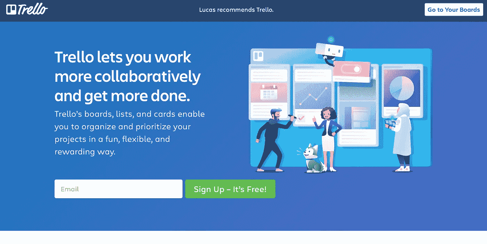
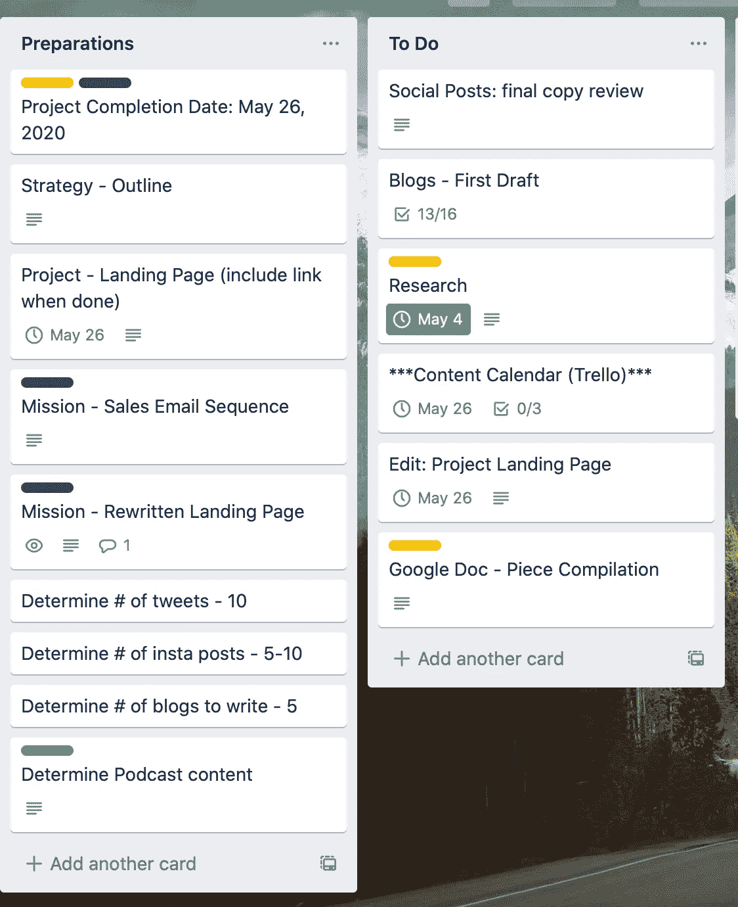
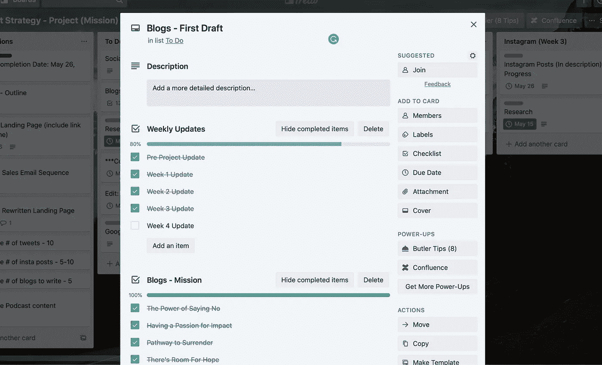
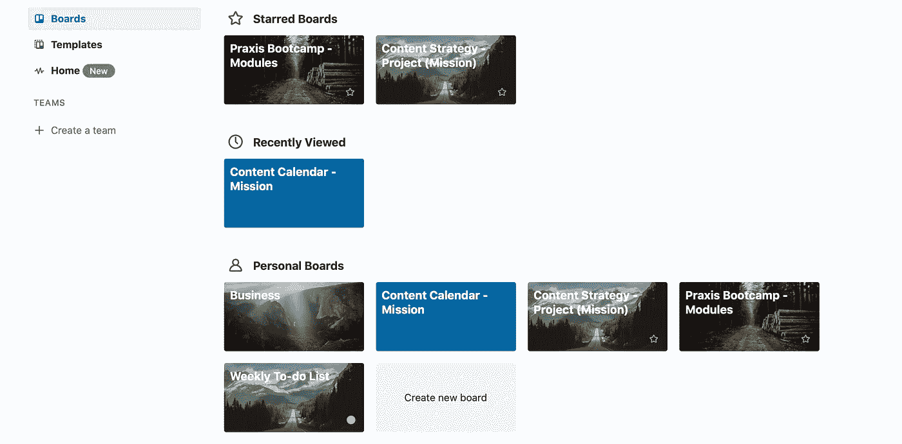
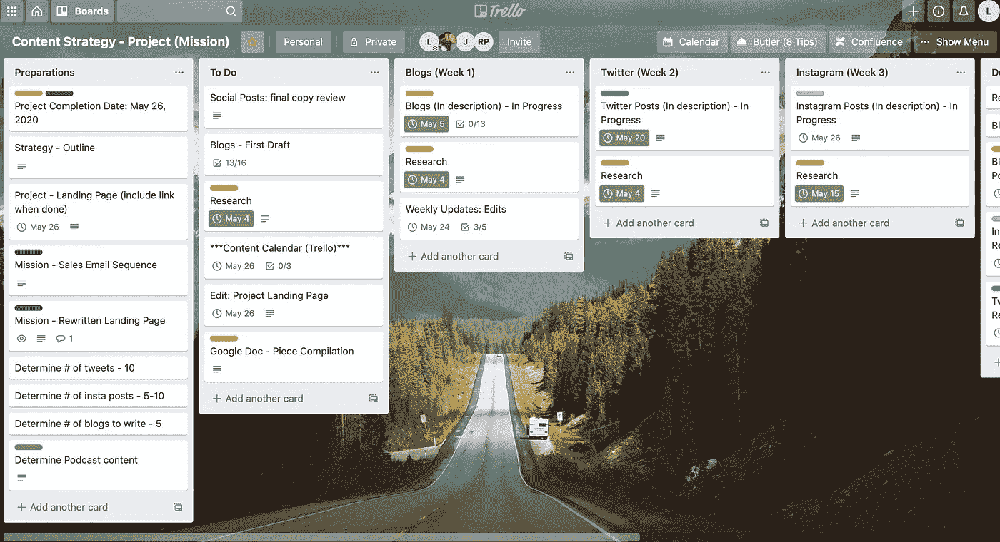

# 特雷罗 Vs .记事本:在线组织的争论

> 原文：<https://medium.datadriveninvestor.com/trello-vs-notepad-the-argument-for-online-organization-55b8c8817a0f?source=collection_archive---------7----------------------->

Photo by [Brooke Lark](https://unsplash.com/@brookelark?utm_source=medium&utm_medium=referral) on [Unsplash](https://unsplash.com?utm_source=medium&utm_medium=referral)

对于所有喜欢便利贴和记事本的人，我会和你们一起。

在我职业生涯的大部分时间里，我都用记事本和便利贴来组织我的想法，还有待办事项、项目、提醒、文档等清单。

我自己更喜欢动手，所以写下一些东西并看到我写的东西的感觉是巨大的。不仅如此，划掉你的整个待办事项清单也非常令人满意。

然而，我最近被挑战使用管理工具 [Trello](https://trello.com) 来完成一个我已经工作了一个月的项目。

**本博客的目的如下:**

*   *让你了解什么是特雷罗*
*   *分享 Trello 和其他人对该平台的评价*
*   *展示我上个月的使用感受*

尽情享受吧！

# 特雷罗是什么？

Trello 是一个基于网络的看板式清单制作应用，成立于 2011 年，总部位于纽约市。

[https://trello.com/en-US](https://trello.com/en-US)

Trello 是一个协作工具，可以将你的项目组织成“板块”。

该应用程序使您能够一目了然地看到以下内容:

*   正在进行的工作。
*   谁在做什么？
*   某件事正在进行中。

下面是 Trello 给出的一个关于该平台的有用图片:

> 想象一个白板，上面写满了便签清单，每个便签都是你和你的团队的任务。现在想象一下，这些便笺中的每一个都有照片、来自其他数据源(如 BitBucket 或 Salesforce)的附件、文档，以及一个与您的队友进行评论和协作的地方。现在想象一下，你可以用你的智能手机把白板带到任何地方，并且可以通过网络从任何电脑上访问它。那是特雷罗！

# 人们对特雷罗有什么看法？

当自己熟悉一个新的应用程序时，我发现先看看专家对它有什么看法是有帮助的。

产品管理负责人贾斯汀·加拉格尔在网上发表了一点关于特雷罗最初想法的内幕:

> “当我们在 2011 年推出 Trello 时，我们的想法是将简单的便利贴贴在墙上，将其转变为帮助人们实时协作的工具。”

“Sticky Notes on a wall”

加拉格尔继续说道:

> “Trello 是一个高度可视化、灵活且适应性强的工具，可用于解决围绕让人们达成共识的各种问题，这也是 Trello 与其他工具的不同之处。虽然许多项目管理应用程序都高度专业化于一种任务，但 Trello 足够灵活，可以在你的整个生活中使用，所以它被每个人使用，从计划下一次休假的人到最大企业的员工。”

蒂姆·布朗， [Hook Agency](https://hookagency.com/) 的创始人，在接受 [CMSWire](https://www.cmswire.com) 采访时也提到，

> “Trello 是一个看板风格的板，更像是一个真正易于使用的待办事项列表。我发现 Trello 非常容易使用，而且更加直观..Trello 的简单性使它成为我最喜欢使用的项目管理工具之一”

# 我对特雷罗的评论

我这么久以来一直使用记事本的一个重要原因是因为它的简单性。应用程序通常附带的几十个功能往往是多余的，而不是有用的。

然而，从一开始，我就发现 Trello 出奇的简单。

创建一个由一系列卡片组成的总体棋盘的想法对我来说很有逻辑意义。更不用说，它真的感觉像一个更有组织性和数字化的便利贴收藏。

## 创建多个电路板的能力

这个平台最大的好处之一是，你可以区分各种不同的(如果没有对比的话)项目、想法、待办事项等。

每个棋盘都可以按照你的意愿与其他事物交织在一起。Trello 使用户能够为他们想要的任何东西创建一个新的板模板。

这使我能够将我的个人生活与项目分开，反之亦然。

## 对一个项目有好处？

当谈到它能够容纳你正在做的项目的一切时，如果你想要一个尽可能简单的应用程序，Trello 是一个不错的选择。

我的大脑非常系统地思考，因此在多步骤项目中，将事情细分的能力很有帮助。

如果你想知道我是如何分解这个项目的，如上所示，[这里是我做的一个概述，详细介绍了我的系统！](https://www.loom.com/share/d38b2d7b204c47978374c2841684adb8)

# 特雷罗的利与弊

如果你还在犹豫要不要加入像 Trello 这样的公司，这里有一些利弊，希望能让你更容易做出决定。

Trello 对任何数量的用户都是免费的。如果你在寻找更好的集成、更好的整体安全性、更好的文件上传、高级用户权限等，还是有升级的。

*   **商务舱:** $9.99 每用户，每月按年计费
*   **企业:**每个用户每月 20.83 美元，按年计费

## 赞成的意见

*   不限数量的团队成员免费使用。
*   评论、颜色编码、@提及等功能。
*   看板风格的板使它在视觉上吸引人并且具有交互性。
*   与 Slack 和 Google Drive 等工具的集成。
*   iOS 和 Android 都有。
*   非常好理解。[如果需要指导，可以看看这个 YouTube 视频。](https://www.youtube.com/watch?v=WlzWKP0Dp3E)

## 骗局

*   在卡片中创建子任务需要你付费订阅。
*   导出功能仅在订阅时可用。
*   一旦你开始与更多的团队成员在 Trello 板上合作，它的功能就像 Asana 那样少了。

# 最后…

直到今天，我都靠我的记事本生活和死亡。

然而，使用 Trello 这个应用程序，在过去的一个月里，我真正看到了在线项目管理工具的效率和整体便利性的提高。

在未来，Trello 将成为我管理项目或记录我生活中许多动态片段的首选工具！

特雷罗适合你吗？[看看吧！](https://trello.com/en-US)