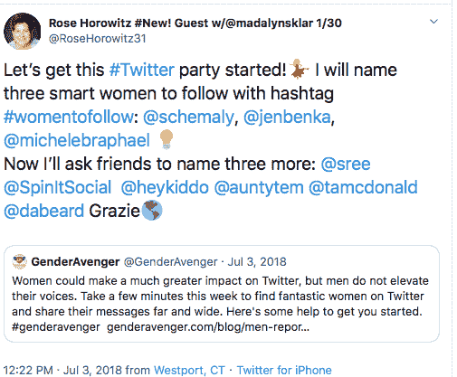

# 流行巨星告诉一切

> 原文：<https://medium.datadriveninvestor.com/trending-superstar-tells-all-97499a0c2aa9?source=collection_archive---------12----------------------->

## 在社交媒体上迅速传播是一件值得欢迎的事情

Photo by Allef Vinicius on Unsplash

目标是做好趋势，从好的内容开始。记者应该知道这一点，这就是为什么[罗斯·霍洛维茨](https://twitter.com/RoseHorowitz31/)作为内容专家随叫随到。除了报道技巧之外，她还创建了#WomenToFollow，为企业和非营利组织管理内容、社交媒体和公共关系。

Horowitz 与数字营销专家 [Madalyn Sklar](https://twitter.com/MadalynSklar) 和社交媒体管理公司 [Hootsuite](https://twitter.com/Hootsuite) 的 [Nick Martin](https://twitter.com/AtNickMartin) 讨论了如何在 Twitter 上创造有价值的内容来推动潮流。

当获得推特金牌时，好事就会发生。

“你的饲料爆炸，”霍洛维茨说。“人们开始转发你，回复你，给同事和朋友贴标签。它不断滚雪球。”

 [## 修复你的社交媒体营销

### Twitter 快速而广泛地传播你的信息

blog.markgrowth.com](https://blog.markgrowth.com/fix-up-your-social-media-marketing-26cbfa3a5d45) 

她回忆说，在基督教女青年会的一堂课后，她读到了一条她无法相信的关于男性如何主宰社交媒体的推文。

霍洛维茨说:“我回复了一个我创建的标签:#WomenToFollow。“推特有腿。对该标签的分析显示，两周内点击量达到了 1200 万。

在 GenderAvenger 的博客中，她写了#WomenToFollow 标签如何发起了一场运动。

这是一个如何以惊人的规模吸引观众的例子。活跃在 Twitter 上很可能提升了霍洛维茨，这不仅仅是偶然。

“定期分享内容给你的观众看，”马丁说。“问问你自己，‘谁是我的观众？他们想从我这里得到什么？“我的个人品牌是什么？”

“当你有了这些问题的答案后，你就知道该分享什么内容了，”他说。

这样的基础知识带来力量。

“当你了解你的观众时，找到他们会觉得有价值和有趣的内容是很容易的，”马丁说。“跳进谷歌，问你的观众可能会问的问题，比如，我怎样才能在 Twitter 上做得更好？”

有了它，一大堆内容就可以分享了。

“确保你也参与进来，”马丁说。“没有人愿意追随一个只会发表文章而不会参与的人。

“加入像#TwitterSmarter 和#HootChat 这样的聊天网站，或者任何与你的受众和你的个人品牌最相关的网站，”他说。

为了获得更多的见解，Hootsuite 发表了一篇文章，[*“Twitter 营销:商业完全指南”*](https://blog.hootsuite.com/twitter-marketing/)

# 很难破解

要在 Twitter 上开创一种潮流，就要发自内心地说出你做了什么或想分享什么。然而，如果你开始创造一种趋势并让它发挥作用，你将是第一个破解密码的人。霍洛维茨向她提供了专业建议:

*   保持现状。在 Twitter 和新闻网站上关注有趣的人和趋势，这样你就足够聪明去发现什么值得你关注。
*   重点:Twitter 的世界是巨大的。选择五个让你感兴趣的领域。

“回报是你很快就会知道足够多的东西，从而做出明智的评论，”她说。

 [## 成功源于关系

### 营销的成功在于提供价值

medium.com](https://medium.com/datadriveninvestor/success-springs-from-relationships-9db5934821d8) 

当试图创造一种趋势时，用你的力量做好事。为了点击诱饵而去消极，很容易也很弱。Horowitz 遵守这些准则:

*   不要转发任何你没读过的东西。你不想用错误的信息开始一个趋势。
*   当你不“认识”这个人的时候，这一点就更重要了。
*   一定要查看人们的推特资料，阅读五到七条推文。信誉就是一切。

一个品牌在 Twitter 上的流行趋势是很棒的，尤其是如果是好消息的话。这将在热门话题中脱颖而出，因为大多数热门话题都令人不快。

“趋势是无价的，”霍洛维茨说，“#WomenToFollow 发起了一场在社交媒体上放大女性声音的运动。我听过[四月统治](https://twitter.com/ReignOfApril/)讲述她如何在 2015 年奥斯卡期间第一个发推特#OscarsSoWhite 的故事。这产生了巨大的影响。

“消费者越来越关心品牌的问题和价值，”她说。“当花旗发现其女员工的收入比男同事低 29%时，它[开始与# its about time](https://blog.hootsuite.com/social-media-trends/)对话。”

Sklar 在流行标签方面的第一手成功始于#TwitterSmarter 宣传她每周一小时的聊天。

“它吸引了更多的人，”她说。“这是一大优势。”

# 日常专业技巧

如果没有流行趋势，Twitter 上的用户可以通过活跃、可用和为他们的受众提供巨大价值来增加他们的影响力。Sklar 指的是她的推特秘制酱:

霍洛维茨从社交媒体专家 Sree Sreenivasan 那里获得了指导:

*   大方点。推特的美妙之处在于它是民主的。要做好，分享有价值的内容。分享你推文的人会给你奖励。
*   关注有趣的账户。
*   看看那些账号关注谁，关注谁。

如果现有趋势符合你的个人或专业品牌，就抓住它们。不要在不知道鲨鱼游向何处的情况下，为了潮流而去追逐潮流。

“有相关的东西可以分享，”Sklar 说。"加入潮流是结识新的有趣的人的一种有趣的方式."

拖延症是一种趋势杀手。

“早点加入，”霍洛维茨说。“有一种蘑菇效应。在趋势上找另一个角度。当所有人都在曲折前进时，你也在曲折前进。”

 [## 有效的营销始于一条推文

### 较少使用的 Twitter 功能让你比竞争对手更有优势

blog.markgrowth.com](https://blog.markgrowth.com/effective-marketing-starts-with-a-tweet-9fdde98d6d04) 

她回忆起当奥斯卡金像奖没有女导演获得最佳导演提名的新闻流行时，她看了更多的娱乐出版物。

“我发现了这条新闻:五部获得最佳纪录片提名的电影中有四部是由女性联合导演的，”霍洛维茨说。“我核对了事实、被提名女性的处理方式、她们的国籍、每部电影的艺术截图，并给 10 个人做了标记。我的推文已经有了 45700 次点击量。”

# 提出问题

写热门文章的秘密公式仍然是一个秘密。你会伤透脑筋——通常是错误的——猜测哪些帖子会击中或错过。

“要有说服力，”Sklar 说。“问个问题。你想鼓励交谈。”

如果有的话，尽你所能，直到闪电来临。

霍洛维茨说:“如果你收集并产生好的内容，展示新闻判断，并对什么是趋势有悟性，你就会做好趋势的准备。”

“在写文章或博客时，发现一些别人没有涉及到的东西，”她说。"做一个作者的采访，[直播](https://medium.com/datadriveninvestor/live-stream-freely-and-legally-c313f4114a15?source=friends_link&sk=91ad5b15b134e13041368d237af2759d)"

 [## 直播激发人类瞬间

### 错误会发生，让真实的你展现出来

medium.com](https://medium.com/datadriveninvestor/live-streaming-inspires-human-moments-d8043cf4efb1) 

无论一条推文或文章是否流行，一定要感谢转发的人。回复评论，让人们知道你的存在和关心。

Sklar 说:“停止你现在正在做的事情，审核你的 Twitter 个人资料。”“你的传记引人注目吗？

"你的个人资料和封面图片与你和你的品牌相匹配吗？"她说。“你需要有最棒的个人资料，这样当你在 Twitter 上做趋势时，你已经在利用它了。”

当幸运降临时，采取行动。

霍洛维茨说:“如果你做对了，并开始了一个标签潮流，那就跟风做吧。”“投资于你开创的事业。看看谁喜欢过你，转发过你。

“向他们表达你的爱，”她说。“这是了解新朋友的好方法。运气发生，订婚就是工作。”

持续参与带来持续回报。

霍洛维茨说:“如果你在其他人的微博上发现一条值得赞、转发或评论的推文，就去做。”“你最终可能会有一个全新的社区对你和你所写的或宣传的东西感兴趣。*接合*。”

**关于作者**

吉姆·卡扎曼是[拉戈金融服务公司](http://largofinancialservices.com/)的经理，曾在空军和联邦政府的公共事务部门工作。你可以在[推特](https://twitter.com/JKatzaman)、[脸书](https://www.facebook.com/jim.katzaman)和 [LinkedIn](https://www.linkedin.com/in/jim-katzaman-33641b21/) 上和他联系。

*原载于 2020 年 2 月 13 日 https://www.datadriveninvestor.com***。**