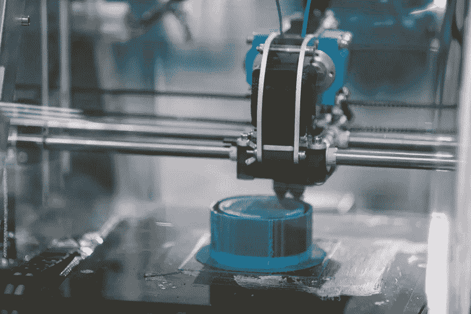
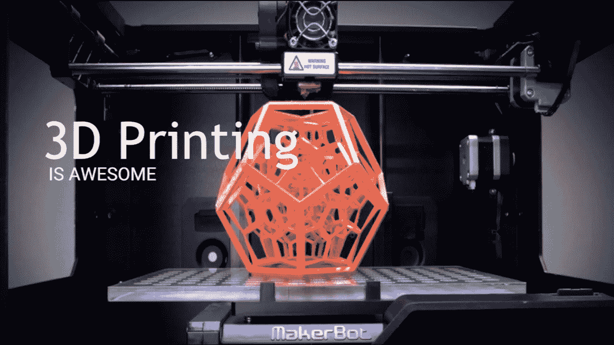

# 增材制造的趋势

> 原文：<https://medium.datadriveninvestor.com/trends-in-additive-manufacturing-64570d5be55f?source=collection_archive---------21----------------------->

Additive Manufacturing

这是从模拟到数字过程的转变所带来的又一项技术进步。近几十年来，通信、成像、建筑和工程都经历了各自的数字革命。现在，AM 可以为制造业务带来数字化的灵活性和效率。

添加制造使用数据计算机辅助设计(CAD)软件或 3D 物体扫描仪来指导硬件以精确的几何形状一层一层地沉积材料。顾名思义，增材制造通过添加材料来制造物体。相比之下，当你用传统方法制造一个物体时，通常需要通过铣削、机加工、雕刻、成形或其他方法去除材料。

虽然“3D 打印”和“快速成型”这两个术语被随意用来讨论增材制造，但每个过程实际上都是增材制造的子集。

 [## 幸福的算法？数据驱动的投资者

### 从一开始，我们就认为技术正在使我们的生活变得更好、更快、更容易和更实用。社交媒体…

www.datadriveninvestor.com](https://www.datadriveninvestor.com/2019/03/08/an-algorithm-for-happiness/) 

虽然添加制造对许多人来说似乎是新的，但它实际上已经存在了几十年。在正确的应用中，添加制造提供了改进的性能、复杂的几何形状和简化的制造的完美三重优势。因此，对于那些积极接受增材制造的人来说，机会比比皆是。

**3D 打印帮助制造作业**

3d printing

大多数制造商想知道什么添加剂技术适合今天。就将要制造的产品而言，该清单扩展到了牙科模具、眼镜、假肢、珠宝、乐器、智能手机外壳、建筑模型、汽车零部件。

以下是目前 3D 打印的一些应用方式:

**原型制作:**

3D 打印对于一次性使用的场景是灵活的。拥有工程和时尚技能的组织可以快速为全新的产品创意绘制 CAD 模型，并使用 3D 打印机制作产品的实体版本。传统的制造方法，如机械加工、锻造和铸造，对于快速原型来说往往成本过高。3D 打印有助于推动更具迭代性的创新方法——一种更容易、更具成本效益的创新方法。这种方法有助于组织将实物产品送到决策者、利益相关者和焦点小组的手中，然后他们可以决定是否进行进一步的开发。

**更换零件:**

将所有可能的备件保存在库存中是非常昂贵的，而指望第三方供应商提供所需的部件可能意味着漫长的等待时间。但是，如果一个人拥有 3D 打印机，因此可以获得所需的 CAD 图纸，或者如果一个人可以快速找到它们，他们将使用 3D 打印在现场制造零件。对于运行大型车队、制造设施或仓库的企业来说，3D 打印提供了前进的方向，这将有助于减少由于设备维护或故障造成的停机时间。

**有利可图的个性化(可配置产品):**

对于高度可配置的产品，3D 打印象征着一种有趣的解决方案，在这种产品中，保持所有可能的零件组合都可用通常是一个物流问题。在企业寻求有效解决消费者对符合其独特要求的个性化产品的期望的时候，企业可以使用 3D 打印通过打印出客户需要的零件来满足需求。

**可持续性:**

3D 打印使生产本地化，这减少了碳足迹和与之相关的运输成本。当产品使用塑料粉末或灰尘制造时，产品也是 100%可回收的。因此，无论制造出什么，通常都会被还原成制造它的尘埃，使得底层材料可以再次用于新的商品。对于认真对待可持续发展努力的组织来说，3D 打印可以促进循环经济的实施。

**读也:**

[**应对限制增材制造的挑战**](https://www.manufacturingtechnologyinsights.com/news/tackling-the-challenges-that-limit-additive-manufacturing-nwid-1031.html)

[**3D 打印的无限可能**](https://www.manufacturingtechnologyinsights.com/news/endless-possibilities-of-3d-printing-nwid-426.html)

**在社交媒体上关注他们**

[**推特**](https://twitter.com/MfgTechInsight)

[**领英**](https://www.linkedin.com/company/manufacturingtechnologyinsights/)