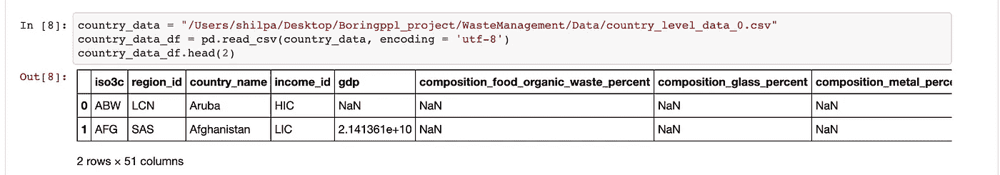
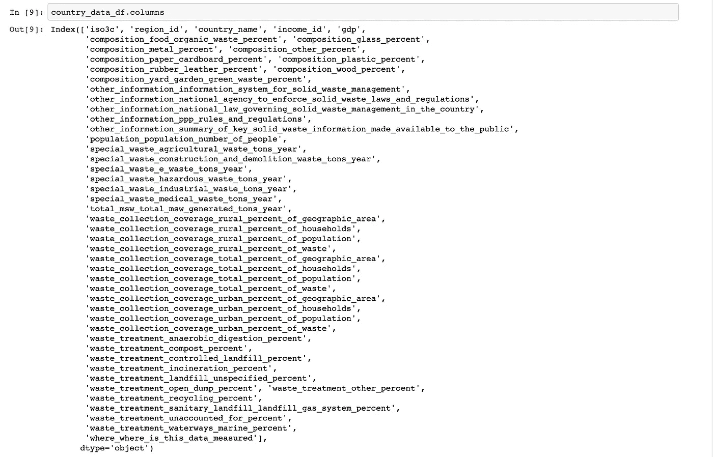
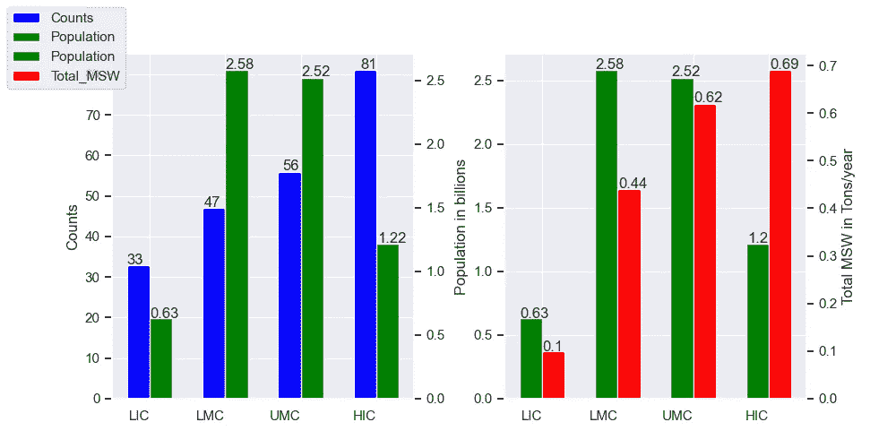
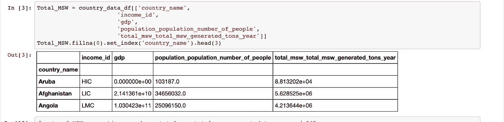
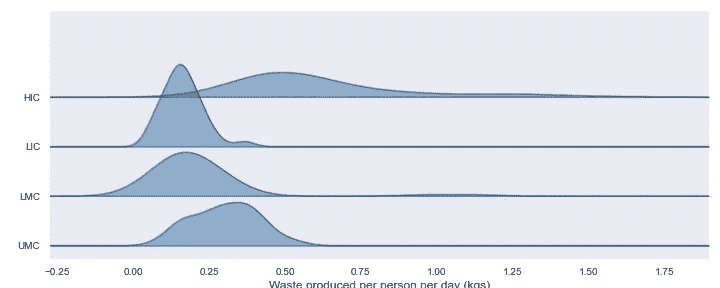
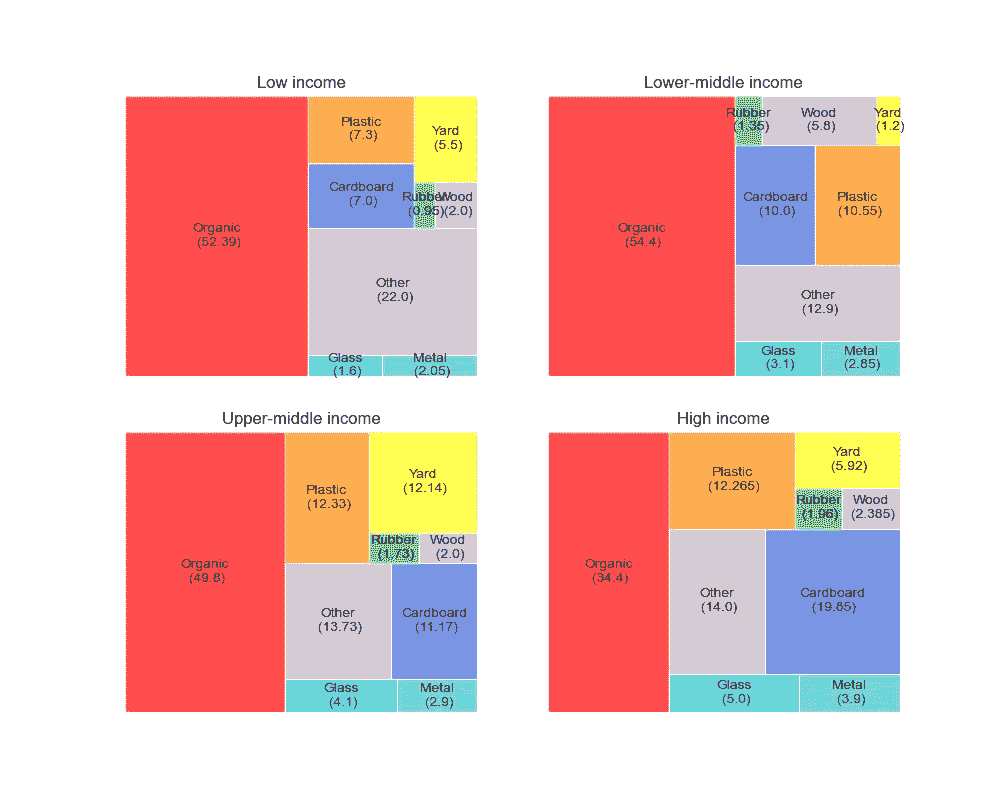
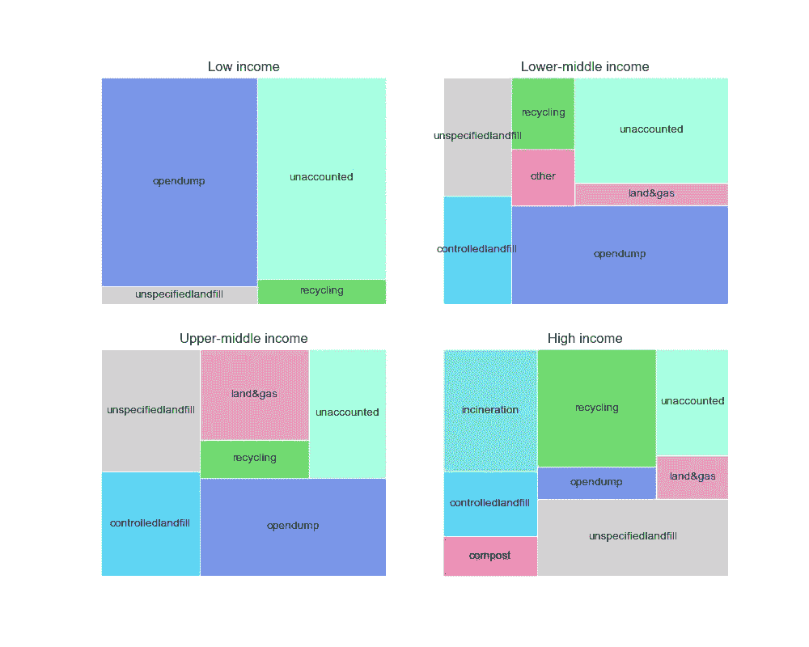
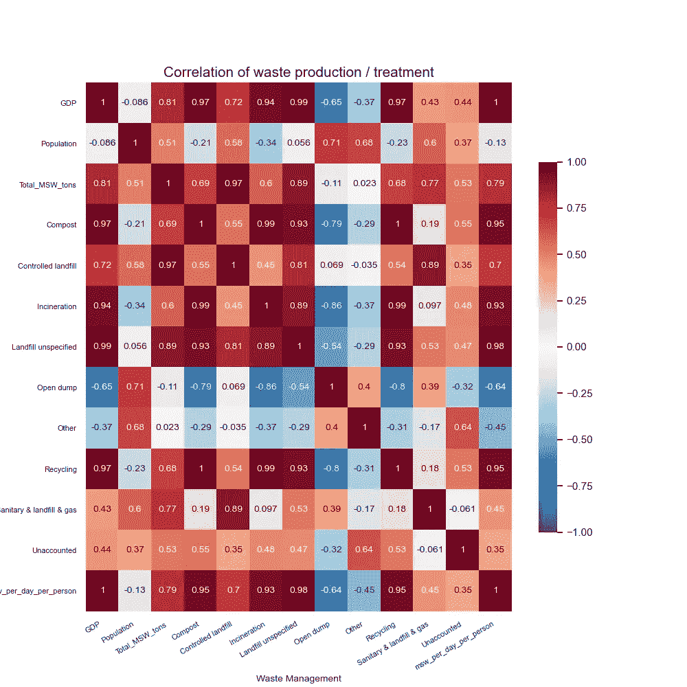

# 废物“管理不善”的趋势——世界废物的探索性数据分析

> 原文：<https://medium.datadriveninvestor.com/trends-in-waste-mismanagement-an-exploratory-data-analysis-of-the-worlds-waste-d412fe179f93?source=collection_archive---------14----------------------->


Photo by [Nareeta Martin](https://unsplash.com/@splashabout?utm_source=unsplash&utm_medium=referral&utm_content=creditCopyText) on [Unsplash](https://unsplash.com/t/sustainability?utm_source=unsplash&utm_medium=referral&utm_content=creditCopyText)

> 垃圾管理为人们的集体习惯和生活方式提供了一个迷人的快照。顾名思义，废物管理意味着生产，默认情况下，意味着安全处置的资源。人们如何处理垃圾让我们得以一窥获得有效垃圾管理的特权和滥用这种特权的权力。

随着人口的增长、经济的改善和寿命的延长，全世界每年人均产生的废物也将增加。此外，适当的废物管理对抗击全球变暖的影响是巨大的。因此，准确了解世界各国对废物产生的贡献至关重要。这些数据将有助于制定适当的政策决定，根据资源分配采取有针对性的干预措施，从而全面改善地球的健康状况。

作为一个狂热的 [TDS](https://towardsdatascience.com) 读者和数据科学爱好者，我看到了[特伦斯·申](https://towardsdatascience.com/14-data-science-projects-to-do-during-your-14-day-quarantine-8bd60d1e55e1)和[普拉萨德·帕蒂尔](https://towardsdatascience.com/exploratory-data-analysis-8fc1cb20fd15)的文章。这些资源启发我将这个数据科学项目概念化，并利用探索性数据分析的力量，通过可用数据的图形表示来了解流行病学模式。成为像厚脸皮的科学家和无聊的人这样的团体中的一员给了我实现目标的指导和帮助。这篇[在 Medium 上的文章](https://towardsdatascience.com/a-peek-into-a-netflix-data-scientists-day-66bf3dacabb9)让我相信了利用数据科学解决问题的无限可能性，这些问题起源于本地，但具有全球影响。在本文中，我将展示我对来自[worldbank.org](https://datacatalog.worldbank.org/dataset/what-waste-global-database)的废物管理数据集的探索性数据分析。

在这段旅程中，我认识到磨练数据科学工具和技能的强大本质，以及数据如何挑战我们基于有限经验创建的假设。

## 导入依赖关系、加载数据以及浏览行和列

```
%matplotlib notebook
import pandas as pd
#from IPython.display import display
import numpy as np
import matplotlib.pyplot as plt
import seaborn as sns
sns.set()
```



对于本文，我选择处理上述数据集中的这些列:

*   收入:有标签`LIC`(低收入国家)`LMC`(中低收入国家)`UMC`(中高收入国家)`HIC`(高收入国家)
*   废物成分栏:`organic`、`glass`、`metal`、`other`、`cardboard`、`plastic`、`rubber`、`wood`、`yard`
*   人口栏:`population_number_of_people`
*   固体废物栏:`total_msw_generated_tons_year`
*   废物处理栏:`anaerobic digestion`、`compost`、`controlled landfill`、`incineration`、`unspecified landfill`、`open dump`、`sanitary landfill & gas`、`unaccounted`、`waterways & marine`

## 根据收入、人口和产生的垃圾量，世界各国是如何分布的？？


我选的栏目`income_id, Population and total_msw_tons_year`。然后，我使用 value_counts 函数和 sum 函数`Population and Total_msw columns`来获得每个收入组的总和。

`Population`和`total_MSW`列在数据帧`df_PoP_MSW`和`Final_1`中以十亿为单位显示。完整的[代码](https://github.com/ShilpaMuralidhar/WasteManagement/blob/master/Data_Science/Counts_Population_TotalMSW_Subplots.ipynb)参见此处。



该柱状图显示了世界上的高收入国家(HIC ),尽管数量很多，但仅占世界人口的 17.5%，却不成比例地产生了超过 37%的废物总量。这一趋势表明，随着财富的增加和生活水平的提高，中低收入人群可能会制造更多的垃圾。

哪个收入群体产生的垃圾更多？？

要回答这个问题，

*   我用了`total_msw_generated_tons_year`柱
*   计算平均产生的废物/天/人。

[代码](https://github.com/ShilpaMuralidhar/WasteManagement/blob/master/Data_Science/viz_joyplot_msw.ipynb)参见此处。



Joy Plots to show the distribution of waste produced/person/day

这张图表突出了两个重要的模式。首先，它表明，随着经济财富的增加，人们也产生更多的废物。例如，`LIC`、`LMC`、`UMC`和`HIC`产生的垃圾中位数分别为 0.16 千克、0.17 千克、0.30 千克和 0.52 千克。
第二，分布的可变性和扩散性在`LIC`最小，在`HIC`最易变。然而，随着国家收入水平的提高，他们往往会产生更多的垃圾，垃圾分配的可变性也会增加。

**各收入组别的废物构成**

为了确定每个收入群体产生的浪费类型及其比例，我决定将相关数据绘制成树状图。[代码](https://github.com/ShilpaMuralidhar/WasteManagement/blob/master/Data_Science/viz_treemap_composition.ipynb)参见此处。这些是我选择的列:

首先，

*   按照`income_id`分组，然后获取相关标签。
*   计算每个收入组别内每种废物的中位数，
*   将结果转换为数据框，然后
*   绘制树状图。



Treemaps to show the composition of waste generated

这种树形图排列描述了每个收入群体中的垃圾构成中值。随着这些国家在高收入阶梯上攀升，T8 的比例似乎在下降。一个可能的原因是，随着各国收入水平的提高，经济从农业转向工业。`cardboard`、`glass`和`metal`的使用，可回收材料似乎也随着收入的提高而增加。`Plastic`；然而，无论收入等级如何，它始终是产生废物的来源。`other`(未说明的废物)的比例值得更多关注，以更好地定义所有不同收入群体中的废物产生。

**每个收入群体如何处理垃圾？**

这些列显示了不同类型的废物处理。首先，使用 get_group()方法将处理列按收入分组并按标签分隔，然后，从 total_msw_tons_year 列计算不同类型处理的比例。最后，比例的树形图使用了这些数据。详细的[代码](https://github.com/ShilpaMuralidhar/WasteManagement/blob/master/Data_Science/Treemap_Treatment.ipynb)参见此处。



这组树形图描述了不同收入组的国家目前采用的废物处理战略。`open dump`和`unaccounted`处理方法是`LIC`垃圾处理的主要途径。这两种垃圾处理方法都随着收入的增加而减少。`Recycling`和`incineration`越来越熟悉不断增长的国家财富。回收和焚烧需要巨大的资源，这些资源可能难以负担`LIC`。一个令人担忧的趋势是中等收入和高收入国家的人口增长。

**相关矩阵**

使用 df 计算这些柱的相关系数。corr()函数，并显示在此热图中。详细的[代码](https://github.com/ShilpaMuralidhar/WasteManagement/blob/master/Data_Science/viz_heatmap.ipynb)参见此处。



*   `GDP`与`msw_per_day_person, Total_MSW_tons_year, Compost, Incineration, Controlled Landfill, Unspecified Landfill, and Recycling`正相关度最高。
*   `Population`与`Total_MSW_tons_year, Controlled Landfill, Open dump, and Other`呈中度正相关。
*   `Open dump`与`Incineration, Recycling, Compost, GDP, and msw_per_day_person`高度负相关。

*总结一下，*

*   *高收入国家仅占世界人口的 17.5%，却产生了超过 37%的垃圾。*
*   *高收入国家的平均废物产量高(~0.5 千克)且易变，而低收入国家的平均废物产量低(~0.16 千克)且易变。然而，随着收入的增加，平均废物产量也会增加，并趋于变化。*
*   随着富裕国家的增加，产生的废物类型趋于一次性，即纸板、玻璃、金属和可回收物。
*   随着低收入国家资源的缺乏，垃圾去向不明，或者采用公开倾倒垃圾的方式。然而，在富裕国家，废物管理方法，如回收和焚烧使用。然而，在中高收入国家，不明垃圾填埋场有所增加。
*   *国内生产总值的增长与个人平均垃圾产量、集体垃圾产量、堆肥、焚烧、回收、受控和未指定垃圾填埋的增长相关。*

感谢您的阅读。可以在我的 [**Github**](https://github.com/ShilpaMuralidhar/WasteManagement/tree/master/Data_Science) **上访问代码。**在 [**LinkedIn**](https://www.linkedin.com/in/shilpamuralidhar/) 上联系我

# 感谢

感谢我的家人和朋友花时间阅读、评论和建议修改这篇文章。

**参考文献:**

1.  [https://www . machine learning plus . com/plots/top-50-matplotlib-visualizations-the-master-plots-python](https://www.machinelearningplus.com/plots/top-50-matplotlib-visualizations-the-master-plots-python/)
2.  [https://informationisbeautiful.net/](https://informationisbeautiful.net/)
3.  [https://stackoverflow.com/](https://stackoverflow.com/)