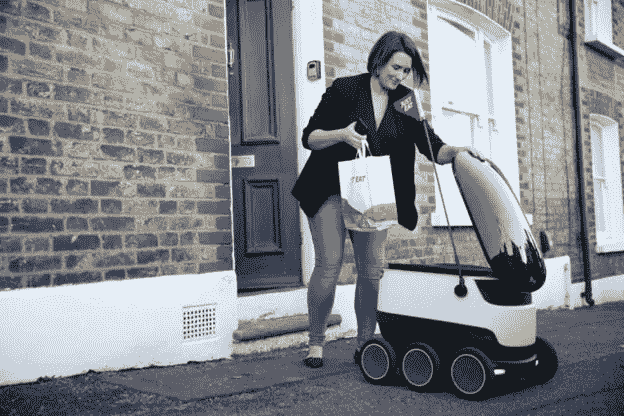
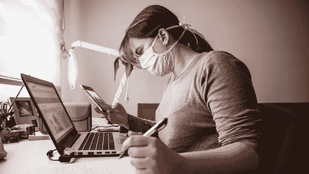
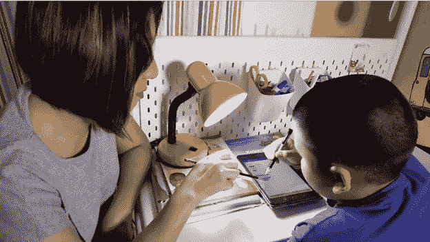
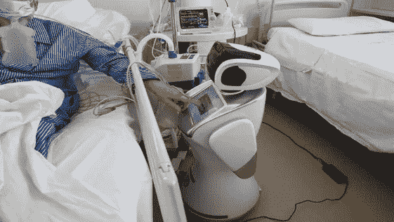

# 新冠肺炎时期的技术趋势

> 原文：<https://medium.datadriveninvestor.com/trends-of-technology-during-covid-19-f9570a44d1d2?source=collection_archive---------36----------------------->

新冠肺炎·疫情激发了包括机器人、网上购物、数字货币、远程工作、在线学习和在线娱乐在内的技术潮流。通过使用这些技术，不仅我们的业务，而且冠状病毒传播的机会也将减少。在这个疫情期间，这些技术可以帮助社会变得更加活跃。在新冠肺炎疫情期间，这些技术在使我们的社会在封锁期间变得实用方面发挥着关键作用。这些技术可以在新冠肺炎之外产生长期影响。

这些技术趋势可能有助于建立一个实用的社会，我们也可以考虑它们对我们如何做生意、如何交易、如何工作、如何生产商品、如何学习、如何寻求医疗服务以及如何维持娱乐的影响。

*   **网上购物和机器人送货**

新冠肺炎已经将我们的购物从传统购物转变为网上购物。网上购物服务需要一个强大的物流系统来支撑。从一个人身上传播病毒是不安全的，病毒很容易在传播过程中传播。在美国和中国，大多数公司都推出了非接触式送货服务，将货物送到指定的地点，而不是从一个人手中或送到一个人手中。中国的电子商务公司正在加紧开发机器人送货。机器人送货服务正变得越来越普遍，公司需要组织明确的协议来保障送货的卫生条件。

*   **数字和非接触支付**

货币可能携带病毒，在中国，中央银行，美国和韩国已经实施了不同的措施，以确保钞票在进入流通之前是干净的。现在，信用卡或电子钱包形式的非接触式数字支付是避免新冠肺炎传播的推荐方法。通过使用数字支付，人们将能够在线购买和支付公用事业账单，并更快地获得刺激资金。

*   **远程工作**

许多公司现在已经为他们的员工提供了在家工作的设施。通过利用虚拟专用网络(VPN)、网络电话(VoIPs)、云计算、在线会议、工作协作工具和使用面部识别系统等设施，员工可以在家远程工作，这些技术使员工能够出现在虚拟背景前，以保护家中的隐私。通过远程工作，员工可以轻松地比他们的办公室环境更好地工作，这不仅节省了时间，还提供了灵活性。

 [## 新的健康技术如何让我们活过 100 岁？数据驱动的投资者

### 不久前，我们都在看一台黑色电视，不得不带着天线跑遍整个公寓，以确保…

www.datadriveninvestor.com](https://www.datadriveninvestor.com/2020/08/12/how-new-health-technology-makes-us-live-past-100-years/) 

远程工作也给雇主和雇员带来了一些挑战。隐私、信息安全和及时的技术支持可能是远程工作中的大问题。如果远程工作在疫情之后变得普遍，那么这将导致孤独和缺乏工作与生活的平衡，公司可能会以低成本雇佣劳动力。

此外，并非所有类型的工作都可以在家里完成，这造成了不一致。

*   **在线学习**

截至 4 月中旬，191 个国家宣布或实施了学校或大学关闭，影响到 15.7 亿学生。为了确保疫情不会扰乱教育部门，教育机构已经开始提供在线课程。学生可以很容易地待在家里上课，他们不需要出去上课。在正常的日常生活中，人们不会以他们的生活方式看待这些事情，人们会面对面地谈论这些事情。但考虑到所有这一切的发生，你会看到一个巨大的变化，在过去几周，在线平台的用户增加了数倍，至少是六倍。为了好的目的利用它是一个好的资源。

*   **在线医生**

在这期间疫情去外面做健康检查是非常危险的，它可能会导致新冠肺炎。因此，在医生和研究人员的合作下，开发了聊天机器人，用于根据患者的症状进行诊断。这些聊天机器人不仅可以诊断疾病，还可以提供相关疾病的药物建议。通过使用这些聊天机器人，病人可以利用医生的设施。

*   **在线娱乐**

这种封锁大大减少了人与人之间的互动，人类的创造力使这一部分在线。中国电影制作公司也发行网络电影。大多数博物馆和遗址现在都提供虚拟旅游。自疫情爆发以来，在线游戏流量也出现了激增。

*   **机器人和无人机**

由于这个新冠肺炎，我们现在已经意识到我们多么依赖人类的互动来使事情运转。如零售、食品服务、制造业、劳动密集型企业和物流受到的冲击最大。这次疫情为推广机器人的使用和机器人研究提供了强大的推动力。在过去的几周里，机器人已经被有效地用于消毒和给隔离区的人送食物。无人机也能在更短的时间内运送食物。根据研究，预计机器人将取代人类，但在这个时候，我们必须专注于机器人的制造，因为他们可以很容易地在这个时期使用，以避免新冠肺炎，他们的表现比人类更有效率。因此，不考虑机器人的影响，我们这次必须专注于它，使人们的生活更好，更安全。

**进入专家视角—** [**订阅 DDI 英特尔**](https://datadriveninvestor.com/ddi-intel)