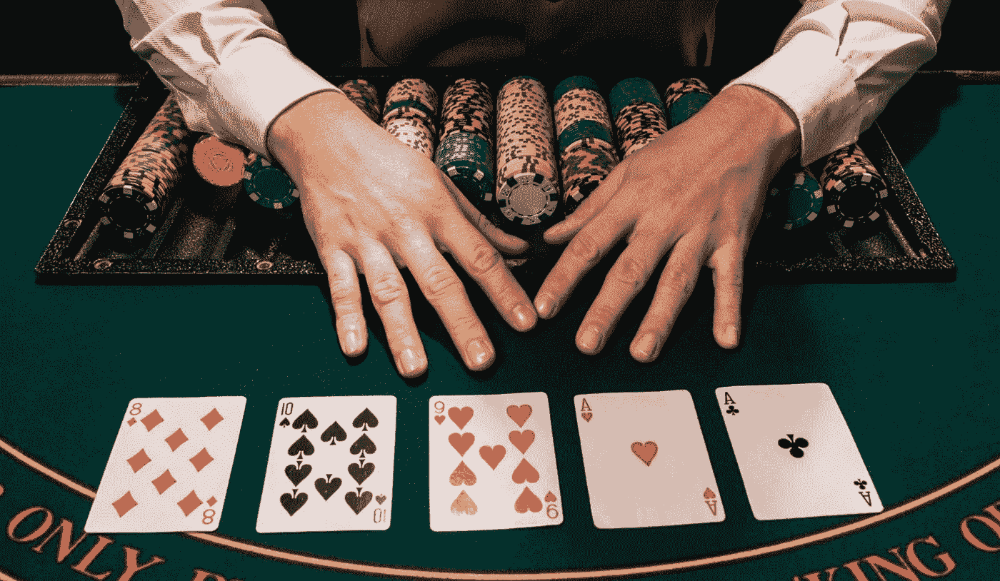
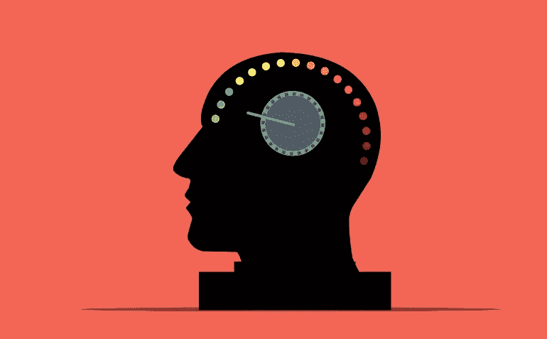
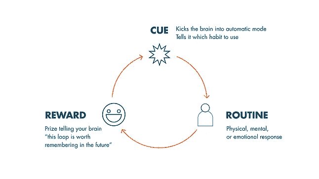

# 欺骗自己实现:我如何用习惯启动我的创业

> 原文：<https://medium.datadriveninvestor.com/trick-yourself-to-achieve-how-i-used-habits-to-kickstart-my-startup-ae6eb4baf6df?source=collection_archive---------31----------------------->

在这篇文章中，我告诉你我是如何在几个月的时间里从一个非常低效的企业家变成一个卓越的企业家的故事。我想向你展示我是如何利用习惯来加速公司的发展并取得惊人的成绩的。我们将一起从科学的角度来看待习惯的机制，以了解我们如何对它们进行逆向工程，并控制我们的日常选择。

**在生活中，你在任何时候的处境都是你在这之前所做的所有累积决定的直接结果。**我喜欢扑克。事实证明，生活与扑克锦标赛有着非同寻常的相似之处。所有玩家都以相同的筹码开始。他们必须在拿到的每手牌上都做出决定，以增加筹码。**他们都有相同的基本决策集可供选择，以便获得第一名**，或最大的筹码。我喜欢这个例子，因为它非常清楚地向你展示了一系列决策和客观量化指标(每个玩家拥有的钱数)之间存在的直接因果关系。在现实生活中，这个指标可以是你的职业满意度、你的健康或任何你真正关心的事情。

我们的选择会直接影响我们的生活。每天，我们都要做出成千上万的选择:在食物和衣服方面，在商业场合，在家庭谈话中，等等。这些选择中有些是经过深思熟虑的，但绝大多数是无意识的。因此，从技术上讲，你一天中很大一部分时间是由你的无意识决定控制的。

谢天谢地，我们的大脑是非常高效的系统。**他们总是走阻力最小的轨迹，把花在脑力上的精力降到最低。**因此，所有不自由的决定都是根据我们的身体习惯来做的，因为这是最简单的方法。这些不自由的选择被称为习惯。另一方面，深思熟虑的决定需要时间和精力。我们的大脑总是喜欢走最简单的路线。这就是为什么拖延总是所有选择中最容易的:把深思熟虑推迟到以后。

即使有可能，也很难改变我们身体和大脑的工作方式。这些方式深深植根于我们的 DNA 中。在所有情况下，它们在历史上都被证明是极其有效的。我们更愿意做的是欺骗我们的身体去接受最好的习惯。阻力最小的道路充满了好处。你将会在每天的生活中完成很多事情，而不需要刻意思考。换句话说，我们将非常有价值的行为从通常被大脑鄙视的有意识的一面转移到与我们的存在和谐一致、运作完美的无意识的一面。**这就是习惯的力量。**

**我实施的快速启动业务的习惯**

我在 2020 年初开始从事我的业务。尽管我对技术世界和在线教育行业充满热情，但我总是发现自己做出了非常小的改进。这主要是由每天的消极情绪、拖延和注意力分散高峰引起的。我不能连续几个小时埋头工作。这很烦人，因为我知道在内心深处我能做到。

我确信我需要改变我日常生活中的一些习惯，这样我就可以释放出启动公司发展所需的能量和动力。改变习惯很难，尤其是如果你不知道它们背后的确切机制。本文的其余部分致力于教你更多关于习惯的知识。

**我实施了三个习惯，这三个习惯彻底改变了我的事业和我的生活**

*   **写一份目标导向的待办事项清单**:睡觉前，我开始尽可能详细地列出我需要做的任务，以及第二天要实现的目标。这样，当我起床时，我就确切地知道我需要做什么。早上花时间思考是非常低效的。
*   早起:我比平时起床时间早了两个小时。这帮助我在开始之前避免与人交往。他们只是都睡着了。
*   **让我的手机和电子设备远离我的床:**这帮助我睡得更快，起床也更快。

**习惯循环**

为了能够通过增加好习惯和改变坏习惯来影响你的日常习惯，你需要了解这些习惯是如何工作的。习惯是一个包含三个步骤的循环:暗示、常规和奖励。每一个习惯都是通过一遍又一遍的重复这个循环建立起来的，每一个习惯都可以通过改变或去除循环的三个步骤中的一个来改变或去除。

The Habit Loop

*   **一个提示:** **是触发大脑自动开始运转的元素，**开始大脑中预先配置好的套路。
    让我们来看看最常见习惯的暗示。吸烟的暗示是看到有人点燃一支烟或闻到烟味。如果习惯更发达，吸烟的想法可以成为一个线索。对于检查社交媒体通知的习惯，提示是看到你的手机或听到通知哔哔声。改掉坏习惯的一个有效方法是去除暗示比如把你的手机放在远离你的工作站或床的地方，或者和不吸烟的朋友出去玩。
*   **一个套路:** **是对提示的反应，自动无意识采取的动作。**有些套路比其他的更无意识。我曾经发现自己在不知不觉中浏览我的社交媒体。例行公事越容易做，越不需要你的努力，它们就越根植于我们的无意识中。当例行程序需要时间来设置时，在开始之前醒来的概率更高。
    **如果你想更有效地改掉一个习惯，那就让它更难做到。**例如，手卷香烟比现成香烟更容易戒烟。将社交媒体应用程序存储在子文件夹中也有助于戒掉社交媒体瘾。
    另一方面，**如果你想养成良好的习惯，让他们的日常工作变得极其容易完成**:准备好你的运动服，你的办公桌，前一天晚上打开你在笔记本电脑上使用的应用程序。这会帮助你在早上开始工作。
*   奖励:这是你每完成一次例行任务后得到的奖品。这需要是让你开心的事情，是你的身体或精神真正喜欢的事情。奖励非常重要，因为它会让你的身体想要再次进入循环。没有奖励，一个习惯永远无法养成，因为它对你的思想来说根本就没有足够的吸引力。多巴胺是你每次查看通知时的奖励。如果你想实现一个新习惯，你需要想出一个奖励来完成你的循环。对我来说，锻炼的回报是得到一杯巧克力蛋白粉。
    你可以找到你真正喜欢做的事情，阻止自己去做，除非你完成了你想养成的习惯的例行公事。例如，禁止自己晚上看《网飞》,除非你完成了待办事项清单上的所有任务。

建立或摧毁习惯不是一个容易的过程，它需要奉献和坚持，但我在这篇文章中的建议将在你的旅程中给你很大帮助。

总是认为你一天中做的大部分事情都是无意识的，所以你最好意识到你的习惯有多健康。你一天中每天微小的进步将对你的未来产生巨大的积极影响。

**更多关于习惯的内容在** [***习惯的力量有声读物***](https://amzn.to/3u3nuaV) ***，作者 Charles Duhigg。我强烈建议养成睡前至少听 10 分钟的习惯。它可以改变你的生活，就像它改变了我的生活一样。
你可以在这里获得平装版:*** [***习惯的力量***](https://amzn.to/3dcDb9I)

通过电子邮件获得有趣内容的通知！**订阅** [**我的快讯**](https://fierce-composer-1474.ck.page/ad7e3fbe83) **。**