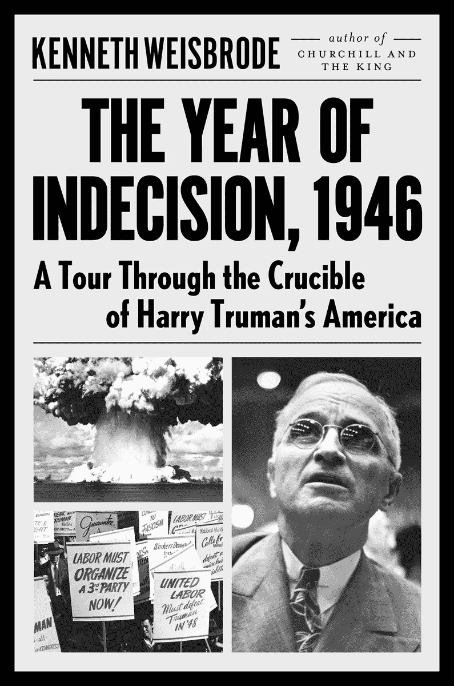

# 杜鲁门被遗忘的经济危机

> 原文：<https://medium.datadriveninvestor.com/trumans-forgotten-economic-crisis-b61a85c46c61?source=collection_archive---------14----------------------->

Credit: Viking Penguin

哈里·S·杜鲁门总统以许多名句而闻名，其中包括我最喜欢的一句:“我从未给任何人下地狱！我只是说出了事实，他们却认为这是地狱。”

也许不太为人所知的是，当和平爆发时，他的政府不得不应对经济动荡。

肯尼斯·魏斯布罗德在他的书《犹豫之年，1946:哈里·杜鲁门的美国之旅》中揭示了这个故事以及战后第一年的其他部分。

 [## 另一场精心策划的全球经济危机正在逼近？如果我们的数据经济可以帮助它|数据…

### 我们的 DApp 的开发，称为 DECENTR，目前正与我们的 R&D 同步进行，作为我们即将到来的…

www.datadriveninvestor.com](https://www.datadriveninvestor.com/2019/03/06/another-engineered-global-economic-crisis-looming-not-if-our-data-economy-can-help-it/) 

二战的结束本应带来繁荣。事实上，从德国和日本战败到 20 世纪 60 年代末这段时间，在很大程度上被认为是美国经济高速增长和美好时光的太平时期。

# 美国经济的急停和重启

但它并不是一开始就没有大问题。首先，美国必须从战争状态转变过来。这种变化极其痛苦。

工资和价格控制必须取消。最重要的是，政府必须停止购买专门用于战争的物资。看起来有点像中央计划经济的模式将会消失，取而代之的是自由市场。

最初的结果很糟糕。工资下降，物价上涨，工人失业。

*   “在一些城市，平均租金上涨了 1000%。“黄油的价格上涨了 25%，”魏斯布罗德说。牛排也是，价格几乎翻了一倍。
*   他写道，从战争中归来的士兵“被看到兜售‘欢迎回家’的标语，乞求一个住的地方”。
*   制造业工人的周薪从 1945 年 4 月的 47.12 美元下降到 1946 年 7 月的 43.07 美元。
*   书中写道，我的前雇主[通用汽车](https://www.forbes.com/companies/general-motors/)解雇了 14 万联合汽车工人，因为政府取消了价值 20 亿美元的合同。
*   “1946 年将会是近年来最大的罢工，”他写道，因为工会工人希望他们在战时的克制有所回报。
*   "美元的价值会下跌。"
*   "税收变得更加沉重。"

魏斯布罗德说，经济紧张导致劳资双方互不信任。“工人们仍然担心失业和通胀，而商人则担心工人们，”他写道。

这场战争“像股票一样被卖掉了，公众现在要求分红。”考虑到巨大的伤亡，这并不令人十分惊讶。

这本书非常值得一读，它提供了在和平的第一年里经济衰退如何发展的有趣细节。当然，我们现在都知道结果了——美国仍然是世界上最富有的国家。尽管如此，这段旅程显示了保持这种状态有多难。

这是一个故事的编辑版本，首次发表于 2016 年 3 月 4 日的《Forbes.com》。