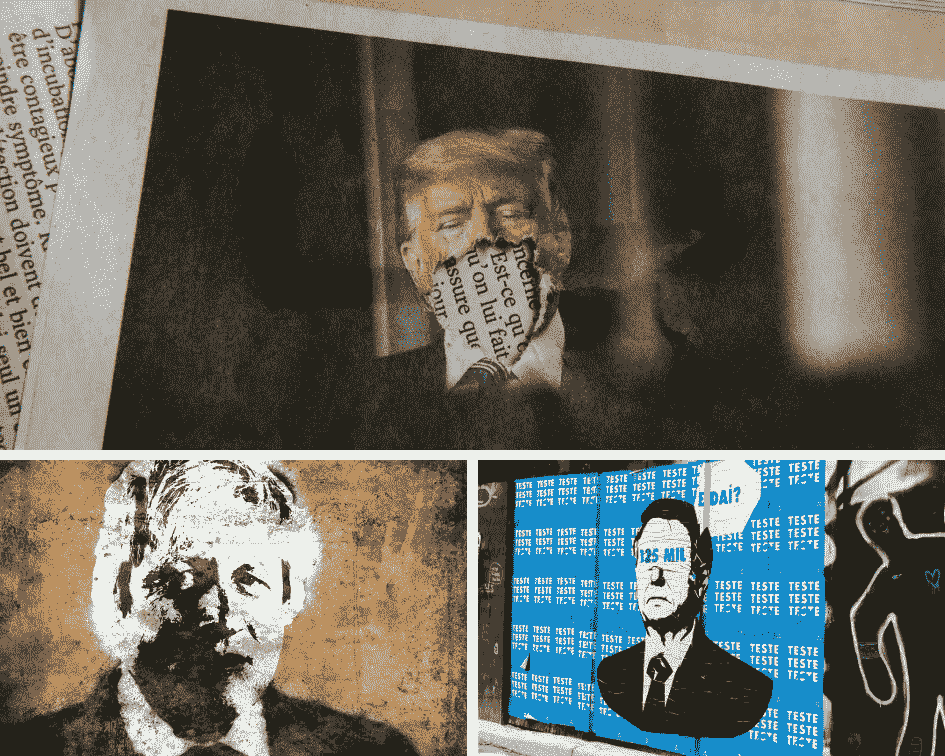
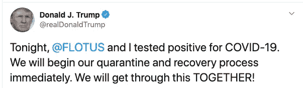
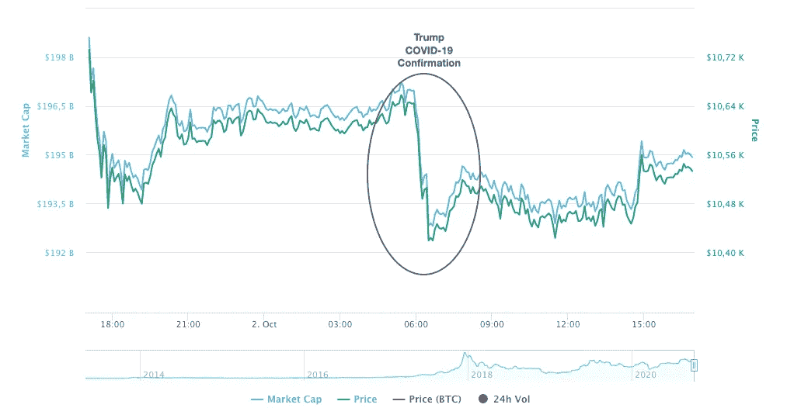
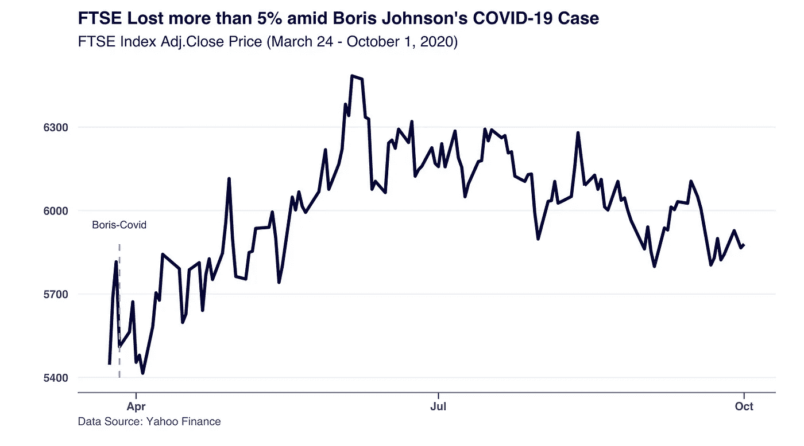
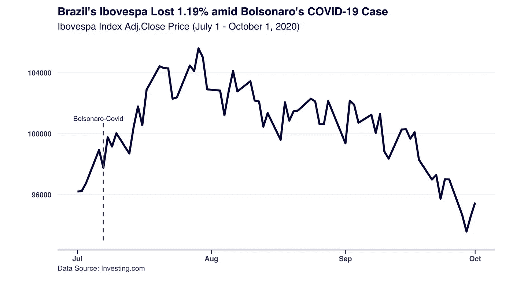

# 新冠肺炎公告中的 Trump、Boris 和 Bolsonaro 垃圾场市场

> 原文：<https://medium.datadriveninvestor.com/trump-boris-and-bolsonaro-dump-markets-amid-covid-19-announcements-20a749d7cf89?source=collection_archive---------26----------------------->

欢迎来到第一版的《过去的地狱》，这是一份关于文化事件如何影响货币和市场的双周刊。请在[***【https://pastthelimbo.substack.com】***](https://pastthelimbo.substack.com/p/trump-boris-and-bolsonaro-dump-markets)订阅

让我们开始吧。

特朗普总统和第一夫人向新冠肺炎证实了检测结果呈阳性，导致标准普尔 500 指数在市场中段下跌 0.5%，纳斯达克指数下跌超过 1%。

## 资产的每日负绩效。

**上市前时间**暗示，特朗普的推特[公告](https://twitter.com/realDonaldTrump/status/1311892190680014849)于凌晨(约 6 点)发布后，每日的负面表现。因此，期货合同价格下跌，CBOE 波动指数上涨，反映了投资者的担忧。

## 黄金和比特币的价格最终为负值，但在公告中出现了相反的价格行为。

与此同时，油价[抛售](https://markets.businessinsider.com/currencies/news/stock-markets-futures-plunge-gold-up-positive-trump-covid-2020-10-1029642923)而黄金，黄金的主要避风港，最初上涨，但此后已经下降到每日轻微的负面表现。在数字方面，比特币在公告时间内的反应非常消极，但有所回落，尽管它仍显示出每日的负面表现。

比特币作为数字安全港的支持者，其行为与黄金相反，但两者都以负面的前景收场，这进一步引发了人们对数字资产与传统市场脱钩及其安全港作用的质疑。

 [## 忽视特朗普|数据驱动型投资者

### 通常，七月四日是烧烤或逃离城市的日子。随着新冠肺炎的第一轮…

www.datadriveninvestor.com](https://www.datadriveninvestor.com/2020/07/02/ignore-trump/) 

## 它会改变中期市场预测吗？

这一可预测的每日调整正值市场面临从夏季高点小幅调整的不确定时期，因国内动荡和美国大选临近。

一些分析师认为这不会改变长期前景，而美国消费者新闻与商业频道的吉姆·克莱姆[建议](https://www.cnbc.com/2020/10/02/cramer-downplays-market-drop-on-trump-coronavirus-get-buy-list-ready.html)“人们应该准备好购买清单。”

**让我们调查一下其他国家领导人[宣布](https://www.nytimes.com/2020/10/02/world/trump-covid-world-leaders.html)新冠肺炎阳性病例后，其他市场的反应**。

## 巴西和英国市场对他们国家领导人的阳性新冠肺炎测试反应如何？

3 月 27 日，英国首相鲍里斯·约翰逊是这三位领导人中第一个宣布自己受到感染，并在严厉的隔离措施下接受医疗护理的人。

这一消息是在凌晨(上午 11 点左右)发布的，这导致由英国前 100 家公司组成的富时 100 指数开始下跌，并导致当天收盘下跌超过 5%。

尽管每日表现不佳，但英国主要股市保持复苏，与全球市场保持一致，直到夏季中期。

## 巴西市场也对博尔索纳罗的新冠肺炎案反应消极。

7 月 7 日，巴西总统博尔索纳罗[确认](https://www.nytimes.com/2020/07/07/world/americas/brazil-bolsonaro-coronavirus.html)他的新冠肺炎阳性检测有轻微症状，导致巴西主要股指 Ibovespa 收盘下跌 1.19%。

然而，正如我们在英国看到的那样，市场的中期表现是积极的，与富时 100 指数、标准普尔 500 和贵金属(如黄金、白银)一致。

自 3 月份暴跌以来，Ibovespa 在 2020 年 1 月达到历史高点后，现在正面临着创纪录价格的回调。

> **你认为市场会向哪个方向发展？请在下面留下您的评论，让我们开始讨论吧。**

## 在每日震荡后，中期趋势似乎会继续

在 COVID 新闻期间，市场的盘中行为导致投资者在领导层不稳定的情况下持悲观态度，导致市场做出负面反应。

然而，长期市场反应似乎与新闻当天看到的异常效应无关，每个国家根据其市场动态做出不同的反应。

对川普的竞选来说，新冠肺炎的确认正值一个棘手的时刻，给即将到来的辩论和选举结果带来了更多的不确定性。市场似乎正相应地走向不确定时期，9 月份表现不一，提高了投资者对未来的警惕。

希望你喜欢《过去的地狱》的第一版，这是一份关于文化事件如何影响货币和市场的双周刊。 *如果你想支持这段旅程，* ***请订阅***[***【https://pastthelimbo.substack.com】***](https://pastthelimbo.substack.com/p/trump-boris-and-bolsonaro-dump-markets)

*原载于*[*https://pastthelimbo.substack.com*](https://pastthelimbo.substack.com/p/trump-boris-and-bolsonaro-dump-markets)

## 访问专家视图— [订阅 DDI 英特尔](https://datadriveninvestor.com/ddi-intel)