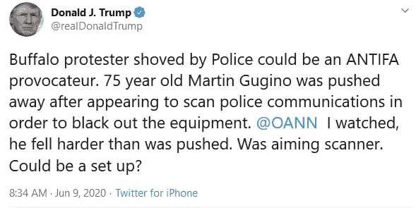

# 特朗普与乔治·弗洛伊德的葬礼争夺关注，并得到了关注。

> 原文：<https://medium.datadriveninvestor.com/trump-competes-for-attention-with-george-floyds-funeral-and-gets-it-b52292c04516?source=collection_archive---------5----------------------->

## 只需要总统发一条疯狂的推特就能让很多人暴跳如雷。

以至于[那条关于一名](https://twitter.com/realDonaldTrump/status/1270333484528214018)[受伤白人抗议者](https://slate.com/news-and-politics/2020/06/buffalo-police-video-white-america.html)的阴谋论的推特成为了当天最热门的话题，甚至在[乔治·弗洛伊德的葬礼](https://www.youtube.com/watch?v=02OAHxHadPk)开始之前和结束之后。(至少在我们关注的 Twitter feed 和新闻 feed 中提到的次数上是这样)。

尽管如此，总统如此卑鄙的举动怎么可能给他带来好的影响呢，不管是以何种方式，在任何宇宙中？如果有的话，特朗普的阴谋论放大甚至可能使他失去一些白人追随者的选民，他们可能直到现在才看到一名老年白人男子在布法罗被警察殴打的视频。(坦率地说，这个特定的暴力时刻可能是让许多白人了解这个故事的原因，他们在过去几周内一直在观看所有的骚乱、起义和军国主义警察行动，不知道该怎么理解)。

不用担心，在特朗普更喜欢的讲述方式中，故事完全被扭曲成指责受害者，并且由一个非常奇怪、带有浓重俄罗斯口音的声音讲述。

值得称赞的是，这位抗议者，75 岁的马丁·古吉诺，一点也不相信。可能是唯一一个没有立即上钩的人。除了国会山的一群总统支持者，他们跑过去躲了起来。

为了增加这一天的怪异，当我们去谷歌搜索葬礼的报道时，看看我们只输入“乔治”这个词后他们给我们的建议。我们甚至还没说到“弗洛伊德”。这是怎么回事？(我们绝对没有搜索过这些词中的任何一个，我们也不认为我们搜索过乔治·索罗斯)。

但这都不是重点。我们也不是说总统的所作所为是有计划的；就像他早上醒来，狡猾地决定做点什么来掩盖乔治·弗洛伊德的葬礼。*是本能*。

关键是总统不能忍受离开聚光灯，哪怕是一小会儿。所以他找到了一种方法让自己呆在里面，在一个他绝对不应该呆的庄严的日子里。