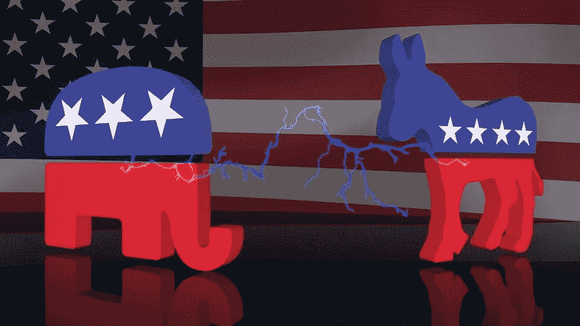

# 特朗普不想辩论

> 原文：<https://medium.datadriveninvestor.com/trump-doesnt-want-to-debate-e5bf27104413?source=collection_archive---------11----------------------->

## 政治

## 他利用拜登对传染的恐惧为自己谋利

Photo by [chayka1270](https://pixabay.com/users/chayka1270-5469348/) on [Pixabay](https://pixabay.com/illustrations/elephant-donkey-ass-logo-2798628/)

特朗普在第一场总统辩论中彻底出丑的第二天，我预测他将拒绝再次与拜登辩论。当时，我认为特朗普会以不喜欢总统辩论委员会(为辩论制定规则)提出的变革为借口，再次退出辩论。

正在考虑的变化之一是切断任何不允许对手不间断发言的参与者的麦克风。特朗普不可能同意这一点。

特朗普不是政客。他勉强算是个商人。他更像是一个黑帮老大。他要求所有为他工作的人都对他忠诚。对于所有反对他的人来说,“主宰”这个词到处流传。特朗普喜欢“主宰”局面和人。他不仅在身体上这样做，如 2016 年他们辩论时，他威胁地潜伏在希拉里身后，而且在口头上，如他在与拜登的第一次辩论中那样。

关闭麦克风将剥夺他主导与拜登的另一场辩论的能力，并让他看起来像个失败者，这是特朗普最大的恐惧之一。当然，他的竞选团队拒绝同意在第二场辩论中对规则进行任何修改的理由是，这些修改将有利于拜登，并将特朗普置于不利地位，因此规则将是不公平的。

 [## 为什么看起来不可能战胜特朗普？数据驱动的投资者

### 我注意到标题说拜登仍然在总统竞选中领先。在这样的标题背后，人们可以感觉到一种恐惧…

www.datadriveninvestor.com](https://www.datadriveninvestor.com/2020/10/07/why-it-seems-impossible-to-trump-trump/) 

然后川普被诊断患有新冠肺炎。这是我早在六月就已经预料到的事情，尽管当时我认为他会在他的一次室内集会上感染病毒。与拜登的第二场辩论，一个市政厅，一直存疑，直到特朗普康复出院。

委员会认为举行市政厅辩论最安全的方式是虚拟辩论。特朗普立即否决了该计划。[他甚至承认这是因为这给了主持人打断他的能力](https://www.axios.com/trump-biden-debate-remote-coronavirus-c57f521e-fca5-46d8-aeed-9ec2ca1b3c2b.html)。委员会取消了辩论，因为特朗普拒绝参加。

现在，特朗普的竞选团队要求委员会重新考虑取消辩论的决定。他们声称，特朗普的医生已经批准他参加公共活动，因为他不再具有传染性。他可以回去亲自参加活动，包括剩下的两场辩论。

这太狡猾了。

特朗普和他的竞选团队知道，无论他的地位如何，拜登和他的竞选团队都将拒绝亲自参加辩论。只是不安全。没有办法确定特朗普不会传染。拜登像任何其他理智的人一样，不想冒着健康风险亲自与特朗普辩论，因为这几乎可以很容易地完成。

因此，特朗普可以说他想辩论，但拜登不想。特朗普不再与拜登辩论，也不再让自己难堪。

## 访问专家视图— [订阅 DDI 英特尔](https://datadriveninvestor.com/ddi-intel)