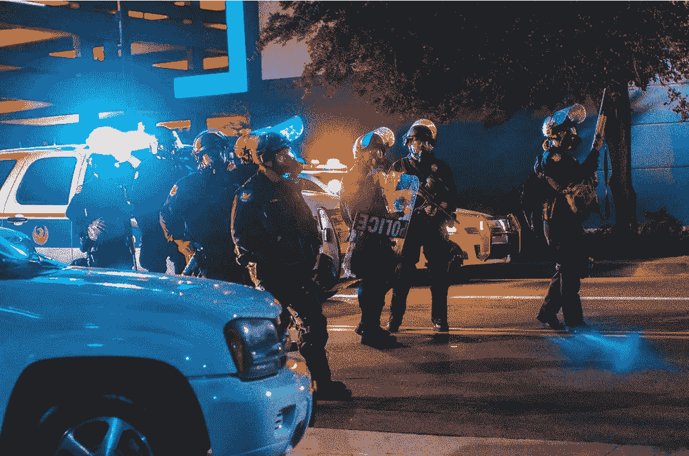
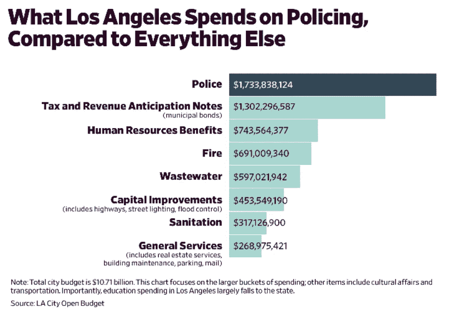

# 特朗普现在正在解除对警方的资助

> 原文：<https://medium.datadriveninvestor.com/trump-is-defunding-the-police-right-now-2ac0bfcb961c?source=collection_archive---------3----------------------->

回到白宫，特朗普在推特上命令他的人民停止就联邦冠状病毒援助进行谈判，而是专注于让他的最高法院提名人通过…

原因？他不希望资金流向:

> *照顾落选的民主党人，高犯罪率的城市和州*。**

*相反，总统说:*

> *我已经指示我的代表停止谈判，直到选举结束，在我获胜后，我们将立即通过一项主要的刺激法案，重点是勤劳的美国人和小企业。*

*如果他把发放进一步的刺激资金作为他再次当选的条件，我们认为不难猜测，如果他没有获胜，他将继续在经济上惩罚那些州和城市。*

*在我们继续之前，让我们后退一步。因为我们不确定我们是否相信这一系列的推文。总统不会在一瞬间改变主意。特朗普在生病前到处分发钱，准备参加选举。*

*你想让我们相信，现在他会让整个美国公众难堪，只是为了惩罚那些碰巧由民主党人管理的城市和州吗？可能没有投他的票也不会再投了？尤其是现在有 1260 万美国人正式失业？更不要说无数的小企业在苟延残喘却摇摇欲坠？*

*[川普建议](https://twitter.com/realDonaldTrump/status/1313551796644831233)没关系，因为:*

> *我们的经济发展得很好。股票市场正处于创纪录的水平。*

*但是很少有人把他们的大部分薪水与他们工作的公司的股票表现挂钩。除非他们是首席执行官。或者一开始就足够富有，以专业投资者的身份谋生。*

**更新:在我们最初发表这篇文章后，* [*总统随后在推特上写道*](https://twitter.com/realdonaldtrump/status/1313664886648582144?s=12) *他“准备马上签署”一项“独立法案”，提供另外 1200 美元的一次性刺激支票。**

*但是，让我们回到经济刺激资金给予“管理不善、高犯罪率、民主党州”和城市的支出上来。因为他在这一点上仍然没有让步。警察，很多。其他事情也是如此:教育、公共卫生、环境卫生等等。但在许多城市，无论大小，警察预算都排在首位。因此，当特朗普背弃这些城市和州时，警察往往是他实际威胁的很大一部分，即使这不是他的直接意图。*

* [## 忽略特朗普|数据驱动的投资者

### 通常，7 月 4 日是烧烤或逃离城市的日子。随着第一轮新冠肺炎…

www.datadriveninvestor.com](https://www.datadriveninvestor.com/2020/07/02/ignore-trump/) 

以洛杉矶为例。根据 Slate 的数据，在 LAPD 的花费远远超过该城市的公共服务。占该市 100 亿美元总预算的 17.3 亿美元。下图更清楚地展示了这一点:

这是一个非常保守的观点，因为它只考虑了警察局实际的年度运营预算。如果你加上其他城市的义务，为警察养老金等提供资金，数额几乎翻了一番:超过 30 亿美元。

因此，当特朗普背弃他所鄙视的“民主党失败，高犯罪率，城市和州”时，他正在向城市和州施加压力，以解除城市和州警察的资金。

现在，在过去，特朗普的财政部长史蒂夫·姆努钦对不让这种情况发生非常敏感。所以，当总统签署行政命令，每周提供 400 美元的额外失业福利，但最初要求其中的 25%由各州支付时，姆努钦取消了最后一部分，很大程度上是因为他不想看到总统被指控削减必要的地方管理的服务，如警察。因为在那种情况下，市长和州长可能会转而指责总统强迫他们以牺牲执法部门的资金为代价，给予出于政治动机的施舍。因为它必须来自某个地方…

既然总统显然决定暂时不帮助任何人，那么每个人都会受到打击。因此，对于执法部门来说，这不是急需的财政支持，而是一种挑战。因为如果特朗普提到的那些民主控制的州和城市的市长和州长开始削减警察预算，那么他们就会受到总统的进一步批评，尽管他拒绝帮助他们解决日益加深的金融危机，而这可能是必要的。因此，他们可能会尝试进一步削减教育或公共卫生预算。

让我们停下来思考一个非常基本的问题:为什么联邦政府有钱用于刺激经济，而各州却没有？联邦政府的金库不也在遭受损失吗？

答案很简单:国家没有钱主要是因为没有印钱的权力。而国会可以授权印出无限量的钞票。根据[美联储主席 Jerome Powell](https://www.cnbc.com/2020/10/06/fed-chair-powell-calls-for-more-help-from-congress-says-theres-a-low-risk-of-overdoing-it.html) 的说法，正如我们多次说过的，他是这里的无名英雄，他们现在应该这样做。而且咄咄逼人。

美联储也可以提供帮助。而且是。州政府和地方政府筹集资金的一种方式是发行债券来支付各种特定的项目，或者只是一般的债务。美联储史无前例地通过购买这些债券在一定程度上支持了州和城市。但是这些城市和州有义务偿还。因为美联储只能放贷。只有国会可以把它打印出来，然后分发出去。

因此，如果没有这些，州和城市应该从哪里拿出特朗普现在坚称他不会提供的所有这些额外资金？特朗普的幕僚长马克·梅多斯(Mark Meadows)在这方面给予了支持——或者更准确地说，是教唆——他本人在国会时因威胁说如果他不能如愿以偿，政府就会关闭而闻名。

因为州和城市不能随便印出新的钞票。如果他们不能从联邦政府获得刺激帮助，他们不得不自己出去获得已经存在的实际资金。

但是怎么做呢？增税？靠什么？州和地方收入最常见的来源是销售税和汽油税。但随着人们减少支出和开车，这些收入正在下降。如果数以千万计的人没有工作，因此没有收入来支付所得税，也无法有效提高州所得税。

酒精？当然可以。可能会看到一些地方的酒税上涨。大麻？合法化一直是一个税收计划，所以你可以打赌，在这一切结束之前，甚至更多的州将合法化。但这不可能一蹴而就。

因此，对于各州如何节省他们自己带来的减少的现金，目前唯一真正的答案是削减服务。如果他们无法获得特朗普提出的大量现金，但现在又否认，他们真的没有选择。他们已经完成了教育，健康，垃圾收集。现在他们越来越多地从事执法工作。甚至那些计划大幅增加警察部门预算的城市也已经削减了预算。不，加州高速公路巡警不会消失。但是对于该州的许多城镇来说，它不仅充当州警察，也充当地方警察。因此，人们可能会开始减少对这些服务的关注。

因此，通过拒绝这些资金，特朗普在自己和许多州和地方政府几乎肯定不得不进行的执法削减之间划清了界限，因为他们没有钱以他们想要的方式扩张，甚至维持目前的水平。这将意味着是特朗普取消了对警察的资助。

## 获得专家视图— [订阅 DDI 英特尔](https://datadriveninvestor.com/ddi-intel)*