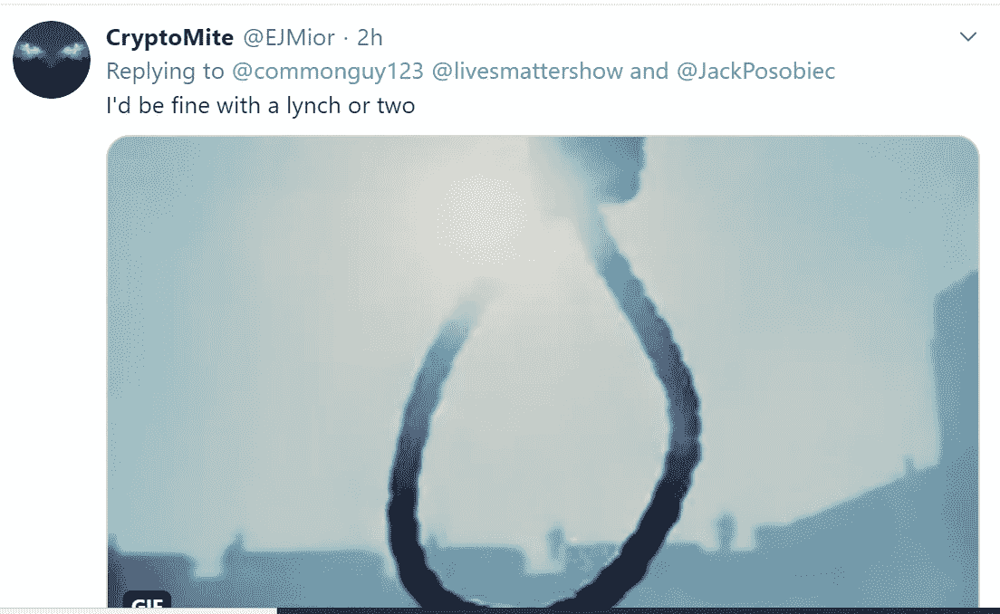
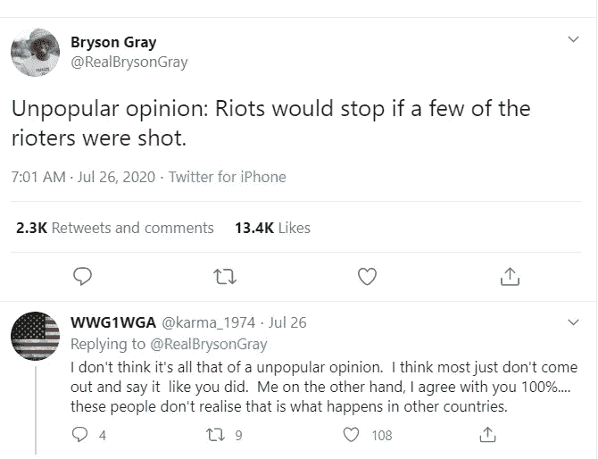
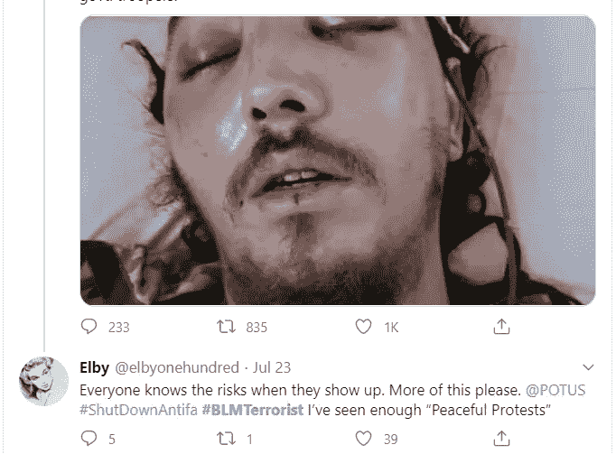

# 特朗普给了他的基础想要的东西:暴力

> 原文：<https://medium.datadriveninvestor.com/trump-is-giving-his-base-what-it-wants-violence-555e98d46953?source=collection_archive---------11----------------------->

(Free SVG / Public Domain)

一般来说，一个好的公务员会忠实地实现选民的愿望。大多数政客在竞选活动中向基层扔红肉，只是为了在上任后从中间治理，但唐纳德·特朗普不是这样。借用娱乐圈的一句话，他就是“粉丝服务”。当民主党人正在考虑将心怀不满的郊区温和派从共和党中剥离出来时，川普正在迎合大约 30%至 40%的选民，他们坚定地站在川普的阵营中。

川普给了人民——也就是说*他的*人民——他们想要的。而川普的基地想要什么？他们的政敌遭到了猛烈的镇压。

想想这些保守派谈论抗议特朗普塔尔萨集会的例子:

(Twitter)

在任何一天，你都可以登录 Twitter，找到以想象得到的最残酷的方式来恢复“法律和秩序”的呼声。最近，有线电视新闻上来自波特兰和西雅图的场景让他们陷入狂热，这些场景显示抗议者和执法部门之间的冲突，隐约近似于他们对反法西斯大群乘公共汽车在乡村游荡的狂热梦想。

许多左翼人士担心会出现另一个肯特州，而右翼人士则公开为此祈祷。

(Twitter)

关于特朗普鼓励极右极端主义并允许许多人做他们长期以来想做的事情的文章不计其数。这种动态是双向的。

特朗普基础的不可动摇的忠诚令一些自由派学者迷惑不解。毕竟，他的平台上不是有很多木板都失败了吗？没有墙。他承诺带回的工作从未兑现。相反，失业率正在飙升。

(Twitter)

但特朗普的吸引力从来都与政策无关。他所提供的不能被立法。他的竞选和总统任期主要围绕两件事。第一个是抵制政治正确，也就是说，说出别人不敢说的话。“二是报复政敌——“把她关起来。”

第一个很简单。他只需要张开嘴或发一条推特，但他还没有能力在第二条战线上兑现承诺。由此产生的认知失调导致了许多奇怪的保守精神病，最著名的是对卡农的崇拜。一个名叫“Q”的匿名人士的追随者相信，现在[密封的起诉书](https://soundcloud.com/user-961354561/core-tenets-of-qanon-sealed-indictments-and-declas)随时会被公布，希拉里·克林顿将和整个奥巴马政府一起被拖到关塔那摩。

因此，从这个意义上说，特朗普对西北部示威活动的威胁和严厉回应遵循了某种逻辑。如果他不能否决一些资深民主党人，他可以退而求其次:派一些暴徒去残酷对待“恐怖分子”，也就是黑人的命也是命和 Antifa。

这是他现在唯一的选择。他弄错了新冠肺炎的回应。经济一片混乱。他没有什么了不起的政策成就可言。国会中存在典型的僵局，所以很自然地，他转向他控制的工具——行政部门——并做他最擅长的事情:创造一个奇观。

在这种情况下，这是针对自由派管理的城市和州的国家暴力奇观。

这让我想起了作家安伯托·艾柯在他永恒的文章“[Ur-法西斯主义，](https://www.theatlantic.com/notes/2016/10/fascism/502841/)”中写道，他称法西斯主义是“为行动而行动的崇拜”艾柯解释说，对法西斯主义者来说，行动“本身就是美丽的，而且必须在进行任何反思之前进行，或者不进行任何反思。思考是阉割的一种形式。”

 [## 不是数据驱动的政治辩论投资者

### 《纽约时报》在 2020 年 6 月 3 日在线发表了阿肯色州参议员汤姆…

www.datadriveninvestor.com](https://www.datadriveninvestor.com/2020/06/08/the-political-debate-that-has-not-been/) 

**访问专家视图—** [**订阅 DDI 英特尔**](https://datadriveninvestor.com/ddi-intel)