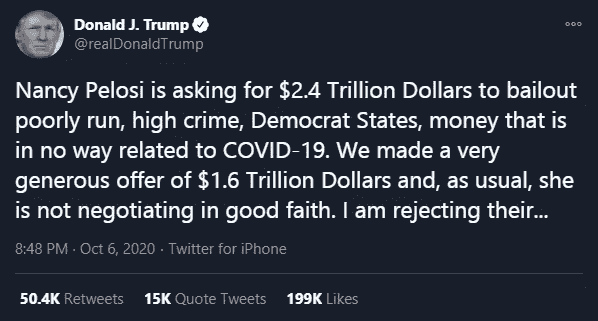
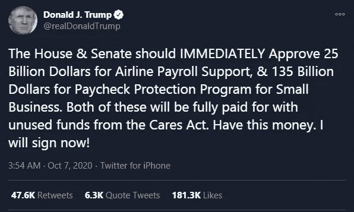
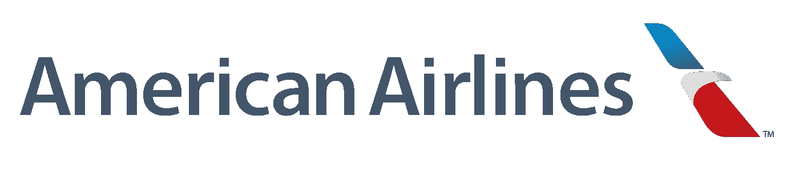
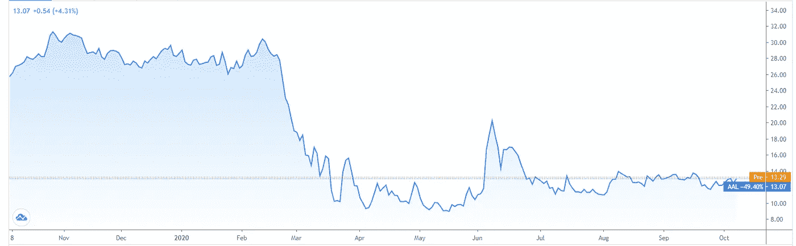
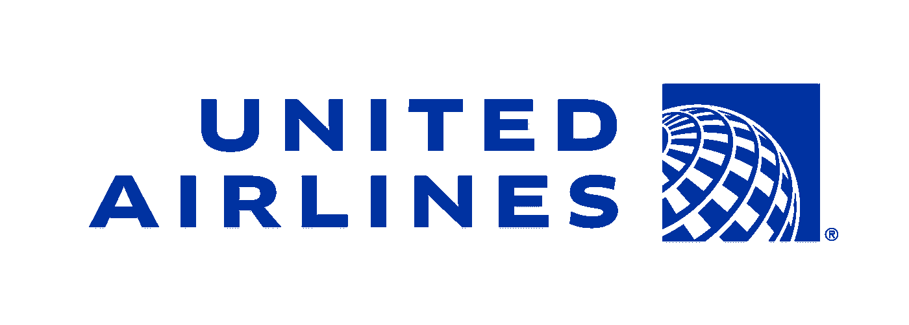
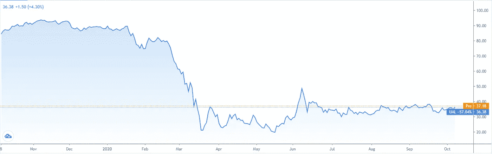
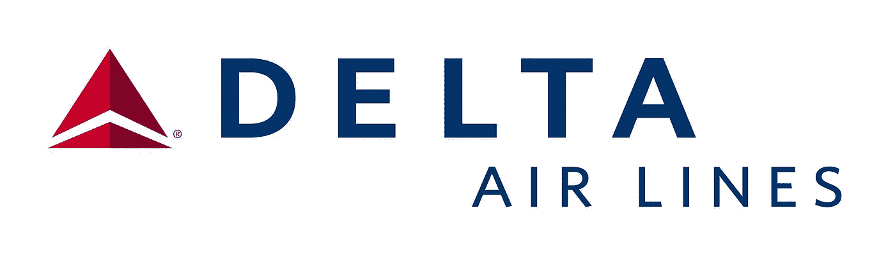
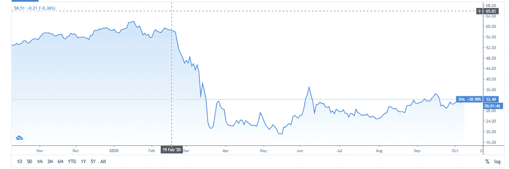
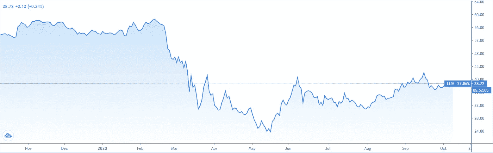

# 特朗普操纵股市

> 原文：<https://medium.datadriveninvestor.com/trump-moves-the-stock-markets-8127b6784d1f?source=collection_archive---------10----------------------->

Photo by [Library of Congress](https://unsplash.com/@libraryofcongress?utm_source=medium&utm_medium=referral) on [Unsplash](https://unsplash.com?utm_source=medium&utm_medium=referral)

250 亿美元给航空公司？找出你如何从中受益。

人们过去常说“格林斯潘对策”，这是以美国前主席美联储命名的。与此同时，“美联储-美联储”已经变得司空见惯。但它到底是什么呢？

该术语描述了美联储(美国美联储体系)在市场疲软阶段做出反应并支撑价格的怀疑或事实。

考虑到日冕，股市确实需要支撑。不仅是价格，实体经济也陷入了一个深渊。

各国政府和中央银行以前所未有的一揽子援助计划作为回应。一切都在那里:关键的利率削减，巨额债券购买，暂停申请破产的义务，以及邮寄的银行本票。

在金融危机期间和之后，尤其是央行，一次又一次地以救世主的身份出现。“美联储看跌期权”诞生了。但在这场危机中，即使是央行的力量似乎也不再足够。政府不得不介入。

## 这是“政府看跌期权”还是“特朗普看跌期权”的诞生？

似乎是很久以前的事了。但在科罗纳之前，有几个奇怪的巧合，美国总统在市场的关键点引发了反弹和价格下跌，甚至有传言说，在后台赚钱。

无论如何，美国总统非常关注价格水平，在周二通过一条推文引发价格下跌后，他在几个小时后收回了这一言论。

source: twitter.com

首先，他宣布将暂停任何关于进一步援助计划的谈判，直到大选结束。这引发了销售。这显示了政府对市场的重要性。没有全方位的支持，任何事情都不会成功。

第二天，特朗普试图限制损害，并做了一个完全的 180 度大转弯。

source: twitter.com

突然，他要求国会发放 1600 亿美元的援助。此外，1200 美元的银行本票应该再次发出，小企业应该得到工资支持。航空公司应该获得 250 亿美元，即使它们并不“小”。

## 那么，我们面对的是针对整个航空业的政府看跌期权(特朗普看跌期权)吗？

美国政府显然决定不惜一切代价拯救美国航空公司。甚至反对派也赞同它。因此，在今年 4 月该行业获得 250 亿美元的援助后，还应该有 250 亿美元的援助。

在我看来，这将继续这样下去，直到危机结束。即使再花 500 亿或 1000 亿美元。

这让我想到一个简单的问题:
如果西南航空、美国航空、达美航空或联合航空以任何一种方式生存，它们的价值是什么？

毕竟，你必须假设企业迟早会回到危机前的水平。

目前，这四家航空公司的股价比最高价低了 50%到 80%。由于政府的慷慨援助，一旦投资者意识到破产的风险相当低，也许部分差距就会缩小。

 [## 利用股市相关性的最佳方式|数据驱动的投资者

### 当阿尔弗雷德·温斯洛·琼斯开创了世界上第一个“对冲”基金(后来“d”被去掉了)时，他让其他投资者大吃一惊…

www.datadriveninvestor.com](https://www.datadriveninvestor.com/2020/02/02/the-best-way-to-use-stock-market-correlations/) 

## 美国最重要的航空公司一览

American Airlines

**美国航空公司(AAL)～13 美元**

source: Traidingview.com **American Airlines (AAL)**

过去几个月，多头和空头都有机会。突破顶部的尝试在八月初以一个小的多头陷阱而告终。与此同时，许多卖空者对突破 12 美元支撑位措手不及。最近几周价格一直在横向波动。这里已经决定了投资者是否有力量，尤其是勇气发起突破。这将是开始可能的反弹的基本要求。

United Airlines

**美国联合航空公司(UAL)～37 美元**

source: Traidingview.com **United Airlines (UAL)**

与其他航空公司一样，联合航空公司也受到了 Corona 的沉重打击，联合航空公司首席执行官 Scott Kirby 预计，未来几个月，这家总部位于芝加哥的航空公司将保持疫情**T5 之前规模的 45%。**

联合航空公司(UAL)已经整合了一段时间。经过一段时间的整理，有了这个消息，我希望多头很快回来，如果 UAL 爆发，我预计向上突破。

Delta Airlines

**达美航空公司(DAL)～32 美元**

source: Traidingview.com **Delta Airlines (DAL)**

2020 年 10 月 5 日，达美航空向下穿越 20 日线。
到目前为止，最大的趋势是在 2012 年 12 月 12 日至 2014 年 10 月 10 日期间，当时达美航空的股票价值上涨了 226.72%，现在我们的交易价格是其 ATH 的-39%，在我看来，达美航空是一个可靠的选择，应该能够在一揽子援助计划的帮助下生存下来，并有望在业务复苏后尽快克服其债务。

**西南航空公司(LUV)～38 美元**

source: Traidingview.com **Southwest Airlines (LUV)**

由于疫情，西南航空公司的股票已经崩溃，但现在也经历了一次大幅反弹。当竞争对手背负巨额债务(占去年销售额的 25%到 50%)时，西南航空的情况看起来要好得多。

该行业的债务非常低，仅相当于年利润或销售额的十分之一(四舍五入)。所以西南航空是可持续发展的。

每年都有巨额资金从其他航空公司流出，关键词:
**利率**
这些钱正在流失给投资者。从长期来看，这会产生巨大的财富效应，这当然会反映在股价上。

西南航空很可能是未来的佼佼者。因此，如果你想押注于该行业的反弹，那么你来对地方了。

只要股价在 38 美元以上，再次涨到 40 美元和 42 美元的可能随时都会发生。在此之上，通往 44 美元和 46 美元的道路将是畅通的。

对于反周期投资者来说，在 36 美元附近，事情变得有趣起来。这是长期支撑区开始的地方，延伸到 30 美元。

## 哪家航空公司最强？

目前看来，美国主要的航空公司都将度过危机。在我看来，美国航空公司是四大公司中最弱的。

美国航空公司(AAL)的利润最低，市场地位最差，增长最低。债务是巨大的。该股也是历史表现不佳的股票，所以我会把它作为一种选择。

具有讽刺意味的是，这恰恰是该股最近反弹的原因:
宽慰也是最大的。矛盾的是，最差的公司却是在复苏反弹中赚最多钱的最佳场所。

紧随其后的是达美航空和联合航空，这两家公司近年来也有类似的增长。销售和负债也差不多。但是达美航空的利润率更高，因此现金流也更强劲，因此达美航空排名第二。

那就剩下西南航空了。如果你看看关键数据，就会相对迅速地发现这是行业牛市。增长是最高的，利润是最好的之一。现金流最强，负债最低。如果你想长期涉足这个领域，这是合适的人选。

## 摘要

在讨论的股票中，西南对长期投资者尤其感兴趣。在我看来，由于各种原因，这显然是最强的美国航空公司。

交易者对达美和美联航更感兴趣。这两家公司的负债都要高得多，每一个正面和负面消息都会产生重大影响。

而美国航空公司的处境如此糟糕，最好不要去碰它。

运气就是发生的事情。当准备遇到机会。

你准备好了吗？

# 如果你喜欢这篇“特朗普推动股市”的文章，请点击拍手按钮，并分享它，以帮助其他人找到它！

Thanks for sharing! (sharing is caring)

# 欢迎在下面留下你的评论，或者你可能会喜欢我的其他文章:

 [## 投资加密货币变得简单

### 投资加密货币从来没有那么容易，这种新产品执行自动购买和出售，以优化您的…

medium.com](https://medium.com/@cryptoeinfach/investing-in-cryptocurrency-made-easy-2ef2fd35a529)  [## 2020 年十大生物技术公司

### 以下 10 只股票将帮助你在 2020 年生物技术行业的上升趋势中获利

medium.com](https://medium.com/@cryptoeinfach/top-10-biotech-companies-2020-3016703ab288)  [## 最佳令牌价格预测

### 最好的信物是什么？BEST 是一项好的投资吗？我疯狂的 1161%投资回报率的 5 年最佳代币价格预测。

medium.com](https://medium.com/@cryptoeinfach/best-token-price-prediction-53a5b1a769c9) 

*免责声明:
此内容仅供参考，我知道股票交易的风险，这只是我的观点，不应作为法律、商业、投资或税务建议。我无法预测未来，股票是不稳定和复杂的，有许多因素可以影响其价格的增长或下降。关于那些事情，你应该自己进行研究或咨询你自己的顾问。对任何证券或数字资产的引用仅用于说明目的，并不构成投资建议或提供投资咨询服务。此外，本内容不针对任何投资者或潜在投资者，也不打算由他们使用，在做出投资决策时，在任何情况下都不得依赖本内容。请注意风险，谨慎交易，不要全押。*

## 获得专家视图— [订阅 DDI 英特尔](https://datadriveninvestor.com/ddi-intel)