# 特朗普推文:使用潜在狄利克雷分配的主题建模

> 原文：<https://medium.datadriveninvestor.com/trump-tweets-topic-modeling-using-latent-dirichlet-allocation-e4f93b90b6fe?source=collection_archive---------0----------------------->

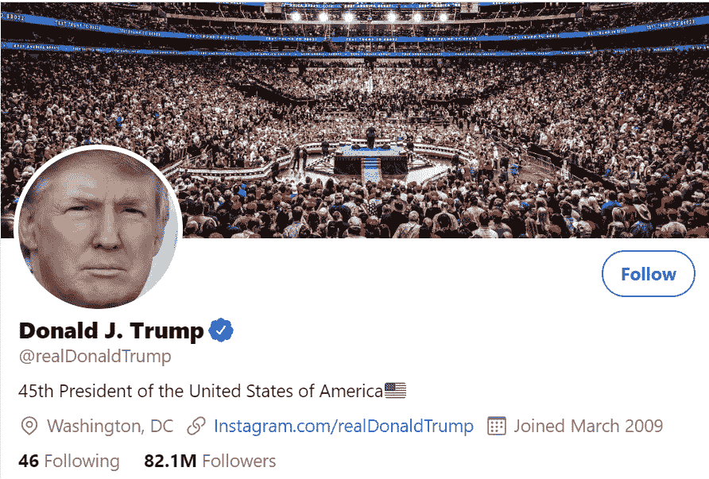

在这篇文章中，我将关注主题建模，这是自然语言处理的一个广为人知的应用。阅读完本主题后，您将能够使用 Python 进行主题建模。

**什么是话题建模(TM):**

这是一种无监督的 ML 技术，因为文本数据没有附加任何标签。听起来，TM 旨在分析和发现文本数据集合(文本、推文、电子邮件、书籍等)中的见解和主题。

几种常用的方法主要可用于 TM:

*   潜在狄利克雷分配
*   潜在语义分析(LSA)
*   非负矩阵分解

在我的例子中，我将在这篇文章中只关注潜在的狄利克雷分配(LDA)。

**潜在狄利克雷分配:**

***潜在狄利克雷分配*** 试图找到输入数据中隐藏分布的概率，因为文本数据可以混合主题和见解。

从功能的角度来看，LDA 是一个“单词包”,这意味着单词顺序并不重要，但它假定:

*   具有相似单词的文档通常具有相同的主题
*   包含频繁出现的单词组的文档通常具有相同的主题。

在 LDA 中，观察被称为文档(在我的例子中是 tweets 内容)，特征集被称为词汇/单词，结果类别被称为主题。

**特朗普推文处理:**

在这一节中，我将展示如何使用 Python 来实现主题建模的 LDA。数据集可以从 [Kaggle 下载。](https://www.kaggle.com/austinreese/trump-tweets)

数据集包含 tweets 内容，这些内容将通过 LDA 用于将 tweets 分组为 10 个主题(类别)。

我首先接收数据并检查数据帧，以检测任何异常情况:

```
df = pd.read_csv('realdonaldtrump.csv', encoding='UTF-8')
print(len(df), 'tweets')
```

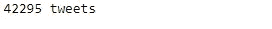

```
df.head()
```

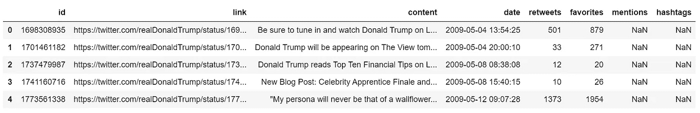

如上所述，在处理、清理和 LDA 应用期间，我将重点放在内容列上，其余的列将被忽略。

```
tweets_df=df.loc[:,['content']]
tweets_df.info()
```

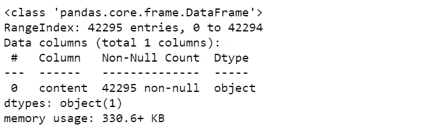

```
a = 42270
for i in range(a,a+10):
    print(tweets_df.content[i])
    print()
```

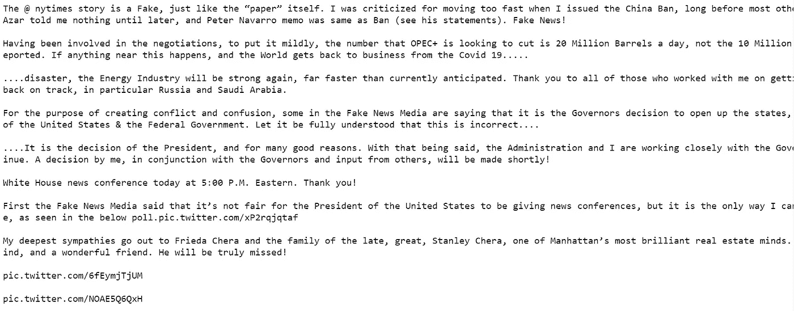

**数据清理:**

在任何机器学习任务中，清理数据与建模一样重要，甚至更重要。当涉及到像文本这样的非结构化数据时，这个过程就更加重要了。

为此，我将执行一些清理活动，作为建模前的预处理步骤:

*   小写文本
*   使用正则表达式删除括号
*   使用正则表达式删除标点和数字

```
def clean_text(text):
''', , and '''
#Make text lowercase   
 text = text.lower()
#remove text in square brackets
 text = re.sub(r'\[.*?\]', '', text)
#remove punctuation   
 text = re.sub(r'[%s]' % re.escape(string.punctuation), '', text) 
#remove words containing numbers
 text = re.sub(r'\w*\d\w*', '', text)
 return texttweets_df_clean = pd.DataFrame(tweets_df.content.apply(lambda x: clean_text(x)))
```

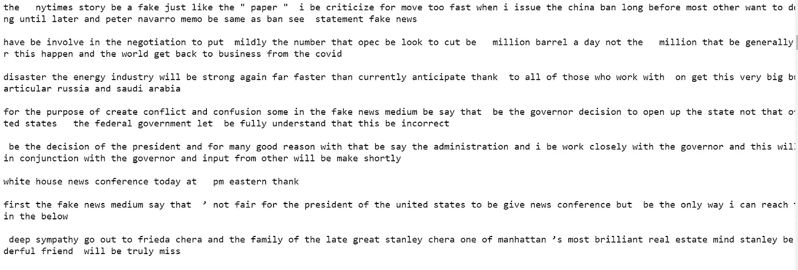

一旦我的数据不包含任何不想要的字符，我将执行词汇化，以减少词根词的词形变化。

因此，我选择使用 spaCy 进行词汇化

```
nlp = spacy.load("en_core_web_sm")
def lemmatizer(text):        
    sent = []
    doc = nlp(text)
    for word in doc:
        sent.append(word.lemma_)
    return " ".join(sent)
tweets_df_clean = pd.DataFrame(tweets_df_clean.content.apply(lambda x: lemmatizer(x)))
tweets_df_clean['content'] = tweets_df_clean['content'].str.replace('-PRON-', '')
```

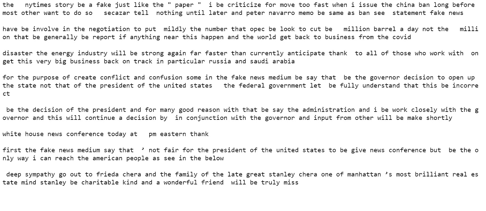

# **探索性数据分析:**

*   **推文长度:**

我现在试着去探究推特一般有多长。

```
import matplotlib.pyplot as plt
%matplotlib inline
import seaborn as sns
plt.figure(figsize=(10,6))
doc_lens = [len(d) for d in tweets_df_clean.content]
plt.hist(doc_lens, bins = 100)
plt.title('Distribution of Tweets character length')
plt.ylabel('Number of Tweets')
plt.xlabel('Tweets character length')
sns.despine();
```

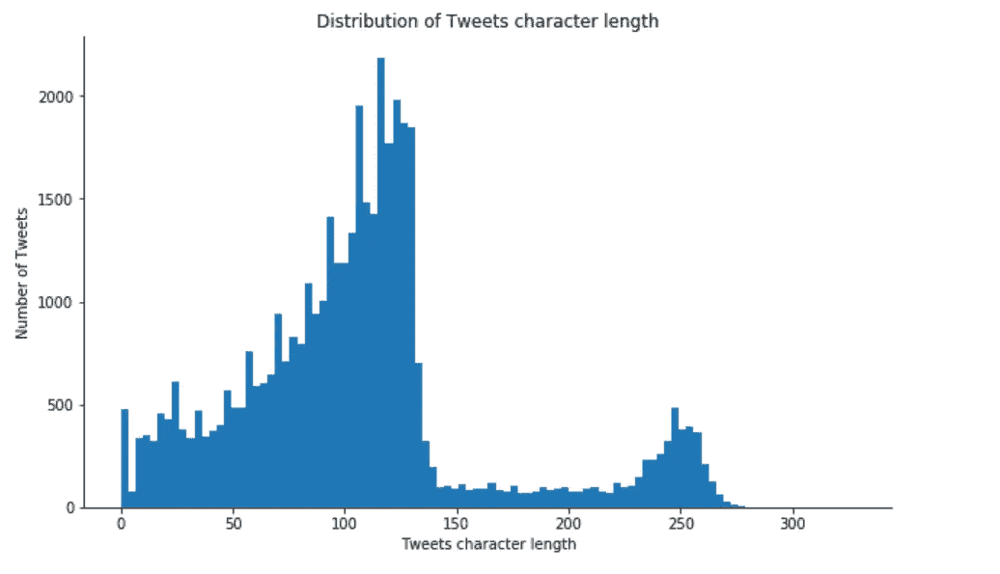

*   **文字云:**

我使用 wordcloud 来简单地可视化数据，并根据特朗普推文中出现的频率，以不同的大小显示哪些词。

```
import matplotlib as mpl
from subprocess import check_output
from wordcloud import WordCloud, STOPWORDSmpl.rcParams['figure.figsize']=(12.0,12.0)  
mpl.rcParams['font.size']=12            
mpl.rcParams['savefig.dpi']=100             
mpl.rcParams['figure.subplot.bottom']=.1 
stopwords = set(STOPWORDS)wordcloud = WordCloud(
                          background_color='white',
                          stopwords=stopwords,
                          max_words=500,
                          max_font_size=40, 
                          random_state=100
                         ).generate(str(tweets_df_clean.content))print(wordcloud)
fig = plt.figure(1)
plt.imshow(wordcloud)
plt.axis('off')
plt.show();
```

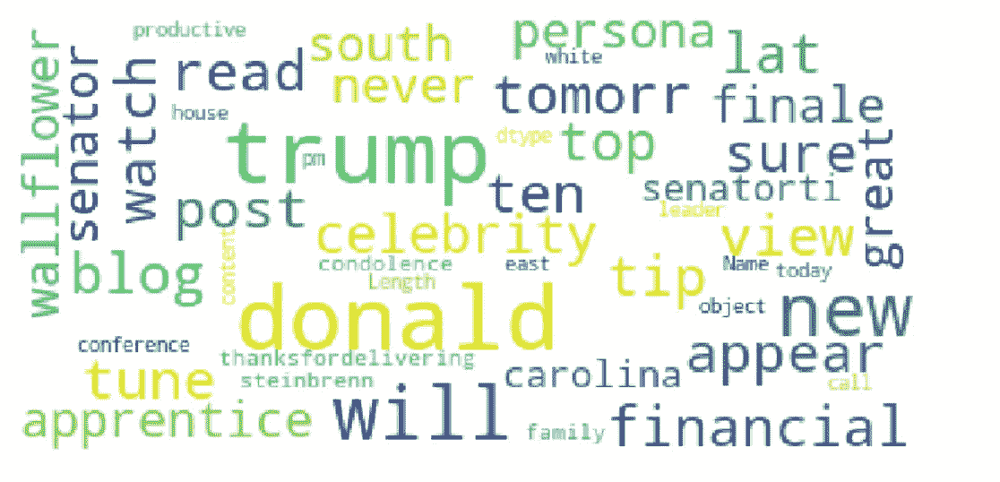

*   **单字:**

一元语法，也称为一元语法，是通过 N 元语法语言模型预测的一个单词序列，该模型计算给定 N 元语法在单词序列中的概率。

为了检测有意义的单字，我删除了所有的停用词。

```
from sklearn.feature_extraction.text import CountVectorizer, TfidfVectorizer
def get_top_n_words(corpus, n=None):
vec = CountVectorizer(stop_words='english').fit(corpus)
bag_of_words = vec.transform(corpus)
sum_words = bag_of_words.sum(axis=0) 
words_freq = [(word, sum_words[0, idx]) for word, idx in vec.vocabulary_.items()]
words_freq =sorted(words_freq, key = lambda x: x[1], reverse=True)
return words_freq[:n]
common_words = get_top_n_words(tweets_df_clean.content, 10)
unigram = pd.DataFrame(common_words, columns = ['unigram' , 'count'])
```

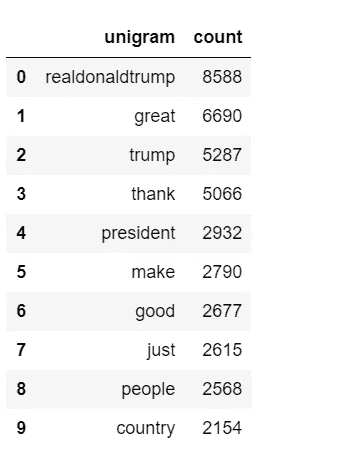

*   **三元模型:**

```
def get_top_n_trigram(corpus, n=None):
vec = CountVectorizer(ngram_range=3,3),stop_words='english').fit(corpus)
bag_of_words = vec.transform(corpus)
sum_words = bag_of_words.sum(axis=0) 
words_freq = [(word, sum_words[0, idx]) for word, idx in      vec.vocabulary_.items()]
words_freq =sorted(words_freq, key = lambda x: x[1], reverse=True)
return words_freq[:n]
common_words = get_top_n_trigram(tweets_df_clean.content, 10)
trigram = pd.DataFrame(common_words, columns = ['trigram' , 'count'])
```

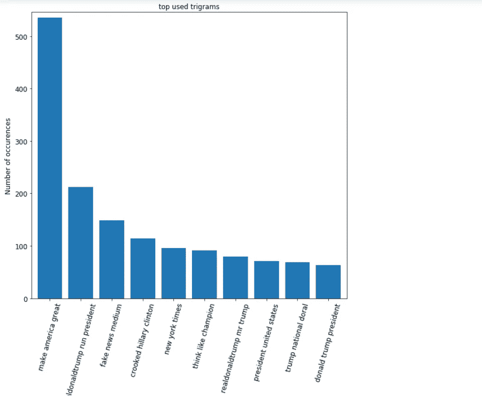

在领奖台的顶部，你可以看到“让美国再次伟大”(MAGA)，这是唐纳德·特朗普在他成功的 2016 年总统竞选中使用的竞选口号。

# 主题建模:

我开始应用 LDA 所需要的就是来自`sklearn.feature_extraction.text`模块的`CountVectorizer`类来创建一个文档术语矩阵，以创建我的 tweets 数据中所有单词的词汇表。

```
from sklearn.decomposition import LatentDirichletAllocation
vectorizer = CountVectorizer(
analyzer='word',       
min_df=3,# minimum required occurences of a word 
stop_words='english',# remove stop words
lowercase=True,# convert all words to lowercase
token_pattern='[a-zA-Z0-9]{3,}',# num chars > 3
max_features=5000,# max number of unique words
                            )data_matrix = vectorizer.fit_transform(tweets_df_clean.contentdata_matrix
```

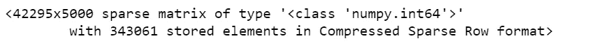

42295 个文档中的每一个都被表示为 5000 维向量，这意味着我们的词汇表有 5000 个单词。

接下来，我将使用 [LDA](https://scikit-learn.org/stable/modules/generated/sklearn.decomposition.LatentDirichletAllocation.html) 来创建主题以及每个主题的词汇表中每个单词的概率分布。

我将使用`sklearn.decomposition`库中的`LatentDirichletAllocation`类对我的文档术语矩阵执行 LDA。参数`n_components`指定了我希望我的文本被分成的主题的数量，参数`random_state`被设置为 20，以允许跨多个函数调用可再现的结果，参数`n_jobs`被设置为-1，以允许使用我所有可用的处理器。

```
lda_model = LatentDirichletAllocation(
n_components=10, # Number of topics
learning_method='online',
random_state=20,       
n_jobs = -1  # Use all available CPUs
                                     )
lda_output = lda_model.fit_transform(data_matrix)
```

我将使用`pyLDAvis`来解释适合 tweets 数据语料库的主题。该软件包从拟合的 LDA 主题模型中提取信息，以通知基于 web 的交互式可视化。

```
!pip install pyLDAvis
import pyLDAvis
import pyLDAvis.sklearn
pyLDAvis.enable_notebook()
pyLDAvis.sklearn.prepare(lda_model, data_matrix, vectorizer, mds='tsne')
```

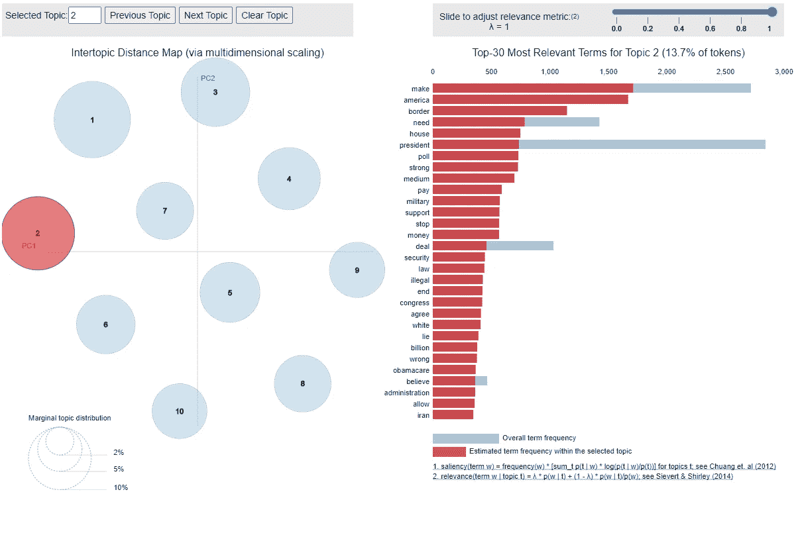

我保留了 LDA 发现的每个主题中出现频率最高的 10 个单词:

```
for i,topic in enumerate(lda_model.components_):
print(f'Top 10 words for topic #{i}:')
print([vectorizer.get_feature_names()[i] for i in topic.argsort()[-10:]])
print('\n')
```

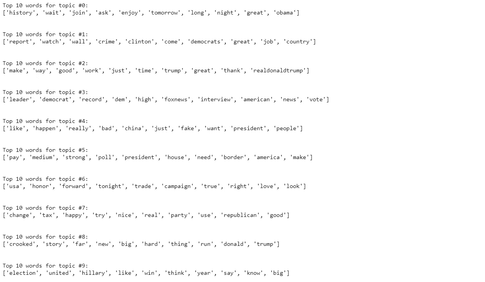

输出显示，最后一个主题可能包含关于 2016 年总统选举的推文，等等。你可以看到所有类别中都有一些常用词。这是因为几乎所有的主题都使用很少的词。

[](https://www.datadriveninvestor.com/2020/02/19/five-data-science-and-machine-learning-trends-that-will-define-job-prospects-in-2020/) [## 将定义 2020 年就业前景的五大数据科学和机器学习趋势|数据驱动…

### 数据科学和 ML 是 2019 年最受关注的趋势之一，毫无疑问，它们将继续发展…

www.datadriveninvestor.com](https://www.datadriveninvestor.com/2020/02/19/five-data-science-and-machine-learning-trends-that-will-define-job-prospects-in-2020/) 

在最后一步中，我将向输入数据帧添加一个新创建的主题列，并根据概率值为每一行分配合适的主题。为了找到具有最大值的主题索引，我们可以调用`argmax()`方法并传递 1 作为轴参数的值。

```
topic_values = lda_model.transform(data_matrix)
tweets_df['Topic'] = topic_values.argmax(axis=1)
```

让我们检查一下初始数据的合并，正如你所看到的，每条推文都有一个主题。

```
tweets_df.head()
```


# 结论:

这项任务到此结束。希望对理解主题建模问题有所帮助。

感谢阅读！如果你有任何问题，请让我知道，我会尽力回答你。

**进入专家视图—** [**订阅 DDI 英特尔**](https://datadriveninvestor.com/ddi-intel)