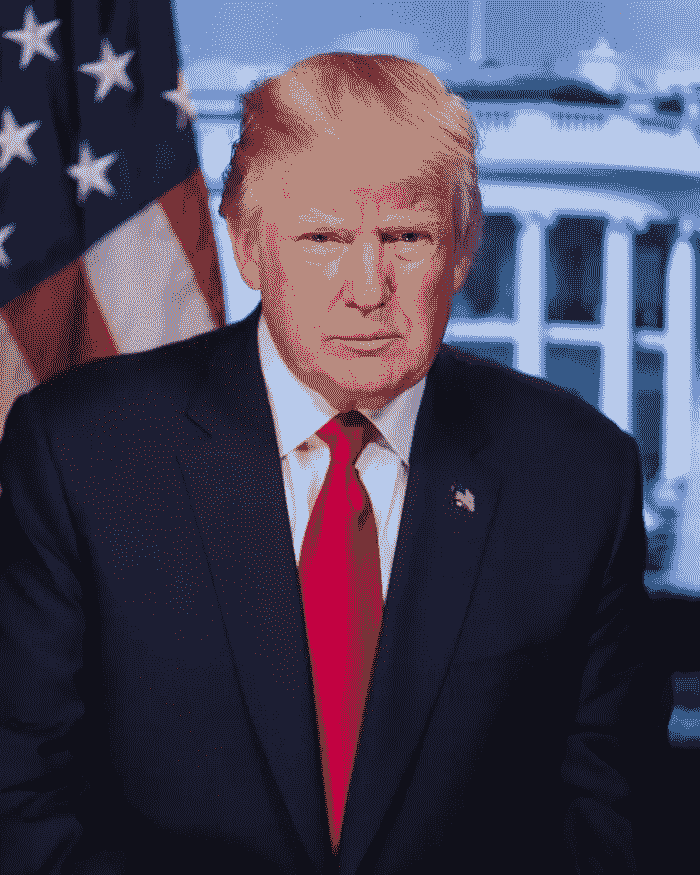

# 特朗普:他的总统任期是因为时代还是错误？

> 原文：<https://medium.datadriveninvestor.com/trump-was-his-presidency-due-to-the-era-or-error-592589313a68?source=collection_archive---------10----------------------->

## 唐纳德·特朗普是怎么当上总统的？

Library of Congress on Unsplash

许多美国人在 2016 年 11 月 9 日星期三醒来，发现一个真人秀节目主持人和失败的赌场运营商，破产的航空运营商，欺诈性慈善机构的所有者，以及众所周知的赖账者；成为了美利坚合众国的总统。民意调查显示，美国不会重复这一实验，但这是他们之前表示过的。问题是，有多少不愿公开承认投票给特朗普的人会关起门来这么做？

答案可能在于审视过去的选举，并回答这样一个问题:他是一个时机已到的人，还是一系列独特的环境将他推上了总统宝座。是时代还是错误？

我不会花太多时间让你猜我会站在哪一边。虽然有几个因素在发挥作用，让特朗普不太可能的出价成为现实。正是这个时代让特朗普成为可能，这说明了我们国家的一些我们不愿承认的东西。

好运确实发挥了重要作用。17 名候选人参加了共和党提名的角逐，这使得任何人都很难脱颖而出。杰布·布什拥有权势关系、金钱和知名度，这使他被认为是领先者。但是他有与生俱来的权利，却缺乏魅力。共和党人倾向于假装支持黑人候选人，以证明他们不是种族主义者，但从不资助他们的竞选活动。赫尔曼·凯恩在 2012 年发现了这一点。本·卡森曾一度在民调中名列前茅，但从未有过机会。特德·克鲁兹太不讨人喜欢了，而像兰德·保罗和卡莉·菲奥莉娜这样的边缘候选人从未受到欢迎。马尔科·卢比奥有潜力成为一个很好的候选人，但他要么太黑，要么不稳定，无法着火。

如果不说别的，唐纳德·特朗普是这群人中最引人注目的。在辩论舞台上，他倾向于朗朗上口的侮辱，让其他人都为自己辩护，这让他脱颖而出。他与小报媒体的关系很有帮助,《国家询问者》和其他阿美族出版物定期发表关于任何需要除掉的对手的负面报道。据称，川普为特德·克鲁兹的父亲卷入 JFK 暗杀事件的报道挑选了封面照片。特朗普自己关于付钱给他睡过的色情明星的负面报道，或者描述他对女性进行性侵犯以及你如何“抓住她们的阴部”的视频，都没有削弱他的支持。

特朗普发展了一批忠实的追随者，他们对他的历史或道德毫不在乎。共和党的其他人非常讨厌希拉里·克林顿，但他们还是捏着鼻子投了他的票。候选人人数更少，关注问题。特朗普永远也不会走得这么远，所以运气确实发挥了作用，但推动他走向胜利的是那个时代。

美国刚刚经历了第一位黑人总统巴拉克·奥巴马的两届任期。尽管所有人为的争议，他们试图削弱他；《速度与激情》、《班加西事件》、《棕褐色诉讼》、他的政府没有起诉、人员流动少于正常水平，总体上表现得像一个总统政府应该做的那样。巴拉克·奥巴马是整个国家的总统。如果我有抱怨，他有时会与自己谈判，向从未打算对他公平的另一方做出让步。米奇·麦康奈尔说，他的首要目标是确保巴拉克·奥巴马连任总统。他在这方面失败了，但却成功地保住了数百名司法提名人和一名最高法院提名人梅里克·加兰的提名。

八年来，我们国家的面孔是一个黑人，这个国家的很大一部分人都无法忍受。很可能，除了追随奥巴马，特朗普永远不会成为总统。他代表了奥巴马面前的白人。特朗普总统任期内唯一稳定的主题就是试图撤销巴拉克·奥巴马所做的一切。

特朗普的对手希拉里·克林顿理论上是有史以来最有资格竞选总统的人。对于那些不需要实质性理由就讨厌她的人来说，特朗普不断唠叨她的电子邮件，称她为罪犯，这足以反对她。特朗普本人不使用电子邮件，但他的家庭成员，包括伊万卡和贾里德，滥用电子邮件协议，整个政府炫耀舱口和洛根厚颜无耻地行事。这个国家的一部分人还没有准备好或者不愿意支持一位女性当总统。正如希拉里所描述的，他们也加入了特朗普的一篮子可怜虫。

很多人都在谈论奥巴马是如何在两次成功的总统竞选中建立联盟的。特朗普也有一个联盟，那些讨厌我们有过一个黑人总统的人(种族主义者)，仇外者；一些人愿意消除来自欧洲以外任何地方的移民(仍然是种族主义者)，白人民族主义者(种族主义者)，新纳粹主义者(种族主义者)，厌恶女性者(性别主义者)，以及看到特朗普总统优势并能够忽视种族主义和性别主义的实用主义者。

特朗普在任何其他时代都不可能成为总统；问题是，我们还生活在那个时代吗？通过涉及特朗普及其政府的无数丑闻，他的基础支持几乎没有动摇。他称我们的士兵为“笨蛋和失败者”，他经常使用“风中奇缘”这样的种族主义诽谤，并将黑人和棕色人种的家园称为“狗屎国家”。他的慈善组织被裁定为欺诈，被解散，并被迫支付 2500 万美元的罚款。他的公司正在接受纽约州的调查。他没有面临联邦指控，因为司法部认为在任总统不能被起诉。他与俄罗斯、中国、土耳其、委内瑞拉和其他国家有着无法解释的联系。我们知道俄罗斯在 2016 年帮助他获胜，并试图再次帮助他。特朗普忽视了一种致命的病毒，这种病毒可能会在下一任总统宣誓就职前杀死 30 多万美国人。然而他的基础(种族主义者、性别主义者和实用主义者)大部分都在那里。

可能导致他们攻击特朗普的一个原因是他想给其他所有人贴上的标签。。。失败者。川普亲自感染了新冠肺炎，并在他的集会上超级传播疾病。他变得越来越狂热，他在冠状病毒或其他任何问题上完全缺乏政策也暴露无遗。他没有关于为什么他应该再次当选的结束信息；他有的只是仇恨。

如果他再赢，那就不是失误或运气了。信息将是，我们仍然生活在一个选择总统时主义比什么都重要的时代。那真是太可惜了。