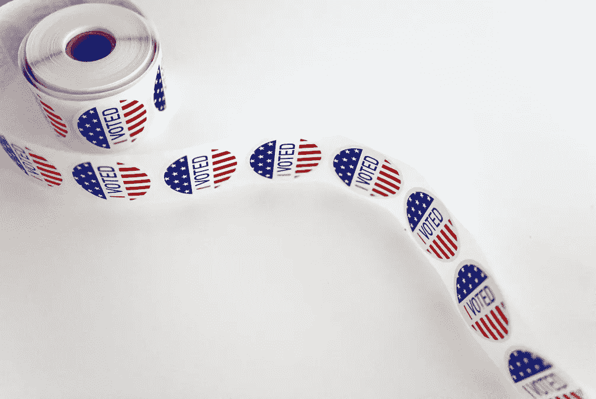
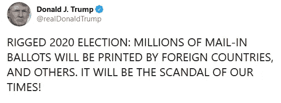

# 特朗普已经告诉海外政府，他希望他们在这次选举中为他做些什么

> 原文：<https://medium.datadriveninvestor.com/trumps-already-telling-governments-overseas-what-he-d-like-them-to-do-for-him-this-election-148f398d836b?source=collection_archive---------4----------------------->

## 那么，我们该如何应对选举干预呢？

这大约是 4 年前的同一时间，东西开始泄漏，机器人开始装瓶，假账户开始做假账。

因此，也许正因为如此，[乔·拜登本周](https://medium.com/@JoeBiden/my-statement-on-foreign-interference-in-u-s-elections-8b42b4444eb6)向媒体发布了他将采取的措施——如果他当选的话——以阻止外国政府和其他坏人干涉美国选举。

问题是，为了做到这一点，他必须先赢得这场比赛。现任总统对阻止海外干预并不感兴趣，假设——可能是正确的——几乎所有这些都将有利于他(也许除了抖音的 [Kpop 粉丝，这就是为什么他可能试图在惩罚中国冠状病毒的保护伞下禁止抖音)。](https://medium.com/@ericjscholl/trump-works-some-new-material-but-mostly-old-out-of-town-in-front-of-small-crowd-ecd4bb1419f4)

那么，在没有更多资金用于选举安全的情况下，我们能做些什么来对抗海外情报机构和黑客活动的影响呢？

到目前为止，大部分努力都是以[有影响力的人签署信件和声明](https://www.brennancenter.org/our-work/research-reports/national-security-leaders-urge-congress-provide-election-officials)，智囊团报告[和民主党政客制造噪音](https://twitter.com/RepAdamSchiff/status/1285274130280075264)的形式出现的。特别要求联邦调查局局长克里斯托弗·雷(Christopher Wray)向他们(和公众)提供这方面的最新信息。

这些都是好事情。记录绝对已经发生的事情以及[这一次](https://www.brennancenter.org/our-work/analysis-opinion/election-protection-national-security-issue)前后可能发生的事情非常重要。它甚至可能转化为更多的钱投入到一个非常现实的问题上，而这个问题几乎被忽视了，被广泛地，被有意地忽视了。

只是在我们的职业生涯中，我们曾多次遇到这样的情况，我们知道我们有一项至关重要的任务要完成，而且我们不会得到足够的资金来妥善完成它。0%的时间是在那种情况下写一封信或发表一份政策声明，告诉你如何以不同的方式处理或做一份报告。相反，采取行动变得更加重要，即使这会带来麻烦；想出如何以不同的方式实现你的目标。如果可以的话，以一种毫不逊色的方式，但有时你所能做的就是尽力而为。

 [## 不是数据驱动的政治辩论投资者

### 《纽约时报》在 2020 年 6 月 3 日在线发表了阿肯色州参议员汤姆…

www.datadriveninvestor.com](https://www.datadriveninvestor.com/2020/06/08/the-political-debate-that-has-not-been/) 

我们不相信 4 年前我们看到的来自海外政府的那种选举干预会让选民改变主意。不过，它真正擅长的似乎是让人们更加兴奋地积极支持他们的候选人(或者更少，取决于目标)，并在任何怀疑时刻迅速与选民联系，并在正确的时间瞄准人们，以确保外部力量一直在帮助建立(或减少)的势头变成真正的投票(或不投票)。

并非一切都和 4 年前一模一样。例如，脸书已经取消了一些——但不是全部——允许海外机构放大其煽动性和误导性信息的功能。举个例子:当我们在新闻订阅中打开和阅读一个故事时，脸书不再明确地把我们带到一堆几乎相同的故事中。但是当我们的朋友分享我们与他们分享的内容时，脸书仍然“祝贺”我们。我们总是认为这很有趣，尤其是当内容是我们写的，因为脸书同时限制我们的朋友访问一些相同的材料，因为我们拒绝付钱给他们让他们更容易看到。有人真的愿意付钱给脸书来增加他们的“内容”吗？嗯，这个机会还是绝对存在的。

那么，有没有什么不需要很多钱就能把选举干预降到最低的选择呢？

*   许多糟糕的演员都有“签名”，虽然有些人足够老练，能够找到新的做事方式，但许多人会足够傲慢，继续他们上次所做的事情，因为上次已经奏效了。即使只是通过你自己的社交媒体渠道，识别并说出这些特征或信息也会有所不同。
*   “如果你看到什么，说点什么”在这里也适用。媒体会报道对选举的干涉，但需要被推动。光靠举报或怀疑是不够的。你需要做足够的“公民新闻”来提供一些证据或消息来源。这并不是因为记者懒惰。这是因为他们的资源——即使是在最大最严肃的新闻机构——也是有限的。因此，为了让记者说服编辑，他们应该把时间花在一个故事上，而不是另一个，他们必须提前确定他们的报道会有回报。(这有点像在好莱坞，你可以拥有世界上最好的剧本，但除非你有一个明星“加盟”，否则仍然很难拍出一部电影。)
*   我们想提到的第三件事发生在其他国家，我们希望现在在美国看到更多，那就是记者，他们因为报道某些故事而受到信任和喜欢众包基金。例如:“有人对关于‘X’的故事感兴趣吗？我可以用$'X '来做。但不幸的是，我们还没有看到这个概念在这里真正起飞。

听着，俄罗斯让特朗普在 2016 年当选的努力不管对选举本身的影响有多大，都取得了超出普京最大梦想的回报。特别是在实现他们破坏美国国内民主以及跨大西洋政治、军事和经济联盟的主要目标方面。

所以这是我们的一个幻想，特别是当特朗普似乎要永远无限地提高对中国的关税时，今年的选举可能会归结为俄罗斯与中国在政治干预方面的对决。但现在我们不太确定中国是否也支持特朗普连任。

是的，我们知道特朗普刚刚将一群中国驻休斯敦领事馆的外交官驱逐出境，指控他们从事间谍活动。国务卿迈克·蓬佩奥在加州的尼克松图书馆发表演讲，他认为[尼克松总统向世界开放中国的良好意图现在应该被视为一个完全失败的政策。当然，川普不会停止将新冠肺炎(或者像他现在经常说的那样:“中国病毒”)的责任 100%归咎于中国政府，以掩盖他自己的缓慢反应。但即使这样，似乎也不会带来任何形式的直接“惩罚”，至少目前不会，这对特朗普来说是不寻常的。](https://apnews.com/052b38be7c16782dfc0409c452a18468)

特朗普似乎只关心中国对科学和企业间谍活动的不可否认的倾向，这是完全正确的。但这只是强调了一个事实，即[被中国踩在脚下。当然，他们做出了一些小的贸易让步，但没有接近特朗普设想的大交易，当然，特朗普对他们的间谍活动有点干涉。但就结果而言，间谍活动总是一场赌博，而中国在最近几个月已经成功逃脱。](https://medium.com/@ericjscholl/china-wouldnt-be-doing-what-it-s-doing-if-it-didn-t-think-trump-was-weak-e24303342555)

比如:

*   打击香港的民主，特朗普在最近的一次新闻发布会开始时确实提到了这一点，但随后很快就离开了。
*   残酷镇压中国西部的维吾尔人。
*   在太平洋地区的军事行为越来越咄咄逼人，尽管特朗普继续威胁要削减美国在该地区的驻军人数。
*   与西欧和非洲国家建立更友好的关系，即使特朗普的“美国第一”政策威胁到欧洲的联盟，并几乎放弃了整个大陆，而这个大陆一度非常倾向于美国。

现在，不受惩罚地处理社会、地区和人权问题的机会对中国来说比什么都重要。因此，特朗普的“美国第一”态度实际上可能正在帮助中国巩固地区和全球经济联系，而与此同时，美国正在放弃或失去这些联系。

与此同时，特朗普已经透露了至少一些他希望这次看到的选举干预的蓝图。就像他建议俄罗斯尝试入侵希拉里·克林顿的电子邮件一样，他现在到处建议——经常建议！外国政府会打印出伪造的邮寄选票。包括最近这样的推文:

而且记住特朗普的推文往往是愿望。

现在，[选举专家说这是胡说八道，永远不会起作用](https://amp.usatoday.com/amp/3235242001)，因为邮寄选票必须签名并与选民记录相匹配，而且通常比亲自投票涉及更严格的验证。因此，即使有一堆伪造的选票在外面游荡，由市中心的年轻人在街角出售(正如特朗普也建议的那样)，它们也永远不会被使用。

但这没有抓住重点。这根本不是证据的问题。专家可以提供各种证明，欺诈性的邮寄投票不可能大规模发生，也不会有一点影响。

因为总统从不在乎证据。他只会让人产生怀疑。如果特朗普的意图真的是要证明奥巴马总统在做他的“出生地”事情时不是出生在这个国家，他实际上应该派私人调查员去夏威夷，而不是只说他出生在这个国家。

如果——正如他已经暗示的那样——大量伪造选票不知何故出现在某个地方，那就有很多疑问了。即使它们没有被使用。也许在一个可能被司法部突然搜查的巨大仓库里。如果仓库和中国的某个企业有某种联系就更好了。

**访问专家视图—** [**订阅 DDI 英特尔**](https://datadriveninvestor.com/ddi-intel)