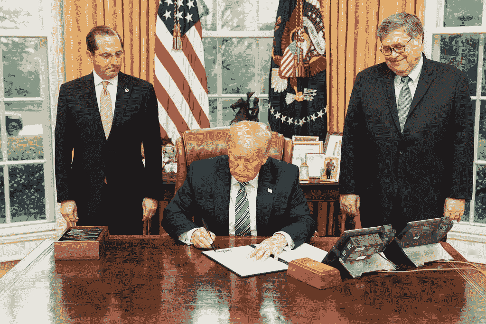

# 川普与普渡制药在 DOJ 达成的协议再次背叛了美国人民和公共健康，有利于亿万富翁

> 原文：<https://medium.datadriveninvestor.com/trumps-doj-settlement-with-purdue-pharma-again-betrays-american-people-and-public-health-in-favor-e8fbf690757?source=collection_archive---------25----------------------->

flickr.com

上周晚些时候，美国司法部(U.S. Department of Justice)与普渡制药(Purdue Pharma)达成和解，普渡制药是主要的制药公司之一，因在过去 20 年里参与了导致全美数十万人成瘾、死亡和生活破碎的行为，而受到调查。

[该公司将请求](https://www.bbc.com/news/business-54636002)允许“在没有合法医疗目的的情况下”供应药物，并同意以 83 亿美元达成和解。

当然，回想一下 T4 公司去年 9 月在美国法院申请破产，使人们对普渡制药公司最终将支付的确切金额产生怀疑。通常情况下，破产程序可能会导致那些负有责任的人向债权人支付一分一毫的赔偿金。

此外，[萨克勒家族](https://www.bbc.com/news/business-54636002)曾拥有普渡制药，并在 2008 年至 2017 年间将超过 100 亿美元转移出公司，即使在支付 2.25 亿美元罚款并据称同意出资 30 亿美元解决更广泛的索赔后，他们仍将成为亿万富翁，不会面临刑事指控。

与 DOJ 的这一协议仍然使许多州和城市的索赔悬而未决，使这些州和城市不得不花费资金来管理公共健康危机，普渡制药公司积极鼓励为自己的利润，对司法部的解决方案非常不满。

> 宾夕法尼亚州司法部长乔希·夏皮罗说:“这一明显的和解对每个因为这个家庭的毁灭和贪婪而不得不埋葬亲人的人来说是一记耳光。”。
> 
> "它允许赛克勒家族离开亿万富翁，并且不承认任何不当行为."

马萨诸塞州总检察长莫拉·希利回应了这些担忧，直截了当地说，“司法部失败了。"

她阐述道:

> “在这种情况下，正义需要揭露真相并追究肇事者的责任，而不是匆忙达成和解来击败选举。我与普渡大学和赛克勒家的关系还没有结束，我永远不会出卖那些长期以来一直呼吁正义的家庭。”

然而，司法部在本案中的行为与威廉·巴尔领导下的司法部的行为是一致的。该部门遵循特朗普政府的路线，按照特朗普的价值体系执行他的命令和职责。

过去四年，我们从特朗普身上看到了什么？

我们看到他不断地抛弃美国人民，违背人民的利益和健康，为最富有的美国人、美国公司和他自己的金融利益服务。

让我们回忆一下，本月早些时候，我们了解到[特朗普在今年早些时候向华尔街投资者](https://www.nytimes.com/2020/10/14/us/politics/stock-market-coronavirus-trump.html)透露了冠状病毒的威胁，使他们能够做空市场并获得财富，而他却向美国人民隐瞒了这一信息，并忽视了采取严肃而重大的行动来防止病毒的传播，导致数十万人丧生，并危及数百万人。

特朗普及其政府根本不重视人的生命；对他来说，为富人服务并创造财富有更高的价值。

因此，特朗普的司法部肯定未能服务于美国人的健康和利益。然而，它成功地完成了特朗普的使命，即利用总统和美国政府的权力为亿万富翁服务，为那些已经拥有财富的人创造财富，甚至——也许特别是——这意味着背叛公共健康和美国人民。