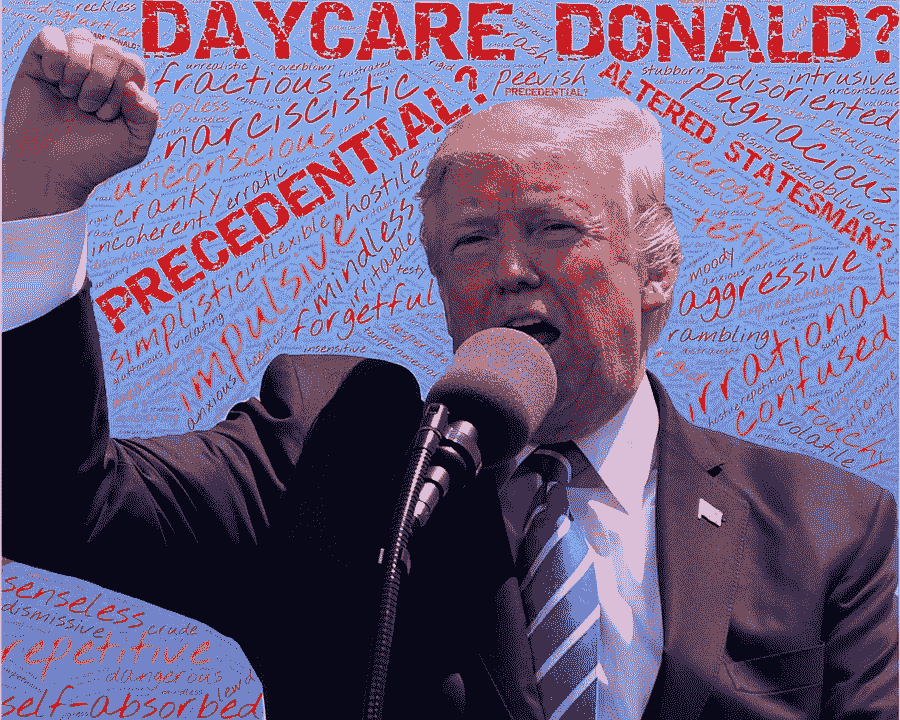

# 特朗普的精神状态正在恶化

> 原文：<https://medium.datadriveninvestor.com/trumps-mental-state-is-deteriorating-e20b7474282b?source=collection_archive---------8----------------------->

## 政治

## 他对现实的理解越来越模糊

Photo by [johnhain](https://pixabay.com/users/johnhain-352999/) on [Pixabay](https://pixabay.com/photos/trump-mental-dementia-dimwitted-2896249/)

特朗普一直在全国各地飞行，举行一场又一场集会。在集会上，人们没有戴口罩。社交距离没有被观察到。而特朗普的“言论”也越来越疯狂。

他对拜登和他的儿子亨特妄加评论，说福奇博士是一场灾难，说疾控中心是错误的，说疫情正在衰落，而经济正在复苏。他恳求郊区的女人喜欢他。他重复了低压浴室设备等东西，声称它们没有足够的水供人们清洁或彻底冲洗。他甚至呼吁监禁密歇根州州长。

媒体认为他古怪的行为是一个绝望的人的行为。一个知道自己会输的人，所以他把谨慎抛到了九霄云外，或者像一些评论家说得更生动一些，他已经放弃了他的计划，而是把一切都抛到了墙上，看看什么会坚持下来(与选民产生共鸣)。

我不同意。我们看到的是一个精神状态在我们眼前恶化的人。我在 9 月份写了他的衰落。从那以后，他对现实的把握变得越来越模糊。

在一次电话中，他告诉他的顾问，他希望将集会次数增加到每天五次。请记住，这是一个 70 多岁的男人，他饮食不好，不运动，临床上肥胖。他已经能够保持一天两场集会的速度，但五场集会不仅在身体上不可能，在后勤上也不可能。

 [## 为什么看起来不可能战胜特朗普？数据驱动的投资者

### 我注意到标题说拜登仍然在总统竞选中领先。在这样的标题背后，人们可以感觉到一种恐惧…

www.datadriveninvestor.com](https://www.datadriveninvestor.com/2020/10/07/why-it-seems-impossible-to-trump-trump/) 

他认为他吸引的中等规模的人群是破纪录的数字。他没有意识到他在沃尔特·里德医院接受的专业治疗是其他任何人都享受不到的。他认为他现在对病毒免疫了。尽管致命的病毒死灰复燃，他认为它正在消失。他声称，尽管失业率创下新高，企业永久倒闭的数量创下纪录，但经济仍在增长。

这不是一个绝望的人。这是一个脱离现实的人。他在第一场辩论中的表现很好地说明了这一点。很明显，特朗普不知道辩论是如何进行的。他表现得好像是在与拜登和主持人进行个人辩论，而不是对这些问题进行有分寸的辩论。他喊道。他打断道。他对事实做了疯狂的、不正确的陈述。他的行为就像你的老爷爷在节日聚会上一样。

第二场辩论被取消，因为特朗普无法掌握虚拟辩论的概念。他是个电脑盲，甚至从未学过使用电子邮件，所以他无法坐在电脑前思考，而是站在讲台上。

他担心还没说完就被打断了。那是他的妄想症。情况越来越糟了。他变得对任何事和任何人都怀疑。

我很惊讶他的竞选团队已经同意第三次辩论。我敢肯定，他们知道他的恶化，并希望只是让他做他的集会，而不是冒险另一个尴尬的辩论表演。

他们试图逃避辩论，要求辩论的主题是外交政策，而不是双方最初同意的由主持人选择的主题。他们声称所选择的主题有利于拜登。

而且我敢肯定他们都害怕他会对一个女 POC 当主持人有什么反应。克里斯汀·韦尔克的父亲是美国土著，母亲是黑人。特朗普不尊重女性，尤其是聪明的女性。他是公开的种族主义者。因此，萨凡纳·格思里尖锐的提问让他感到不舒服，克里斯汀·韦尔克很可能引发他发表种族主义长篇大论。

当拜登讲话时，他如何处理麦克风被关掉两分钟，这也很有趣。我的预测是，他会容忍一次，然后在那之后痛苦地抱怨，并回去大喊大叫，打断别人。他很少或根本无法控制自己，就像一个蹒跚学步的孩子。

老实说，我无法理解怎么会有人支持或投票给特朗普。他不只是无知，他是危险的精神病患者。带着病毒和特勤局的人一起乘坐密封的汽车是疯狂的。不允许在白宫或白宫活动中戴面具或保持社交距离是疯狂的。想到他可以在接下来的两周内保持每天 5 次拉力赛的速度，简直是疯了，他生活在什么样的世界里呢？

让我振奋的是，提前到场的选民排起了长队，还有很多选民在当地投票箱投下邮件时的自拍。这给了我希望，拜登能赢，因为这个国家将无法承受另一个疯子当总统的四年(或者更长，如果他有办法的话)。

## 访问专家视图— [订阅 DDI 英特尔](https://datadriveninvestor.com/ddi-intel)