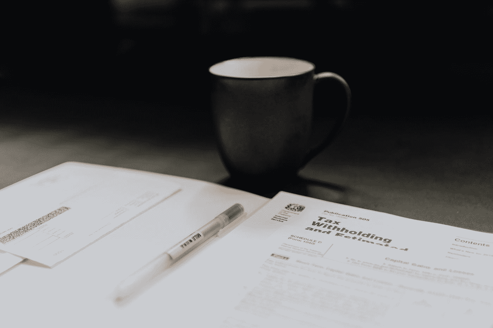

# 特朗普的税收

> 原文：<https://medium.datadriveninvestor.com/trumps-taxes-599ca6c7e5cb?source=collection_archive---------14----------------------->

## 政治

## 特朗普的所得税只是证实了我们对他的了解

Photo by [Kelly Sikkema](https://unsplash.com/@kellysikkema?utm_source=medium&utm_medium=referral) on [Unsplash](https://unsplash.com?utm_source=medium&utm_medium=referral)

《纽约时报》获得了特朗普 2000 年至 2017 年的所得税副本。头条新闻是他十多年来没有缴纳所得税。对我来说，大标题是他为什么十几年不交所得税。

他损失了近十亿美元。准确的说是 9.157 亿美元。

让那件事过去一会儿。那个被选为总统的人，因为他被认为是一个伟大的商人，损失了 10 亿美元，这笔钱太大了，不能在一年内一笔勾销，而必须在几年内分期偿还。

他对选民撒谎。但是我们已经知道他了，对吗？他撒谎？关于一切？

 [## 忽略特朗普|数据驱动的投资者

### 通常，7 月 4 日是烧烤或逃离城市的日子。随着第一轮新冠肺炎…

www.datadriveninvestor.com](https://www.datadriveninvestor.com/2020/07/02/ignore-trump/) 

当然，我们不应该对这一巨大损失感到惊讶。我们已经知道了他的 6 次破产。所有的企业破产都是因为他的企业无法偿还他购买这些企业时欠下的债务。另一个谎言:他声称损失是由于贬值。

据《NYT》报道，他正再次走向破产。他的高尔夫球场一直在大量流失现金，所以他从有利可图的资产中提取现金，以避开债权人。他还申请了他个人担保的贷款。如果他再次当选，在他的第二个任期内将有 4 . 21 亿美元到期。

现任总统会被取消赎回权吗？被逼到个人破产？我敢肯定，特朗普的私人律师兼调解人，也就是美国司法部长，已经有了避免所有这些不愉快的计划。

那么，来点作弊怎么样？最好坐下来听这个。特朗普于 1996 年在威彻斯特郡购买了一处地产，意图将其改造成另一个高尔夫球场。周围的邻居反对，所以他与一家土地保护机构签署了协议，承诺不开发土地，以换取 2110 万美元的慈善税收减免。

目前为止还好吧。该房产现在被归类为投资房产，尽管它不用于出租，特朗普夫妇把它用作度假屋。作为投资房产，特朗普有权注销全部 220 万美元的年度房地产税。

由于他的 2017 年税法，我们其他人可以为我们居住的房屋注销多少房地产税？$10,000.

他作弊的其他例子在那些税务记录中比比皆是。他通过将私人飞机、甚至私人发型师等个人支出列为业务支出来支持自己奢侈的生活方式。

但《纽约时报》报道中突出的是非法薪酬。所有外国和国内公司利用特朗普的各种财产对总统施加影响的例子都很突出。大多数特朗普房产的收入都有所增加，尽管这还不足以遏制赤字。

特朗普在他的真人秀节目《学徒》和《名人学徒》中暂时摆脱了长期的财务损失，这让他赚了数百万美元。当然，作为特朗普，他没有把钱投出去以备不时之需。不，他继续疯狂收购，收购高尔夫俱乐部，所有这些都在赔钱。

那么，我们如何让一个足够狡猾的人想出创造性的方法来欺骗他的所得税，但又愚蠢到投资赔钱的房地产呢？以下是我根据几十年对他的观察得出的理论:

> “特朗普不是一个聪明人。他的财富让他可以奢侈地成为一个彻底的失败者，而不是在桥下无家可归。钱给他买了会计师和律师来保护他免受自己的伤害。”

因此，尽管特朗普一直在进行糟糕的商业投资，但一直是他的会计师精心策划了他的避税行为。

一些人认为他在 2016 年竞选总统不是为了获胜，而是为了支撑他的形象和帮助他的生意。甚至有人猜测，他的参选只是为了宣传他想创办的新电视网的一个噱头。

不管他竞选总统的理由是什么，都不是因为他想当总统。在他的总统任期内，我们看到的所有谎言和欺骗并不新鲜。他的所得税表明，这就是他一生的经营方式。

最后，这将如何影响选举结果？这是会让特朗普竞选脱轨的“十月惊喜”吗？我最初预测拜登的竞选活动不会像传统的 10 月惊喜那样进行，因为提前投票和他已经有太多丑闻的事实。[正如我之前所说的](https://medium.com/politically-speaking/will-there-be-an-october-surprise-f3f46628986e)，

> "一些会立即毁掉其他任何人职业生涯的东西会从他身上滑落."

这种情况下也是如此。无论如何，他的支持者都爱他。我们其他人已经知道他逃税，只是不知道他逃税的程度。

我认为这篇爆炸性的报道不会对选举结果或选民对他的看法产生任何影响。

## 获得专家观点— [订阅 DDI 英特尔](https://datadriveninvestor.com/ddi-intel)