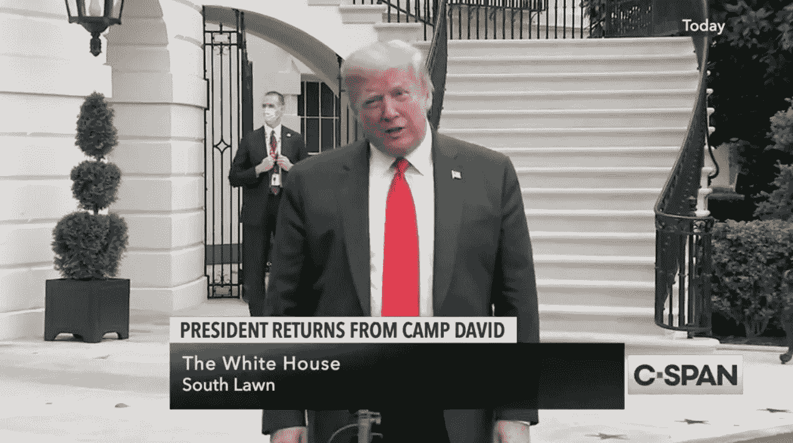
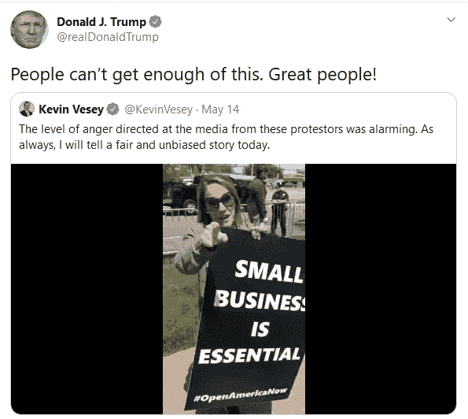
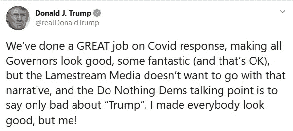

# 特朗普在尝试一种屡试不爽的策略。但是这次会成功吗？

> 原文：<https://medium.datadriveninvestor.com/trumps-trying-on-a-tried-and-true-tactic-but-will-it-work-this-time-d7b0e63cb20a?source=collection_archive---------2----------------------->

Returning from Camp David Sunday, calls Obama “grossly incompetent”

## 超过一半的总统周末推文针对奥巴马/拜登。只有 16%关注冠状病毒反应…

我们对关注冠状病毒的推文非常宽松，不仅包括 Trump 为自己的回应欢呼的推文，还包括他对抗议者(在陆地上和在海上)鸡蛋的推文，甚至在[甚至没有达到他自己的重新开放的*条件*](https://www.whitehouse.gov/openingamerica/)的州。

如果特朗普继续沿着这条路走下去，当然这将意味着实际的健康危机并不像“科学”(以及媒体和民主党)所说的那样糟糕——从来没有那么糟糕。更不用说那些几乎完全基于形势科学而迅速采取行动的国家(一些政治体系非常不同)，如韩国、台湾和新西兰，感染和死亡人数明显更少。有些几乎没有。因为美国的死亡人数现在是一个移动的目标，总是可以逐步上升到一个新的可接受的水平。在那里，总统总是做着“伟大的工作”。

但为了让这一信息发挥作用，特朗普不得不希望越来越少的人真正接触到这种疾病。即便如此，每个人都受到了经济衰退的影响。因此，这一次分散注意力可能不会像通常对这位总统那样容易。他真的需要猛烈抨击一阵子，让人们关注关于奥巴马政府的复杂理论。

这是一个高风险的赌注:因为即使美国的病例正在达到顶峰，或者已经达到顶峰，这并不意味着病例数量正在下降。这仅仅意味着新病例的数量没有上升的那么快。这也意味着死亡人数将继续上升，即使速度有所放缓，也很可能接近我们在曲线上升端看到的数字。

但是我们也不确定这是一个不可能让总统接受的故事。

当疫情席卷全国时，我们一直在东海岸。不是在纽约，而是在马萨诸塞州，这已经够糟了。我们知道有一群人病得很重(甚至有些人几乎从不生病)，还有一些人悲惨地死去了(一个以前的老师，一个我们几乎每天遛狗时都会碰到的人……)

但我们想知道，我们的思维模式与疫情造成的致命影响要小得多的那些州的人们有多大的不同。(甚至我们的生活与纽约居民有多么不同，纽约居民到目前为止的情况要糟糕得多。

在过去的几周里，我们与其他州的人交谈或听说过他们像平常一样去做手术，他们在家工作或失业，但每天晚上从一家餐馆跑到另一家餐馆，或提供社区超市的每日状况报告，或自豪地理发，好像在公共场合花那么多时间根本不是什么大事。在那些地方，也许不是。

在这种情况下，特朗普的策略或许会奏效。即使奥巴马阴谋的废话最终没有。如果许多地方的人们没有被疾病感染，也就是说朋友或亲戚病得很重(甚至可以说是三度分离)，那么他们看到和感受到的大多数是经济影响。然后，总统可以将此归咎于民主党人不希望特朗普获胜。(其起源与他大谈特谈的奥巴马理论有关)。关于科学家决定持有观点，无论出于何种原因，“[是不可接受的](https://www.bbc.com/news/world-us-canada-52656959)”即使在有大热点的州，那些地方也往往是肉类加工厂或少数民族社区，所以这可能会让很多人觉得不是 T4 他们。除了经济灾难那部分。

正如我们在顶部所指出的那样，当特朗普最近在推特上发布关于冠状病毒的消息时，他主要强调的是下面来自纽约长岛的视频，一群蒙面、没有社交距离的亲特朗普抗议者骚扰当地新闻记者。事实上，他发了两次微博。即使你完全同意抗议者的观点，即使你分担了他们所有的愤怒和沮丧，他们无论如何也不是伟大的人。。他们被打成了一个洞。

自己看:

我们很少解析特朗普的推文，但他本周末最早的一条推文在每个词的谎言和误导数量方面令人惊叹:

*   首先，特朗普告诉所有州长，他们只能靠自己。*那是* *他的*叙述。“[我们不是货运员](https://www.politico.com/news/2020/03/19/trump-governors-coronavirus-medical-supplies-137658)”他抱怨道。特朗普的女婿兼高级顾问表示，联邦医疗设备储备是“[我们的储备](https://abcnews.go.com/Politics/kushner-stockpile-hhs-website-changed-echo-comments-federal/story?id=69936411)，不应该是他们然后使用的州储备”。因此，也许媒体“不想采用这种叙事”，因为这完全是编造的叙事，与他的旧叙事完全相反。
*   “民主党的观点是只说‘特朗普’的坏话”。是的。这是一个两党制。一些事情(比如数万亿美元的救助)将会是两党合作的。有些事情不会。民主党人说“特朗普不好”，因为如果没有其他事情的话，他们实际上是在下届选举中与总统竞选。因为这就是这个国家政治体系的运作方式。并不代表他们讨厌美国，热爱死亡等。
*   “我让每个人都好看，除了我！”这就像旧金山 49 人队教练凯尔·沙纳汉抱怨说，没有人相信他在今年的超级碗比赛中被堪萨斯城酋长队击败，然后没有人相信他让对方球队“看起来不错”。

所有这些都是在美国死亡人数远远超过超级碗体育场总人数的背景下发生的，特朗普根本没有提到这一点。

今天只有一个脚注:关于我们关于拜登如何需要一首主题曲的故事，我们从一些显然不是他的粉丝的朋友和追随者那里得到了几个下流的建议。这让我们想到了特朗普的一个名字:加兰·杰弗里斯(Garland Jeffreys)的“[狂野街头](https://www.youtube.com/watch?v=3RzBZsOeqOQ)”:

> *美国夫人，你最喜欢的儿子怎么样了？*
> 
> *你在乎他做了什么吗？”*