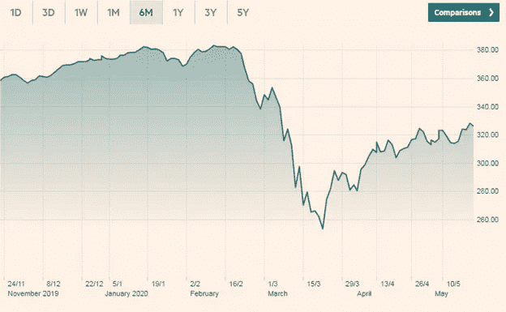

# 股票市场的动荡

> 原文：<https://medium.datadriveninvestor.com/turbulence-in-the-stock-market-96d008fae159?source=collection_archive---------4----------------------->

## 穿越冲击波

Photo by [Alec Favale](https://unsplash.com/@alecfavale?utm_source=medium&utm_medium=referral) on [Unsplash](https://unsplash.com?utm_source=medium&utm_medium=referral)

## 冲击波

新冠肺炎彻底撼动了世界医疗保健和商业体系。全世界有 500 多万人感染了这种病毒，超过 33 万人死亡。

经济后果同样糟糕，甚至更糟。对非必需品的需求急剧下降，大多数消费者只关注食品和医疗用品。由于旅行限制和人们自愿呆在家里，对酒店、燃料和旅游的需求已经下降。

自 2007 年经济衰退以来，房地产市场活动创下历史新低。建筑、制造和服务行业的需求大幅下降。报告显示，全世界有数百万人失业。

 [## 利用股市相关性的最佳方式|数据驱动的投资者

### 当阿尔弗雷德·温斯洛·琼斯开创了世界上第一个“对冲”基金(后来“d”被去掉了)时，他让其他投资者大吃一惊…

www.datadriveninvestor.com](https://www.datadriveninvestor.com/2020/02/02/the-best-way-to-use-stock-market-correlations/) 

在当前的经济危机中，许多人都惊讶于股票市场依然保持稳定。许多分析师预测前景黯淡，但美国和全球市场大多已从新冠肺炎的最初冲击中复苏。

让我们更深入地了解正在发生的事情，以及市场未来是否会崩盘。

## 新冠肺炎会议之前的世界经济

最好从头开始。在新冠肺炎教起源并从武汉传播之前，中美之间的贸易紧张已经在加剧。

美国政府对中国供应商征收关税，并禁止几家中国公司在美国运营。中国政府也采取了类似的措施予以回应。

美国从中国进口的商品和服务多于出口。中国对美国公司的税收没有对业务产生重大影响。

然而，中国对华出口的下降影响了另一个行业。许多从美国获得盈余收入的中国企业将资金投资于两件事；美国货币储备和美国房地产市场。对进入美国的中国进口商品的贸易限制和关税对这些投资产生了影响。

与此同时，EU-与美国的贸易也在下降，因为美国政府对欧盟的具体政策不满意。推动低碳经济的《巴黎协定》和欧盟的低军费开支是有争议的重大问题。

欧盟国家对中国和俄罗斯企业颇有微词。欧盟对中国操纵其货币感到不满，这降低了欧盟产品的竞争力。他们还对中国生产中心的大规模污染发出警告。

欧盟试图增加乌克兰的影响力，但遭到了俄罗斯的反对，俄罗斯增加了军费开支，并加强了对波罗的海的监控。欧盟和英国因为英国退出欧盟问题大吵了一架。欧盟国家和英国的民意推动更多的民粹主义右翼政党反对商品和服务自由流动的紧密联系的世界。

世界各地的贸易和经济活动已经承受了很大的压力。几乎所有人都指责中国在世界各地大规模生产和倾销他们的产品。然后，新冠肺炎从中国爆发，传遍全球。哦，真讽刺！

## 新冠肺炎对世界经济的影响

世界经济的很大一部分与人员的自由流动和全球贸易联系在一起。人们为了工作、教育、研究和旅游而在世界各地旅行。从原材料、燃料、食品到成品和机械等产品也在不同国家之间来回流动。

新冠肺炎疫情直接影响了许多行业的商品和服务的流动。从零售商和送货服务到制造商和原材料生产商的供应链中的许多企业已经关闭，以遏制病毒的传播。酒店业、旅游业和航空业也停止了运营。

以采矿和石油开采企业为例。对提取和生产设备的投资给这些企业带来了损失，因为原料必须保持运转。关闭和重启钻井作业所涉及的财务负担如此之高，以至于公司更愿意保持一切运转，因为对石油的需求已经下降，他们有多余的产量，却没有地方储存。

航空公司和运输企业面临着类似的问题。社交距离措施要求公司与通勤者保持一定距离。然而，运输座椅建造得很近，以受益于规模经济。按照目前的运营程序准则，私营运输企业无法盈利。

剧院、体育场馆、餐馆以及任何涉及社交聚会的行业都是如此。

## 股票市场是如何受到影响的？

传统观点认为，当前的经济环境不利于投资。如果如此多的企业已经关闭，冠状病毒还看不到尽头，那么对商品和服务的总需求将会下降。

经济学家已经预测，在未来几年内，全球经济将萎缩两位数。世界经济有可能下降 10%。这对市场来说将是灾难性的，我们面临着迫在眉睫的崩盘。

2020 年 3 月初，当欧洲和美国成为病毒的中心时，我们看到了一个预告片。在政府介入并宣布救助计划以稳定局势之前，世界市场崩溃，股票价值损失了约 20%至 25%。

来源:[金融时报](https://markets.ft.com/data/indices/tearsheet/summary?s=AW01:FSI)

美国宣布向该国企业和个人提供 2.2 万亿美元的贷款和赠款。欧洲国家各自拨出数十亿美元来刺激经济。目前，德国和法国正在进行谈判，以建立一个 5000 亿欧元的基金来帮助欧洲大陆的企业。

分析人士认为，财政援助有助于暂时停止经济崩溃，但并没有解决问题。如果人们不恢复工作，由于新冠肺炎的恐惧，总需求仍然很低，最终经济崩溃的风险总是存在的。

## 我们已经到了终点

今年 3 月，美国联邦政府将利率下调至 0%-0.25%，以刺激消费者支出。这是近代历史上第二次价格降得如此之低。上一次发生在 2008 年房地产市场危机之后。在新冠肺炎受到冲击之前，欧洲的利率已经处于 0%-0.5%的区间。

虽然许多经济学家对此举表示欢迎，但一些人质疑此举是否会产生很大影响。记住，联邦利率已经很低了，在 1%-1.5%的范围内。下降 1%不会说服很多人比现在花更多的钱。

美国和欧洲国家采取的另一项举措是放松封锁限制。实质上，政府是在要求人们走出去，关注他们的日常生活，以防止经济崩溃。

美国和欧洲当局因放松封锁而受到猛烈抨击。关于人的生命是否比经济活动更重要，有一场大辩论。然而，即使是最著名的批评家也同意，封锁不可能是无限期的，我们迟早要开放。

## 股票市场预测

在交易时段，一只股票只有两种走势，上涨或下跌。对经济中正在发生的事情、单个公司的表现以及股票价格预期走向的市场预测是基于市场因素的。

不知道将来会发生什么。我们所能做的就是根据手头的信息进行有根据的猜测。

目前，对于股价的未来有两种主流观点。第一组对他们的信念相当有信心。“熊市派”认为，鉴于目前的经济状况，股市将会崩盘。潜在的市场情绪过于消极，企业过于悲观，消费者过于恐惧。尽管政府放松了封锁，但不会恢复正常。

第二组，让我们称他们为“未决定”组，认为前景是错误的，但有太多的不确定性来预测任何事情。这组分析师认为，市场将在未来几个月出现小幅下跌，增长在很大程度上将保持停滞。然而，不会有熊市预测的那么严重的崩盘。还有一种可能性是，由于政府干预，股价根本不会下跌，市场或多或少会维持在当前水平。

我属于第二组。市场可能会有些下滑，需要时间来恢复。这可能是一个缓慢、稳定的下降，一种可控的混乱，而不是许多人预测的崩溃。

在接下来的六到十个月里，股市上涨的可能性极小。我希望被证明是错误的，但投资者认为这在短期内不会发生。

有几个原因可以解释为什么股市会保持稳定或缓慢下跌，而且崩盘不太可能发生。

## 市场并没有过度膨胀

如果你看看 1929 年的大萧条和 2007 年的金融衰退，你会注意到市场上存在广泛的投机。

1929 年，股票价格高度膨胀，远远超过其实际价值。从百万富翁大亨到普通百姓，每个人都把钱投进了股票，因为他们相信价格会继续上涨。

2007 年，房地产也有类似的案例。每个人都认为抵押支持的次级抵押贷款是安全的投资，并不断购买越来越多的次级抵押贷款，最终导致了危机。

当过多的资金被投入到一种并不那么值钱的商品中时，就会产生人为的泡沫。它会膨胀直至爆裂。

如果你看看现在的世界市场，它们似乎没有过度膨胀。对业务的分析更加仔细，并且有适当的审计和检查。没有太多的猜测，所以预计市场不会崩溃。

## 政府将会介入

发达经济体的政府大多采取不干涉的方式，让市场自由发展。然而，有一个有效的论点是，如果市场因任何原因崩溃，政府应该介入。

许多人认为，如果政府早点介入，大萧条和 2007 年的衰退就不会发生。政府资金和新项目的增加将有助于稳定对经济的信任。

从过去的错误中吸取教训，美国政府比以前更快地介入，并承诺提供大规模救助基金来刺激经济和企业。世界各地的其他政府也采取了类似的行动。有人说这还不够，但我们可以肯定未来会有更多的援助。

## 股票市场的复杂性

股票市场比以往任何时候都更加复杂多样。除了石油和天然气、制造业和房地产行业，还包括 it 企业、零售商和制药公司。这种多样性有助于分散固有的市场风险。

在当前的新冠肺炎局势中，并非所有人都是输家。提供远程工作、电信和家庭娱乐服务的企业销售额有所增长。制药公司和个人防护设备制造商的股价也有所回升。食品和快速消费品零售商是明显的赢家，随着人们囤积供应，销售额几乎翻了一番。

上市企业和公司的巨大多样性降低了重大崩盘的风险。

## 长期战胜了短期

快速顺畅的信息流动使得股票市场反应灵敏。有些人会称之为有效，因为市场对可能影响投资者利益的相关信息反应非常迅速。其他人认为，市场已经变得无效，因为它们现在更加不稳定和投机，迅速上升和下降，甚至一点点的错误信息。

真相介于两者之间。

市场对消息的反应确实很快，我们已经看到了恐慌性抛售或基于谣言的买入。股价的大幅上涨或下跌使其在短期内变得不可预测，并带有一定的投机性。然而，在此之后，迟早会出现调整。

市场上有许多头脑清醒的人，他们有着雄厚的财力和长远的眼光。他们超越投机交易者，分析公司头寸的价值。从大人物的预测和持股情况来看，股市似乎不会崩盘。

## 投机是双向的

但是，来自市场某些方面的悲观消息又是怎么回事呢？这当然也有一定的道理，不是吗？

是的，许多投资者确实担心，他们也应该担心。尽管市场前景是负面的，可能会小幅下跌，但这并不等于说市场会崩溃，一切都会像一副牌一样下跌。

之所以有这么多关于崩盘的说法，是因为投机是双向的。你可能听说过这样的投资者，他们在股价低的时候买入股票，然后让其他人投资来支撑股价。一旦价格足够高，他们就会获利套现。

同样的事情也发生在不利的一面。当投资者预期股票价格下跌时，他们会以当前市场价格出售，并承诺在未来某个日期交付一定数量的股票。当股价下跌时，他们会回购股票，并在此过程中获利。

当新冠肺炎来袭，市场在 3 月份投降时，许多看跌者押注崩盘。然而，政府在金融支持和放松封锁方面的快速行动帮助了市场复苏。空头仍在押注和预测崩盘，但犹豫不决的人似乎在掌控局面。

当前的政策是“等着瞧”

## 结果

美国总统特朗普最近在推特上说，所有关于市场崩溃的猜测都是“富人”试图通过做空来赚钱。

作为总统，他可以接触到一些最著名的银行家和做市商。他和精英们来往密切，知道发生了什么，至少在金融界是这样。

他也表现出高度的决心去得到他想要的。他的自我意识把自己的声誉放在第一位，他将竭尽全力防止市场崩盘毁掉他作为美国总统所构想的遗产。