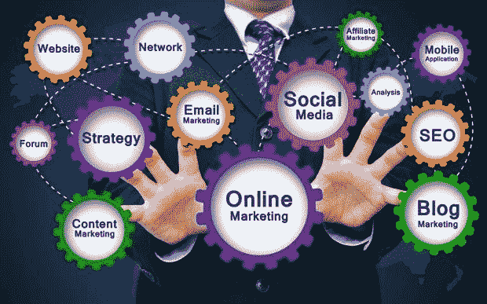
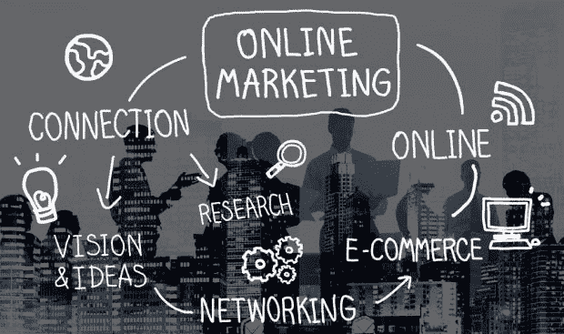

# 把爱好展示变成赚钱机器

> 原文：<https://medium.datadriveninvestor.com/turn-hobby-showcase-into-a-money-maker-b9f54b38aede?source=collection_archive---------16----------------------->

## 你的热情会成为意想不到的收入来源

大多数人把他们的网站作为一种爱好。网上赚钱是他们做梦也想不到的。

这是造梦者奥斯卡·冈萨雷斯响应号召的地方。他是一名独立的在家工作的顾问，同时也是一名互联网营销人员以及商业教练和顾问。

Gonzalez 与社交媒体经理 [Carol Stephen](https://twitter.com/Carol_Stephen) 讨论了网站盈利的问题，这是她从自己的书 [*“全面参与社交媒体的 21 种方法:这会让你看起来像个专业人士”中得出的结论*](https://www.amazon.com/Ways-Total-Social-Media-Engagement/dp/1732209901/ref=sr_1_1?ie=UTF8&qid=1537909679&sr=8-1&keywords=21%20ways%20to%20social%20media%20engagement%20that%20will%20make%20you%20look%20like%20a%20pro)

“许多人建立网站是为了展示他们的爱好，”冈萨雷斯说。“我认为你应该马上将网站货币化。最简单的方法是添加一个广告网络，比如 Adsense。

“一个更好的方法是使用一个联盟计划来推广你在业余爱好中使用的产品，”他说。“大多数公司都有你可以使用的联盟计划。作为退路，试试亚马逊的合作伙伴计划。这让你可以满怀激情地做自己的爱好或手艺，而不用担心产品的销售。”

冈萨雷斯回忆道，这不完全是一种爱好，他在 2014 年通过博客将育儿变成了一项赚钱的事业。这是各方对他们所看到的充满热情的最好例子。

“严格地说，从爱好的角度来看，当你让很多人感兴趣并真诚地赞美产品时，这是一个好迹象，”他说。“朋友和家人总是说‘你应该卖掉这些’，但当一个陌生人告诉你时，你要注意。”

 [## 做你最擅长的事，赚更多的钱

### 资金紧张时，爱好带来的收入是天赐之物

medium.com](https://medium.com/financial-strategy/earn-more-money-from-doing-what-you-do-best-b41809919dc9) 

他不认为亚马逊是一个明显的货币化选择。

“他们的支出非常低，而且他们的饼干很难吃，”冈萨雷斯说。"我认为他们是万不得已的万全之策。"

那些销售小配件等产品的人可能会想，为什么他们还没有开始赚钱。

“当我们谈论小部件时，我们谈论的是这个词的经济学意义，即你卖‘东西’，”冈萨雷斯说。“答案是肯定的，你在用你的网站赚钱，但人们通常会把两到五倍的钱留在桌面上。

“考虑从一个小部件扩展到一个集合，到一个集合加伴侣，”他说。“考虑一下食谱指南，以便更好地使用这个小工具。想得比你已经在卖的东西更大。”

# 与合作伙伴合作

这尤其适用于测试未知水域。

冈萨雷斯说:“如果你拓展到你不擅长的领域，别忘了通过联盟或合作项目赚钱。”“例如，我告诉一个想运行虚拟主机的 web 开发人员不要去做。

“取而代之的是，通过他们的联盟项目与网络 T2 主机公司合作，”他说。“这样他们可以从网络开发中获得报酬，也可以从网络托管中获得佣金。人们不再卖一样东西，而是把钱留在桌子上。总是想得更大。”

博客，搜索引擎优化和分析的技术专长在开始时是不需要的。

冈萨雷斯说:“如果你已经有一段时间的博客，你想开始赚钱，你应该立即开始。”“搜索引擎优化和分析很好做，可以边做边学，但不要让它们阻止你迈出第一步，即创造内容和赚钱。”

 [## 窃取将你的品牌货币化的秘密

### 通过利用您所知道的知识，让您的业务面向未来

blog.markgrowth.com](https://blog.markgrowth.com/steal-the-secrets-to-monetizing-your-brand-449d3b0509c8?source=search_post---------1) 

一个普遍的规则是去有观众的平台，与他们互动。

Gonzalez 说:“总是要把消费者拉回网站。“社交平台很棒，但很多都不让你赚钱。你也可以使用一个内容多个网络的方法，这样你就不会重复工作，同时总是把流量导向你自己的物业。”

不确定网上销售的企业主应该寻求帮助。

冈萨雷斯说:“制作数字化的配套产品，如食谱或操作指南。”“还有配件、类等东西。利用社交媒体、你的网站和电子邮件列表来推动销售。

“另一个赚钱的方法是增加一个私人俱乐部在线会员，每月花费 X 美元，让粉丝加入并成为其中的一员，”他说。"提供折扣、特别活动、特别早期销售等等."

虽然在 YouTube 上销售看起来很诱人，但冈萨雷斯告诫人们不要这么做。

“YouTube 越来越难赚钱了，”他说。“然而，你可以通过增加人们在你网站上的停留时间，利用你的视频内容在你的网站上获得更好的结果，从而获得更好的排名。

“在适当的时候，使用你的视频描述来链接到附属产品，”冈萨雷斯说。"我的浏览量很少，但我通过视频链接赚钱."

# 今天小，明天大

制作大量视频的人发现，链接的浏览量会增加。

Gonzalez 说:“今天一个不到 50 次浏览的视频为我的生意带来了一大笔交易。”“这也不是说有多少观点，而是正确的观点。做好描述、标签和标题，搜索产品的人就会找到。”

斯蒂芬回忆说，她的一个旧视频已经有超过 10 万的浏览量。她希望她能赚钱。

“一定要重游，”冈萨雷斯说。“确保标题是相关的，有一个好的描述，至少包括一个链接到您的网站。”

 [## 生动的视频将业务提升至顶级水平

### 直播带来更大的关注和更多的钱

medium.com](https://medium.com/curious/lively-video-boosts-business-to-the-top-tier-15d3065f59f8) 

他建议使用 YouTube 的“魔力”来获得更多帮助。

从制作视频开始，没有人是完美的，这没关系。

“错误磨练我们的技能，让我们变得更好，”冈萨雷斯说。“如果你没有犯错误，你有没有尝试过？

“我还是会犯很多错误，”他说。“我每次都努力学习，不再重复。错误还是会发生，有时候不同的场景让你在不经意间重蹈覆辙。然而，我们一直在改进。向前向上。”

总的来说，在线产品和服务的盈利并不是必然的。

“很难直接在社交媒体上赚钱，”冈萨雷斯说。“相反，用它来提高产品和品牌的知名度，并试图把人们带到一个网站、博客或登录页面。使用大型网站:抖音、Instagram、YouTube 和脸书。

“在其中一些网站上，你可以买到非常有效的广告，”他说。“获得付费或有机流量的诀窍在于了解平台的细微差别。在 Linkedin 上管用的东西在 Instagram 上可能就不管用了。”

尽管似乎吸引注意力的唯一方法是用猫、婴儿隆起、订婚戒指或幸存者的故事的图片，冈萨雷斯说不要绝望。

“一致性、细微差别和清晰度胜过所有这些——除了性。性是卖点，”他说。“要始终如一。这需要时间。我们经常看到其他人在几个月或几年的时间里“一夜之间”卖出很多东西。”

# 网站是必须的

那些有赚钱想法的人需要知道从哪里开始。

“创建一个网站——基本的两三页，”冈萨雷斯说。“其中一页应该是兴趣表格，即使你不准备出售。发送付费流量到网站:100 到 300 美元应该足够开始。衡量兴趣，如果结果是积极的。

“你也可以在 Etsy 这样的市场上列出你的产品，”他说。“在你大举投资开发你的产品或品牌之前，先看看效果如何。如果这是一个想法，试试 kickstarter 或 GoFundMe——但要有一个网站。”

 [## 视频为营销注入活力

### 当企业家知道他们想要什么时，他们就有了优势

blog.markgrowth.com](https://blog.markgrowth.com/video-injects-pizzazz-to-marketing-3974d06be72?source=search_post) 

没有潜在客户，在网上或网下迈出第一步都是孤独的。

“现在观众无处不在——而且很便宜，”冈萨雷斯说。“你可以在任何网络上购买。测试是他们是否对产品感兴趣，以及你是否能很好地推销它。我认识的‘大鲸鱼’每个月都能卖出几百万只，你可能不知道它们的名字。”

他建议不要把钱投入邮件列表。

“他们不是观众，是你不应该购买的选项，”冈萨雷斯说。“然而，你可以在每个网络上购买广告，并通过脸书的赞和 YouTube 的浏览量在那里积累观众。

“购买有助于建立你自己的邮件列表的广告，”他说。“从技术上讲，你可以购买电子邮件列表，但其中 99%都是垃圾邮件，毫无用处。如果你打算走这条路，最好从合作伙伴那里购买邮寄广告。”

冈萨雷斯说，即使人们已经在出售诸如 T 恤衫或其他商品之类的物品，大门仍然是敞开的。

“每当人们说某样东西‘饱和’时，我都会退缩，”他说。“如果人们在买东西，那就意味着他们想要它。卖给他们。市场很少饱和。你不需要成为第一或者最大的什么的。你只需要出色而独特地完成任务。”

# 没有免费的午餐

冈萨雷斯强调，购买广告是一件好事。

“人们已经忘记了广告艺术，因为他们认为所有的流量都应该免费，”他说。“是的，在有机接触方面下功夫，但也要微调你的广告购买。在某些时候，你应该能够花 1 美元，赚 1.5 美元或更多。那你为什么不呢？

“不要只是把钱扔掉，也不要做一个广告三天后就取消，”冈萨雷斯说。“把你的预算分散到几周或几个月。看分析，微调，调整。如果你给它时间和真正机会，它会给你带来正的投资回报。”

 [## 获得你的 2 美分价值:预算营销

### 以很少甚至没有成本的方式传播你的业务

blog.markgrowth.com](https://blog.markgrowth.com/get-your-2-cents-worth-marketing-on-a-budget-801786370414?source=search_post---------0) 

相比从谷歌或其他社交媒体平台购买广告，Gonzalez 更喜欢从网络或认证合作伙伴(如 Adroll)购买广告，如果进行多网络活动的话。目标是买广告赚钱。

冈萨雷斯说:“这对顾问、教练和社交媒体专家来说尤其有效。“你可以花几百美元做一个广告，这样你每年就能得到一个五位数的 T2 客户。

“购买广告意味着购买那些把人们送到某个地方的广告，”他说。“这可能是脸书上的一则广告，让人们进入你的脸书页面、你的网站或某个特定产品。买流量和买广告，或者说点击是一样的。你是在为潜在客户的一点关注买单。”

# 像大企业一样思考

冈萨雷斯说，企业家应该克服购买流量的疑虑。

"你认为谷歌和脸书是如何走到今天这一步的？"他说。“到底靠卖什么？谷歌、脸书和其他小公司都可以直接接触到你的买家，并了解他们。真正了解那些买家，正确定位，就看你自己了。[广告作品](https://www.datadriveninvestor.com/2019/08/02/brands-draw-attention-with-paid-media/)

知道何时推出一个商品系列是一门艺术。

冈萨雷斯说:“这很棘手，因为太早了，人们会认为你自恋，太晚了，他们会说你是个叛徒。”。“明智的做法是尽早进行实验，看看产品是如何设计和被接受的。让你的听众参与到这个过程中。

他说:“我见过很多受众不多的人用 t 恤、马克杯或其他商品大赚一笔，因为他们用一句话、一句名言或有趣的俏皮话赚了大钱。”“那绝对值得探索。”

事实上，在马克杯或 t 恤上放一条好的推文可能会很有趣，而且有利可图。

“试试看，”冈萨雷斯说。“头脑风暴一下，看看你的分析。想想你告诉你的客户很多，并尝试一下。有许多地方的投资为零或极小，他们按需印刷。”

**关于作者**

吉姆·卡扎曼是[拉戈金融服务公司](http://largofinancialservices.com/)的经理，曾在空军和联邦政府的公共事务部门工作。你可以在[推特](https://twitter.com/JKatzaman)、[脸书](https://www.facebook.com/jim.katzaman)和 [LinkedIn](https://www.linkedin.com/in/jim-katzaman-33641b21/) 上和他联系。

*原载于 2020 年 2 月 14 日 https://www.datadriveninvestor.com***。**