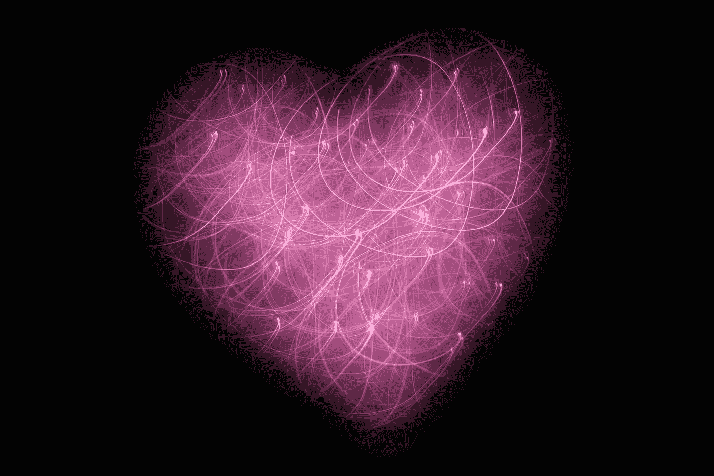

# 打开你的心灯！

> 原文：<https://medium.datadriveninvestor.com/turn-on-your-heartlight-8f2f36ed481d?source=collection_archive---------9----------------------->

Photo by Jude Beck on Unplash

我从劳拉·伯曼博士的书《量子之爱》中学到的最令人惊讶的事情之一是，心脏是一致性的中心。其实我们的身体有**两个**震中。

**一个我已经知道的；大脑——我本以为它操纵了整场演出！**

事实证明，心脏本身就是一个能量发电站，并通过双向对话与大脑交流。研究发现，我们的心和大脑之间的对话通过 4 种机制进行；

**我们的神经系统** **(神经通讯)**

**我们的荷尔蒙(生化交流)**

**我们的脉搏波(生物物理通讯)**

**我们的** **电磁场(高能通讯)**

**电磁场？？？？这听起来可能很疯狂，但是…**

研究表明，我们的心脏周围有一个强大的电磁场，其振幅是大脑产生的电活动的 60 倍，T21 的 5000 倍。事实上，心脏的能量如此强大，以至于几英尺外就能探测到。想想那种力量对你的身体、你的思想和你的能量频率意味着什么。

换句话说，大脑的活动会因为与心脏的连接而改变。身心连接是双向的。

研究还表明，我们强大的心脏能量可以影响他人的大脑！在一项研究中，他们将一个人连接到脑电图(EEG ),另一个人连接到心电图(ECG ),以观察一个人的心脏是否可以与另一个人的大脑对话。他们发现答案是肯定的！事实上，佩戴脑电图仪的人的脑电波与另一个人的心脏同步。

 [## 良好的生活是习惯的形成|数据驱动的投资者

### 过度思考是过度紧张。仅仅几个简单的习惯就会在一天中产生巨大的影响。那是…

www.datadriveninvestor.com](https://www.datadriveninvestor.com/2020/01/17/a-good-life-is-habit-forming/) 

这意味着，通过将你的心移入开放状态，你实际上可以在身体上影响另一个人。当你的能量上升时，他们的能量会吸引你。

这让我以一种全新的方式思考爱情。

“量子爱”就是利用你身体的能量来创造你渴望体验的关系和联系。你有能力改变一切。就现在。

打开你的心灯…让它在你所到之处闪耀。

让它发出快乐的光芒…让全世界都看到。

**访问专家视图—** [**订阅 DDI 英特尔**](https://datadriveninvestor.com/ddi-intel)