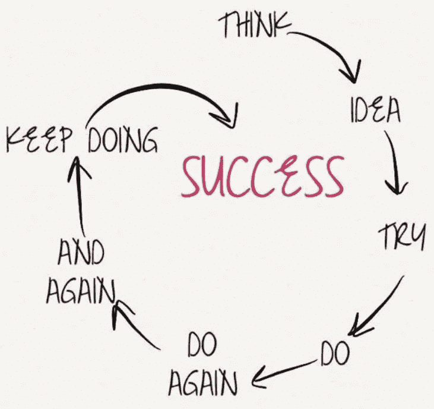

# 将激情转化为利润

> 原文：<https://medium.datadriveninvestor.com/turn-passions-into-profits-14c17dcd186e?source=collection_archive---------4----------------------->

## 你最喜欢的活动可以是成功的在线业务

你如何给你喜欢的东西定价？如果你想谋生，不想挨饿，你自己想办法。

企业家兼教练 [Carolina Millan](https://twitter.com/CarolinaMillan/) 在她的书[“网上盈利的 7 个步骤”中，对那些想将自己的激情转化为金钱的人提出了一些建议](https://personalbrandingsecrets.me/ebook)

米兰和千禧一代专家切尔西·克罗斯特(Chelsea Krost)在 Krost 的#MillennialTalk Twitter 聊天中深入探讨了如何将你的热情转化为在线业务。切尔西·克罗斯特是顶级的营销和品牌代言人、演讲者、顾问和 LinkedIn 讲师。

 [## 窃取将你的品牌货币化的秘密

### 通过利用您所知道的知识，让您的业务面向未来

blog.markgrowth.com](https://blog.markgrowth.com/steal-the-secrets-to-monetizing-your-brand-449d3b0509c8) 

那些想赚钱的人应该有一个愿景和实现目标的计划。这应该会让他们看到自己感兴趣的东西是否有市场。

Krost 建议采取以下初步措施:

*   定义激情。
*   进行市场调查和竞争分析。
*   定义这是对您当前品牌、业务的分层提供，还是单独的侧面宣传。
*   谁是你的利基受众或客户，他们在哪里在线？
*   创造产品，无论是产品还是服务。

“每个人都有独特的品质和技能，可以用来脱颖而出，”克罗斯特说。“你不能是别人。你独特的品质是你应该强调和依靠的。真实性是*关键*。

“如果你不能处理和解决人们的痛点，你就不会非常成功地将他们转化为顾客或客户，”她说。

不复杂的是，米兰建议牢记“三”。

“找出是什么让你从竞争对手中脱颖而出，”她说。“让你与众不同的三件事是什么？你的三大技能是什么？

“然后确定谁是你的理想客户，”米兰说。“谁会从你所知道的事情中受益？你最想和谁一起工作？”

# **问题和痛点**

充分了解需求以及如何满足需求。

“找出你理想客户的三大问题或痛点，”米兰说。“然后，您可以将它们与您的解决方案联系起来。

“你越真实越好，”她说。"加入已经在你的理想客户心中发生的对话."

Millan 有三个基于激情的在线创业策略:

*   制作内容，将你定位为一个有价值的代理人，一个愿意为他人服务的人。帮助人们，最好是通过视频内容。然后在你的理想客户最有可能在的平台上分享它。
*   创造一些有价值的东西，你可以免费给人们，以换取他们的名字和电子邮件地址。这可能是一本电子书，网络课程或视频系列。开始建立你的电子邮件列表，这样你就可以把人们带进你自己的生态系统。
*   想想你的潜在客户在得到你的免费报价后，为达到他们想要的结果需要遵循的下一个逻辑步骤，这可能是你的第一个付费产品或服务。

 [## 用有吸引力的销售线索吸引人们来你的企业

### 有价值的赠品是良好营销活动的关键部分

blog.markgrowth.com](https://blog.markgrowth.com/lead-magnets-attractive-ways-to-get-your-foot-in-the-door-2005d8be6f96) 

“然后是付费的方式，”米兰说。"[用一段视频和一份申请表建立一个漏斗](https://blog.markgrowth.com/businesses-live-or-die-through-outreach-f2e646c0e7af?source=friends_link&sk=0312357bae1fc777cf0dc011ac5dffa9),这样人们就可以填写表格与你交谈。让他们举手。向你的理想客户发送付费流量。”

寻找理想的客户需要研究。

“了解你的利基受众在网上，将有助于你缩小你的数字营销推广应该在哪里，”克罗斯特说。“挖掘你的观众在网上分享这种激情的地方，并在那里。

“当谈到建立在线业务时，你必须首先考虑内容，”她说。“内容将连接、教育、激励客户，并将在线线索转化为客户。”

当开始网上业务时，Krost 倾向于采取主动。

“与正确的受众联系并参与进来，”她说。“用与您的服务或产品相关的内容进行教育、娱乐和激励。

“利用内容来分享成功故事，或者你的产品或服务是如何满足目标客户需求的，”克罗斯特说。耐心*无疑*是关键。人们看到别人赚钱，认为是一夜之间发生的。"

# **早期过载**

创业者新手倾向于承担太多，而不是从同龄人或那些能帮助他们避免重复本可避免的错误的人那里寻求帮助。

“他们最大的错误是期望在没有品牌、内容创作或数字广告的前期投资的情况下增加观众和产生销售，”Krost 说。

“不要纠结于小细节，”她说。“以大局为重。最终，一个新的追随者在浏览你的频道或网站时，应该理解*谁、什么、哪里、何时、为什么*和*如何*。

Krost 强调了几件不要做的事情:

*   为不存在的问题提供解决方案。
*   而不是来自目标市场的众包反馈。
*   驳回负面反馈，认为你有所有的答案。
*   忘记考虑所有的法律问题:商标、员工和买家协议、保密协议等等。

不管激情如何，成功的企业不会神奇地出现。

“新手认为，‘如果你建造了它，他们就会来’，但这不是真的，”米兰说。“你必须通过免费增值、投资流量、建立你的社交受众群以及真诚地关心他们来吸引人们。

“新企业家放弃得太快了，”她说。“在一个活动、一个视频、一个漏斗之后，如果他们看不到结果，他们通常会停止，而没有意识到这需要工作、资源、时间和耐心。”

成功需要从一开始就有远见。

“人们经常在不清楚为什么要这样做的情况下开始上网，”米兰说。“他们倾向于将网上业务作为一种爱好。更糟糕的是，他们参与商业机会只是为了赚钱，而没有投入任何激情或努力。”

 [## 摆姿势并不流行

### 冒名顶替综合症随时可能出现，削弱自信

medium.datadriveninvestor.com](/striking-a-pose-is-not-in-vogue-7b09379e3f9b) 

除了面对他人的质疑，新企业家还必须克服自己的限制性信念。许多人患有冒名顶替综合症。如果创业者认为自己不够优秀，无法取得成功，他们就会在创业前止步不前。

克罗斯特说:“最大的限制信念是，为了发射，一切都需要 T2 完美。“如果你太注重完美，你将永远无法开始。每个人都要从某个地方开始。

“永远没有完美的时机，”她说。“一旦你开始创业，这一点会变得更加明显。在某些时候，你只需要*开始*

# **每个人的空间**

这是对自信的一种奖励。

“你必须欣赏自己，重视自己的生活经历，”米兰说。“仅仅因为有其他人在做你想做的事情，并不意味着没有你的空间，或者你没有什么有价值的东西可以提供。

“你不必成为某个领域的终极专家，”她说。“只要比那些刚刚起步的人领先几步，你就可以和他们分享你的知识和经验。”

 [## 开始在网上做生意不是为了胆怯

### 在迈出这一步之前，要知道你将面临什么

medium.datadriveninvestor.com](/startcustoing-business-online-not-for-faint-of-heart-6367e4e6bc4d) 

这个过程不涉及彻底的改变。

“你不必为了开始网上生意而辞职或停止一切，”米兰说。“确保你挤出时间——减少休闲活动——这样你就可以把这些时间花在你的业余活动上。一旦你看到第一个结果，就要全神贯注。

“不要拿自己和别人比较。从来没有，”她说。"只关注自己，目标是每天进步 1% . "

米兰为在线企业推荐了几种模式:

*   开始你自己的在线咨询业务。帮助人们改善他们生活中的结果，或者在你有热情和技能的特定领域。
*   创建一个信息产品或在线会员课程。每次和一群人分享你的知识和经验。这有助于您通过一对多模型获得优势。
*   围绕你感兴趣的领域开一家电子商务商店。你越细分越好，因为电子商务竞争可能非常激烈。

“永远要瞄准这些商业模式中的任何一种，”米兰说。

Krost 也有她最喜欢的商业模式，强调选择最适合企业产品和客户的模式:

*   卖一个实体产品:电商驱动。
*   销售在线或虚拟服务:一对一辅导、咨询和体验。
*   销售数字信息产品，如电子书、虚拟课程或培训。

# **寻找观众常去的地方**

将品牌货币化的最佳社交媒体平台是受众所在的平台。相比 Instagram，这项业务可能对脸书客户更有吸引力，反之亦然。去找客户，而不是期望他们蜂拥到公司。

“没错，”米兰说。“如果你找到了你的理想客户，你就会知道他们最常去哪里。这应该是你的主要关注点。

“根据我的经验，Instagram、YouTube 和 Twitter 效果最好，”她说。“确保你没有忽视 YouTube。它的美妙之处在于，你的内容会在未来数年内继续存在，因为它是一个搜索引擎。”

也有不太有名但值得考虑的网站。

“像 [Izea](https://izea.com/) 或 [Intellifluence](https://intellifluence.com/) 这样的平台可以让你注册并申请有影响力的交易或联系品牌——即使追随者较少，”米兰说。

“当然，确保你在这些平台上发布的每一条内容中都加入行动号召，”她说。“确保人们继续与你接触，并从你那里获得价值。”

 [## 参与建立受众和利润

### 重要的是追随者的质量，而不是数量

blog.markgrowth.com](https://blog.markgrowth.com/engagement-builds-audience-and-profit-3849952ddbaf) 

克罗斯特强调了坚持目标的重要性。

“了解你的利基受众在网上的位置将有助于你在社交媒体上定位，”她说。“研究不同社交媒体渠道用户行为的人口统计数据和兴趣，从中寻找灵感。”

脸书在广告业有着巨大的影响力和声誉，这让企业家们怀疑他们是否可以不在脸书做广告。

“是的，你可以，”米兰说。“在没有付费流量的情况下，可能需要更长的时间来建立受众，但多年来我已经知道，你需要有机和付费流量的健康结合。

“如果你只依赖有机内容，在你看到结果之前，将会花费更多的时间和精力在所有的平台上发布内容，”她说。“如果你从零开始，尤其如此。所以，先挑一两个 max 开始吧。”

# **找到平衡**

虽然很诱人，但米兰建议不要全押在广告上。

“如果你只依赖付费——如果你的流量来源、活动甚至预算出现问题——一旦流量停止，销售也就停止了，”她说。"开始构建你的有机资源，并平衡两者."

 [## 获得你的 2 美分价值:预算营销

### 以很少甚至免费的方式宣传你的业务

blog.markgrowth.com](https://blog.markgrowth.com/get-your-2-cents-worth-marketing-on-a-budget-801786370414) 

因此，何时涉足付费领域没有基准。

“你第一天就可以做到，”米兰说。“没什么要求。只要确保你得到了专家的帮助。当你不知道自己在做什么或者你的漏斗没有转换时，很容易在付费流量上浪费金钱。”

除了传统的广告，如社交媒体广告或谷歌广告，还有其他方式来真正的网上销售。

Krost 更喜欢与来自以下来源的温暖线索联系:

*   [推特聊天](https://blog.markgrowth.com/chats-break-through-brick-and-mortar-walls-324c7c9d8f9c?source=friends_link&sk=54881197f13db3a8a33e5d74a5b8789a)
*   [直播](http://www.datadriveninvestor.com/2019/07/17/live-streaming-inspires-human-moments/)
*   播客
*   思想领导力文章
*   参与行业或目标在线团体或论坛
*   免费网络研讨会

米兰说:“我喜欢各种形式的视频营销。“你可以在 YouTube 上上传一个每周一次的节目，在那里你可以增加价值、分享故事和出价。你还可以利用脸书和 Instagram 等平台上的直播。

“坚持下去，相信自己，”她说。“你的内容自然会随着你的进展而得到润色。你不需要任何花哨的设备——只需要你的手机。”

# **沉默对待**

蟋蟀的声音对于新人来说并不少见。

“一开始，也许没有人会观看或出现，”米兰说。“不要让它打击你。当我在 2012 年举办第一次网络研讨会时，*没有人来。我一直在练习。继续下去，你会看到如何开始建立你的观众。*

她说:“当你提出一个提议时，尽可能自然地去做。”“没必要这么热情。简单地增加价值，向人们展示你知道你的手艺，并提供与你合作的机会。不要一开始就。嘿，买我的东西吧。你不会向一个陌生人求婚。"

 [## 树立震撼你的世界的意识

### 人们不会买你卖的东西，除非他们知道你是谁

medium.datadriveninvestor.com](/build-awareness-to-rock-your-world-6d5c4615e1ac) 

回顾过去，两位企业家都对刚刚起步的年轻自己提出了建议。

“倾听市场的需求，”克罗斯特说。“跟着你的直觉走。不要想太多细节。做的开心点。不要让对失败的恐惧阻止你去尝试。”

这导致了自信。

“分享内容不要感到尴尬，”米兰说。“如果你的信息有价值并能引起人们的共鸣，人们不会在意你的长相或声音。外面有人等着你去激励他们。

“在付费流量上投入更多，”她说。"不要因为费用而害怕冒险。"

最重要的是，单干的企业家不需要单干。

米兰说:“投资导师。“找到那些在你想去的地方的人。他们可以帮助你降低学习曲线，节省时间和金钱，让你在过去的尝试和错误中受益。”

**关于作者**

吉姆·卡扎曼是[拉戈金融服务公司](http://largofinancialservices.com/)的经理，曾在空军和联邦政府的公共事务部门工作。你可以在[推特](https://twitter.com/JKatzaman)、[脸书](https://www.facebook.com/jim.katzaman)和 [LinkedIn](https://www.linkedin.com/in/jim-katzaman-33641b21/) 上和他联系。