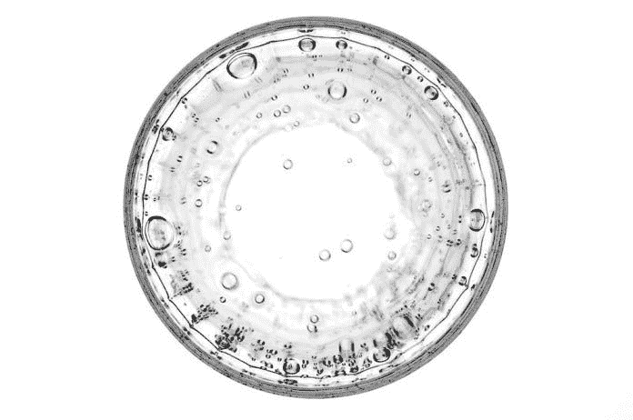
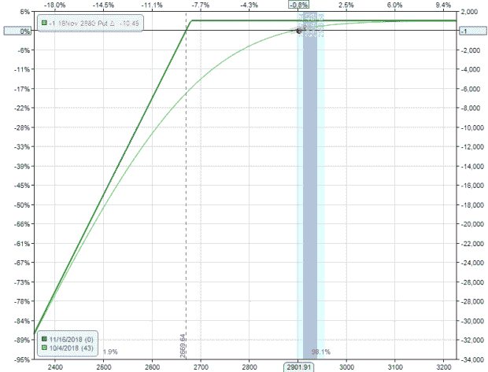
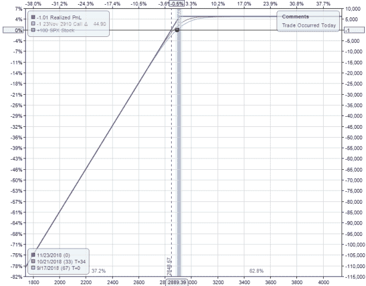
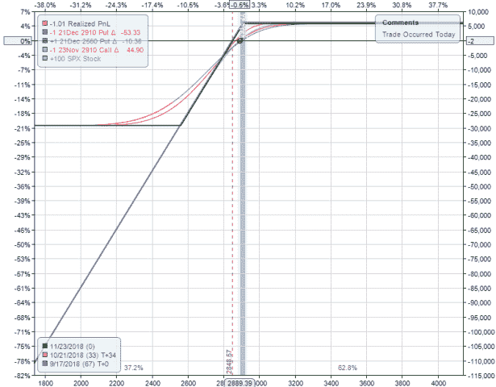
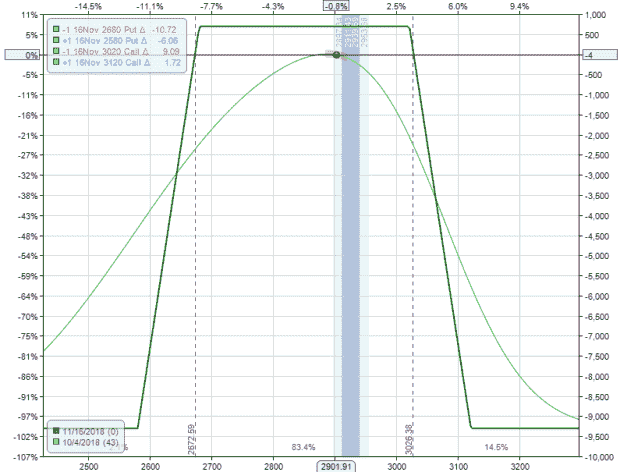
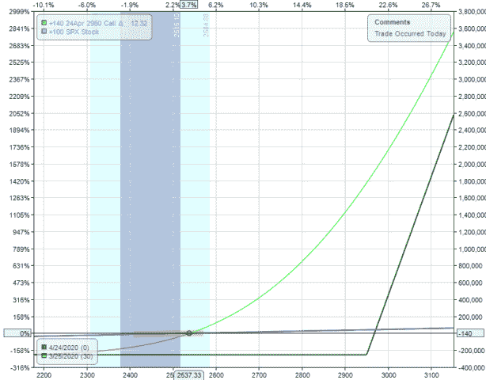

# 将美元变成一角硬币:久经考验的亏损期权策略

> 原文：<https://medium.datadriveninvestor.com/turning-dollars-into-dimes-time-tested-options-strategies-for-losing-money-1781a576fe08?source=collection_archive---------12----------------------->

创造伟大的期权策略是一个反复试验的过程。这篇文章就是关于这些错误的。

# 糟糕的策略# 1——出售裸期权:鲁莽的顶峰。

这张图表显示，如果市场上涨，交易会赚一点钱。如果下跌，交易会损失很多钱。

卖出无担保看跌期权或看涨期权(或者对你们这些喜欢幻想的人来说是尾部风险)从来没有好结果。拥有有限的上升空间和无限的风险是好交易的对立面。

这里有一份专业交易者的名单，他们用这种方法累计损失了近 30 亿美元。

Optionsellers.com 损失了 1.5 亿美元

[LJM 基金管理公司](https://www.reuters.com/article/us-usa-fund-volatility/exclusive-ljm-partners-shutting-its-doors-after-vol-mageddon-losses-in-u-s-stocks-idUSKCN1GC29H)——损失 4.4 亿美元

[Catalyst Financial](https://www.sec.gov/litigation/admin/2020/ia-5436.pdf)——亏损 7 亿美元

Malachite Capital Management —损失了 16 亿美元(注:这是最近发生的事情，损失的整体程度相对未知。)

# 糟糕的策略# 2——隐蔽的电话:引诱退休人员进入 1975 年以来的糟糕交易。

备兑看涨期权是指投资者持有股票，并卖出该股票的看涨期权。

注意这和裸期权有什么相似之处吗？还是那句话，无限亏损有限上涨。

当股票横盘或下跌时，投资者将这一策略作为创收手段。这可能有利可图，但这是一种极其低效的资本利用。回报太少，风险太大。

同样的风险敞口可以通过利用风险资本减少 90%的垂直市场来实现。

# 糟糕的策略# 3——铁鹰:骑着公牛在头上平衡手榴弹。

铁鹰出售有限风险的深 OTM 期权溢价。

有几个原因可以避免这种方法。首先，它冒的风险比它能获得的要多。第二，这种交易会在实现小利润的过程中招致大的损失，如绿色曲线所示。

铁鹰是超级交易员凯伦的谋生策略，直到她损失了 5000 多万美元。

超级掠夺者凯伦是钢铁秃鹰的一个极端例子。这在一定程度上是由于高额的内部交易损失导致了她挥霍无度的公开爆发。

# 糟糕的策略# 4——利用多头期权:致富之路(和穷人之家)

简单地说，不要把你所有的钱都用来购买 OTM 期权。

绿线显示买入电话。蓝线表示买入股票。

两笔交易的金额相等。

这个策略如果成功的话，可以大赚一笔。如果没有也可以一眨眼就炸了。

避免所有这些策略不会让你变得富有，但会让你不变得贫穷。交易最重要的部分是永远不要爆炸。确保不管发生什么，第二天都可以回来交易。

*原载于 2020 年 4 月 24 日 https://www.datadriveninvestor.com***。**