# 推特航空情绪分析

> 原文：<https://medium.datadriveninvestor.com/twitter-airline-sentiment-analysis-3b147b565027?source=collection_archive---------1----------------------->

## 文本挖掘从描述性分析到预测性分析

Image Source: [Dailymail](https://www.dailymail.co.uk/travel/travel_news/article-3046994/A-bird-s-eye-view-Pilots-reveal-world-s-beautiful-cities-sit-best-vantage-point.html)

根据[世界航空运输统计 2019](https://www.iata.org/contentassets/a686ff624550453e8bf0c9b3f7f0ab26/wats-2019-mediakit.pdf) ，旅客需求呈现强劲增长。与 2017 年相比，2018 年全行业收入客运公里数增长 7.4%。2018 年，中国增加了最多的乘客旅程，美国本土仍然是世界上最大的单一 O-D 乘客市场。为了提高收入和利润，大多数航空公司都推出了有吸引力的套餐和高质量的服务。大多数决策都基于大数据分析的基础。对从各种社交媒体平台收集的数据进行情感分析的技能对于数据科学家来说是必不可少的，尤其是那些打算在这些航空公司工作的数据科学家。这个故事演示了分析旅行者如何在 Twitter 上表达他们的感受的分步指南。描述性分析包含在第一部分，预测性分析包含在第二部分。

# 先决条件

这个故事中使用的名为“Twitter 美国航空公司情绪”的数据集可以从 [Kaggle](https://www.kaggle.com/crowdflower/twitter-airline-sentiment) 下载。

# 描述性分析

利用数据集中提供的数据，可以绘制一些图表来帮助进行描述性分析。

## 图表 1:情绪的数量与类型

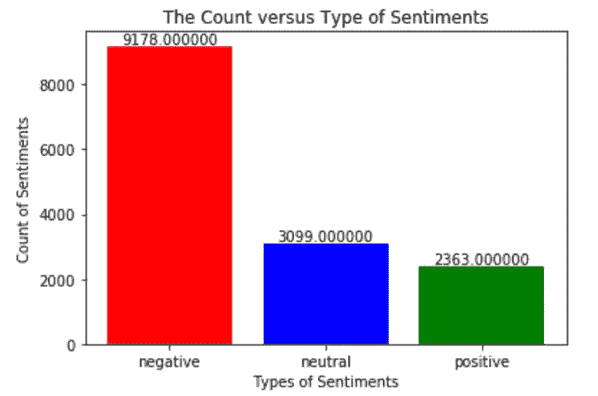

Figure: The count versus type of sentiments.

数据集是不平衡的，因为它的负面情绪多于正面和中性情绪。负面情绪的数量分别是中性和正面情绪数量的 2.96 倍和 3.88 倍左右。然而，普遍的情况是[人们对负面事件的记忆比正面事件多](https://www.nytimes.com/2012/03/24/your-money/why-people-remember-negative-events-more-than-positive-ones.html)。

## 图表 2:按喜好类型分组的对航空公司的喜好计数

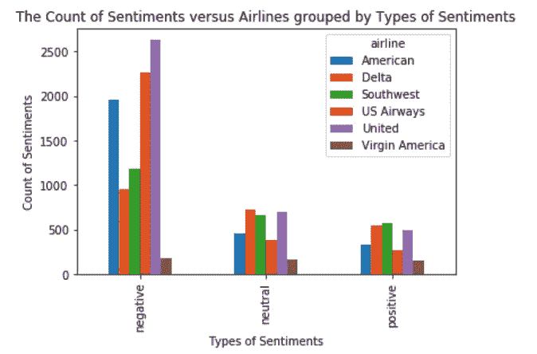

Figure: The count of sentiments versus airlines grouped by type of sentiments.

从负面情绪的数量来看，美国联合航空公司排名第一，其次是美国航空公司和美国航空公司。对维珍美国航空公司持负面、中立和正面看法的人数几乎相同。总的来说，对大多数航空公司来说，负面情绪的数量是负面、中性和正面情绪数量中最多的。

## **图表 3:所有负面原因的情绪分布**

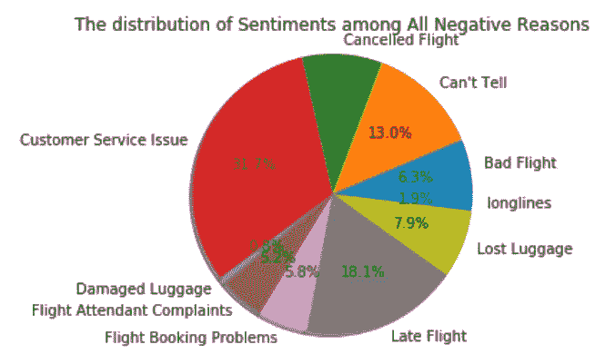

Figure: The distributions of sentiments among all the negative reasons.

大多数乘客(31.7%)给出负面评价，因为他们不满意各航空公司提供的客户服务质量。18.1%的乘客对航班延误有不好的体验，13.0%的乘客不喜欢航空公司提供的服务，但没有提供充分的理由。行李损坏问题最少，只占整个饼状图的 0.8%。

## 图 4:按航空公司分组的情绪分布与负面原因

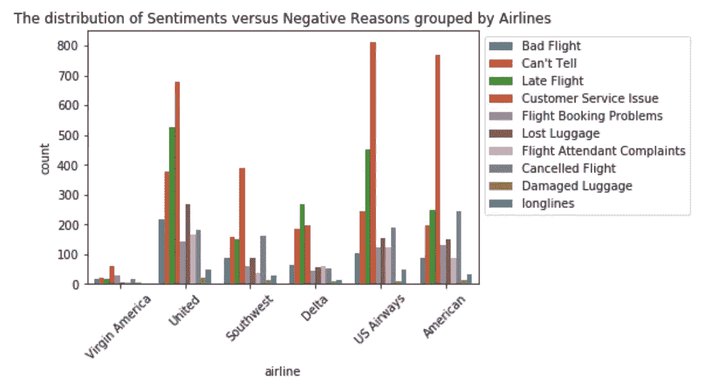

Figure: The distribution of sentiments versus negative reasons grouped by airlines.

除了达美航空公司，客户服务问题一直是大多数航空公司的头等大事。建议达美航空先处理航班延误问题，再解决其他问题。

## 图表 5:按日期分组的负面情绪与航空公司的对比

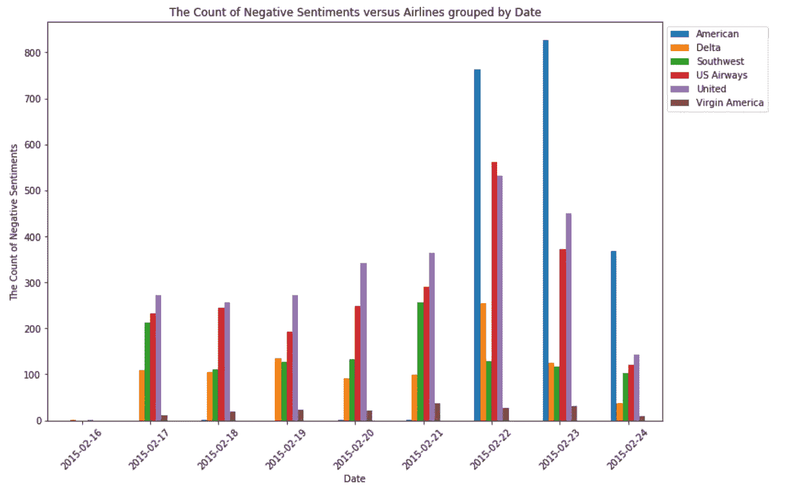

Figure: The count of negative sentiments versus airlines grouped by date

从 2015 年 2 月 17 日至 2 月 21 日，美国联合航空公司在负面情绪数量方面排名第一。自 2015 年 2 月 22 日起，美国航空公司的负面情绪数量领先。在截至 2015 年 2 月 24 日的过去 3 天中，对达美航空的负面评价数量缓慢下降。

# 预测分析

利用情感上提供的标签，可以通过建立模型来预测情感的类型来进行预测分析，情感的类型可以是“积极的”、“中性的”或“消极的”。总流程包括:

## 预处理

选择一些必需的列，并执行一些常见的文本处理算法，以:

*   删除空评论。
*   将所有评论转换成小写。
*   删除数字、推特账号名称、网站网址、特殊字符和空格。

## 要使用哪个文本规格化器？

数据集使用不同的词条分类器进行处理，词干分析器在 TF-IDF 矢量器的帮助下使用随机森林进行建模。

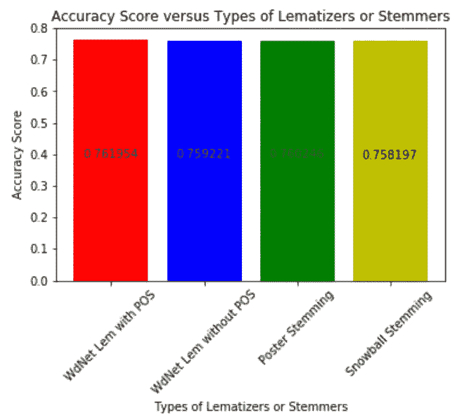

Figure: The accuracy scores of the Random Forest trained by dataset processed using different lemmatizers and stemmers.

由使用波特斯特梅尔处理的数据集训练的模型与使用具有 POS 标签的 WordNet Lemmatizer、没有 POS 标签的 WordNet Lemmatizer 和雪球斯特梅尔处理的数据集相比具有最高的准确度。在后面的过程中，波特·斯特梅尔被选为文本规格化器。

 [## 数据科学和软件工程哪个更有前途？数据驱动的投资者

### 大约一个月前，当我坐在咖啡馆里为一个客户开发网站时，我发现了这个女人…

www.datadriveninvestor.com](https://www.datadriveninvestor.com/2019/01/23/which-is-more-promising-data-science-or-software-engineering/) 

## 我应该扩充和上采样数据集吗？

尝试对小类中的文本进行扩充和上采样，以解决不平衡数据集的问题。

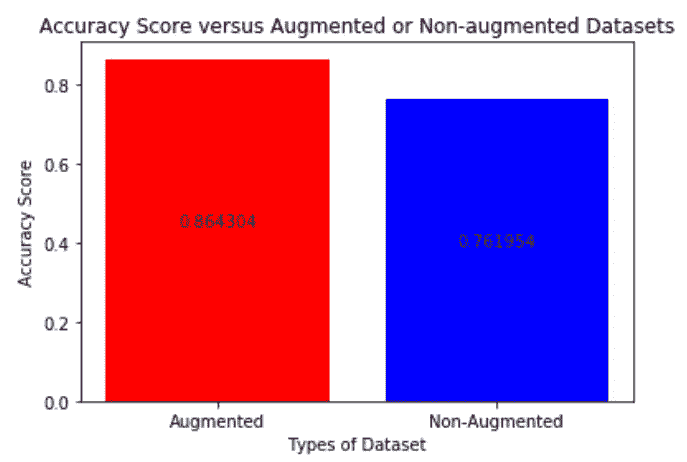

Figure: The accuracy scores of the Random Forest trained by augmented and non-augmented datasets.

结果表明，扩充后的数据集有助于显著提高模型精度。在后面的过程中，增广数据集被选择用于建模的输入。

## 该不该用深度学习算法？

该项目没有使用随机森林等机器学习算法，而是尝试了简单的深度学习算法，包括自行设计的简单神经网络(一个嵌入层+一个密集层)、自行设计的递归神经网络(RNN)和自行设计的卷积神经网络(CNN)。

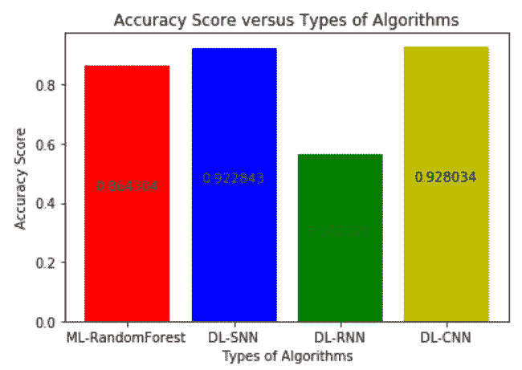

Figure: The accuracy scores of the models trained by different algorithms using augmented dataset.

卷积神经网络的准确度最高，其次是简单神经网络、随机森林，最后是递归神经网络。

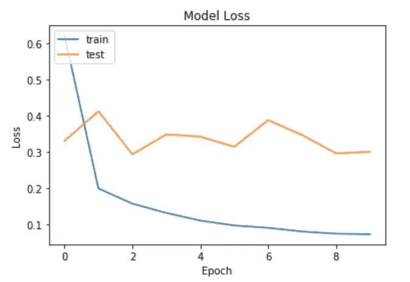

Figure: The graph of training and test loss for CNN.

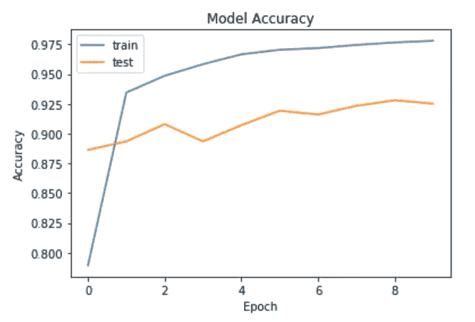

Figure: The graph of training and test accuracy for CNN.

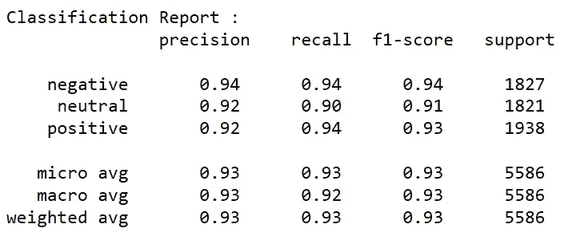

Figure: The classification report of the model trained by using CNN.

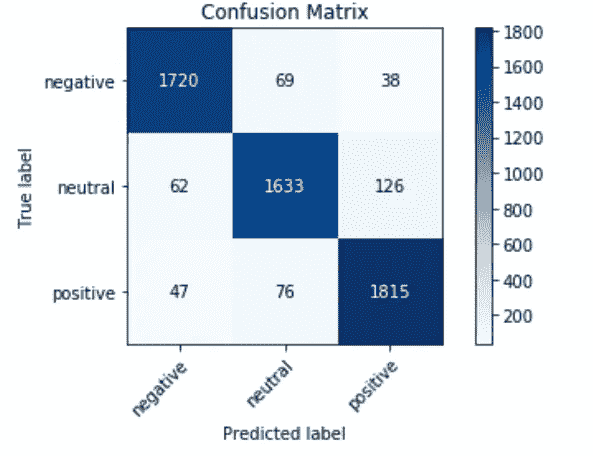

Figure: The confusion matrix of the model trained by using CNN.

# 额外:单词云

在负面情绪的词云中可以直接发现的有意义的词是“延误”和“取消航班”。

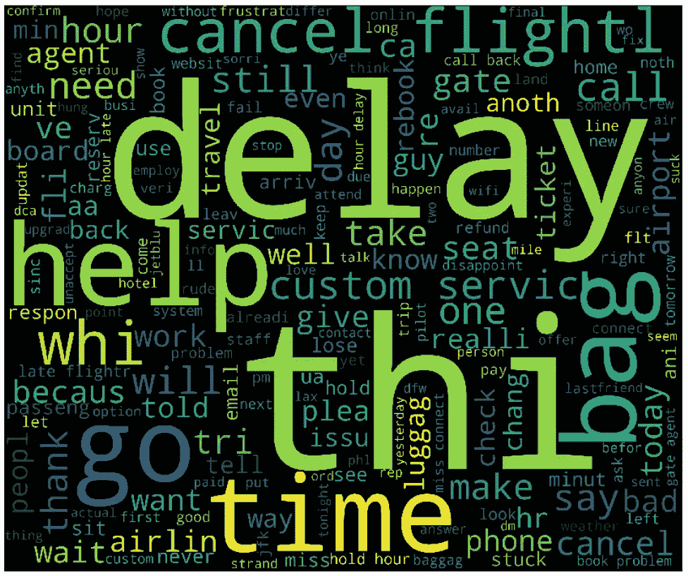

Figure: The negative sentiments’ word cloud.

另一方面，在积极情绪的词云中可以直接发现的有意义的词包括“谢谢”、“最好”、“太棒了”和“太棒了”。

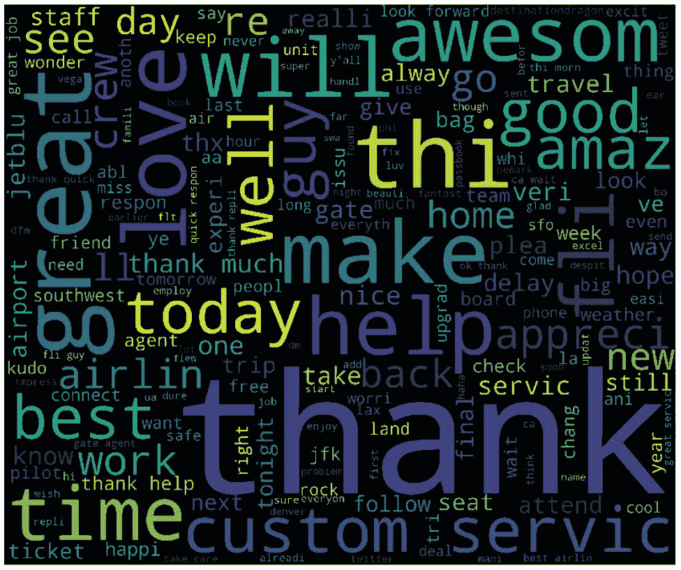

Figure: The positive sentiments’ word cloud.

总的来说，似乎两个词云同时显示了许多无意义的词，如“thi”、“help”、“time”、“today”、“will”等。**目前的停用词过滤器设计得并不太好**。

此外，一些单词的拼写不正确，例如“thi”(原始单词应该是“this”)和“amaz”(原始单词应该是“amaze”)，因为**Porter Stemming 的输出被馈送到单词云**中，以便在该项目中进行可视化。

# 可用代码

如果无法直接读取 html 文件，请下载并打开它。

 [## 情操 _ 分析. html

### 编辑描述

drive.google.com](https://drive.google.com/file/d/1HXhC1e3PFb19J4hr0hFEODazxasHxw_l/view?usp=sharing) 

# 确认

这个项目是由 Tan Pei Seng 和 Koay Yee Shean 为 CDS 522 文本和语音分析提供的，这是马来西亚 Sains 大学数据科学和分析硕士的选修科目之一。

# 参考

1.  **推特美国航空公司情绪**:[https://www . ka ggle . com/crowd flower/Twitter-Airline-sensation/kernels](https://www.kaggle.com/crowdflower/twitter-airline-sentiment/kernels)
2.  **世界航空运输统计 2019**:[https://www . IATA . org/content assets/a 686 ff 624550453 e 8 BF 0 c 9 B3 f 7 f 0 ab 26/wats-2019-media kit . pdf](https://www.iata.org/contentassets/a686ff624550453e8bf0c9b3f7f0ab26/wats-2019-mediakit.pdf)
3.  **赞美稍纵即逝，但我们记得的诋毁**:[https://www . nytimes . com/2012/03/24/your-money/why-people-remember-negative-events-more-positive-ones . html](https://www.nytimes.com/2012/03/24/your-money/why-people-remember-negative-events-more-than-positive-ones.html)