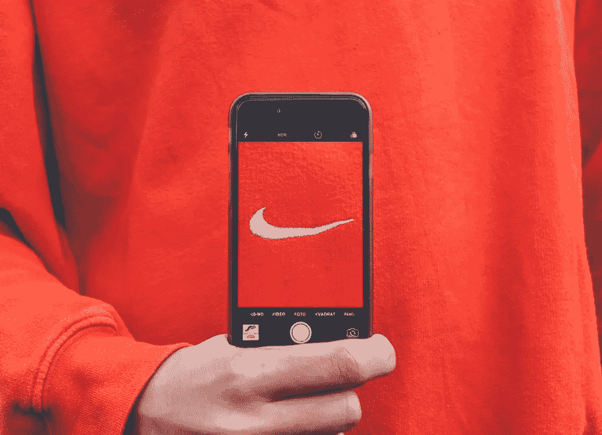

# 发展个人品牌的最佳平台是什么——LinkedIn 还是 Twitter？

> 原文：<https://medium.datadriveninvestor.com/twitter-or-linkedin-which-is-best-for-growing-your-personal-brand-1ffcb6ded2d2?source=collection_archive---------3----------------------->

[https://unsplash.com/@kristianegelund](https://unsplash.com/@kristianegelund)

不可否认，社交媒体对于发展你的个人品牌非常有效。但是，对于这些平台中的哪一个最值得关注，以建立你的个人品牌，一直存在争议。

它们都提供了很多机会来更好地了解你的品牌，但决定使用哪一个可能有点混乱。我认为这完全取决于你想得到的潜在客户的类型。Twitter 上的人们搜索主题和推文，而 LinkedIn 上的人们根据他们的需求搜索行业和相关人员。它们都有好处，并为品牌提供大量的机会；由你来决定什么最适合你。

# Twitter 需要什么

与 LinkedIn 相比，Twitter 不够专业。所以，你可以自由地分享你女儿或宠物的照片或类似的东西。Twitter 允许你与你的追随者分享你的亲密。

与 LinkedIn 相比，twitter 上的人们注意力持续时间较短，但一个解决办法是在你的帖子上创建主题或添加链接。我见过许多人使用线程来教学，最后，他们发出行动的号召。不过，长格式的内容在 twitter 上不会像在 LinkedIn 上那样好用。

Twitter 是一个与你的受众建立信任和关系的绝佳平台。因为这才是真正让人们想与你的产品或服务联系在一起的原因。这有助于他们通过你发布的内容了解你的立场。客户可能会看到你的内容，并根据你的主张联系你。如果您的服务符合他们的需求，这通常会发生。

总之，twitter 是一个很好的平台，让人们在更亲密的层面上了解你，更快地联系到你。

# LinkedIn 需要什么

LinkedIn 对我的职业生涯帮助很大。这是你必须专业的地方。了解平台可以让你决定内容的方向。虽然你可以在 Twitter 上谈论与职业无关的个人生活，但这和 LinkedIn 不一样。你的职业应该是你的重点。

在 LinkedIn 上，我制作的内容基于我所做的事情——写作。我不能去那里谈论足球或者我的爱好，因为那不是观众想要的。这有点太正式了，对你的观众来说可能是个不利因素，不了解你的个人情况，但这就是重点。这是专业人士的平台。你就是。

有句话说得好，“在 LinkedIn 上，你是一个商务人士，但在 Twitter 上，你是一个做生意的人。”这就解决了整个争论。在 Twitter 上，你的观众首先会知道你是谁，而在 LinkedIn 上，你的观众首先知道你的业务。

LinkedIn 有助于在一个地方展示你的工作经历和技能，这是 Twitter 所不具备的。从 LinkedIn 上找到你的客户可以看到你是否合格，并且比在 twitter 上更快地满足他们的需求。他们只是浏览你的个人资料，然后马上告诉你他们想要什么。

它允许长格式的内容。LinkedIn 有一个发布工具，可以让用户写文章——有点像博客。这些文章是给你写专业知识的。把它看作是一个推销自己的机会，向你的潜在读者展示你是专业的。

LinkedIn 在活跃人数和缺乏个人关系方面有其弱点。

# 你如何从每个平台中获益？

你必须采取积极的步骤在他们两个身上得到你想要的。当然，你知道这些平台是不同的，但两个平台的目的都是为了 ***引起*** 的注意。如果你不积极主动，什么都不会改变。

# 你是如何被注意到的？

## 1.每天创建内容

无论是在 LinkedIn 还是 Twitter 上，你都必须创造内容，不仅仅是普通的内容，而是对你的观众有价值的内容。

在 Twitter 上，试着交替提供关于你的爱好、兴趣等个人内容。*(你不必太个人化)*有点像 80%的个人和 20%的专业。在专业日，你可以谈论你的品牌，给读者一些有帮助的建议。每天保持这种模式，随着时间的推移，会有更多的人想和你互动。

你也可以在 LinkedIn 上混合使用，但是应该 80%是专业的，20%是个人的，因为人们不会像在 twitter 上那样关心你的个人事务。

## 2.增强你的个人资料

无论平台如何，您的个人资料都是至关重要的。它给人们暗示你是谁，你做什么。如果一个潜在的客户搜索文案，我希望我的个人资料出现在他们的搜索引擎结果页面的第一页。

**在领英上，**

获取推荐

获得正确的技能

向您的网站或电子邮件列表添加链接

写一个“关于”的故事，讲述你的公司历程

确保“任何人”都能看到您的个人资料图片

每 6 个月更新一次你的个人资料，因为这可以保持你的关注者的可见性，并提高谷歌排名

不要使用默认的横幅图像

**对于推特，**

使用标签

发布图片、gif 和视频

经常发微博

参与激发你兴趣的人们的推文和标签

通过同步你的联系人来吸引 twitter 以外的关注者

在你的个人资料上谈论你是谁。包括你的位置、生日、当前图片、横幅和行业关键词

# 所有这些都不够，如果

你害怕使用行动号召。不管是什么平台，你都必须努力引导人们采取行动。它可以是注册你的时事通讯或引导他们到你的网站或告诉他们你如何能帮助他们与你的服务。

# 底线？

Linkedin 最适合 B2B 用户，而 Twitter 最适合 T2 B2C 用户。