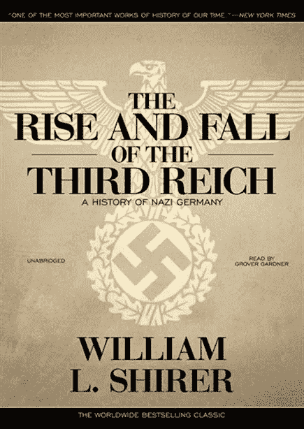
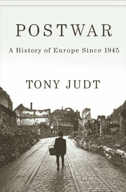

# 有助于理解第二次世界大战的两本书

> 原文：<https://medium.datadriveninvestor.com/two-books-that-will-help-one-understand-the-second-world-war-ddbaaa10cb43?source=collection_archive---------25----------------------->

## 以及由此产生的欧洲结构

[Many Books](https://www.freepressjournal.in/book-reviews/book-review-just-out)

20 世纪是全世界快速发展的时期。这是一个增长和毁灭的时期，是经济大扩张的时期，同时也是经济大收缩的时期。发生的重大事件的数量太多了，以至于无法思考或研究，除非一个人将他们生命中的大量时间用于思考或研究。这并不意味着这些事件和它们的意义不能被理解，除非你为了你自己而研究它们。在隔离期间，有两本书可以阅读或聆听，以了解欧洲是如何首先被希特勒改变的，然后通过由此产生的政治、社会和文化地位。

> ***第三帝国的兴衰:纳粹德国的历史——威廉·L·夏伊勒***

[Book Cover Raise and Fall of The Third Reich](https://www.politics-prose.com/book/9781441734204)

威廉·L·夏伊勒是一名美国记者，在希特勒复活和第二次世界大战爆发期间，他住在柏林。在他的书《第三帝国的兴衰》中，希尔作家讲述了希特勒的一生与同时发生在整个欧洲的事件交织在一起。他描绘了希特勒是如何控制纳粹党的，以及他是如何通过自己的魅力和对党员的残忍利用来建立一支平行的战斗力量，从而获得德国公众越来越多的支持。然后，他从不同的角度带领读者了解第二次世界大战的发展，同时像墙上的苍蝇一样描述战争期间的重大会议和战术决策。该书引用了约瑟夫·戈培尔(德国宣传部长)、弗朗茨·哈尔德(德国陆军最高司令部参谋长)、加莱阿佐·齐亚诺(意大利外交部长)的私人日记、英国外交部的报告以及纽伦堡审判的证词。这本书有 1 200 多页，详细描述了希特勒、纳粹德国、欧洲以及第二次世界大战各战场的生活。它为读者提供了大量的理解纯粹的影响和发生的事件。

> ***战后:1945 年以来的欧洲史——托尼·朱特***

[The Cover of Postwar](https://audiobookstore.com/audiobooks/postwar.aspx)

托尼·朱特是纽约大学欧洲研究的历史学家、作家和教授。从希特勒之死和随之而来的欧洲废墟中，战后复苏了。他详述了从 1945 年到 2005 年的欧洲历史。它讲述了战后欧洲经济、政治和文化发展的历史。托尼·朱特出色地解释了欧洲是如何成为今天这个样子的，有一个共同的货币，一个欧盟，以及东欧是如何在政治和文化上演变的。关注政治、文化和经济，并把它们作为欧洲如何发展的相互交织和相互联系的部分，是理解欧洲今天的关键。

 [## 如何让人们真正倾听你|数据驱动的投资者

### 没有神奇的五步公式。这可能不是你现在想听到的，但相信我，从长远来看，这是…

www.datadriveninvestor.com](https://www.datadriveninvestor.com/2020/03/22/how-to-get-people-to-really-listen-to-you/)