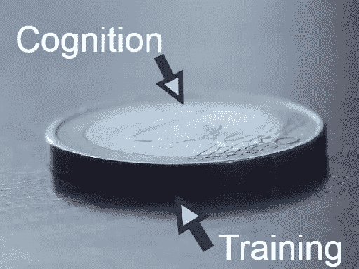

# 人工智能的两大领域

> 原文：<https://medium.datadriveninvestor.com/two-broad-areas-of-artificial-intelligence-84037150bae?source=collection_archive---------9----------------------->

大家好，

今天我将讲述人工智能的两大领域。我敢肯定，如果你知道这两个区域是考虑到我们大脑的两个主要智能能力而构建的，你会非常兴奋。它们是什么？

1.  学习理论并运用这些理论解决问题。(推理解题/认知)
2.  在不知道任何理论的情况下，大脑可以通过大量的例子进行训练，并使解决问题成为可能。(训练能力)

人类在这两方面都很好。例如，当我们通过学习理论和练习 pass 问题来准备考试时。对人的认知与通过符号进行的理论操作有关。这些符号可以是逻辑、规则或一些其他符号形式。有些人不喜欢符号操作，从童年早期就放弃了数学等科目。

有许多需要理论操作的智能任务。

*   医生对疾病的诊断
*   玩游戏
*   使用语法理解语言

让我们看看如何根据我们大脑的能力来划分人工智能的两大领域。

他们是，

1.  机器学习
2.  认知系统

涉及基于理论的问题解决的人工智能领域被称为人工认知系统，涉及来自示例的训练的领域被称为机器学习。这两种能力是相辅相成的。事实上，我们知道理论可以在实践后得到更好的理解。

AI coin

**机器学习**

机器学习是通过大量的例子进行训练，即使不知道背后的任何理论。这是一种自动建立分析模型的数据分析方法。ML 技术需要更多的时间来训练，但需要更少的时间来反应。机器学习解决方案只是解决方案。他们无法解释。

机器学习的例子，

*   虚拟个人助理
*   社交媒体服务
*   垃圾邮件和恶意软件过滤
*   搜索引擎结果提炼
*   在线欺诈检测

**认知系统**

认知系统是关于基于符号的问题解决、推理、思考等。这涉及到理论或对知识的符号化操作。认知系统解决方案是可以解释的。认知系统方法在意外或动态情况下更好。

一些认知特征是，

*   理解
*   学习
*   推论出
*   做决定
*   沟通
*   想

认知系统例子，

*   专家系统
*   自然语言处理系统
*   游戏系统
*   问题解决系统
*   多代理系统

请毫不犹豫地分享你对这篇文章的想法。让我们来看看下一个关于“人工智能的主要领域”的帖子。

再见…！！！

 [## 人工智能和监督资本主义|数据驱动的投资者

### 大科技，总是现在:人工智能推动的大科技，已经使购物，搜索，在你的…

www.datadriveninvestor.com](https://www.datadriveninvestor.com/2020/03/04/on-artificial-intelligence-and-surveillance-capitalism/) 

参考

 [## 来自日常生活的 9 个机器学习例子

### 人工智能(AI)无处不在。可能是你以这样或那样的方式使用它，而你没有…

insights.daffodilsw.com](https://insights.daffodilsw.com/blog/9-machine-learning-examples-from-day-to-day-life)