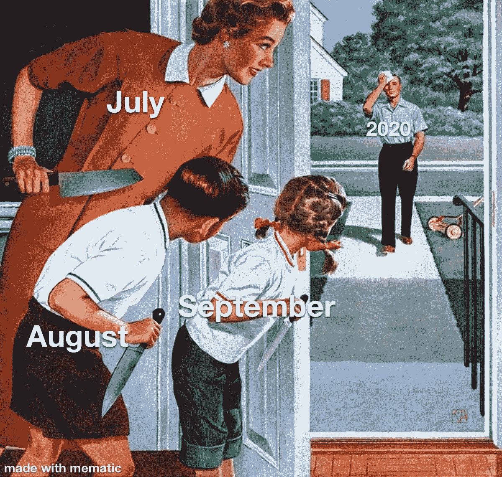
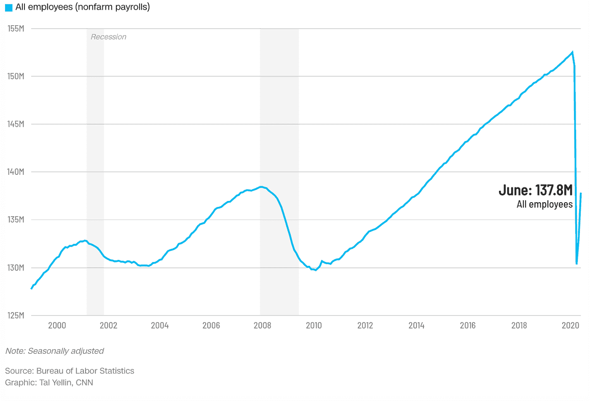
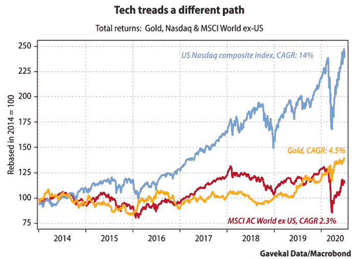
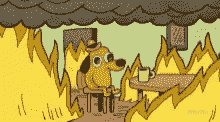

# 抵御即将到来的风暴的两个交易理念

> 原文：<https://medium.datadriveninvestor.com/two-trading-ideas-to-weather-the-coming-storm-alphatrades-ecab765fbf77?source=collection_archive---------8----------------------->

## 随着科技巨头在新高上蹒跚而行，世界屏住了呼吸。

*被困在 Medium 的付费墙后面？* [*注册我们的 Discord 服务器*](https://discord.gg/a97qq2s) *查看#公告免费获取全文:*[*https://discord.gg/a97qq2s*](https://discord.gg/a97qq2s)

# 外卖:

1.  科技领袖和 TSLA 在持续的争议中再创新高。
2.  物流和电动汽车共享一些风头。
3.  美联储可能会支持你，但我们建议有一个后备计划。

*欢迎来到 AlphaTrades 的另一份每周股票综述。如果你是来看周日视频的，请滚动到底部。否则，我们已经为所有深入图表分析添加了相关的时间戳。*

**回顾:**上周，几只领先的科技股位于关键点位，我们预计会出现反弹。我们的水晶球没有说谎(声明，我们没有水晶球，即使我们有，我们也不会告诉任何人)——标准普尔指数本周上涨 4%(时间戳 2:53 )。让我们从我们的图表向导和新闻爱好者社区来看一下这个动作。

**快进** ( [时间戳 1:10:45](https://youtu.be/yxlvC-fuOn0?t=4245) ) **:** 如果 SPX 跌破 3080 点的支撑，这将是一个丑陋的下跌周。我们预计在 2910 年前会有 7%的回落。如果标准普尔 500 指数突破 3185 点，我们将改变基调，在 Workday (WDAY)、Johnson & Johnson (JNJ)、Beyond Meat (BYND)和台积电(TSM)建立多头头寸。由于没有消息，后者周五大幅上涨，本周收盘上涨 3%。即使在科技股回调时，半成份股也将是表现最好的板块之一。看跌方面，我们将寻找一个时机，在 2-3 周的目标到期日买入甲骨文(Oracle)看跌期权。

[【复制我们的 S & P 500 主图，设置警报！】](https://www.tradingview.com/chart/12yl2kNH/)

# 每周节拍

**这是唯一合乎逻辑的:**物流重量级敏捷[预订 1000 辆混合动力电动卡车](https://www.freightwaves.com/news/agility-preorders-1000-hyliion-hybrid-electric-trucks)，而 work horse(WKHS)的库存在批准生产其[电动送货车](https://www.benzinga.com/news/20/06/16363082/workhorse-gets-final-safety-nod-to-begin-electric-van-ramp-up)时猛增。此外，众议院通过了一项基础设施法案，将奖励美国邮政 250 亿美元购买电动汽车。

在路的另一边，美国财政部将向 YRC Worldwide 贷款 7 亿美元，这是一家被认为对国家安全至关重要的卡车运输公司。作为回报，政府获得 29.6%的股权。

# 科技股继续打破鼻血水平

脸书(FB)继续打击它的客户(或者最近的[广告商](https://edition.cnn.com/2020/07/01/tech/facebook-top-advertisers/index.html))，但是我们不能那么容易地摆脱这种有害的关系。在广告客户抵制这家社交媒体巨头的消息传出后的几天里，交易员们很快买入了 dip，价格回升。我们的分析师长期看好脸书，但在这种时候突破历史高点显然是一种兴奋，而不是强烈买入的迹象。

与前几代人相比，千禧一代对有意识投资更加敏感，这将影响像脸书这样的数据挖掘巨兽的长期决策，但他们的广告护城河足以吸收一些负面新闻。由于经济放缓，T2 的总体广告支出预计会减少，尽管这不足以让脸书失去双腿。我们在之前的[简讯](https://medium.com/datadriveninvestor/us-stock-market-weekly-update-alpha-trades-5214dbe5b2ea)中提到，如果脸书跌至 205 美元左右([时间戳 22:40](https://youtu.be/yxlvC-fuOn0?t=1360) )，那么它将是一个潜在的买入对象。或者，买入历史高点的破位也将带来有利的 R:R。

**谁穿短短裤？特斯拉(TSLA)现在是市值领先的汽车制造商。TSLA 预计明年每股收益为 13 美元。然而，空气中有一种奇怪的味道…不，不是那辆燃烧的 Model 3 在州际公路上飞驰，但有一些[不可靠的会计指标](https://www.zerohedge.com/markets/gordon-johnson-warranty-accounting-impropriety-tesla-similar-accounting-wirecard)值得研究(我们忘记 Wirecard 了吗？).此外，TSLA 下降的交付数字可能被其进入新市场所掩盖。这些相互冲突的数据点应该很快就会收敛。**

**害群之马:**苹果(APPL)报告称，5G iPhones 的出货量[下降超过 50%，但股价没有变化。](https://www.zerohedge.com/markets/decline-apple-shipments-5g-iphones-halved-digitimes)

**贝佐斯享受单身生活:**亚马逊(Amazon)创始人、科维德荒原的上帝之王[刚刚度过 1716 亿美元的净资产](https://www.bloomberg.com/news/articles/2020-07-01/bezos-s-wealth-soars-to-171-6-billion-to-top-pre-divorce-record)。如果这家伙如火如荼，我一般会放弃。

**垄断 IRL:** 四大巨头[就反垄断和数字市场缺乏“有力竞争”在国会作证](https://www.cnbc.com/2020/07/01/apple-google-amazon-and-facebook-ceos-to-testify-in-congress.html)。不开玩笑！

所有这些关于科技巨头、反垄断和空头的新闻给我们带来了一个很好的观点，作者是[道格·卡斯](https://realmoney.thestreet.com/investing/let-s-consider-return-of-capital-over-return-on-capital-15364216?):

*   规则 4:零售商大多在趋势顶部买入，在底部买入最少。
*   规则 5:当市场强劲时最安全，当被少数蓝筹股主导时最脆弱。

# 市场什么时候会从轨道上回来？

He’s had such a hard day already.

考虑到四大巨头周围发生的所有负面影响，预计科技股将会回落。尤其是 APPL，未来几周可能会出现 7%至 12%的调整。这对市场的整体情绪和结构会有什么影响？

如果科技股出现回调，那么住房、工业、医疗保健、公用事业和 Corona Advantage 板块将更好地站稳脚跟，并在下半季度加速上涨。

**住房警告:**我们的分析师认为房地产需求受到抑制，但年复一年，消费者越来越不愿意在新房上花钱。该行业预计 2021 年收益将创纪录。我们可以保证德克萨斯州休斯顿的房地产市场非常火爆。家得宝也相对强劲——人们会对升级现有房屋更感兴趣吗？鉴于当前的经济环境，这种趋势当然是有道理的。

**人们正在寻找工作……但有一个警告:**今天早上发布的 NFP(就业)报告显示，美国新增 480 万个就业岗位[这是一个巨大的数字](https://edition.cnn.com/2020/07/02/economy/june-2020-jobs-report-coronavirus/index.html)。目前来看，这是积极的，但交易者仍应保持谨慎。这些信息是在 6 月中旬之前提取的。自那以后，我们看到亚利桑那州、加利福尼亚州、佛罗里达州、德克萨斯州等地报告的 COVID 病例有所增加。病毒的影响是一个滞后指标，但我们也怀疑市场会将另一次封锁定价，因为我们的领导层没有反映出回到那种生活的愿望。因此，我们预计经济反应会比预期的更糟糕，但不会是世界末日的情况。

# 本周洞察

我希望我们还没有失去你，因为我们即将分发*两个*自由贸易想法([时间戳 28:23](https://youtu.be/yxlvC-fuOn0?t=1703) )。

# 所有人都盯着美元。

没有人想要高美元(DXY)。强势美元令全球经济复苏艰难。这些国家很难偿还它们的债务，这些债务大多以美元计价。美元占世界贸易总额的 79.5%(T2)。

此外，货币流通速度最近大幅下降，这意味着人们为了偿还债务而储蓄。最终，这不仅会影响到股票市场，还会影响到全球经济从底层一直到顶层。

我们选择做多还是做空的行业和货币组合将在很大程度上取决于 DXY 中发生的事情。如果美元突破 0.95 的支撑位，这将为 80 年代中期至 0.60 年代中期打开大门。如果美元突破前 COVID 高点 1.03，我们将考虑做空美元兑新兴市场。

**我们的分析师想用两种方式来玩这个游戏。**

# 千载难逢的机会([时间戳 31:45](https://youtu.be/yxlvC-fuOn0?t=1905) )

黄金将是未来两年的最佳交易。在无限印钞的时代，这是一个拥挤但安全的行业。最近，GLD 正在创造一个巨大的杯子和把手。在对突破的预期中，我们将柯克兰湖(KL)视为纯粹的物质游戏，注意到黄金是他们最大的资产。GLD 和 GDX 也在我们的名单上。

在衰退、通缩和通胀的环境中，黄金表现良好。这是永恒的树篱。

# 挪威——不仅仅是黑色金属

我们的第二个玩法是美元/挪威克朗(USDNOK) ( [时间戳 1:07:28](https://youtu.be/yxlvC-fuOn0?t=4048) )。挪威拥有超过 2 万亿美元的庞大主权财富基金，分布在世界各地。在过去的几十年里，他们已经为全球经济的崩溃做了最充分的准备。这个国家手头有大量的资金和资产，现在他们正在清算他们的头寸。如果美元走强，它对克朗的汇率也不太可能大幅上涨。

这使得外汇交易员处于一个独特的位置，可以做空美元/挪威克朗对，或者做多美元/挪威克朗或欧元。这仍然是一个观望的交易，取决于 DXY 在可预见的未来如何行动。

# 意见

我讨厌使用“不要对抗美联储”这种借口，但世界上最大的买家实际上是在说他们支持你。即使那不是真的，也有足够多的人相信。

请记住，美联储打算[保持低利率](https://www.cnbc.com/2020/06/10/fed-meeting-decision-interest-rates.html)以允许小企业复苏，这将有利于大公司，因为他们将能够承担风险。毕竟，美联储已经宣布他们将[购买公司债券](https://markets.businessinsider.com/news/stocks/federal-reserve-begins-individual-corporate-bond-purchases-secondary-market-relief-2020-6-1029309910#)。美联储完全处于哥斯拉模式，他们会吃掉他们必须吃的任何东西，以保持经济不崩溃([时间戳 47:25](https://youtu.be/yxlvC-fuOn0?t=2845) )。

美国股市和美元是世界如何看待自身经济实力的晴雨表。如果美国经济崩溃，那么所有人都会进入恐慌状态。失去控制的迹象将是债券市场分崩离析，利率上升，美元日益强劲，或股票崩溃。如果其中一种情况发生，很可能它们都会发生；对全球经济来说，这将是一波麻烦的浪潮。

# 大动作正在发生

我们给柯克打了电话，现在我们在看 URI、FB 和 DXY ( [时间戳 39:12](https://youtu.be/yxlvC-fuOn0?t=2352) )。时机并不是一切，但是尽早了解这些想法是值得的。[了解更多](https://bit.ly/2KJ1oor)。

# 想免费试用 Advantage 两天吗？

[订阅 Discord 服务器](https://bit.ly/2KJ1oor)学习技术分析以及如何投资获利。询问 2 天的高级会员试用！

# 放弃

Alpha Trades，LLC 提供的信息不用于制定任何财务决策，也不是购买、持有和/或销售特定产品、数字资产或 ICO 的请求或建议。

我们的分析师持有比亚迪、AMD、SLV、GLD 和 GDX 的股票。我们的分析师还拥有间谍选项。

访问我们的完整服务条款:[https://bit.ly/3faVeeV](https://bit.ly/3faVeeV)