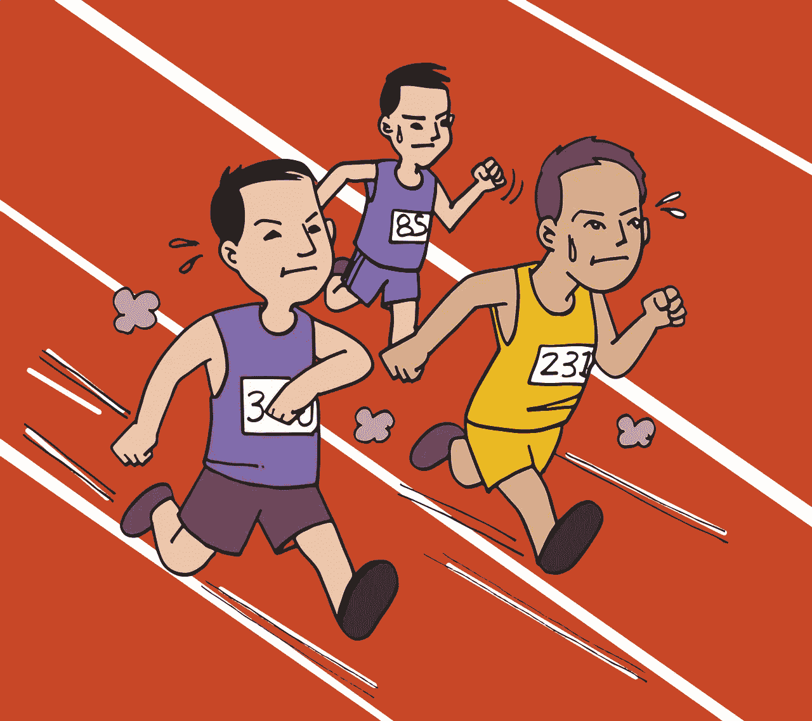

# 赚钱的两类互联网企业家

> 原文：<https://medium.datadriveninvestor.com/two-types-of-internet-entrepreneurs-that-make-money-c88ce212f85?source=collection_archive---------8----------------------->

## 一个是追逐目标，一个是建立系统。

Image by [mohamed Hassan](https://pixabay.com/users/mohamed_hassan-5229782/?utm_source=link-attribution&utm_medium=referral&utm_campaign=image&utm_content=2840792) from [Pixabay](https://pixabay.com/?utm_source=link-attribution&utm_medium=referral&utm_campaign=image&utm_content=2840792)

互联网创业是一场赛跑。你要么是短跑运动员，要么是马拉松运动员。短跑运动员不能跑马拉松，而马拉松运动员必须加速才能在短跑中存活下来。你可以通过了解你在跑什么样的比赛来增加收入、线索和阅读量。

短跑运动员每天工作 16 个小时，一边睡觉一边赚钱。马拉松运动员周末休假只是为了参加他们自己的婚礼。

穿错鞋错过比赛可能会让你的观众困惑，并损害你的底线。如果你不确定自己在经营什么生意，你可能会浪费无数的时间和金钱。

# 这场比赛

每一个类别都有一套工具和一个建立业务的重点。写博客通常是一场马拉松，因为你必须呆在社交媒体周围，不断发布内容。

网店通常是冲刺。你可以建立自己的事业，预订去斯里兰卡的两个月假期。蒂姆·费里斯是短跑运动员。他一边在阿根廷跳萨尔萨舞，一边创业赚钱。

你是哪一个？了解你的业务对增加你的观众和赚更多的钱很重要。

# 马拉松赛跑

内容制作者通常在跑永无止境的马拉松。如果你是一个中等作家，你不是在追逐目标。达到任何目标都不是比赛的终点。在一个疯狂传播的故事之后，你甚至不能休息一下。你的观众总是渴望更多。

扎特·拉纳发表了一篇[告别文章](https://medium.com/@ztrana/why-i-am-leaving-medium-b34c8271b770)说他厌倦了日以继夜地写作。我已经错过了媒体高质量的精神层面。拉纳先生是一个很棒的故事讲述者，也是这个平台的一大损失。

> “除非你每天都出版，否则很难获得稳定的收入。”——扎特·拉纳

但是，如果他不经常出版，他就无法谋生，即使他有大量的 11.1 万媒体追随者。拉纳先生可能对博客世界有所期待。

如果你在跑马拉松，你可能会陷入什么都自己做的陷阱，因为你可以。经常在做营销、设计、插画、图表、调研、文案等。

马拉松运动员需要系统。您的整个业务依赖于在正确的时间提供的新鲜内容。你必须[可靠，经常](https://medium.com/better-marketing/how-often-should-you-publish-for-best-results-c16d74a3f03e)。你的观众在期待下一个故事。你的观众是你的读者、顾客和纳税人。你靠他们的钱生活，所以你最好准时拿好你的东西。

Image by [Mote Oo Education](https://pixabay.com/users/MoteOo-466065/?utm_source=link-attribution&utm_medium=referral&utm_campaign=image&utm_content=5204384) from [Pixabay](https://pixabay.com/?utm_source=link-attribution&utm_medium=referral&utm_campaign=image&utm_content=5204384)

# 冲刺

网上创业的尤塞恩·博尔特(Usain Bolts)在短时间内付出了 170%的努力，然后享受下一趟飞往泰国的航班。

蒂姆·费里斯是著名的短跑运动员。他的书 [4 小时工作制](https://fourhourworkweek.com/)是冲刺商业的圣经。在这本 300 页的手册中，你可以找到关于如何外包浪费时间的杂务的各种策略。

营销渠道、网上商店和类似的企业需要高质量的短跑运动员。营销漏斗需要时间来建立。你必须找到合适的产品，撰写并测试你的文案，然后想办法吸引人们。

最后，经过几个月的不眠不休，你已经为长假做好了准备。[德里克·西弗斯](https://sivers.org/)在创办 CD 宝贝后已经赚了数百万。在[以 2200 万美元的价格出售公司](https://www.wired.com/2008/10/derek-sivers-so/)之前，该业务已经赚了 7000 多万美元。他最初创业后，每周工作不超过一小时。

短跑运动员不使用社交媒体或零星的博客。你不能通过发布一千条推文，然后下线半年来开展一场推特运动。

如果你要开一家网店，找别人来负责内容营销、社交媒体和客户服务。短跑运动员设立了很高且难以实现的目标。他们瞄准山峰，为了挖金矿牺牲社会生活。

# 中间立场

你不可能总是只做其中一个。互联网创业是一个丰富多彩的行业。个人想法两者都需要一点，你可能会发现自己在光谱的任何地方。

一个博主可以成为一个内容常青、内容日历的短跑运动员。如果你写了 1 000 个经得起时间考验的故事，你就能成为博客短跑运动员。

组织你的内容日历，每天在你的博客平台上发布，然后为你的社交媒体组织一个内容计划，每天发布六到七次。在 Medium、LinkedIn 和你自己的页面上发布你的作品。

将 100 篇博客文章转换成电子书，比如 Seth Godin。建立你的时事通讯漏斗，最终促成图书销售。在你的电子邮件中提供 95%的免费和高价值的内容，然后最终带领你的客户进行图书销售。

如果你的新系统有效，预订飞往异国目的地的航班，在制作沙子天使的同时点一杯椰林果汁朗姆酒。

Image by [mohamed Hassan](https://pixabay.com/users/mohamed_hassan-5229782/?utm_source=link-attribution&utm_medium=referral&utm_campaign=image&utm_content=3176449) from [Pixabay](https://pixabay.com/?utm_source=link-attribution&utm_medium=referral&utm_campaign=image&utm_content=3176449)

# 结论

互联网创业是一个有两个极端的光谱。个人的想法需要一次冲刺，其他的没有漫长的马拉松是活不下去的。如果你参加长跑比赛，注意不要一开始就把自己累垮了。

马拉松需要一个系统，让你明天和后天回来工作。你试图通过每天平衡你的能量来远离精神病院。

网上商店更像是一个冲刺的行业。你必须通过不眠之夜和社会牺牲来建立整个企业。但是，一旦商店开始运营，时间浪费者被成功外包，你就准备好在海滩上喝鸡尾酒了。

无论你最初选择什么，保持开放，给它留有余地，因为随着时间的推移，你的业务可能会发生变化。互联网创业从来都不是一边倒的，你随时都可以把自己的企业成长为短跑运动员或者马拉松运动员。

**进入专家视角—** [**订阅 DDI 英特尔**](https://datadriveninvestor.com/ddi-intel)