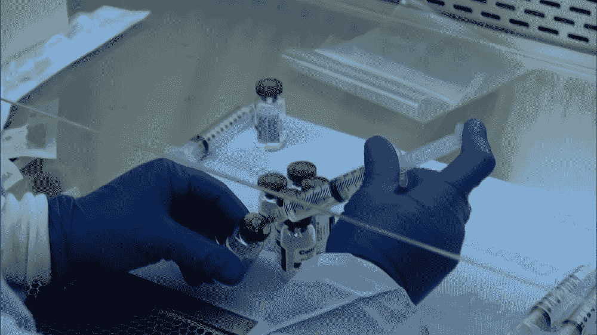
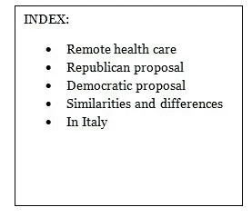

# 两项美国公共卫生法案提案和新冠肺炎

> 原文：<https://medium.datadriveninvestor.com/two-us-public-health-bill-proposals-and-covid-19-98e7a6d006b2?source=collection_archive---------19----------------------->

# *远程医疗*

早在新冠肺炎疫情突然改变我们的日常生活之前，一些政府已经开始应用远程医疗，即所谓的“ ***【远程医疗】*** ”，以减轻国民医疗服务的压力，并帮助日益“老龄化”的人口！美国和澳大利亚已经规定对远程医疗服务进行补偿，正是为了鼓励这种现象，联合王国依靠“*聊天机器人*”系统提供更有效的*客户协助*。

因此，这场危机不仅代表了全球卫生效率的试验台，也是实现数字卫生的积极驱动力。甚至欧盟也在整合各个国家的数据仓库，以创建跨境数字处方:2017 年，美国食品&药品管理局批准了首个“*”数字药丸，这不是巧合。这是一种化疗药物，通过它的传感器，你可以监控患者是否在接受治疗。应用于卫生部门的人工智能不仅有能力创造个性化疗法，还能通过对生物标志物的统计研究，大幅推进研究。当然，如果技术优势似乎无穷无尽，那么与患者隐私相关的问题也是如此，存在集中和管理不善的监控风险(见我们最近关于防止传染的应用程序 Immuni 的案例)。*

* [## 在医疗保健中使用人工智能的伦理|数据驱动的投资者

### 人工智能(AI)正被应用于任何管理大量数据的行业，在一个…

www.datadriveninvestor.com](https://www.datadriveninvestor.com/2020/03/21/the-ethics-of-using-ai-in-healthcare/) 

毕竟，与 Covid 的斗争还首先通过大规模收集整个人口的个人和敏感数据，或多或少是自愿的。在公共健康权利的倡导者和不可侵犯的隐私的不知疲倦的支持者之间的公开冲突中，美国立法保证数据安全和用户隐私的想法和倡议产生了。

# 共和党的提议

事实上，4 月 20 日，共和党参议员*罗杰·威克*提出了 ***新冠肺炎消费者数据保护法案(CCDPA)***，该法案要求受《美国联邦贸易委员会》管辖的公司在收集、处理或传输有关个人健康、地理位置或邻近程度的信息之前，必须获得个人的主动明确同意，以达到新冠肺炎的可追溯性，并根据数据最小化原则，让这些公司负责数据收集、存储和不再需要时的处置！

# *民主提案*

这还没有结束，5 月 14 日，在一场更了解政治挑战而不是有效关注公民需求的竞赛中，一些民主党参议员提出了 ***【公共卫生紧急隐私法案】【PHEPA】***，以保护数据收集，但除此之外，该法案还规定了公共和私人的诉讼权，允许联邦贸易委员会、州和公共官员以及指控违法的个人提起民事诉讼。这也需要明确的选择加入同意，但也禁止政府实体使用收集的任何个人健康信息来否认、限制或干涉个人在联邦、州或地方选举中的投票权。

# *异同点*

这两个方案有什么区别？

如果 CCDPA 针对的是涵盖的实体，而不是 HIPAA 已经涵盖的数据的*【标准化】*，PHEPA 则针对所有收集 ***【紧急健康数据】(【EHD】)***的公共和私人实体。此外，与 CCDPA 不同，PHEPA 不仅限于私人实体，还将管理 EHD 的收集和传播中的某些政府用途。

收集同意的类似政策和方法以及同意被视为合法的必要要求。这两项提案都将接受美国联邦贸易委员会的监督，但有一点不同，即只有《公共健康保护法》为任何损害性的侵权行为提供私人诉讼权。

最后，在工作场所的数据收集、存储、安全和删除义务方面，似乎有一种两党合作的方法，其唯一和唯一的目的是限制疫情，目的是在收集目的停止时，始终尊重数据最小化，从而尊重删除。

# *在意大利*

根据米兰大学的一项调查，我们的医疗保健系统本身正在向远程医疗和集成互联护理系统转变，根据这一经验，近几个月有 51%的家庭医生认为这是积极的，正在向远程治疗护理转变，尽管在组织、管理和网络安全方面仍有欠缺。

版权所有

**律师*律师*律师**

## 获得专家观点— [订阅 DDI 英特尔](https://datadriveninvestor.com/ddi-intel)*