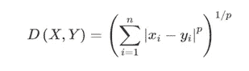
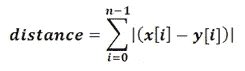
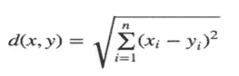
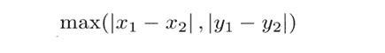
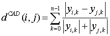
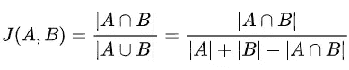

# 距离度量的类型以及在 Scikit 的 KNN 算法中使用用户定义的距离度量:

> 原文：<https://medium.datadriveninvestor.com/types-of-distance-metrics-and-using-user-defined-distance-metrics-in-scikits-knn-algorithm-9d159dfa4391?source=collection_archive---------2----------------------->


KNN 算法是数据科学中最常用和最重要的算法之一。这是一个**监督分类**算法，这意味着我们输入算法的数据被标记，我们使用它们来根据它们的相似性对数据进行分类。该算法首先测量每个点到 **k 个最近点**的距离，并分配最近点的标签。它用于图像、物种等的分类。

KNN 算法最重要的部分是它使用的距离度量。谢天谢地，scikit 允许我们调整这一部分。距离度量标准如此之多，让我们讨论五种广泛使用的距离度量标准。

> 如果你想**马上实现你自己的距离度量**，跳到最后一部分！

# 距离度量:

在我们开始讨论距离度量之前，让我们为有效的距离函数设置一些基本规则。距离函数必须满足的条件是

*   **非负性** : d(x，y) > = 0。距离必须始终大于 0。
*   **恒等式** : d(x，y) = 0 当且仅当 x == y。
*   **对称性** : d(x，y) = d(y，x)。
*   **三角形不等式** : d(x，y) + d(y，z) > = d(x，z)。

好了，现在我们来讨论一下距离度量。

[](https://www.datadriveninvestor.com/2020/02/19/cognitive-computing-a-skill-set-widely-considered-to-be-the-most-vital-manifestation-of-artificial-intelligence/) [## 认知计算——一套被广泛认为是……

### 作为它的用户，我们已经习惯了科技。这些天几乎没有什么是司空见惯的…

www.datadriveninvestor.com](https://www.datadriveninvestor.com/2020/02/19/cognitive-computing-a-skill-set-widely-considered-to-be-the-most-vital-manifestation-of-artificial-intelligence/) 

## 1.闵可夫斯基距离:

闵可夫斯基距离用于度量赋范向量空间中的距离。这意味着，我们可以将一个数据点表示为空间中的一个向量，其长度是可以计算的。向量的范数就是向量的长度。

向量 x 的范数||x||必须满足这些条件:

1.**零矢量**的长度为零。

2.标量因子(正)乘以一个矢量，只改变大小而不改变方向。

3.保持三角形不相等。

**公式如下:**



The formula of Minkowski distance

当 p = 1 时，公式给出**曼哈顿距离:**



距离是用一个 ***差的绝对总和。***

当 p = 2 时，它给出了**欧几里德距离:**



这个公式是基于勾股定理的。

当 p = ∞，我们得到**切比雪夫距离:**



***注意:*** *当使用这些距离度量时，* ***归一化*** *非常重要，因为这种距离度量对单个属性中的极端差异很敏感*

## 2.汉明距离:

汉明距离给出了两个二进制字符串之间的相似性。例如

11011001 ⊕ 10011101 = 01000100

汉明距离，d(11011001，10011101) = 2。

最小的汉明距离代表最接近的值。汉明距离对于测量数据串特别有用。我们可以在**分类数据**上使用这个，并且查看两个字符串是否相等，即查看“Hamming”和“Hanning”是否相同。

一个简单的方法是设置公式=**| x-y |⁰.**因此，当差异为 0 时，值将为 0，表示它们相似。任何其他提高到 0 的数都是 1，因此值为 1 意味着它们不相同。

## 3.堪培拉距离:

堪培拉度量类似于曼哈顿距离。区别在于，两个对象的变量之间的绝对差在求和之前除以绝对变量值的和。这是曼哈顿距离的加权版本。它对零附近的变化非常敏感。当我们处理具有大量变量的高维空间中的数据时，这个特性变得非常有用。



## 4.Jaccard 距离:

假设两个数据点是两个集合，你想测量它们有多相似。Jaccard 距离度量的一个好选择。它测量两个集合中的公共元素与两个集合中所有元素的数量。更多的公共元素意味着两个对象应该是相似的。分数越高，两个数据点越相似。



这种度量的一些用例是识别剽窃、文档之间的相似性等。

## 5.余弦相似性和距离:

余弦相似性试图通过测量两个向量之间的余弦来测量两个向量的相似性。余弦给出邻边和斜边的比值。当角度= 0 时，余弦= 1。当两个向量之间的角度为 0 时，它们位于彼此之上。当值= 1 时，表示两个向量相似。较低的值意味着它们具有较低的相似性。


**余弦距离= 1 —余弦相似度。**我们可以用上面的公式来计算距离。

> 对于大多数用例来说，这应该已经足够了。但是什么时候应该使用哪种度量标准呢？

没有一种特定的距离度量在所有情况下都适用，也没有一种特定的距离度量在任何时候都适用于特定的问题。这都是关于试错。所以，用最适合你的吧！

这是一篇漂亮的[论文](https://arxiv.org/pdf/1708.04321.pdf)，探讨了数据集上不同的距离度量，并对它们进行了比较。

# 使用 Scikit 的 KNN 算法自定义用户定义的距离度量:

Scikit 已经允许您从一系列距离度量中进行选择。请参考此[页](https://scikit-learn.org/stable/modules/generated/sklearn.neighbors.DistanceMetric.html)查看您想要使用的指标是否可用。但是如果你需要使用一个没有在上面的链接中列出的距离度量，你可以这样做:

## 步骤 1:定义函数:

我已经决定实现我上面提到的论文中的 Hassant 距离。该函数必须返回传递给它的每对向量的距离分数。

```
**def hassant_distance(v1, v2):
    total = 0
    for xi, yi in zip(v1, v2):
        min_val = min(xi, yi)
        max_val = max(xi, yi)
        if min_val >= 0:
            total += 1 - (1 + min_val)/(1 + max_val)
        else:
            total += 1 - (1 + min_val + abs(min_val))/(1 + max_val + abs(max_val))
    return total**
```

## 步骤 2:将度量参数中的函数名传递给模型构造函数:

我用的是 sklearn . neighborsclassifier .我从 kaggle 上下载了音乐数据集。目标是根据音乐类型的属性对其进行正确分类。

```
import pandas as pd
import numpy as np
from sklearn.model_selection import train_test_split
from sklearn.neighbors import KNeighborsClassifier, NearestNeighbors
from sklearn.metrics import accuracy_score, classification_report#Read the data in
music_data = pd.read_csv("..\Datasets\Tmusic_data.csv")#Specify the target
X = music_data.drop("class", axis = 1)
Y = music_data["class"]#Split the data into train and test sets
Xtrain, Xtest, y_train, y_test = train_test_split(X, Y, random_state = 0, train_size = 0.7)#Standardize the data 
scaler = preprocessing.StandardScaler().fit(Xtrain)
Xtrain = scaler.transform(Xtrain)
Xtest = scaler.transform(Xtest)**#train the algorithm
knn = KNeighborsClassifier(n_neighbors=3, algorithm='ball_tree', metric = hassant_distance) 
knn.fit(Xtrain, y_train)**#test
y_pred = knn.predict(Xtest)print(accuracy_score(y_test, y_pred))0.75
```

我们得到了 75%的准确率。你可以尝试不同的指标，看看你是否能得到更好的分数。

**注意:***如果我们选择**KD _ tree 算法，这个自定义函数不起作用。除此之外，你很棒。*