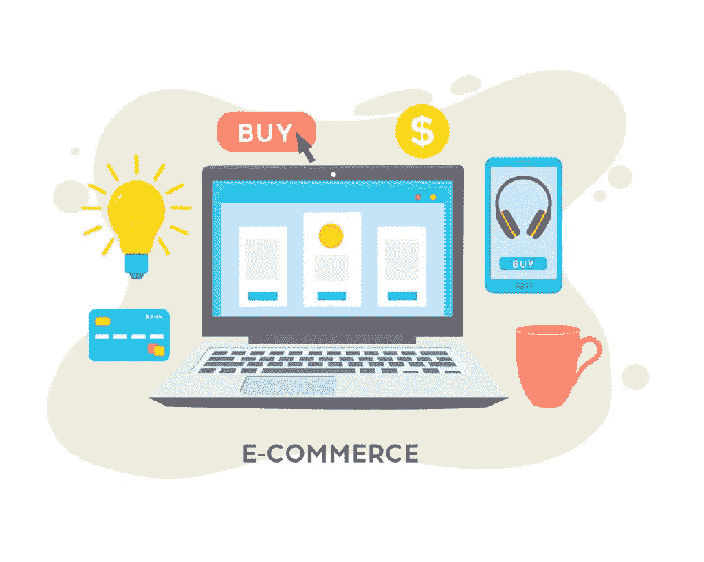
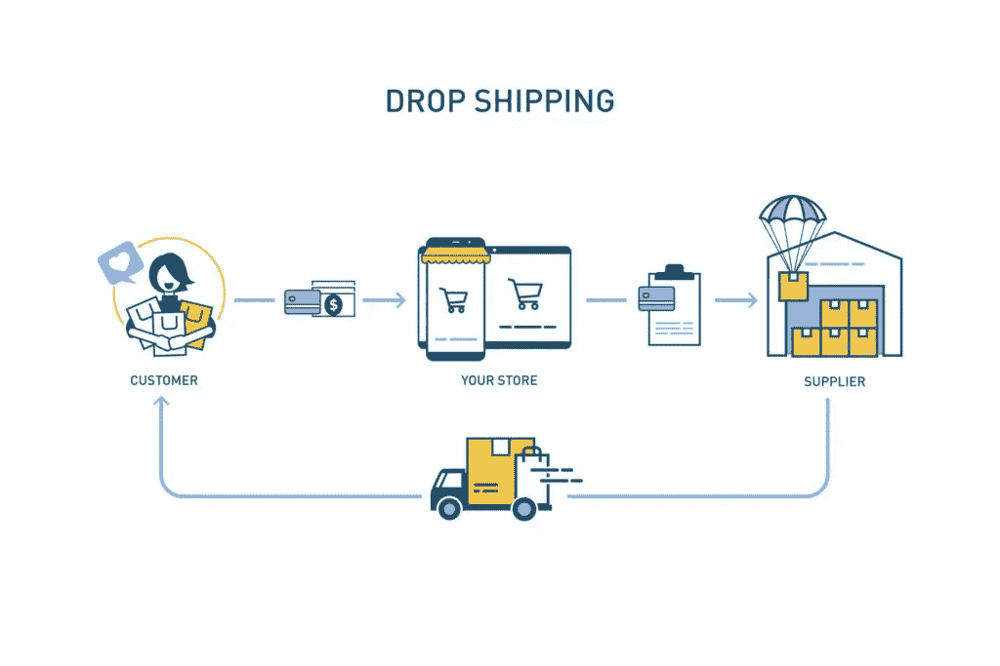

# 电子商务的类型——商业模式、范例和优势

> 原文：<https://medium.datadriveninvestor.com/types-of-ecommerce-business-models-examples-and-benefits-925297d84cef?source=collection_archive---------13----------------------->

没有哪两家电子商务公司是完全一样的，你对公司做出的所有决定都应该着眼于你的个人需求。这包括从您选择的平台到您使用的 [PoS 软件](https://skywell.software/blog/what-is-pos-and-why-your-business-needs-it/)以及两者之间的一切。今天，我们想看看所有不同类型的电子商务，并为您提供一些行业见解，以便您可以成功地启动和管理您的商店。从人们最常犯的错误中吸取教训是很重要的，这样你就可以避免重复这些错误。首先，让我们了解一下不同类型的电子商务。

# 各种类型的电子商务

电子商务的类型因参与方的不同而不同。目前，他们有 6 个人。识别正确的电子商务类型是任何成功企业的基础。为了成功，你必须确定你的市场和你的客户是谁。每当你向个人客户销售产品时，都会有一个很短的销售周期，他们的决定将更多地基于情感而不是实际需求。通常，他们会在你的网站上看到一些他们需要的东西，并最终本能地购买。能够利用这种情绪化决策的公司可以显著增加收入。这通常是通过个性化您与每个客户的沟通，并为他们提供量身定制的体验来实现的。这将让你与每一位客户建立持久而有意义的关系，随着时间的推移，他们会开始更加信任你。这就是为什么征求客户反馈如此重要的原因之一。你的客户正在寻找方法来确保他们的声音被听到，他们的意见被重视。你也可以开始提供智能协助，比如为他们提供购买某些商品的个性化建议。你用废弃购物车里的东西作为指引。电子商务可以分为两类:销售给个人消费者和销售给企业。让我们来看看它们。

 [## 2020 年最佳短期投资选择精选资源|数据驱动型投资者

### 投资是增加你净财富的一个好方法。如果你通过遵循一个严格的…

www.datadriveninvestor.com](https://www.datadriveninvestor.com/2020/03/28/handpicked-resources-for-the-best-short-term-investment-options-of-2020/) 

# 向消费者销售

## 企业对消费者销售

有很多 b2c 电子商务的例子，因为它是最常见的电子商务模式，因此它是最具竞争力的。这是至关重要的，真正零在你的目标受众，并找到你的利基，因为这将是你可以瞄准的人。就你的电子商店而言，客户体验和旅程必须是平稳的，因为没有人会花时间去试图弄清楚一个复杂的结账过程是如何工作的或任何其他繁重的方面。消费者还有其他选择，如果他们不喜欢你网站的某些东西，他们会毫不犹豫地去别的地方。

## 消费者对消费者销售

C2C 销售的最好例子是像亚马逊和易贝这样的平台，一个客户发布他们试图向另一个客户销售的产品或服务。对于拥有自己平台的人来说，很多时候，他们会在第三方网站上投放广告，试图吸引新的业务。

## 政府对消费者销售

我们通常不认为政府参与了电子商务，但你可以在线向政府支付车辆登记费、学生贷款和任何其他费用，这就是电子商务的一个例子。一般来说，你和政府之间的任何网上交易都被认为是电子商务。

# 向企业销售

将企业作为你的客户有很多好处和坏处。一方面，他们的预算会比个人多得多，因此会订购更多的产品。另一方面，他们的销售周期会更长，因为通常会有很多人参与决策过程。事实上，对于一家拥有 100-500 名员工的公司来说，平均有七个人参与购买过程。如果我们将这与销售给个人相比，销售给企业将涉及做出非常合理的决策。为了在这个市场上取得成功，你需要为每个客户提供定制的价格，让他们可以灵活地下订单。销售过程应该从企业在你的网站上注册账户开始。这将使您能够全面了解您的客户，从而开始为他们提供量身定制的产品。此外，重要的是要记住，一旦销售完成，服务并没有结束。你必须继续提供支持，即使在他们从你这里购买之后，以建立关系，并向他们表明你真正关心他们的需求。

## 向企业出售业务

表面上看，销售 B2B 涉及一个企业向另一个企业销售。虽然这可能是真的，但您仍然需要考虑有许多不同供应商的市场。即使你的买家是个人客户，市场的所有者也会将数字空间出售给其他进行 B2B 交易的公司。请记住，如果个体企业向政府销售，这仍被视为 B2B 交易。

## 消费者对企业销售

如果你曾经雇佣过一个自由职业者为你的公司执行任何任务，那么你就参与了一次 C2B 交易。这可以是像为你的网站雇佣一个网页设计师，一个摄影师来拍摄你的产品的高质量的照片和许多其他的事情。由于这些人通常是希望吸引公司注意的个人，他们会使用许多不同的方法来获得自己的名字并在那里工作。这将包括创建一个网站或作品集来展示他们的作品，在电子商务网站上收集反馈，以及许多其他方法。

## 政府对企业销售

任何与政府的互动通常都是私人性质的，电子商务也不例外。G2B 模式通常涉及政府向企业提供支付某些服务或费用的便捷方式。一个很好的例子是国税局使用的网站和门户，人们可以在那里登录，支付他们的税款，然后监控他们的回报状态。现在我们已经看了所有的电子商务商业模式，让我们继续看你可以在网上销售的商品类型。

# 网上销售的各种电子商务商品

让我们从实物商品开始，如鞋、电子产品、配件和许多其他物品。当你选择销售这些商品时，你就进入了与实体店的直接竞争，实体店会通过提供店内体验来吸引你的顾客。为了反击，你需要通过提供更广泛的选择、更准确的商品描述和许多其他东西，向你的潜在客户展示你提供的体验甚至更好。

你也可以尝试销售数码产品，这也有其优缺点。好的一面是有更少的开销和交付限制，但是你将面临来自开源软件的激烈竞争。这就是为什么你需要关注产品的所有好处，而不仅仅是免费得到一些东西。

我们要看的最后一种类型是服务。除了销售服务之外，还有许多不同类型的电子商务收入模式。例如，客户购买了服务，但需要帮助进行设置。这为您提供了追加销售的机会。如果你在网上销售服务，你将需要通过电话和电子邮件与你的客户进行更多的沟通，以解决所有的细节并最终完成销售。

# 电子商务商业模式的类型

理解你的商业模式是很重要的，因为你将在此基础上组织你的供应链。

第一种是**直运**。当客户从您的商店购买商品时，您可以与仓库合作，将商品直接运送给客户，这是提供次日送货等额外服务的好方法。基本上，您在这里的角色是充当客户和直接发货人之间的中间人。然而，缺点是利润较低，而且你放弃了对供应链过程的所有控制。

现在我们来看看**仓储**。你可以购买所有你需要的物品，并把它们存放在你的仓库里。你可以想象，你将不得不承担所有的管理费用，如租金和水电费，但你将有更多的航运和交货的控制权。

下一类模式是**私人贴牌**制造。这是零售商选择外包其品牌下的制造产品销售的时候。这将允许你有项目设计到您的确切规格，而不必支付大量的钱有自己的生产。

最后还有**白标**。这是当你购买各种公司生产的通用产品，并试图以他们的品牌名称出售。这将让你节省设计和开发成本，同时还能传达品牌信息。

# 选择最适合您需求的型号

虽然我们研究了许多不同类型的电子商务收入模式和可以在线销售的产品，但没有人能说其中一种比另一种更好。你必须确定你想卖什么，并找到合适的商业模式。你还需要有合适的[电子商务软件解决方案](https://skywell.software/retail-software-development/)来迅速投入运营并开始具有竞争力。

*最初发布于*[*https://sky well . software*](https://skywell.software/blog/types-of-ecommerce-business-models/)*。*