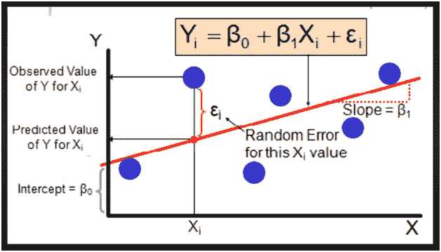
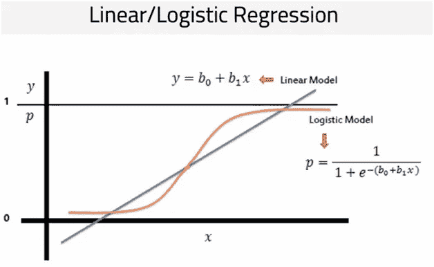
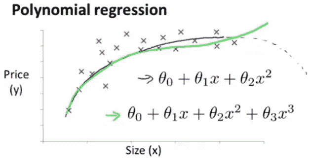
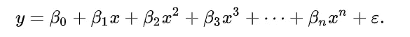
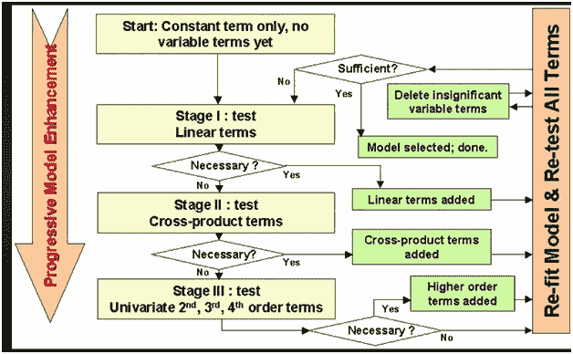
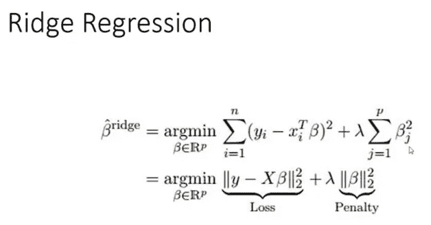
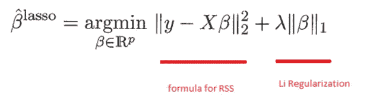

# 机器学习中的回归类型。

> 原文：<https://medium.datadriveninvestor.com/types-of-regression-in-machine-learning-bd0f5c4772fc?source=collection_archive---------2----------------------->

Photo by [Isaac Smith](https://unsplash.com/@isaacmsmith?utm_source=medium&utm_medium=referral) on [Unsplash](https://unsplash.com?utm_source=medium&utm_medium=referral)

我写这篇文章是为了列出机器学习中可用的不同类型的回归模型，并进行简短的讨论，以帮助我们对它们的含义有一个基本的概念。

现在，在进入主题之前，让我们先了解数据科学实际上是什么，以及它与回归有什么关系。

众所周知，数据科学是一个主要用于借助统计学解决问题的领域，然后是机器学习算法，以帮助我们做出预测和有价值的商业决策。

所以，当我们从统计学过渡到机器学习时，我们首先应该理解的是回归。

什么是回归？？回归可以说是一种找出输入变量(称为预测变量)和输出变量(也称为响应/目标变量)之间最佳关系的技术。并且最佳关系由预测值和实际值之间的最小差异来表示，该最小差异也称为残差。

简而言之，回归通过最小化误差来指示预测值和响应变量之间的最佳关系。

## **回归的类型**:

现在让我们了解一下回归模型是如何分成不同类型的。

根据我遇到的各种问题的经验，以下三个因素在很大程度上将每个模型分为不同的类型:

1 >响应变量的类型(是连续变量还是离散变量)。

2 >回归模型中使用的输入变量的数量。

3 >最后—回归线的形状(无论是直线还是曲线)。

**因此，最著名和最广泛使用的回归模型是:**

1 >线性回归。

2 >逻辑回归。

3 >多项式回归。

**还有几个是:**

4 >逐步回归。

5 >岭回归。

6 >套索回归。

7> ElasticNet 回归。

现在，让我们逐一了解它们:

1> **线性回归** —这是一种监督学习算法，主要用于预测分析，这通常意味着尝试拟合输入和输出变量之间的最佳直线，以便对我们的数据进行建模。这条最佳拟合直线也称为回归线，它使预测的误差平方和最小。线性回归的另一个最明显的特征是输出变量应该是连续的。

上图有助于我们理解线性回归，其中 Y 是输出变量，X 是输入变量。

2> **逻辑回归** -这也是一种监督学习算法，但在我们想要找到事件的概率时使用。针对由分类/离散输出变量确定的分类问题的最广泛使用的算法。与输出连续变量的线性回归不同，逻辑回归通过使用逻辑 sigmoid 函数发送回一个概率值来转换输出，该概率值稍后将映射到两个或多个离散类。

逻辑回归用“S”形曲线表示，也称为 Sigmoid 曲线或逻辑函数。

3> **多项式回归**:与我们试图拟合输入和输出变量之间的线性关系的线性回归不同，在多项式回归中，我们试图拟合输入和输出变量之间的非线性关系，这样做是为了增加输入变量的功效。

*维基百科对多项式回归的定义是:*

我们可以将 y 的期望值建模为 n 次多项式，从而产生一般的多项式回归模型。

它基本上是试图拟合一条曲线，而不是一条直线。多项式回归也称为多元线性回归，主要用于复杂的数据集，在这种情况下，拟合直线会变得很困难。

4> **逐步回归**:当我们有大量独立变量时，这是一个用于大型数据集的回归模型，因为模型的特征选择是一个自动过程。模型基本上会选择自己的独立特征来拟合模型，并通过使用前向选择和后向排除法等方法来验证模型中每个独立变量的统计显著性，这些方法可以在 minitab 等统计软件包/工具的帮助下轻松实现。在 R 中，“olsrr”包可用于此目的，并根据 R 平方、调整 R 平方、AIC 等标准选择最佳最终模型。

Stepwise regression- wikipedia

5> **岭回归:**每个回归模型都容易出现误差，这种误差是预测值与实际值之间的差值，可以分为三类——偏倚、方差和不可约误差。

因此当数据具有高方差且多重共线性问题意味着输入变量之间存在高相关性时，则使用岭回归，因为它带有一个罚函数来最小化误差，并以较小的误差拟合模型。因为我们使用λ函数的平方项来最小化误差，所以它们也被称为正则化技术，并且类似地，当我们使用罚函数的平方时，它也被称为 L2 正则化或偏差的平方项。

岭回归也有助于通过惩罚系数向量的 L2 范数(欧几里德距离)来解决过拟合，这导致β系数的“收缩”。

6> **Lasso 回归** : Lasso(最小绝对收缩和选择算子)也和岭回归一样，但是我们在这里增加了一个绝对项作为罚函数来最小化误差。拉索回归也被称为 L1 型正则化。

套索回归通过惩罚系数向量的 L1 范数(曼哈顿距离)来帮助解决过度拟合问题，因为当λ值增加时，一些系数收缩到零。这种方式 L1 正则化有助于最佳特征选择，解决多重共线性问题，并且未被归零的独立特征指示它们是最重要的特征。

7> **ElasticNet 回归**:这种类型的技术可以称为岭和套索回归的混合，它使用 L1 和 l2 正则化来惩罚模型，主要用于具有多个变量的数据。

在 ElasticNet 回归中使用了一个称为 alpha 的超参数来在套索和脊之间进行选择。并且该参数可以在 0 和 1 之间优化，这将有效地缩小一些系数，从而改进特征选择过程。但是，alpha 值为 0 将选择 L2(山脊)术语，而 1 将选择 L1(套索)术语。

***总结一下*** :有三种流行的正则化技术，每一种都旨在减小系数的大小:

岭回归，惩罚系数平方和(L2 惩罚)。

拉索回归，惩罚系数的绝对值之和(L1 惩罚)。

弹性网，凸脊和套索的组合。

**感谢阅读！！**

**参考文献:**

[https://www . data camp . com/community/tutorials/tutorial-ridge-lasso-elastic-net](https://www.datacamp.com/community/tutorials/tutorial-ridge-lasso-elastic-net)