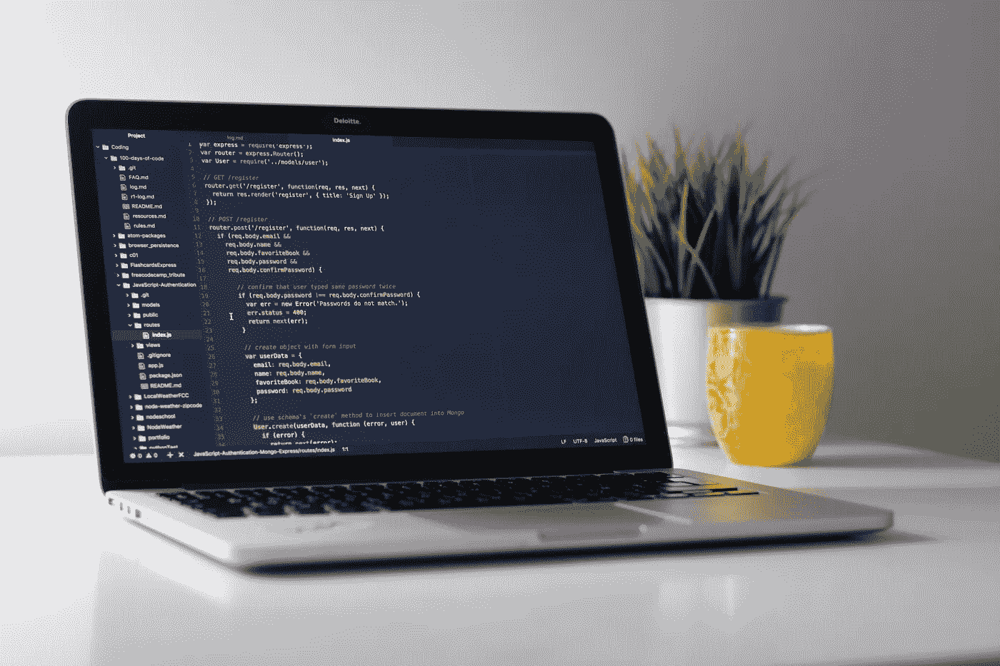

# 你可能遇到的软件工程师的类型

> 原文：<https://medium.datadriveninvestor.com/types-of-software-engineer-you-re-likely-to-come-across-3d4c566233f6?source=collection_archive---------11----------------------->

## 你是哪种类型的软件工程师？

Photo by [Clément H](https://unsplash.com/@clemhlrdt?utm_source=unsplash&utm_medium=referral&utm_content=creditCopyText) on [Unsplash](https://unsplash.com/s/photos/computer?utm_source=unsplash&utm_medium=referral&utm_content=creditCopyText)

我们，软件工程师，是一个奇怪的物种。我们非常积极地写帖子、评论和喜欢它们，但不像其他人，我们主要在 Stackoverflow(而不是脸书)上这样做。根据我们的说法，虫子不是昆虫。我们非常害怕这个短语——“还有一件事”。

> 你心目中的完美约会是什么样的？
> 
> 日/月/年。其他格式有点混乱。

这就是我们看待事物的方式。

今天我醒来时想到要造一个计算器。一天下来，我已经开发出了一个不错的版本，但是不知道该怎么做。我们对外面的世界就是这么疯狂。但是即使在软件开发社区中，也有一些其他程序员觉得奇怪的程序员原型。

让我们来看看其中的一些人格。

# 极客

唐纳德·特朗普认为移民会抢走美国人的工作。我不是特朗普，但我确信这些工程师将取代许多工程师同事的工作。一个普通的工程师每天工作 8 小时，但这种工程师可以轻松达到 18 小时。那至少是两个工程师合二为一。

这些人是你的经理们经常比较的对象。

> 看 x，他还在工作
> 
> 看看你，她这么早就来了

他们不担心工作生活平衡、健康等小问题。他们最喜欢的短语是:

> 别担心，我会处理的。
> 
> 我会在周末做这件事
> 
> 我今晚会做的

有时候，当你在周末忙着徒步旅行，或者浪漫的约会时，他们会忙着给你的代码添加测试用例，或者优化你的包中的特定代码块，甚至给你的 repo 添加注释。

他们的桌子上总是放着一个空披萨盒和几杯咖啡。有时它们也会发出臭味。但是，谁在乎呢。

真正的问题是从来没有人要求他们这样工作。他们甚至会试图用这样的评论来让团队的其他人感到内疚，

> 是啊，回家享受晚餐吧。我会在明天之前完成接下来三周的代码。

# 大师级理论家

它们是关于编程、软件开发、项目管理、相对论和 51 区的活百科全书。你问他们一个他们知道的理论。他们不仅知道理论，他们还会花几个小时向你解释，即使你不想知道。

他们为自己设定了一个非常高的标准，这意味着你在一天内开发、测试和部署的代码，将花费他们 15 天的时间。但是他们的代码将会像梵高的杰作一样——世界上一半的人将无法破译其中的任何东西。但这将是一件美事。

如果你能让大师级的理论家专注于项目本身，而不再花时间在终极排序算法**上，他们就能变成一笔巨大的财富。**

 [## 我作为软件工程师学会的 4 个关键习惯|数据驱动的投资者

### 我从事软件工程已经快 3 年了。老实说，我不认为我擅长这个(我不知道我会不会…

www.datadriveninvestor.com](https://www.datadriveninvestor.com/2020/10/12/4-key-habits-i-learned-as-a-software-engineer/) 

# 信息载体

他们从来不在座位上。你很少看到 IntelliJ 在他们的机器上打开。他们不相信自己擅长这些任务。但是它们有一项技能——捕猎和收集信息。

他们很少单独去咖啡馆。他们可能不吸烟，但你可能会在卷烟站找到他们。他们唯一的目的就是和其他人接触以获取其他团队的信息。

就像一个特工去不同的国家获取重要信息。他们的句子通常是这样的:

> 你知道 A 先生正计划进行重组吗
> 
> 我有确凿的消息说 Y 先生要被解雇了
> 
> 我知道他们的私人关系不太好。

他们也喜欢传播信息。可能是错的，但那不是他们的问题。

# 创可贴

它们是不可阻挡的自然力量。他们工作的速度比任何人都快两到三倍。他们是谷歌搜索的专家。只要有用，他们就不会去理解他们复制的东西。

问题是，至少一半的速度来自于抄近路和投篮。他们的代码和理论家大师的代码一样难以理解，但这是因为他们的代码质量太差了。他们没有测试用例或者注释。他们的代码没有优化。他们的代码是编程教科书中“*不要这样做*”例子的一部分，但是它神奇地工作了。

你不能把他们两个放在同一个项目上，因为它注定会失败——他们会践踏彼此的改变，搬起石头砸自己的脚。

如果你的项目不能按时交付，给他们打个电话，当务之急是让它以某种方式运行。您可能需要创建一个单独的项目来对此进行优化和重构，但这是以后的另一个问题。

# 游戏玩家

他们喜欢游戏，就这样。问他们任何关于最新游戏的问题，甚至不是最新的。他们有一个答案。他们知道 FIFA 20 的新功能。他们知道所有游戏问题的解决方案，从

> 我停留在《我们最后的人》第二部的第四阶段

运筹学

> 我的 PS4 无法启动

如果你的问题与软件工程有关，就把目光移开。他们可能不知道答案，但更重要的是，他们不关心你的开发错误。他们工作得很快，这样他们就可以回家玩下一关*塞尔达传说:野性的呼吸*

# 乐观主义者

这些人对你给他们的任何工作都超级自信。与他们的正常互动是这样的:

→给他们一个任务

→承诺第二天完成

→失踪整整一周

→获取提醒

→再次承诺第二天完成

→一个月后终于完成了任务

他们是团队错过最后期限的原因。但这并不能改变他们未来的态度。每当分配给他们一项任务时，他们的大脑中就会有一个东西在打勾，告诉他们— *明天*就能完成。

他们通常承担比他们能完成的更多的工作。人们经常看到他们在不同的任务之间周旋，最后把所有任务的截止日期都搞砸了。

# 平庸之辈

最后但并非最不重要的是平均和平庸。所有的软件行业都充满了他们。他们介于大师级理论家和捷径骗子之间。他们的工作很普通。“足够好”是你能从平庸的人那里得到的最好的。

他们的代码不是模范，也不是垃圾。如果你问他们一个非常技术性的问题，他们很可能会保持沉默，避免目光接触。

他们做了项目中的大部分工作，但却最不受尊重。他们在会议上不怎么说话。他们和自己的团队一起闲逛，主要讨论 bug、任务和截止日期。大多数时候，他们是在用头撞 IntelliJ(或 Eclipse)窗口。

他们大多对上述人群心存敬畏。

那么，你是什么类型的软件工程师呢？

## 获得专家视图— [订阅 DDI 英特尔](https://datadriveninvestor.com/ddi-intel)