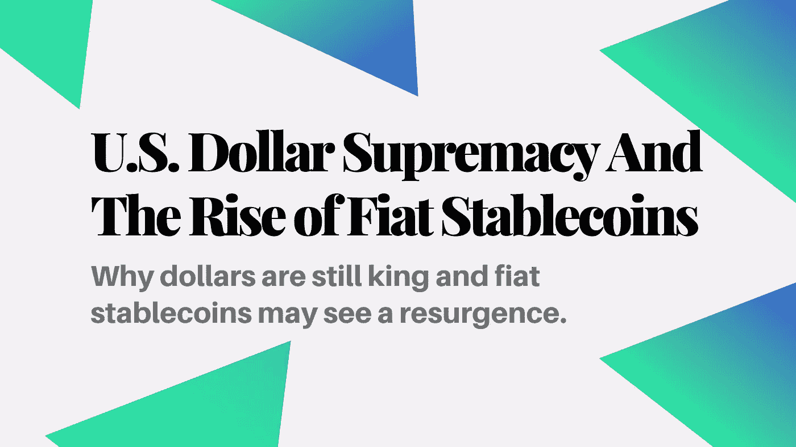
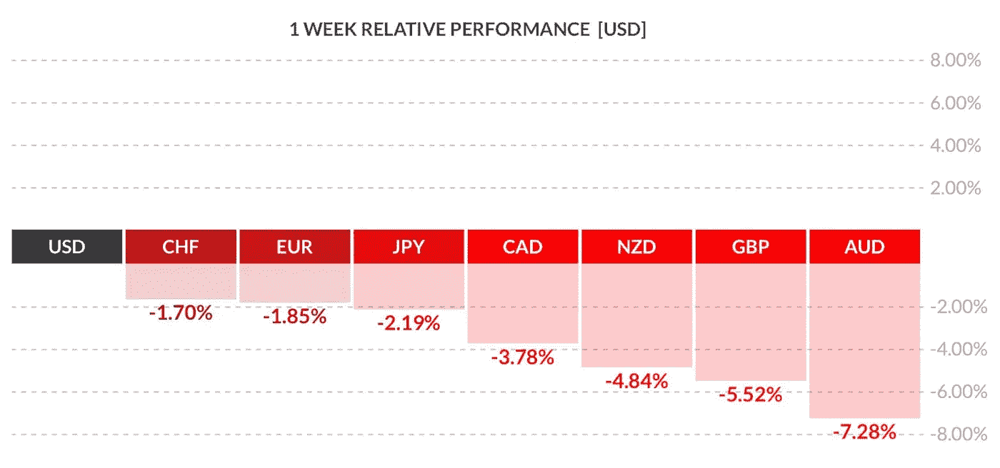
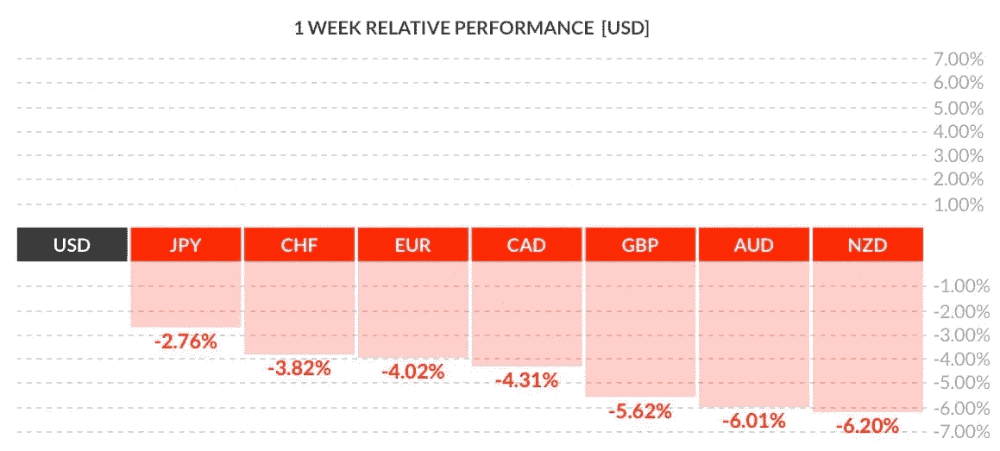
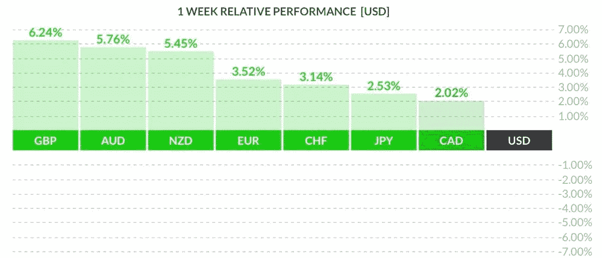
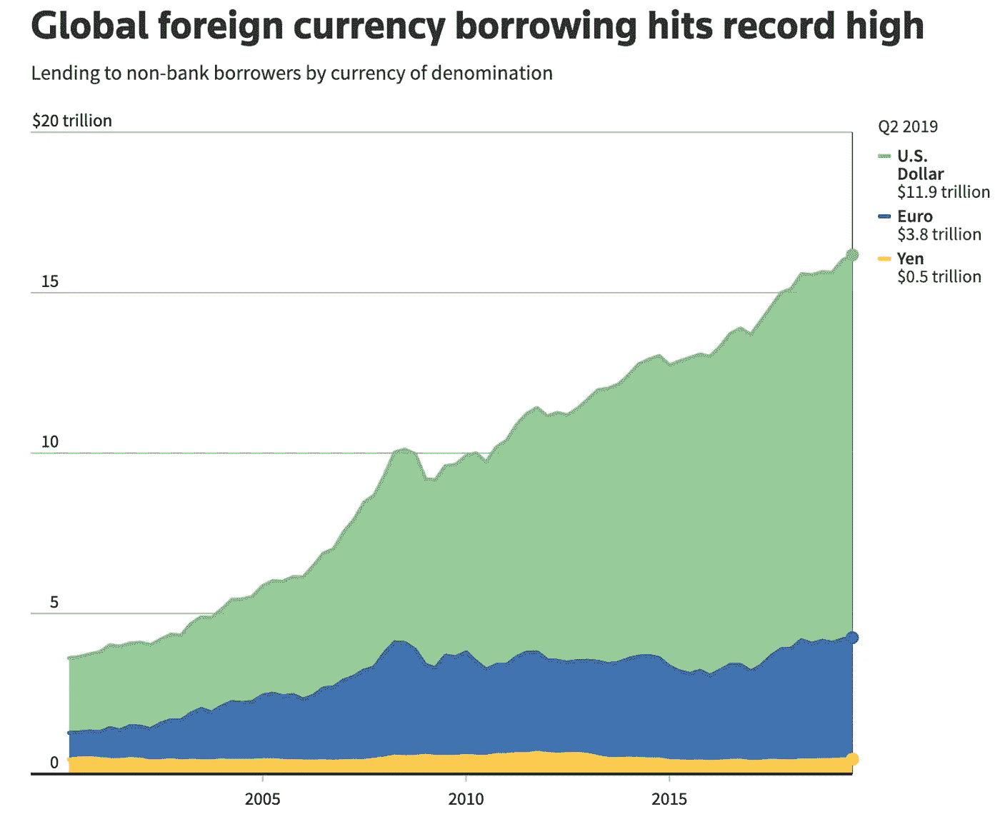

# 美元霸权与法币的崛起

> 原文：<https://medium.datadriveninvestor.com/u-s-dollar-supremacy-and-the-rise-of-fiat-stablecoins-64c3124782f1?source=collection_archive---------6----------------------->

## 为什么美元仍然是国王和菲亚特稳定的硬币可能会看到复苏。

# 世界顶级掠夺者:美元

上周五，美国政府刚刚批准了一项 2 万亿美元的刺激法案，但即使面临潜在的长期通胀，美元也不会有任何变动。事实上，过去几周，随着美元继续证明其全球霸主地位，美元反而走强。看看外汇数据，隔离的第一周震惊了全球系统，导致主要外币相对于美元的强劲抛售。

3 月 13 日的一周，美元相对于其他主要全球法定货币的表现。

Image Source: [Michael Brown](https://twitter.com/MrMBrown/status/1238531165700718597)

美元为什么表现这么好？全球市场通常以美元计价，通常是因为美元比其他货币更具流动性。在危机时期，流动性变得更加重要。此外，公司和金融机构对在资产负债表上持有美元计价的资产(如美国国债)感到放心。

 [## 总部位于瑞士的 ETP 进入加密交易市场|数据驱动的投资者

### 虽然金融市场几乎没有沉闷的时刻，特别是在引入…

www.datadriveninvestor.com](https://www.datadriveninvestor.com/2019/03/10/swiss-based-etp-enters-the-crypto-trading-market/) 

我们可以在接下来的一周(15 日至 20 日)的下图中看到，美元对所有主要货币继续表现强劲。与英镑相比，美元表现尤为出色，英镑兑美元汇率创下 35 年来的新低。本周，英格兰银行也宣布了新一轮的量化宽松和降息。

3 月 20 日的一周，美元相对于其他主要全球法定货币的表现。

Image Source: [Michael Brown](https://twitter.com/MrMBrown/status/1238531165700718597)

美元的强劲表现可能部分得益于一些公司，这些公司被要求出售本币计价的资产，以支付更多可能以美元计价的国家合同或资产。为了保持流动性，跨国公司可能会选择出售本币或以较弱国家货币计价的资产。决定货币汇率的因素有很多，但要记住的重要一点是，市场目前是不稳定的。

要寻找这种波动性的证据，看看本周发生的相反反应，美元兑各国法定货币(尤其是英镑和澳元)的表现令人难以置信地糟糕。

3 月 27 日的一周，美元相对于其他主要全球法定货币的表现。

Image Source: [Michael Brown](https://twitter.com/MrMBrown/status/1238531165700718597)

我知道你在想什么——“美元在这个图表中看起来不太，嗯，占主导地位，梅森”。没错，但这张图表显示了外汇市场面临的前所未有的波动。本月，澳元/美元汇率经历了每周的下跌和上涨，超过了 2019 年全年的涨幅。货币不应该是不稳定的。它应该是相对稳定的，每年都有轻微的通货膨胀。

这就是美元优势的来源。许多人担心美国政府的大规模刺激计划，以及这些行动在未来几年对全球经济和美元强势的潜在影响。虽然这些担忧是合理的(非常合理)，但政府印刷更多美元并不是其实力的最大决定因素。相反，美元的强势是由国家和全球组织持有美元的意愿决定的。对美国来说幸运的是，美元仍然受到高度重视，因此美元可能会保持非常强劲，因为国际公司承担了大量以美元计价的债务融资。

Image Source: Source: Bank for International Settlements, Ritvik Carvalho, Marc Jones | [REUTERS GRAPHICS](https://www.reuters.com/article/us-global-markets-debt/new-high-water-mark-for-global-foreign-currency-debt-idUSKBN1X921E)

在创纪录的借贷水平下，主要是美国债券和美元计价资产——美元不会有任何变化。美元仍然是金融界的头号掠夺者，至少在这场濒临萧条的衰退的剩余时间里是如此。

# 为什么这很重要？这与加密有什么关系？

很高兴你问了。显然，全球宏观趋势具有长期影响，所以我只想强调几个我觉得有趣的趋势。

## 创造数字美元和中央银行数字货币的复兴

政府和主要银行一直在悄悄地寻找创造数字法定货币。数字美元无疑会让刺激援助的分配更加容易。通过手机向公民汇款比邮寄支票更快，也更实惠。此外，虽然像美国这样的地方有直接的银行存款，但周围大多数人都没有银行服务或者完全没有银行账户，这使得接受任何形式的援助都很困难。数字法定货币将有助于那些没有银行账户但能够获得手机的个人。

此外，数字美元将使控制货币供应更加有效。政府可以很容易地回购或发行新货币，而不需要昂贵的劳动力和印刷费用。

这种数字美元的一种实现形式是中央银行数字货币(CBDC)。中央银行数字货币(CBDC 的)将代表对中央银行的债权，类似于今天纸币的功能。这可能会减少监管审批的争议，并更快地融入现有的金融体系。今年，英格兰银行宣布，一个银行联盟将研究创造一种数字货币的潜在好处。你可以在[中央银行和货币的未来](https://pages.consensys.net/central-banks-and-the-future-of-digital-money)中阅读更多关于 CBDC 的内容，这是一份由 ConsenSys 出版的白皮书。

## 菲亚特 Stablecoins 的崛起

Stablecoins，无论是由法令支持还是由其他形式的抵押品支持，都正式成为第一个杀手级加密应用。全球危机有助于强化货币作为平息受冲击经济体的最后手段的重要性。早在一月份，稳定的硬币转移量翻转了乙醚转移量。这在很大程度上是 USDT 迁移到以太坊的结果，但也凸显了 stablecoins 在无权限区块链的清晰价值主张。

值得注意的是，黑色星期四(3 月 12 日)导致制造商将比特币基地的稳定币添加到协议的抵押品基础中，这将进一步增加菲亚特支持的稳定币的采用。此外，菲亚特 stablecoins 在过去一个月表现良好，因为加密投资者购买 stablecoins 以减轻他们在 BTC 和 ETH 等波动性更大的资产中的损失。

尽管由菲亚特支持的稳定币不如完全自主的稳定币令人兴奋，但在以太坊或另一个未经许可的区块链变得足够大之前，它们的波动性也会更小(如果不是更多，也有数千亿的抵押品)。

## 选择退出金融体系

受影响最大的将是那些不具备由全球超级大国支撑的令人难以置信的弹性金融体系的国家。全球对美元、欧元、日元和瑞士法郎等更稳定货币的需求正在增加。较弱的国家将经历本币通胀，经济越来越不稳定。这一全球性事件可能会促使一些国家出于金融风险缓解的目的，购买黄金和比特币等[价值资产。](https://www.investopedia.com/terms/s/storeofvalue.asp)

更重要的是，即将到来的企业纾困和缺乏政府支持可能会让世界各地的人们相信主权金融体系的重要性。当人们感到被他们所生活的体制剥夺了权利时，他们会试图退出。这一次，以太坊和比特币提出了退出机制。

加密货币和未经许可的区块链网络是一场社会和政治运动。是的，有金融和经济属性，但本质上这是一场革命。革命是由战斗的人民赢得的，而不仅仅是由资金支持。

[**推进 Web 3.0**](https://advancingweb3.substack.com/) 是一份关于加密货币、去中心化金融( [DeFi](https://consensys.net/blog/news/2019-was-the-year-of-defi-and-why-2020-will-be-too/) )和塑造下一个互联网时代的技术的每周时事通讯。欢迎来到流血边缘。欢迎来到 Web 3。

**关于作者:**我是 [Mason Nystrom](https://twitter.com/masonnystrom) ，一名作家和有抱负的天使投资人。之前，我在 ConsenSys 公司担任营销人员，主要负责 ConsenSys 公司及其投资组合公司的营销策略。在加入 ConsenSys 之前，我在 Gatecoin 担任业务分析师，这是第一家上市以太币的加密货币交易所，以太坊的本地加密货币。

我对比特币、以太坊、DeFi、Web 3.0 和所有加密技术充满热情。当我不写东西或埋头于 crypto 时，我在 Lambda School 学习成为一名开发人员。

*所表达的观点、信息和意见仅由作者个人所有，仅供参考，不作为买卖任何证券、加密资产或其他金融产品的建议或投资建议。*