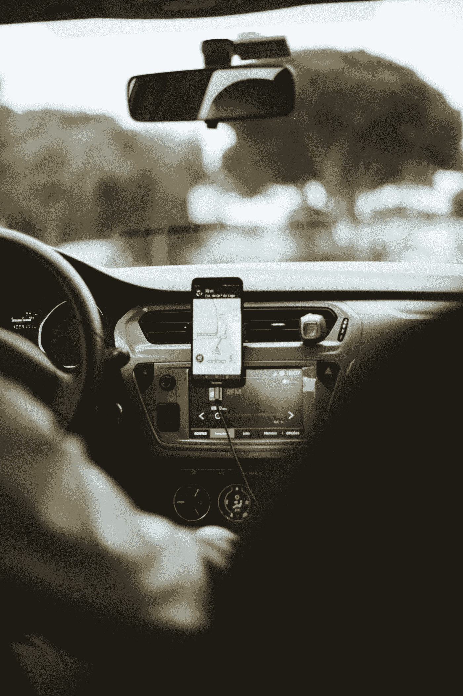
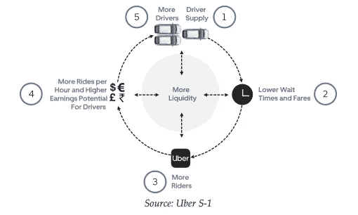
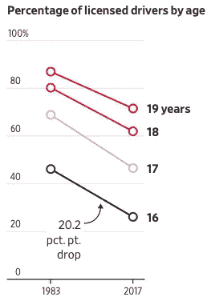
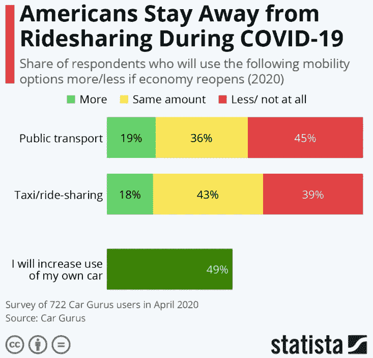

# 优步仍然被高估了

> 原文：<https://medium.datadriveninvestor.com/uber-is-still-overvalued-b3645abbd217?source=collection_archive---------0----------------------->

## 为什么我相信优步的未来叙事变得更加难以置信

Photo by [Humphrey Muleba](https://unsplash.com/@good_citizen?utm_source=medium&utm_medium=referral) on [Unsplash](https://unsplash.com?utm_source=medium&utm_medium=referral)

优步不再是一家初创公司，但它的估值植根于叙事。

该公司已经成为私人股本市场和公共股本市场分离的典型代表，比尔·格利(Bill Gurley)和阿斯瓦特·达莫达兰(Aswath Damodaran)之间著名的[辩论证明了这种分离。这些人都是各自领域的顶尖人物，他们多年来的争论显示了优步估值这个话题是多么具有争议性。](http://abovethecrowd.com/2014/07/11/how-to-miss-by-a-mile-an-alternative-look-at-ubers-potential-market-size/)

在风投眼中，优步的愿景和增长证明其估值的提高是合理的，但公开市场惩罚了该公司，因为它未能将这一愿景和增长转化为股东回报。

尽管已经低于上次的私人估值，我认为优步仍然被高估了。

## 优步的核心产品是无差别的，因此被商品化了。

优步是一家物流公司，其核心产品是为用户提供乘车和送餐服务。对于消费者来说，拼车和送货方式的选择最终取决于价格和等待时间。

 [## 投资区块链前要问的三个简单问题(也是一个困难的问题)|数据…

### 现在是了解区块链的最佳时机。不同货币之间的增长率，比如…

www.datadriveninvestor.com](https://www.datadriveninvestor.com/2020/03/12/three-simple-questions-and-one-difficult-one-to-ask-before-investing-in-a-blockchain/) 

优步开启了一种商业模式，使其能够优化司机利用率，缩短等待时间，并削弱传统出租车的价格，但替代拼车选项的出现削弱了优步的差异化能力。优步之旅与 Lyft 没什么不同，UberEats 与 Postmates 和 Doordash 提供的服务是一样的；消费者在这些选项中的选择取决于价格、等待时间和其他因素。

移动服务提供商之间的同质化服务导致了旨在增加市场流动性的价格战和促销战。一辆优步的平均等待时间现在刚刚超过三分钟(T3)，几乎没有边际改善的空间。需求聚合并不便宜，优步发现自己陷入了一场永无止境的战斗，向市场添加司机、骑手和餐馆。

在我看来，增加流动性并不能解决根本问题，优步必须意识到，他们在防止拼车平台的多重租赁方面无能为力。对于大多数骑手来说，托管多个应用程序并比较价格和等待时间以做出购买决定是有意义的。

优步、Lyft 和其他人的策略导致了消费者乌托邦和生产者反面乌托邦。像其他拼车和送餐公司一样，优步对其网络中的任何成员都没有影响力，消费者、司机和餐馆倾向于选择成本最低或支付最高的供应商。与航空公司类似，优步创造了大量的价值，但却很少获得。

## 司机分类战正在向有利于司机的方向倾斜。

疫情期间提供乘车服务的相关风险为优步司机应被视为雇员的观点提供了依据。

Photo by [Courtney Corlew](https://unsplash.com/@courtneycorlew?utm_source=medium&utm_medium=referral) on [Unsplash](https://unsplash.com?utm_source=medium&utm_medium=referral)

这个话题已经在公司和司机之间争论了多年，但陪审团站在了前者一边。2019 年 5 月，联邦劳工委员会的总法律顾问发布了一份声明，支持优步将司机归类为合同工的立场。以下声明引自[备忘录](https://src.bna.com/Ibt)来支持他们的立场:

> 司机几乎完全控制他们的汽车、工作时间表和登录位置，加上他们为优步的竞争对手工作的自由，为他们提供了重要的创业机会。

虽然这可能是真的，但很多事情已经改变，削弱了这一论点。

司机完全控制着他们的汽车，这使他们最容易受到伤害。除了[要求戴口罩](https://www.cnet.com/news/lyft-joins-uber-in-requiring-drivers-and-riders-to-wear-face-masks/)之外，司机可以采取的安全预防措施很少，而且[已经出现司机在接触病毒后死亡的故事](https://www.theguardian.com/world/2020/apr/17/uber-driver-dies-from-covid-19-after-hiding-it-over-fear-of-eviction)。在每次乘坐前后对汽车进行消毒是不可行的，即使这样做了，也不能消除司机和他们的乘客在每次乘坐期间呼吸相同的循环空气的事实。在优步司机被感染的情况下，司机没有健康保险，没有紧急经济补偿，也没有公司的保护。

优步过去曾多次声称，司机的工作不属于优步的正常业务范围。优步将自己视为司机和供应商之间的推动者，尽管网络的每一方都同样重要，但没有那些在前线提供顺风车和送货的人，就没有网络。

优步的估值是由其司机的承包工作支撑起来的。司机们愿意放弃一些利润来支付平台费，以换取额外的收入和工作灵活性，然而，情况已经发生了变化，这些优惠不再足以说服司机继续与陌生人分享他们的汽车。司机们希望得到额外的保护，他们的理由越来越充分。如果工人的分类发生变化，优步的运营模式将出现更多的漏洞，这种风险可能会对优步未来的生存构成重大威胁。

## 汽车所有权的观点再次发生了变化。

在优步之前，获得驾驶执照是年轻人生活中值得珍惜的时刻。获得驾驶执照意味着有能力去做任何你想做的事情，人们把拥有驾驶执照等同于自由。优步按需服务的出现让消费者重新考虑是否需要一辆车，如果下面的数字可以作为指标的话，拥有汽车的说法失去了吸引力。

[https://www.wsj.com/articles/driving-the-kids-are-so-over-it-11555732810](https://www.wsj.com/articles/driving-the-kids-are-so-over-it-11555732810)

买车很贵，一般新车[要花](https://www.financialsamurai.com/average-new-car-price/)3.4 万美元。这个数字并不能说明真正的价格，因为车主还必须考虑保险、保养和维修费用、利息支出以及新车的存储费用。消费者债务危机继续给数百万人带来负担，优步的拼车服务使得购买新车变得更加困难。

因此，一代人开始扭转他们的观点，将*而不是*拥有一辆车的想法等同于自由。然而，在我们这个新的与世隔绝的世界里，拥有汽车的观念再次发生了变化，消费者正在重新评估拥有汽车的好处。

人们仍然必须从 A 点到达 B 点，但骑车人不愿意为了方便而绕过安全。共享经济让我们重新考虑父母关于不要和陌生人坐一辆车的建议，但现在我们正在重温父母的智慧。

[https://www.statista.com/chart/21582/attitudes-towards-ridesharing-covid-19/](https://www.statista.com/chart/21582/attitudes-towards-ridesharing-covid-19/)

如果拼车继续显示出衰落的迹象，优步的核心产品将减少到只有送餐服务，其 560 亿美元的市值将无法解释。

## 优步兜售希望，但价值应该基于现实。

优步的核心业务是无差别的，缺乏对市场任何一方的定价权将导致双方各自选择对自己最有利的。这对消费者来说是好事，但对优步的商业来说，这是一种不可持续的模式。

优步只对司机起作用，然而这些司机并没有受到公司的保护。司机的分类一直是并将继续是一个辩论的话题，但司机提出的论点已获得势头。如果司机被重新归类为员工，优步的运营模式将会崩溃，其盈利之路将永远停留在理论上。

最后，人们对汽车所有权的看法已经改变，新的说法也不利于优步。当前的危机表明了一个依赖陌生人之间信任的系统的脆弱性。在我们这个新的、偏执的世界里，与陌生人分享东西是不被鼓励的，人们已经[展示了](https://techcrunch.com/2020/03/19/uber-coronavirus-update/)他们正在选择替代的交通方式。

优步的估值很大程度上基于增长和希望，其市值表明该公司的价值比其在 T2 的账面价值高出数倍。事实证明，优步没有能力向股东返还资金，该公司最近下调预期指引的决定是一个早期迹象，表明该公司设想的未来不再是现实。

我认为，优步的下行风险不足以抵消上行回报，该公司今天的估值预示着一个越来越不可能的未来。