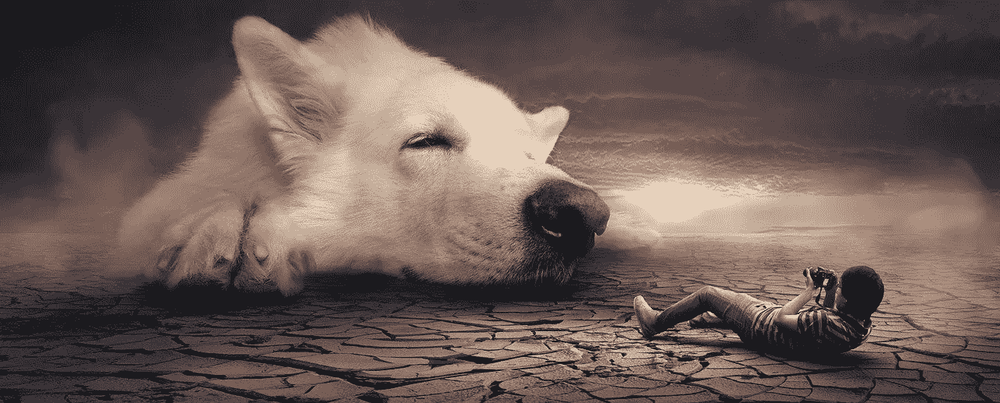
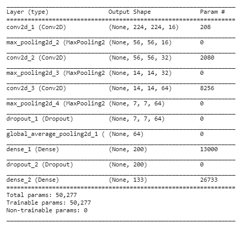
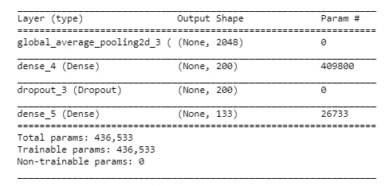
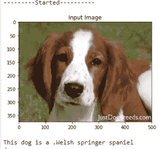
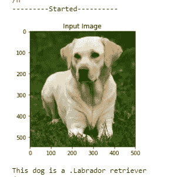
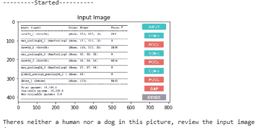
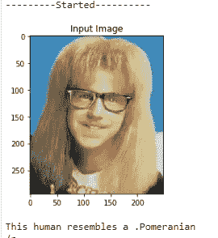
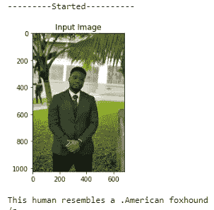

# Udacity 顶点:使用卷积神经网络识别狗的品种

> 原文：<https://medium.datadriveninvestor.com/udacity-capstone-identifying-dog-breeds-using-convoluted-neural-networks-c266cfd42b80?source=collection_archive---------8----------------------->



根据美国养狗俱乐部的统计，有 149 种狗。一些消息来源称这个数字应该超过 300，但可以肯定的说有很多狗的品种。一般人很难找到时间或动力去记住每一个犬种的特征，期望任何一个人拥有一眼就能认出犬种的技能也是一种奢望。

正是在这种情况下，我们有机会应用数据科学技术，让计算机填补人类一直难以填补的空白。对于这个项目，目标是当给定一张狗的照片作为输入时，使用卷积神经网络(CNN)根据狗的品种对狗的图像进行分类。

该项目在 Udacity 工作区中执行，项目数据已经加载到工作区中。然而，用于训练 CNN 的数据可以在[这里](https://s3-us-west-1.amazonaws.com/udacity-aind/dog-project/dogImages.zip)下载。

[](https://www.datadriveninvestor.com/2020/02/19/five-data-science-and-machine-learning-trends-that-will-define-job-prospects-in-2020/) [## 将定义 2020 年就业前景的五大数据科学和机器学习趋势|数据驱动…

### 数据科学和 ML 是 2019 年最受关注的趋势之一，毫无疑问，它们将继续发展…

www.datadriveninvestor.com](https://www.datadriveninvestor.com/2020/02/19/five-data-science-and-machine-learning-trends-that-will-define-job-prospects-in-2020/) 

该项目是 Udacity nanodegree 计划的一部分，最终产品是一种算法，当提供图像作为输入时，该算法将使用 CNN 来执行以下操作:

1.检测输入图像中的人脸

2.检测输入图像中的狗脸

3.如果检测到狗，预测狗的品种

4.预测哪种狗最像它检测到的人脸

对于本文，项目的执行将包含在以下步骤中:

检测图像中的人

检测图像中的狗

从头开始建立一个 CNN 来分类狗的品种

使用迁移学习建立一个 CNN 来分类狗的品种(使用迁移学习)

编写一个结合上述所有步骤的算法

测试算法

**检测图像中的人类**

使用 face_recognition 库用 python 实现了图像中人脸的检测(文档[此处](https://pypi.org/project/face-detector/))。该库提供了一种简单的方法来实现图像中的人脸检测，当在图像子集上测试时，它比 Udacity 推荐的使用 OpenCV 库来检测人脸的实现具有更高的准确性。下面显示了两个人脸检测实现，它们在一组 200 张图像上进行测试，其中 100 张包含狗，100 张包含人。

利用 OpenCV 实现人脸检测。

```
#Define a function that returns true if it detects a human facedef face_detector(img_path):
 img = cv2.imread(img_path)
 gray = cv2.cvtColor(img, cv2.COLOR_BGR2GRAY)
 faces = face_cascade.detectMultiScale(gray)
 return len(faces) > 0
```

利用这种实现，对于 100%的人图像和 11%的狗图像检测到面部。

```
#Import the relevant library
import face_recognition#Define a function that returns true if it detects a human facedef face_detector(path):
    image = face_recognition.load_image_file(path)
    face_locations = face_recognition.face_locations(image)
    return len(face_locations) > 0
```

上面是使用 face_recognition 库实现的人脸检测器。利用这种实现，对于 100%的人图像和 10%的狗图像检测到了面部。

```
##Test the performance of the face_detector algorithm on the images in human_files_short and dog_files_short.#Import files for testing the face detectorhuman_files_short = human_files[:100]
dog_files_short = train_files[:100]#Instantiate counters for the number of faces detected in each set 
dog_count, human_count = 0,0#Loop through all images and try detecting a face
for count in range(100):
    if face_detector(dog_files_short[count]):
        dog_count+=1

    if face_detector(human_files_short[count]):
        human_count+=1

print('Faces were detected for {0}% of human images'.format(human_count))print('Faces were detected for {0}% of dog images'.format(dog_count))
```

从使用上面的代码进行的测试中，我们发现这两个模型都不完美，但是第二个实现在选定的日期产生了稍好的结果。

**检测图像中的狗**

检测输入图像中的狗是使用 Resnet 50 CNN 架构和 imagenet 数据库执行的。CNN 是使用下面的代码导入的。

```
from keras.applications.resnet50 import ResNet50# define ResNet50 model
ResNet50_model = ResNet50(weights='imagenet')
```

在输入图像中检测狗的过程包括两个步骤。第一步是处理输入的图像数据，第二步是根据处理后的图像进行预测。

**预处理**

在将数据传递到 Resnet 50 模型进行预测之前，我们需要对图像数据进行一些预处理。我们这样做是因为使用 TensorFlow 作为后端的 Keras CNNs 要求输入是 4D 数组。输入数组的形式如下:

(样本数、行数、列数、通道数)

为了实现以下功能，定义了:

**Path_to_tensor** :该函数接受一个彩色图像的字符串值文件路径作为输入，并返回一个适合提供给 Keras CNN 的 4D 张量。该函数首先加载图像，并将其调整为 224×224 像素的正方形图像。然后，图像被转换成一个数组，数组的大小被调整为 4D 张量。在这种情况下，由于我们正在处理彩色图像，每个图像有三个通道。

**Paths_to_tensor:** 这个函数接受一个 NumPy 数组的字符串值图像路径作为输入，并返回一个具有所需形状的 4D 张量。在我们的数据为模型做好准备之前，要采取的最后一步包括额外的归一化步骤，即获取 ImageNet 中所有图像的所有像素的平均像素值(用 RGB 表示为[103.939，116.779，123.68])，并从每个图像的每个像素中减去它。这是在导入函数`preprocess_input`中实现的，在这里可以找到[。](https://github.com/fchollet/keras/blob/master/keras/applications/imagenet_utils.py)

这两个函数的代码如下所示。

```
from keras.preprocessing import image                  
from tqdm import tqdmdef path_to_tensor(img_path):
    # loads RGB image as PIL.Image.Image type
    img = image.load_img(img_path, target_size=(224, 224))
    # convert PIL.Image.Image type to 3D tensor with shape (224, 224, 3)
    x = image.img_to_array(img)
    # convert 3D tensor to 4D tensor with shape (1, 224, 224, 3) and return 4D tensor
    return np.expand_dims(x, axis=0)def paths_to_tensor(img_paths):
    list_of_tensors = [path_to_tensor(img_path) for img_path in tqdm(img_paths)]
    return np.vstack(list_of_tensors)
```

**做出预测**

下面显示的函数是用于进行预测的函数，它使用 predict 函数来获得 Imagenet 的 1000 个类的数组。然后，我们使用 NumPy 的 argmax 函数来隔离概率最高的类。

在 Imagenet 类的输出字典(在这里找到)中，条目 151 到 269 表示狗，因此我们编写了第二个函数，使用这个字典来确定图像中的任何已识别对象是否属于这个字典范围。

```
from keras.applications.resnet50 import preprocess_input, decode_predictions#Extract the label with the highest probability according to the CNN
def ResNet50_predict_labels(img_path):
    # returns prediction vector for image located at img_path
    img = preprocess_input(path_to_tensor(img_path))
    return np.argmax(ResNet50_model.predict(img))### returns "True" if the extracted label corresponds to a dog 
def dog_detector(img_path):
    prediction = ResNet50_predict_labels(img_path)
    return ((prediction <= 268) & (prediction >= 151))
```

下面的代码用于测试狗检测器的准确性，结果是 0%的人图像和 100%的狗图像检测到人脸

```
dog_count = 0 
human_count = 0
#Loop through all images and try detecting a face
for count in range(100):
    if dog_detector(dog_files_short[count]):
        dog_count+=1

    if dog_detector(human_files_short[count]):
        human_count+=1

print('Dogs were detected for {0}% of human images'.format(human_count))
print('Dogs were detected for {0}% of dog images'.format(dog_count))
```

**从零开始建立 CNN 对狗的品种进行分类**

尽管该项目的目标是使用迁移学习建立一个狗品种分类器，但该项目的这一部分对于理解 CNN 的基本原理及其工作方式是有用的。

我为 CNN 选定的网络旨在通过使矩阵比其高或宽更深来降低图像的维度。使用 max-pooling 层减少维度，而使用卷积层增加图像的深度。

在添加完全连接的层之前，使用间隙层来展平阵列，该完全连接的层以具有 133 个节点的完全连接的层结束——与狗品种的数量相同。脱落层用于降低过度拟合的可能性。

该模型使用 rmsprop 作为基于分类交叉熵的损失函数的优化器进行编译。

```
from keras.layers import Conv2D, MaxPooling2D, GlobalAveragePooling2D
from keras.layers import Dropout, Flatten, Dense
from keras.models import Sequentialmodel = Sequential()
model.add(Conv2D(filters = 16, kernel_size = 2, padding = 'same', activation = 'relu', input_shape = (224, 224, 3)))
model.add(MaxPooling2D(pool_size = 4, padding = 'same'))
model.add(Conv2D(filters = 32, kernel_size = 2, padding = 'same', activation = 'relu'))
model.add(MaxPooling2D(pool_size = 4, padding = 'same'))
model.add(Conv2D(filters = 64, kernel_size = 2, padding = 'same', activation = 'relu'))
model.add(MaxPooling2D(pool_size = 2, padding = 'same'))
model.add(Dropout(0.3))
model.add(GlobalAveragePooling2D())
#model.add(Flatten())
model.add(Dense(200, activation = 'relu'))
model.add(Dropout(0.4))
model.add(Dense(133, activation = 'softmax'))model.summary()
```



这项任务的目标是建立一个精确度大于 1%的 CNN。上述网络在没有任何参数微调或数据扩充的情况下实现了 18.062%。

**用迁移学习建立一个 CNN 对狗的品种进行分类**

该项目的这一部分涉及利用现有的模型来提高我的 CNN 的准确性。这是通过切断先前存在的 CNN 的最终分类层并添加我设计的分类层来实现的。在此应用之后，整个模型将在狗图像数据集上训练，以调整添加的层的权重，同时保持原始模型的权重。

这种方法将使新 CNN 的训练非常快速，因为我们应用的图像中已经分离出了用于识别的主要特征。这意味着我们只有少量的参数或权重可以反向传播。

我选择通过利用在 imagenet 数据库上训练的 Resnet 50 CNN 来构建我的 CNN。Resnet 50 模型的瓶颈特性是存在的，我只需要下载我们的 Resnet 50 CNN 的文件，然后用下面的代码导入它。

```
### TODO: Obtain bottleneck features from another pre-trained CNN.bottleneck_features = np.load('bottleneck_features/DogResNet50Data.npz')
train_Resnet50 = bottleneck_features['train']
valid_Resnet50 = bottleneck_features['valid']
test_Resnet50 = bottleneck_features['test']
```

**模型架构**如下图所示。我尝试了几种不同的组合，其中 1 和 2 个完全连接的层具有 200 和 400 个节点，不同的丢失率(0.4 和 0.5)和不同的优化器(Adam，rmsprop)。所有不同的架构给我的测试准确率在 79%到 83%之间。

最后一层是 133 个节点，以匹配我们的类的数量。

以下架构的测试准确率为 82.656%

```
### TODO: Define your architecture.
trans_model = Sequential()trans_model.add(GlobalAveragePooling2D(input_shape=train_Resnet50.shape[1:]))
trans_model.add(Dense(200, activation = 'relu'))
trans_model.add(Dropout(0.4))
trans_model.add(Dense(133, activation = 'softmax'))trans_model.summary()
```



定义架构后，使用下面的代码对其进行编译和训练。

```
### TODO: Compile the model.
trans_model.compile(loss = 'categorical_crossentropy', optimizer = 'rmsprop', metrics = ['accuracy'])
```

我们跟踪所有时期并加载最佳参数，以确保我们的 CNN 在训练过程中具有最高精度的权重。

```
### TODO: Train the model.from keras.callbacks import ModelCheckpointepochs = 50checkpointer = ModelCheckpoint(filepath='saved_models/weights.best.trans.hdf5', verbose=1, save_best_only=True)trans_model.fit(train_Resnet50, train_targets, validation_data=(valid_Resnet50, valid_targets),epochs=epochs, batch_size=20, callbacks=[checkpointer], verbose=1)trans_model.load_weights('saved_models/weights.best.trans.hdf5')
```

我们测试了用下面的代码实现的模型的准确性，得到了 80.502%的准确性。

```
### TODO: Calculate classification accuracy on the test dataset.# get index of predicted dog breed for each image in test set
new_dog_breed_predictions = [np.argmax(trans_model.predict(np.expand_dims(tensor, axis=0))) for tensor in test_Resnet50]# report test accuracy
test_accuracy = 100*np.sum(np.array(new_dog_breed_predictions)==np.argmax(test_targets, axis=1))/len(new_dog_breed_predictions)
print('Test accuracy: %.4f%%' % test_accuracy)
```

在训练模型之后，下一步是将它放入一个函数中，该函数将接受图像路径并预测图像中的狗的品种。为此任务定义的函数如下所示。

```
### TODO: Write a function that takes a path to an image as input
### and returns the dog breed that is predicted by the model.from extract_bottleneck_features import *def Resnet50_predict_breed(img_path):
    # extract bottleneck features
    bottleneck_feature = extract_Resnet50(path_to_tensor(img_path))
    # obtain predicted vector
    predicted_vector = trans_model.predict(bottleneck_feature)
    # return dog breed that is predicted by the model
    pred1 = re.sub(r'[0-9]', '', dog_names[np.argmax(predicted_vector)][11:])
    prediction = re.sub(r'_', ' ', pred1)
    return prediction
```

**写出你的算法，它结合了上面**的所有步骤

为了完成到目前为止的所有工作，构建了一个函数。该函数接受图像的文件路径，并首先确定图像是否包含人、狗或两者都不包含。然后，

*   如果在图像中检测到一只**狗**，返回预测的品种。
*   如果在图像中检测到一个**人**，返回相似的狗品种。
*   如果在图像中没有检测到**或**，则提供一个指示错误的输出。

我们利用项目中前面指定的人脸检测器和狗检测器功能来检测图片中的人脸和狗脸。该算法接收图像路径，并基于上述要求进行操作。

```
### TODO: Write your algorithm.
### Feel free to use as many code cells as needed.def dog_breed_detector(path):

    print('---------Started----------')

    #Display the image
    display_image(path)

    if dog_detector(path):
        breed = Resnet50_predict_breed(path)
        print('This dog is a ' + breed)

    elif new_face_detector(path):
        breed = Resnet50_predict_breed(path)
        print("This human resembles a " + breed)
    else:
        print("Theres neither a human nor a dog in this picture, review the input image")
    pass
```

**测试算法**

我测试算法的能力受到这样一个事实的限制，即我没有大量的图片进行测试，但该模型在测试图片上的表现令人满意，如下所示。

```
import oslistr = [(str(i)[11:-2]) for i in os.scandir('images')]
del(listr[11])
print(listr)for x in listr:
    dog_breed_detector('images/' + x)
    print ('/n')
```



Images tested with the algorithm. Apparently I look like an American Foxhound

**倒影**

该模型表现令人满意，但未能达到 90%的准确度。然而，所获得的结果可以通过以下方式进行改进:

通过提供更大的数据集和审查图像来提高训练数据的质量，以确保它们不会偏向一个品种，不会模糊或有任何负面影响 CNN 的缺陷。

数据扩充，包括使用 Keras ImageDataGenerator 类对训练数据进行数据扩充。

进一步超参数调谐