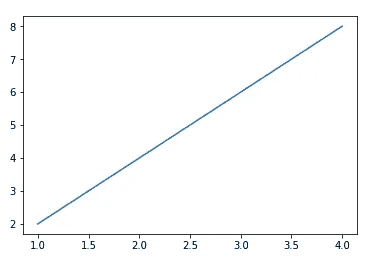
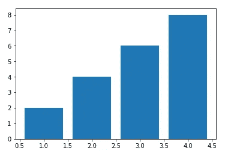
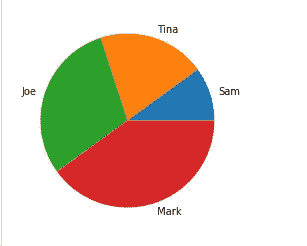

# Python 的 Matplotlib 终极指南:一个用于绘制图表的库

> 原文：<https://medium.datadriveninvestor.com/ultimate-guide-to-pythons-matplotlib-a-library-used-to-plot-charts-3d2210ccb04c?source=collection_archive---------9----------------------->

## 用 Python 绘制条形图、折线图和饼图的简单指南


Photo by [Cookie the Pom](https://unsplash.com/@cookiethepom?utm_source=medium&utm_medium=referral) on [Unsplash](https://unsplash.com?utm_source=medium&utm_medium=referral)

数据可视化是指使用图表、图形和地图等元素对数据和信息进行图形化或可视化表示。多年来，数据可视化已经获得了巨大的普及，因为它通过以模式、趋势等形式显示数据，提供了对甚至大量数据的简单解释。通过遵循这些模式和趋势，用户可以促进他的决策。

Python 使用 Matplotlib 库的 pyplot 进行数据可视化。Pyplot 是 Matplotlib 库中的一个方法集合，可用于创建 2D 图表、图形和交互式有效地表示数据。Matplotlib 库预装在 Anaconda 发行版中，也可以从互联网上轻松安装。

# 安装 Matplotlib

1.如果您有 Anaconda navigator，请打开 navigator 窗口，单击 environments 并向下滚动找到 Matplotlib 库。它预装在您的计算机上。

2.如果您没有 Anaconda navigator，这不是问题。就去[https://pypi.org/project/matplotlib/#files](https://pypi.org/project/matplotlib/#files)

在这里你会找到图书馆。下载并安装它，您就可以用 python 本身创建精彩的图表和图形了。

# Matplotlib 提供的图表类型

它提供了大量图表，其中最常用的图表如下:

## 1.折线图

它通过使用直线段连接称为“标记”的重要点。这些点将代表您在制作图表时将要输入的数据。

## 2.条形图

它使用条形来表示数据。条形的高度是多样化的，以描述给定数据中的差异。根据用户的需要，条形图可以水平绘制，也可以垂直绘制。

## 3.圆形分格统计图表

圆形区域的切片用于描述数据。面积较大的切片代表较高的值，而面积较小的切片代表较小的面积。

## 4.散点图

散点图只是以点的形式绘制数据。它不同于折线图，因为它不是用直线将点连接起来。

现在，让我们继续创建这些图表的步骤。

> 注意:在开始创建图表之前，您必须给出导入 Matplotlib 的命令。为此，只需在 Jupyter 或 python 窗口中键入下面提到的命令:

```
import matplotlib.pyplot as pl
```

这会将 Matplotlib 导入到您的窗口中，每次创建图表时，您只需使用“pl”来代替长的“matplotlib.pyplot”。

# 折线图

要创建折线图，您必须事先分配一些数据。在 python 中，这些数据可以以列表或字典的形式给出。这里我将使用列表来创建图表:

```
import matplotlib.pyplot as pla= [ 1, 2, 3, 4]b= [2, 4, 6, 8]pl.plot(a,b)pl.show()
```

这里 a 和 b 分别是由值 1，2，3，4 和 2，4，6，8 组成的列表。命令 pl.plot(a，b)用于绘制一个折线图，使用“a”中的值作为 x 轴,“b”作为 y 轴。

下面是绘制的图表:



Image source: Author

您也可以为 x 轴和 y 轴命名，如下所示:

```
pl.xlabel(“ values in a”)pl.ylabel(“values in b")pl.plot(a,b)pl.show()
```

这里，x 轴将被命名为“a 中的值”，y 轴将被命名为“b 中的值”。

[](https://www.datadriveninvestor.com/2020/12/06/why-we-invested-in-fidocure-aka-how-tech-can-help-save-dogs-and-eventually-humans-from-cancer/) [## 为什么我们投资 FidoCure，也就是技术如何帮助拯救狗(最终拯救人类)免于癌症|…

### 10 月，安宣布获得由北极星创投领投的 1000 万美元 A 轮融资，我们增加了…

www.datadriveninvestor.com](https://www.datadriveninvestor.com/2020/12/06/why-we-invested-in-fidocure-aka-how-tech-can-help-save-dogs-and-eventually-humans-from-cancer/) 

# 条形图

让我们继续画条形图。条形图也需要与折线图相同的步骤。唯一的区别是给出绘制数据的命令。

```
import matplotlib.pyplot as pla= [ 1, 2, 3, 4]b= [2, 4, 6, 8]pl.bar(a,b)pl.show()
```

在给出绘制条形图的命令时，我们需要为其指定“bar ”,正如我们在上面所做的那样。



Image source: Author

要命名 x 轴和 y 轴，可以遵循相同的过程。

```
pl.xlabel(“ values in a”)pl.ylabel(“values in b")pl.bar(a,b)pl.show()
```

也可以使用“宽度”命令改变条形的宽度。width 命令中给定的值应该是数字，否则 Python 会产生错误。

```
pl.bar(a,b, width=<value>)
```

# 散点图

散点图允许您通过指定标记大小和标记类型来更改数据点或标记的外观。在这种类型的图表中，您必须指定两者中的任何一个或两者，同时给出创建相同图表的命令。

```
a= [ 1, 2, 3, 4]b= [2, 4, 6, 8]pl.plot(a,b, “o", markersize=10)pl.show()
```

此处，数据点类似于“o”字母，标记大小等于 10。如果我们不指定它们，那么将绘制一个折线图来代替散点图。


Image source: Author

更改散点图的 x 标签和 y 标签也将保持不变。

```
pl.xlabel(“ values in a”)pl.ylabel(“values in b")pl.plot(a,b, “o", markersize=10)pl.show()
```

# 饼图

与其他图表相反，饼图也可以只显示一个列表。但是为了读者和用户理解的清晰，我们为每个片段指定了标签，这需要使用第二个列表。

```
a= [‘Sam’, ‘Tina’, ‘Joe’, ‘Mark’]b= [100, 200, 300, 400]pl.pie(b, labels=a)pl.show()
```

该列表表示 4 个成员为组织一个聚会所做的贡献。不同的构件将用不同的颜色表示，如下所示:



Image source: Author

您也可以给饼图命名:

```
a= [‘Sam’, ‘Tina’, ‘Joe’, ‘Mark’]b= [100, 200, 300, 400]pl.pie(b, labels=a)pl.title(“contributions made")pl.show()
```

这是用 python 绘制图表的入门参考指南。然而，这些图表可以尝试改变颜色、大小、风格等等。考虑到这篇文章适合初学者，我把它精简了。这将需要更多的实践来激发创造力，充分利用图表所代表的趋势和模式。

## 访问专家视图— [订阅 DDI 英特尔](https://datadriveninvestor.com/ddi-intel)