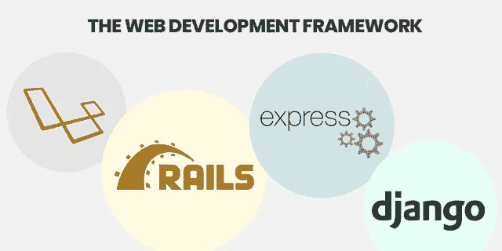
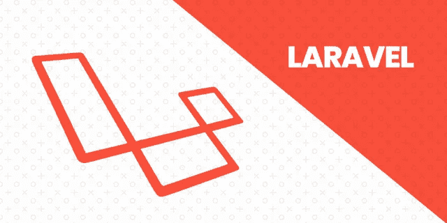

# 2021 年网络发展趋势和后端框架的终极指南

> 原文：<https://medium.datadriveninvestor.com/ultimate-guide-to-web-development-trends-backend-frameworks-in-2020-4ff1e531e0ed?source=collection_archive---------2----------------------->

## 仅仅通过采用这些最新的发展趋势和后端框架来增加你的网站的功能和效率。

“Web 开发服务对于每个开发人员来说都是必不可少的，它为开发过程提供了明确的规则和规章指南。”如果你想开发一个外观和功能都如你所愿的网站，那就必须遵循能帮助你实现目标的步骤。

在目前的情况下，大约有超过 20 亿个网站，到目前为止有 25 亿活跃用户。然而，这个数字预计在不久的将来会增长，因此标志着黎明充满了更多的竞争，尖锐，和技术细节。此外，当它是所有关于开发一个网站，网页开发有自己的追求。

因为 web 开发人员是这个不断发展的开发世界的重要组成部分。很明显，他们需要适应新兴技术，并为不断的变化做好准备。但是，就像其他一些行业一样，最重要的是要跟上新趋势和新技术的步伐，这些新趋势和新技术标志着最好的 [**网络开发公司**](https://www.xicom.biz/offerings/web-development/) 的诞生

> ***正因为如此，我整理了一份 2021 年及以后最流行的技术趋势和最佳后端框架的清单。***

让我们从开发技术的趋势开始，这些趋势是框架所遵循的，这些框架被证明有助于使你的网站成为全球认可的物有所值的选择。

> 所以，拿起你的咖啡杯，让我们开始了解“最新的网络技术”:

# 1.区块链

区块链是潮流的引领者。它给安全和数据行业带来了革命性的变化。网站和应用程序都通过区块链在线存储数据，仿佛提供了无懈可击的安全性。

因此，无论我们谈论教育部门、医疗保健部门还是金融领域，区块链都是它们的首选。

# 2.人工智能和机器学习

AI & Machine Learning

> ***根据来自***[***Gartner***](https://www.gartner.com/en/newsroom/press-releases/2018-04-25-gartner-says-global-artificial-intelligence-business-value-to-reach-1-point-2-trillion-in-2018)****的最新报告，人工智能的新兴技术预计到 2022 年将达到 3.9 万亿美元。现在，越来越多的组织正在将人工智能纳入他们的数字化转型战略，并且没有放缓的迹象。****

*当人工智能在包裹着创新的数字舞台上迈出坚实的步伐时，同时，它有助于分析和理解你网站访问者的行为。而且，人工智能与机器学习的结合在网络和应用程序行业有着光明的未来。*

*像脸书、谷歌这样久负盛名的公司都是由人工智能驱动的。最新的网络技术融入新兴技术。虽然人工智能在世界上蓬勃发展，并被用于最流行的框架，甚至，你可以使用像 AR/VR 和 ML 技术这样的技术来打造一个利基。*

# *3.物联网*

*你一定听说过智能设备，比如智能电视、智能助手、智能汽车等等。粗略估计，2021 年有 3100 万台联网设备。*

*由于所有这些设备都通过网站运行，这使得硬件和软件以及在线平台之间的集成成为强制性的。它无疑是下一个未来，值得一提的是，它将在未来几年一点一点地崛起。*

# *4.带浏览器的扩展*

*如今，使用第三方 API 和应用程序来提升你的浏览体验已经过时了。插件和浏览器扩展取代了 API。*

*在目前的情况下，“谷歌 Chrome”是一个广泛使用的选择，是一个来自谷歌的可信浏览器插件，其流行性和可靠性与脚步相匹配。毫无疑问，浏览器扩展增加了你的收入，销售，保持数据安全，并不妨碍隐私的关注。*

*名单上更多的是 Flipkart、亚马逊、脸书和其他世界领先的大公司，它们在世界范围内利用浏览器扩展。所以，如果你想让你的业务更有效率，那么选择浏览器扩展是正确的选择。*

# *5.右切线——“轨道——概念”*

*RAIL-Response 动画 Idle Load 是 web 开发服务中最新的门厅，其概念是最小化网页的加载时间。到目前为止，用户认为整个网站的加载时间大约为 3 秒。*

> *但是，有了铁路，时间将大大缩短到 1 秒钟。*

*这个概念背后的核心动机是为用户提供一个更好、更方便、更愉快的 UX 界面。为了实现这一目标，RAIL 采用了一种简单的方法，将 UX 分成有用的网站结构，其结果是无与伦比的性能。*

*最新的 web 技术和框架数不胜数。将它们都包含在一篇文章中并不容易。因此，我只是将有前途的网络技术收入囊中，这些技术是最好的 [**软件开发公司**](https://www.xicom.biz/) **的最佳选择。***

# *接下来是“Web 开发框架”*

**

*Web Development Frameworks*

> *但是，在从最佳后端框架层次结构开始之前，让我们快速回顾一下什么是 web 开发框架？*

*框架是开发软件和网络应用的平台。此外，它还提供了一个基础，开发者可以在这个基础上为特定的平台开发程序。例如，一个框架可以由预定义的类和函数组成，这些类和函数用于处理数据、管理硬件设备和与软件的交互。*

*这简化了开发过程，所以当你 [**雇佣网络开发人员**](https://www.xicom.biz/offerings/hire-web-developers/) 时，他们不需要每次开发新的应用程序都重新发明轮子。*

# *1.姜戈*

*Django 被认为是一个基于 Python 的模型-视图-模板框架，用于 web 开发。像谷歌、YouTube 这样的大公司和 Instagram 这样的社交平台完全依赖于这个框架。此外，Django 吹嘘它是一个包含电池的功能，这是 Django 用来完成的认证和消息传递等功能的集合。*

*它比配置模式和干模式更遵循惯例。Django 中的安全级别非常重要，因为它为开发人员提供了创建安全网站的技术和特定工具，或者在框架本身中实现安全特性，比如防止模板层中的代码执行。*

# *2.表达*

*得益于 Node.js 的火爆，Express 在如今的框架中已经有了快速突出的趋势。它是埃森哲、IBM、优步和许多其他公司的基准名称中的一个流行选择，以及它与其他框架如 Sails、Loopback、北海巨妖的兼容性。*

*Express 作为一个最小的、快速的、非个人化的框架获得了广泛的欢迎。它提供了一些核心框架功能，而不影响 Node 的特性，并利用了异步 Node.JS 的动态性能。*

*添加到列表中，它非常灵活，甚至支持所有应用程序以及 REST API。也许，Express 最大的缺点是没有明确的方法来解决问题或明确地谈论初学者。*

# *3.轨道*

**

*Ruby on Rails*

*Rail 是一个使用 Ruby 的模型-视图-控制器框架，Ruby 是许多开发人员喜爱和使用的流行框架之一。例如 Airbnb、GitHub、Hulu 和 Shopify 都是使用 Rails 的首选。对于初学者友好的框架来说，Rail 是一个相当好的选择，事实上，它的优点和缺点是一个争论的热门话题。*

*但是，这帮助了许多初学者太快地开始使用 web 开发服务。Rails 有许多有益的精华，其中一些是类似库的依赖项，可以扩展应用程序的功能，甚至帮助您更快、更高效地开发。*

*Rails 社区非常可靠和友好，有一些教程、截屏和资源可以帮助您在最短的时间内成为 Rails 专家。*

*Rails 最大的缺点在于，它们需要额外的努力才能在生产环境中部署和运行。然后，这是一个学习曲线——它的抛物线性质使它很难深入到框架中去展示它下面的潜力。*

# *4.弹簧*

*Spring 是一个模型-视图-控制器框架，在 Java 编程语言上工作，Java 编程语言是空前流行的语言。Wix、TicketMaster 和 BillGuard 等网站都是这个流行框架的用户。*

*领先的离岸[**软件开发公司**](https://www.xicom.biz/) 认为这是一个可靠的选择，因为 Spring 拥有许多姐妹项目，可以加速其性能并让您快速扩展您的业务达到新的高度。事实上，它可以在 Java 上工作，Java 是一种强类型语言，对许多 web 开发人员来说是一种严峻的挑战。*

*学习 Spring 的图表可能很陡，特别是如果您不是 Java 背景的话。*

# *5.拉勒韦尔*

**

*Laravel*

*Laravel 也是一个基于 PHP 的模型-视图-控制器框架，PHP 是最流行的 web 语言之一。与列表中的其他框架相比，它相对较新。*

*Laravel 附带的 API 支持也是开箱即用的，而且它还包含大量可以轻松扩展其覆盖范围的包。Laracasts 是一个截屏教程网站，有成千上万的视频，介绍如何在 Laravel 开发的生态系统中使用 PHP、Laravel 和前端技术，这是初学者的天堂。*

*然而，在追求性能方面，Laravel 没有与 Django，Express 竞争，这对于大型项目来说可能是一个缺点。*

***持久的想法:***

*我希望我的文章能让招聘软件开发人员这一令人困惑的工作变得轻而易举，记住最新的 web 技术和最好的 web 开发框架。*

*因此，不要害怕拿起一个框架并开始工作，它为您提供了对事物如何工作的洞察力，并且您肯定会发现所列出的框架、它们所使用的不同编程语言和技术之间有许多相似之处。*

*毕竟，你需要的是一个专注、热情、创新的 [**网站开发人员**](https://www.xicom.biz/offerings/hire-web-developers/) 来开始你的项目构思，直到完成。*

*请记住，繁荣的大公司总是在迁移和探索新的东西，所以没有所谓的死胡同。*