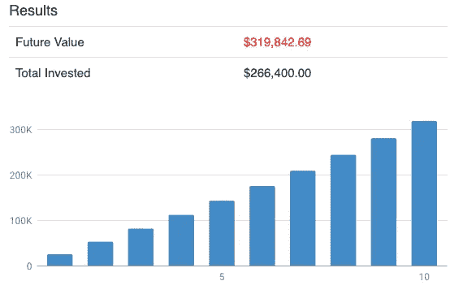

# 离开新加坡时提取中央公积金的终极指南

> 原文：<https://medium.datadriveninvestor.com/ultimate-guide-to-withdrawing-cpf-when-leaving-singapore-7450dd452e11?source=collection_archive---------1----------------------->

## 新加坡是一个由大量外国人和永久居民组成的国家。个人退休者与居民一样向养老基金中央公积金缴款。但他们中的一些人可能会移民到其他国家或回到自己的国家，届时他们的养老基金会发生什么情况。你可以在这篇文章中找到信息。

Photo by [Sreehari Devadas](https://unsplash.com/@sreeharid1?utm_source=unsplash&utm_medium=referral&utm_content=creditCopyText) on [Unsplash](https://unsplash.com/s/photos/singapore-airport?utm_source=unsplash&utm_medium=referral&utm_content=creditCopyText)

有 50 多万人在新加坡永久居住。他们已经在新加坡生活和工作多年，其中许多人已经很好地融入了社会。他们还像居民一样向同一养老基金中央公积金缴款。就减贫战略而言，从第三年起，中央公积金的缴款率逐渐上升，与居民的缴款率相同。作为第一年和第二年的公关，你支付较低的利率，以适应较低的税后工资。

# 在新加坡工作的同时增加你的公积金

55 岁以下的雇员将工资的 17%存入中央公积金账户，雇主将工资的 20%存入雇员的中央公积金账户。总百分比为 37%。在 5 年、10 年或 20 年的时间里，如果你把钱从普通账户转移到特殊账户，你可以获得 4%的利率，并使你的公积金资金增长到一个可观的数额。

例如，Tim 是一名新加坡公关，35 岁。他的月薪是 6000 美元。他每月的公积金供款是 6000 美元 X 37% = 2220 美元。每年的捐款是 26640 美元。其中，普通账户 15，120 美元，医疗储蓄和特别账户 11，520 美元。

10 年后，Tim 将有 307，705.49 美元的公积金，他和他的雇主只投入了 266，400 美元:

*   普通账户:169，395.13 美元
*   特别账户+医疗储蓄:138，310.36 美元

如果蒂姆将所有资金从利率为 2.5%的普通账户转移到利率为 4%的特殊账户，他的公积金甚至可以增长到一个很大的数额。医疗储蓄账户也有 4%的利率。10 年后他会有 319，842.69 美元。

所以，如果你像蒂姆一样，在新加坡做公关，你可以从庞大的养老金体系中受益，将你的公积金积累到一大笔钱，尤其是当你将钱从一个普通账户转移到一个特殊账户，并且不打算用普通账户买房的时候。

即使你决定搬到另一个国家，你仍然可以把钱带走。这就是在新加坡工作并为公积金做贡献的好处。

经过你多年的积累，当你搬离新加坡时，提款过程相当简单。

**下载电子表格计算自己的养老金金额** [**这里**](https://fantastic-creator-4488.ck.page/fa91d82dfd) **。**

# 离开新加坡(和西马)时提取中央公积金

有一个条件，你要离开新加坡和西马来西亚。所以只离开新加坡去西马不算。如果您永久离开新加坡和西马来西亚，您可以提取公积金金额。

如果你是新加坡的**，可以亲自申请:**

您需要填写[以永久离开新加坡和西马为由提取中央公积金申请表】(表格 CPF-LM)](https://www.cpf.gov.sg/Assets/members/Documents/FORM_CPFLM.pdf) 成年人和[以永久离开新加坡和西马为由提取中央公积金申请表(表格 CPF-LM)(儿童)](https://www.cpf.gov.sg/Assets/members/Documents/FORM_CPFLMC.pdf)，并携带原始证明文件到中央公积金服务中心，以证明您已经离开或将永久离开新加坡。

如果你已经**离开新加坡**，你需要通过邮件申请:

1.  将填好的[“以永久离开新加坡和西马来西亚为由提取中央公积金的申请”(表格 CPF-LM) (PDF，1.5MB)](https://www.cpf.gov.sg/Assets/members/Documents/FORM_CPFLM.pdf) 交由一名新加坡海外使团官员见证并加盖其公章；和
2.  由新加坡海外使团的官员证明并加盖公章的相关证明文件(如申请表中所述)的复印件。

您将通过直接转账到您的新加坡银行账户或电汇到您的海外银行收到付款。可以选择哪种方式收钱。根据我自己在网上的研究，这个过程相当快，相当符合政府的效率。

**此处 **下载电子表格计算自己的养老金金额** [。](https://fantastic-creator-4488.ck.page/fa91d82dfd)**

# 再次回到新加坡

如果你是返回新加坡的前公民或前永久居民，在离开并提取你所有的中央公积金资金后，为了获得永久居留权或公民身份，你必须将所有金额放回中央公积金，包括过去几年赚取的利息。如果你以外国人的身份回来，这当然不适用。

# 55 岁后离职

你可能已经在文章 [<中读到过如何在 55 岁时从中央公积金提款的简单指南，当你达到 55 岁时，你需要留出一些钱到退休账户。从 65 岁起，你可以从中央公积金生活计划中领取年金。](https://www.fasttrack.life/blog/simple-guide-on-how-to-withdraw-money-from-cpf-at-55)

如果您已加入中央公积金人寿保险计划，但尚未获得中央公积金人寿保单。那么你的退款是全额的，不包括一些保险。如果您已经获得了一份 CPF 人寿保险，并且您每月都收到支出，您可以选择终止您的 CPF 人寿保险，任何剩余的保费都将退还给您，或者您可以选择继续从退休帐户接收每月支出。当你填写提款单时，你就有了这个选择。我发现拥有这种选择太棒了。由于新加坡政府非常可靠，拥有中央公积金的退休年金是老年每月收入的来源，而不必担心投资何处和承担风险。

# 你的公积金做公关怎么办

如果您知道将来某个时候您会回到自己的国家或另一个国家退休，您可以专注于最大化您的 CPF，并通过特殊账户和医疗储蓄账户的高利率逐年增长。如果你想学习如何优化公积金，增长到 100 万新加坡元。你可能想看这篇文章: [<如何优化并拥有 100 万新币的公积金>。](https://www.fasttrack.life/blog/how-to-optimize-and-have-sgd-1-million-in-cpf)

本文提供的所有信息都基于 CPF 董事会资源。作者不对任何过时的信息负责。你需要对自己的钱和自己的行为负责。

**下载电子表格计算自己的养老金金额** [**这里**](https://fantastic-creator-4488.ck.page/fa91d82dfd) **。**

**访问专家视图—** [**订阅 DDI 英特尔**](https://datadriveninvestor.com/ddi-intel)