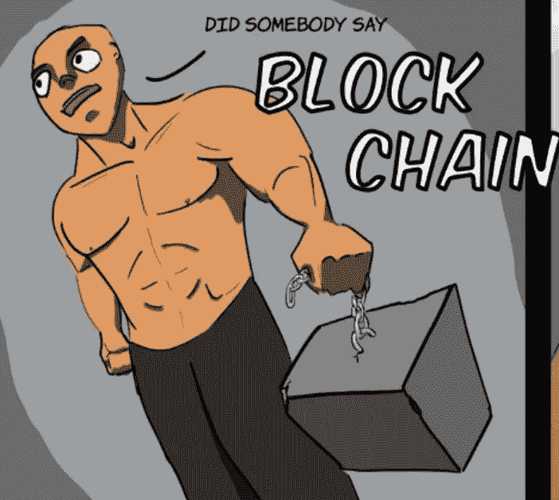

# 摆脱区块链的束缚

> 原文：<https://medium.datadriveninvestor.com/unchaining-from-the-blockchain-ee131ffc6001?source=collection_archive---------5----------------------->

最近，虽然我仍然在 Twitter 上保持存在，并每天查看常用网站( [Tether](https://tether.to) 、 [OffshoreAlert](https://www.offshorealert.com) 和 [CoinGecko](https://www.coingecko.com/en) )，但我也退了一大步，从区块链空间和总体欺诈行为中退了出来。这并不是因为我已经厌倦了阅读这些概念，而是一种间接的情况:我已经搬到我妈妈的地方去照顾她，让我的头脑恢复正常。这两个优先事项迫使我暂时把对欺诈和加密货币的热爱放在次要位置。

但不管怎样，这是一次令人大开眼界、收获颇丰的经历。下面是方法和原因。

(image via [fishtoaster.com](https://fishtoaster.com))

我们生活在泡沫中。不，我不是在说价格行为或 hashrates。我说的是区块链的整个概念。顽固的比特币人或狗屎币人会说，这证明他们仍然领先于趋势，这已经是十年后的事了，但这很难理解。

我离开的这段时间很好地证明了一点:人们根本不在乎区块链。他们不关心哪个比特币是“真正的比特币”，他们不关心克雷格·赖特，他们不关心 Chainlink 或 Tether。他们对此毫不关心，即使他们因为价格波动而进行再投资，我也看不出大多数人如何能够理解区块链的技术，或者除了作为一种凭空赚钱的方式之外，为什么它会有用。

因此，尽管加密货币 Twitter 上的许多人依赖于这个行业——无论他们是交易员、记者、研究人员、开发人员还是技术专家——但他们只是一个非常小的、响亮的公众群体。花时间在 Twitter 和 r/WallStreetBets 上查看他们 45 美元的 RobinHood 加密账户的人少之又少——世界上大多数人不仅不会逛 Twitter 或查看 DogeCoin 的价格，而且认为整个领域充其量是有趣的，或者最糟糕的是扭曲和偏执的。

 [## 冠状病毒疫情正在重塑区块链吗？该技术如何帮助应对该病毒|数据…

### 当前的冠状病毒疫情已经严重影响了区块链和加密货币行业的方方面面…

www.datadriveninvestor.com](https://www.datadriveninvestor.com/2020/07/15/is-the-coronavirus-pandemic-reshaping-blockchain-and-how-can-the-tech-help-tackle-the-virus/) 

向我介绍比特币和以太坊的四个人中，没有一个人持有任何硬币，也没有一个人跟随空间。像我妈妈这样的老年人，他们必须保护自己的投资组合和退休，也对“区块链技术”完全不感兴趣——他们明智地规避风险，不希望将大部分资金投入到动荡复杂的资产类别中。此外，与我同龄或更年轻的人有更大的问题需要关注:从高得离谱的房价到父母不断打电话警告我们冠状病毒。事实是，世界上大多数人都有比比特币更重要的事情要担心。

# 这都是些趣闻轶事，宝贝

除了我认识的人当中没有人对比特币或区块链感兴趣之外，我还目睹了许多我尊敬的记者和研究人员远离这个领域。对于一些人来说，每当一个新闻故事或研究文章对 ShitcoinX 或 BitcoinY 不利时，他们就会遭到刻薄和仇恨的攻击。对其他人来说，这是因为试图将计算机技术与金融、营销和世界末日宣传结合起来的空间要么太模糊，要么不够模糊。记者们已经离开去报道更广泛的新闻故事，研究人员已经离开去研究更小众的话题。

当然，我不与风险投资家或天使投资人交往，他们可能确实对这个空间感兴趣，但我每天接触的人——甚至是所谓的 VileGang 的成员——似乎都认为这个空间不值得它所消耗的东西。尽管我喜欢加密货币等高增长和低监管行业固有的欺诈和渎职的明显例子，但我忍不住同意。

# 不是退出，而是理解

我之前已经陈述过了，但是有必要再陈述一次:我不会离开这个空间。我太喜欢这样了，看到明目张胆的欺诈在公众面前发生，这是一次非常有益的学习经历，不能完全抹杀。但是，由于只关注区块链，我错过了同时发生的更精彩的惨败，从幸运咖啡到 T2 螃蟹欺诈。

我不想被严格地称为“拴绳的人”，我想成为了解历史欺诈、影子银行和空壳公司的人——我想成为那个会去任何地方获得有趣故事的人，[，即使我最终两手空空](https://medium.com/@thecaspiancey/finding-finex-3eefac0d45a2)。但是做到这一点的唯一方法是通过行动和写作，而不仅仅是说这是想要的东西。

所以，为我的欺诈报道的新的、更广阔的时代干杯。干杯！

保持怀疑，朋友们。

**进入专家视角—** [**订阅 DDI 英特尔**](https://datadriveninvestor.com/ddi-intel)