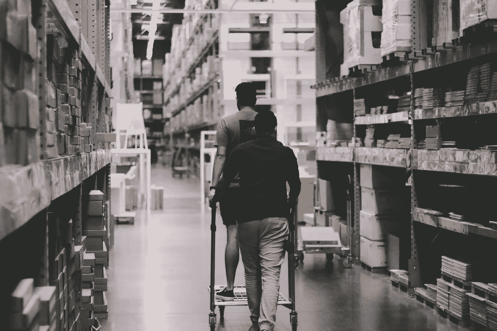

# 揭开现代仓储物流的精彩世界

> 原文：<https://medium.datadriveninvestor.com/uncovering-the-exciting-world-of-modern-warehouse-logistics-502156a94a71?source=collection_archive---------36----------------------->

Photo credits: [Pexels](https://www.pexels.com/photo/men-going-around-a-warehouse-1797428/)

长期以来，零售电子商务的持续增长一直在重塑仓库行业。公司甚至推出了一日送达服务，因为除了其他需求之外，客户还期待定制的方式和持续的商品供应。因此，在 50 英里范围内运送货物的日子已经一去不复返了。如今，该行业必须通过物流管理软件解决方案和革命性的[仓库运营数字化](https://www.fpt-software.com/industries/digital-logistics/)来跟上步伐。当然，一个仓库不可能处理所有的趋势并采用所有神奇的解决方案，但有些绝对值得你关注。了解在大流行后的世界里哪些是最有价值的。

# 新冠肺炎仓库的新现实

在疫情之前，物流的数字化转型并不是必须的。仓库可以采用一种新的车队管理软件系统，而且绝对不会有问题。然而，当新型冠状病毒的疫情席卷全球，全世界都不得不转向网上购物时，仓库和物流行业必须改变，而且必须尽快改变。

封锁、社交距离、禁飞、新的社交和安全协议严重影响了无缝运营:最少的劳动力和极其繁重的工作量。三月中旬，当波兰关闭了与德国的边境时，A4 高速公路上的卡车排起了 [37 英里的长队；](https://www.businessinsider.com/coronavirus-europe-borders-shut-trucks-traffic-jam-2020-3?IR=T)[钦奈、卡马贾拉尔和卡图帕利港口的 50，000 多个堆积的集装箱](https://www.thehindubusinessline.com/economy/logistics/over-50000-containers-stuck-at-3-major-ports-in-chennai/article31263262.ece)；或者中国长途卡车 15%的运营能力。正确的物流管理软件确实帮助中国将其数字恢复到更接近 2019 年的水平，但这对任何国家来说都不是快速复苏。

# 物流数字化转型的令人振奋的趋势

物流的主要趋势是所有流程的全球数字化，以及用机器助手和物流软件取代人力。这正是重新考虑任何规模的仓库和物流公司的当前工作流程并向行业未来迈进的时候。毫无疑问，用机器人代替人或使用企业车队管理软件可能不是一个通用的解决方案，所以请继续阅读以了解趋势，并批判性地思考哪一个适合您的企业。

# 机器人学

早在 1961 年，当第一个工业机器人被开发出来时，机器人就加入了仓库。四年前，[仓库机器人市场价值](https://www.marketsandmarkets.com/Market-Reports/warehouse-robotic-market-128876258.html)为 2.28 美元。到 2022 年，预计 CAGR 将增长 11.8%。历史和统计数据证明，这是行业的现在和未来。

机器人可以成为仓库的重要组成部分，完全取代人类劳动力，或者它们可以只取代仓库操作的特定元素，如机器人手。不管大小如何，机器人确实提高了生产率，而仓库操作安全为运输公司提供了正确的软件来引导这些机器。这就是机器人能做什么，以及为什么这是好消息。

*   机器人按照它们的算法工作，它们不能脱离它们；这导致人为错误的减少和供应链的准确性。
*   机器人可以更快、更仔细地完成工作；这导致了生产率的提高。
*   机器人(包括合作机器人和 AMR)可以做任何交给他们的工作；这将人类工人从平凡的操作中解放出来，并允许执行更复杂的操作。

**例子:**机器人实现最令人兴奋的例子之一是亚马逊。今天，这个零售巨头在美国的仓库使用了 [20 万个机器人。回到 2012 年，*亚马逊*收购了 *Kiva Systems，*三年后，*亚马逊机器人*成立。截至目前，这是世界上最大的零售公司，在其日常运营中使用了如此多的机器人助手。事实上，](https://roboticsandautomationnews.com/2020/01/21/amazon-now-has-200000-robots-working-in-its-warehouses/28840/)[机器人完成了所有繁重的工作](https://youtu.be/HSA5Bq-1fU4)(挑选、交付、分拣、运输和装载)，而人类通过仓库和运输管理软件控制这些操作。

# 无人驾驶车辆

无人驾驶汽车是一般仓库自动化概念的一部分。它们的使用，以及机器人技术，最大限度地减少了日常过程中的人类干预，因此，带来了:

*   效率
*   速度
*   生产率
*   灵活性
*   安全

无人驾驶的手推车和叉车现在操作仓库，再次由人类引导，并执行在仓库周围重新定位、卸载/装载、运输或交付任何货物的任务，而没有任何故障。完美选择和匹配的物流软件是这种车辆所固有的，因此它们可以在仓库环境中完美地自我定位。

**例子:**像*亚马逊*或*阿里巴巴*这样的大公司都考虑并在他们的仓库里使用无人驾驶汽车。DHL 甚至发布了一份指南，介绍这种趋势是什么，为什么值得关注，以及这种技术是如何工作的。就连日本政府也[出台了几份政策文件](https://www.mlit.go.jp/seisakutokatsu/freight/seisakutokatsu_freight_tk1_000128.html)在国内推广这个车队管理软件系统。

 [## 加速科技银行的数字化:云和人工智能成为疫情赢家|数据驱动的投资者

### 疫情新型冠状病毒的经济效应正在把斗争推向每个国家的主要产业…

www.datadriveninvestor.com](https://www.datadriveninvestor.com/2020/05/12/speeding-up-the-digitalization-of-the-tech-banking-cloud-and-ai-as-the-pandemic-winners/) 

# 图像识别

人脑处理的 90%的信息都是视觉信息，所以难怪仓库工作人员不得不不断关注视觉信息来寻找正确的物品，从而失去了注意力，尤其是当人们需要在巨大的空间中开车寻找正确的通道和区域时。然而，随着图像识别作为运输和航运管理软件，这些职责可以进行得更顺利，并大大减少努力。此外，随着无人机的实施和图像识别技术的使用，库存清点和一般检查等流程现在可以在没有员工的情况下进行。

**例子:**沃尔玛早在 2015 年就开始使用无人机，那是专有技术。2016 年，他们进行了测试，今天这是该公司在全国各地仓库例行工作的一部分。由于无人机能够每秒捕捉 30 帧，并且它们还可以处理所有这些信息，沃尔玛大大缩短了由人类执行的库存流程(分别只需要一天和一个月)。

# 仓库管理系统(WMS)

仓库管理系统进入物流软件市场已经有一段时间了。他们一直在帮助仓库高效运作，并将在新的水平上继续这样做。今天，所有 WMS 都可以分为:

1.  独立系统(本地存储和使用)
2.  基于云的系统(基于网络，非常适合同时协调多个仓库)
3.  供应链模块(用于供应链的模块或单独的物流管理软件)
4.  ERP 模块(用于管理大型企业中多个流程的大型软件)

每台 WMS 都能为仓库带来广泛的好处，对于各种规模的企业来说都是不可或缺的。

**例子:** *北美最古老的零售商之一男装店*选择了一个 WMS，从一个平台同时控制所有的业务。[数字转型机构](https://www.fpt-software.com/industries/digital-logistics/)帮助该品牌整合了遍布全国的 1200 多家商店和仓库，并允许其轻松改变单位分配、产品流程和整体较低的加工成本。

# 区块链

从购买到买家家门口的成功交付过程取决于供应链中每一个利益相关者的成功参与，仓库是其中之一。流程中每一步的多次协作都缺乏透明度，不幸的是，经常会导致延误和金钱损失。这正是区块链的目的——在同一个平台上连接所有相关方，方便沟通，同时通过单个物流管理解决方案中的智能合同保证完美的数据安全性。

**例如:**区块链已经成为新闻焦点有一段时间了，今天许多全球仓库公司开始以这样或那样的方式实施这项技术。例如，DHL 正在使用医疗保健行业的[区块链](https://www.ups.com/us/es/services/knowledge-center/article.page?kid=a0e2f652)来控制交付货物的温度。另一方面，[maersk 利用区块链的主要特性](https://venturebeat.com/2018/08/09/ibm-and-maersk-launch-blockchain-to-reduce-shipping-time-and-costs/)——易于追踪和安全的信息交换——来获取该公司负责的所有运输事件，并最大限度地减少运输时间和成本。

# 还有吗？

当然啦！物流和仓储行业正在提出更新、更大胆的解决方案，以尽可能地最大化利润和最小化成本。你肯定可以找到许多关于人工智能实施、语音控制技术、大数据分析、更广泛的无人机使用以及物流数字化转型的许多其他例子的文章。他们中的每一个人听起来都像是未来主义者小说中的人物，但事实上，他们都已经在这个行业工作了很长时间，尤其是在巨头的仓库里。

2020 年已经给该行业带来了巨大的破坏，同时促进了各种物流软件解决方案的使用和实施。这一年即将结束，但它的变化绝对永远地重塑了仓库行业。

## 访问专家视图— [订阅 DDI 英特尔](https://datadriveninvestor.com/ddi-intel)