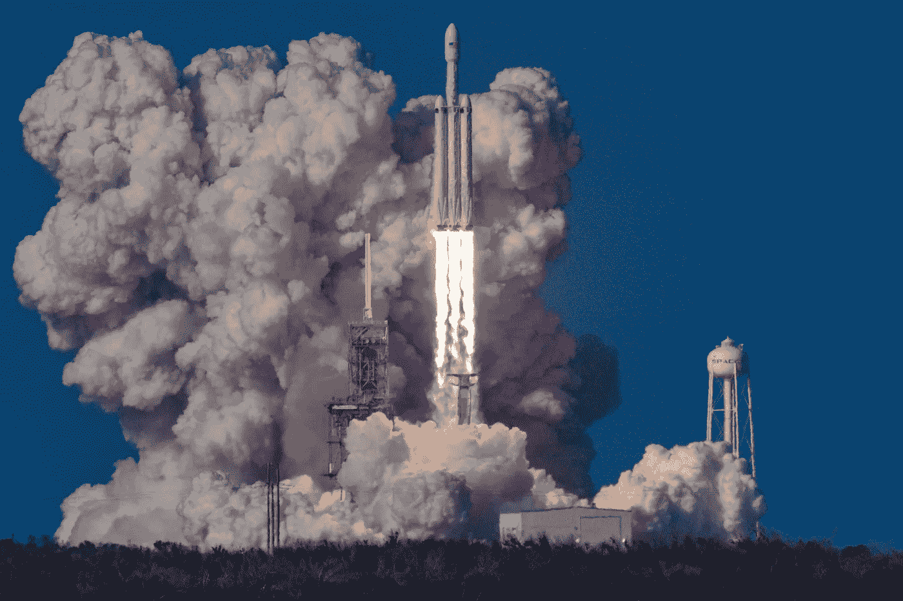
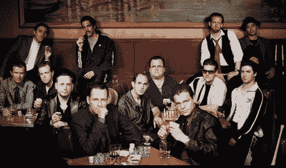

# 2021 年的雷达空间

> 原文：<https://medium.datadriveninvestor.com/under-the-radar-spacs-for-2021-bc67367ce67?source=collection_archive---------4----------------------->

在过去的几个月里，我们看到了一些 SPACs 的疯狂举动，它们与颠覆性公司合并，从电动汽车和金融科技一直到空间基础设施。

[了解特殊目的收购公司的基础知识](https://medium.com/datadriveninvestor/spacs-opportunity-or-bubble-b5b937ba81c4)，包括传统 IPO 和 SPAC 之间的主要区别、不对称风险回报机会、风险以及跟踪 spac 的有用工具。

以下是我在未来几周将重点关注的几个 SPACs。不要覆盖那些已经取得重大进展的明显 SPACs，因为有大量其他资源可以覆盖它们。

我已经强调了特殊目的收购公司在出现负面情绪或整体市场调整时可能出现的最大下跌空间。 **'+时间'**指的是资本的机会成本，这是与 SPACs 相关的一个主要风险，因为你可能要等几个月才能等到一个积极的合并公告。在此期间，投资者本可以从其他投资中获得更好的回报。

时间>金钱

“The first trillionaire can be made in space.” Peter Diamandis. Photo by [Bill Jelen](https://unsplash.com/@billjelen?utm_source=unsplash&utm_medium=referral&utm_content=creditCopyText) on [Unsplash](https://unsplash.com/s/photos/rocket?utm_source=unsplash&utm_medium=referral&utm_content=creditCopyText)

# 1.重塑技术合作伙伴 Z (RTPZ)

***团队* :** 雷德·霍夫曼(联合创始人、前 CEO，LinkedInPaypal 前 CEO 格雷洛克公司合伙人)、马克·平卡斯(Zynga 董事长兼前首席执行官)

目标行业:消费互联网、手机游戏、科技

当前价格:11.85 美元。最大下跌幅度- 15.6% +时间

## ***论文***

**Paypal 黑手党**在硅谷无需介绍。贝宝的创始团队包括彼得·泰尔、埃隆·马斯克、麦克·莱佛青，他们有 3 个亿万富翁和更多的百万富翁。拥有 a 的雷德·霍夫曼曾是硅谷最有人脉的人，在进行包括脸书、Zynga、Flickr、Digg 和 Last.fm 在内的 80 多项天使投资之前，他是 Linkedin 的联合创始人

这家公司的核心理念是重塑。发明是指公司从 DVD 市场开始发明核心产品，如网飞，然后通过主导流媒体市场彻底改造他们的整个身份。对雷德·霍夫曼和马克·平卡斯来说，这些发明和再发明产品和服务的循环并不新鲜。他们的目标是与众多准备上市的科技公司之一合作，并通过在公司内部整合他们几十年的专业知识来帮助它蓬勃发展。

> 未来几年，全球互联网用户将呈爆炸式增长，尤其是在新兴经济体。他们中的大多数将在移动设备上。

The original Paypal mafia including Reid Hoffman, Peter Thiel and Elon Musk(Elon who?)

# 2.德美科技集团第三公司

***团队*** :尼依格罗酒店·德·马西(DMYT、DMYD 首席执行官)、哈里·尤(甲骨文、埃森哲前首席财务官)、达拉·安德森(网飞制片人)

目标行业:移动应用、消费互联网、科技

当前价格:11.22 美元。最大下跌幅度- 10.9% +时间

## ***论文***

dMY 技术集团在 SPACs 方面有着良好的记录。dMY Technology Group I 与 Rush street interactive(纽约证券交易所代码:RSI)合并，后者目前的交易价格为 24.24 美元(141.30%)。他们的第二个特殊目的收购公司，dMY Technology Group II (DMYD)宣布与 Genius sports brand 合并，Genius sports brand 是一家领先的体育数据和技术提供商，为体育、博彩和媒体生态系统提供支持。

DMYI 旨在重点搜索人工智能(AI)、机器学习(ML)、**云基础设施和量子计算**领域的公司，估值约为 10 亿至 30 亿美元。

# 3.DPCM 资本公司

***团队*** : Emil Michael(优步前首席商务官)、Eric Schmidt 博士(谷歌前 CEO 兼董事长、Alphabet 前 Exec 董事长)、Peter Diamandis。

目标行业:企业价值在 10 亿到 20 亿美元之间的北美技术公司。

当前价格:10.73 美元。最大下跌 6.8%以上的时间。

## ***论文***

由于这次合并还没有宣布，赌注将完全压在管理层和他们过去的记录上。

Emil Michael 已经建立了 3 个成功的公司，包括 Tellme Networks、Klout 和优步。他对 Bird、Codeacademy、Docker、Stripe 和 SpaceX 的投资证明了他在发现高增长技术业务方面的丰富经验。

彼得·迪亚曼蒂斯博士比其他人更能预见未来。他的书包括《未来比你想象的更快》、《富足》和《大胆》，是关于人类未来的最好的书。《未来比你想象的要快》比我见过的任何一本投资书籍都有更多的投资理念。

> “世界上最大的问题就是世界上最大的市场机遇。这是一件大事。解决饥饿、识字和能源问题，获得世界的感激，并在这个过程中成为亿万富翁。”——彼得·迪亚曼蒂斯

Photo by [Marvin Meyer](https://unsplash.com/@marvelous?utm_source=unsplash&utm_medium=referral&utm_content=creditCopyText) on [Unsplash](https://unsplash.com/s/photos/tech?utm_source=unsplash&utm_medium=referral&utm_content=creditCopyText)

# 4.Zanite 收购公司

**团队** : Kenneth Ricci(定向航空资本负责人)、John Veihmeyer(毕马威国际前全球主席；福特汽车公司董事)、拉里·弗林(湾流航空航天公司前总裁)

顾问:罗纳德·休格(诺斯罗普·格鲁曼公司前董事长兼首席执行官；主席，优步；苹果、雪佛龙、安进董事)

目标行业:航空航天、国防和可持续航空，企业价值超过 7.5 亿美元

现价:10.76 美元。最大下行时间- 7.1%以上

## **论文**

应对气候变化是新总统乔·拜登最关注的领域之一。采用清洁能源的未来，以确保美国在 2050 年前实现 100%清洁能源经济和净零排放，这意味着航空业将不得不积极努力降低目前的污染水平。

一个由福特汽车、苹果、诺斯罗普·格鲁曼和毕马威前高管组成的团队将拥有必要的关系网络，以发现散户投资者通常无法获得的机会。

# 5.哈德逊行政投资公司

**团队**:道格·布朗斯坦(HEC 创始人；摩根大通前首席财务官)、道格·伯杰龙(Verifone systems 前首席执行官)

目标:Talkspace，一家在线和移动治疗公司

当前价格:11.61 美元。最大下跌幅度- 13.9 % +时间。

## **论文**

Talkspace 提供通过视频或文本聊天联系治疗师和患者的服务。该公司使用机器学习和人工智能来不断提高会议质量，为客户提供更好的体验。

Talkspace 还与美国医疗保险行业的领导者联合健康集团建立了合作关系。

2020 年是一个起伏不定的年份，过度的社交媒体和数字接触会对心理健康产生负面影响。面对面地会见精神健康专家有许多障碍，包括耻辱和公众看法，但在未来几年，通过移动应用程序随时获得服务可能会成为常态。

Talkspace 也有可能被 Teladoc 或 Amwell 等上市医疗保健公司收购。作为虚拟医疗保健的长期趋势，如果大公司通过利用现有的基础设施和网络收购 Talkspace 这样的公司，它们可以为更多的患者服务。

Talkspace 也得到了歌手黛米·洛瓦托和 28 次奥运会奖牌得主迈克尔菲尔普斯的支持。

[Talkspace](https://www.talkspace.com/michael) endorsed by Michael Phelps

让我知道你下面的评论。

欢迎访问 Twitter[获取更多关于 SPACs 和投资的信息。](https://twitter.com/pereraashain)

欣赏《特殊目的收购公司归来》。

## **参考文献**

dMY 技术集团公司 I — dMY 技术集团公司(2021)。可在:[https://www.dmytechnology.com/investor-materials](https://www.dmytechnology.com/investor-materials)

(2021)Sec.gov。可在:[https://www . sec . gov/Archives/Edgar/data/1821742/000121390020031251/fs 12020 a 1 _ DPCM capital . htm # T8](https://www.sec.gov/Archives/edgar/data/1821742/000121390020031251/fs12020a1_dpcmcapital.htm#T8)

Spac 轨道(2021)。可在:[https://spactrack.net/](https://spactrack.net/)

特殊目的收购公司(特殊目的收购公司)——SPACInsider(2021)。可在:[https://spacinsider.com/](https://spacinsider.com/)

重塑技术合作伙伴 Z (RTPZ)股价，报价和新闻|股票分析(2021)。可在:[https://stockanalysis.com/stocks/rtpz/](https://stockanalysis.com/stocks/rtpz/)