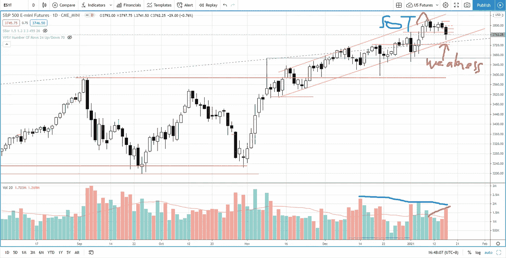

# 被低估的高成长股——EVO、EMBRAC、FTCH、MWK、OPEN、SKLZ、UPST

> 原文：<https://medium.datadriveninvestor.com/underhyped-high-growth-stocks-evo-embrac-ftch-mwk-open-sklz-upst-5105abd20143?source=collection_archive---------15----------------------->

# 2021 年第 2 周市场回顾

在 2021 年 1 月 11 日之前，通道超买顶部向上推力的缩短(表明买入势头减弱)为空头攻击标准普尔 500 期货创造了一个巨大的机会。然而，在过去的四个交易日里，在标准普尔 500 盘整的同时，供应却出现了短缺。周五供应增加，标准普尔 500 跌破支撑位 3770，测试上升通道的需求线。

下一个支撑位是 3725，此外还有需求线，如果标准普尔 500 继续走弱的话。

整体长期和中期的上升趋势是完整的，而短期疲软是显而易见的。供应水平是正常的(尽管局部增加),尚未达到可能损害中长期结构的水平。

Photo by Author — Ming Jong Tey

## 被炒作的高成长股？

在 2020 年 12 月中旬，我订阅了一份简讯，每周发给我一只股票，简要介绍公司的基本面，如公司如何运作，如何解决问题，产品，优势，弱点，增长前景，财务数据等。就所提供的信息而言，对我这个只关注价格波动和交易量的交易者来说已经足够了。

我发现这些股票的有趣之处在于它们通常都有一个共同点，那就是强劲的势头。这当然是摆动交易的一个吸引点。让我们看看这个股票观察名单，包括埃沃，恩布拉克，FTCH，MWK，开放，SKLZ，UPST，并分析从价格行动交易和威科夫分析方面。观看下面的视频:

## 时间戳

*   [1:11](https://www.youtube.com/watch?v=z8WZ-18COUo&t=71s) EVO(进化游戏集团 AB)
*   [5:51](https://www.youtube.com/watch?v=z8WZ-18COUo&t=351s)EMBRAC(Embracer Group AB SER。b)
*   [9:28](https://www.youtube.com/watch?v=z8WZ-18COUo&t=568s) FTCH (Farfetch 有限公司)
*   [11:40](https://www.youtube.com/watch?v=z8WZ-18COUo&t=700s) 杯和手柄图案
*   [13:40](https://www.youtube.com/watch?v=z8WZ-18COUo&t=820s) MWK(莫霍克集团控股有限公司)
*   [14:18](https://www.youtube.com/watch?v=z8WZ-18COUo&t=858s) 杯柄结构
*   [16:33](https://www.youtube.com/watch?v=z8WZ-18COUo&t=993s) 打开(开门技术公司)
*   SKLZ 公司
*   [19:00](https://www.youtube.com/watch?v=z8WZ-18COUo&t=1140s) UPST(新贵 HLDGS 公司)

# 资源

**每周市场展望&最佳交易建议**直达您的收件箱:【https://www.tradeprecise.com/】T4

**专业免费**制图平台:创建账户→[www.TradingView.com](https://bit.ly/2U2Femd)

**非美国居民？** ( **马来西亚、新加坡**、澳大利亚、新西兰、欧洲等……):[点击此处，存款 2000 新加坡元](https://ji.hn/sgtiger)即可获得**免费股票(价值 100++美元&老虎经纪**的欢迎礼物)

美国居民？[点击此处，当您存入 1500 美元](https://ji.hn/ustradeup)时，就有机会在 TradeUP 上获得一份**免费的 AMZN 股票(价值 3000++美元** ) & **欢迎礼物**

**从媒体获取无限文章** —加入以下:[https://priceactiontrading.medium.com/membership](https://priceactiontrading.medium.com/membership)

# 进一步阅读

 [## 阿里巴巴崩溃——马云失踪了吗？—购买或销售

### 自 2020 年 10 月以来，阿里巴巴股价暴跌 34%，负面消息不断。巴巴触底了吗还是…

medium.com](https://medium.com/datadriveninvestor/alibaba-baba-crashes-is-jack-ma-missing-buy-or-sell-90c20dd6ba21)  [## 火眼公司和太阳风公司被黑-网络安全股票牛市的开始？

### 2021 年第 1 周市场回顾

medium.com](https://medium.com/datadriveninvestor/fireeye-solarwinds-hacked-start-of-the-bull-run-for-cyber-security-stocks-31e99fd2b8c1)  [## ARK Invest 的 Cathie Wood 预测基因组股表现优于特斯拉？

### 方舟投资公司的首席执行官凯西·伍德预测，最大的上涨惊喜可能来自基因组股票，尤其是…

medium.com](https://medium.com/datadriveninvestor/ark-invests-cathie-wood-predicts-genomic-stocks-outperform-tesla-b67f3c4bbc68) 

披露:如果您点击本文中的链接进行购买或开立账户，并将所需金额存入推荐的经纪人账户，我们将免费为您赚取佣金。

免责声明:本演示中的信息仅用于教育目的，不应作为投资建议。